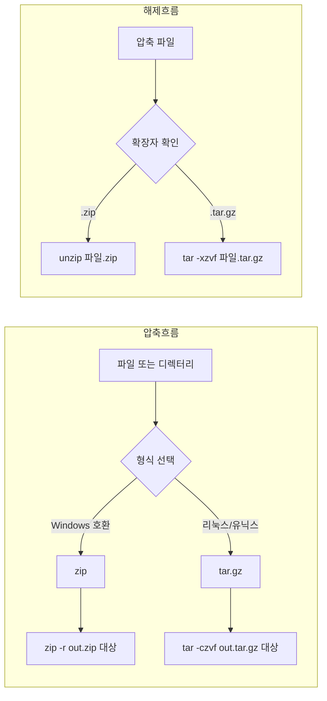

## 도입: 왜 리눅스 압축 명령을 익혀야 하는가

리눅스 서버나 WSL, macOS 터미널에서 **압축 파일**을 다루는 일은 배포 패키지 받기, 로그 수집, 백업, 이전 환경 마이그레이션 등에서 빠질 수 없다. **zip**은 Windows·리눅스·맥에서 공통으로 쓰이고, **tar**와 **tar.gz**(gzip)는 유닉스 계열에서 표준처럼 사용된다. 이 글은 리눅스에서 `zip`, `unzip`, `tar`, `gzip`으로 압축·해제할 때 필요한 명령과 옵션을 한곳에 정리하고, 형식별 차이와 실무에서의 선택 기준을 다룬다. 터미널을 쓰는 개발자·운영자·초보 사용자 모두 참고할 수 있도록 구성했다.

---

## 정의와 기본 개념

**압축(compression)**은 파일이나 디렉터리 내용을 하나의 아카이브 파일로 묶고, 필요 시 용량을 줄이는 과정이다. **zip**은 압축과 아카이브를 한 번에 수행하는 포맷이며, **tar**는 여러 파일을 하나로 **묶기만** 하고, **gzip**(또는 bzip2, xz)은 그 결과를 **압축**하는 역할을 한다. 그래서 리눅스에서는 보통 `tar`로 디렉터리 구조를 유지한 채 묶은 뒤 `gzip`으로 압축해 `.tar.gz`(또는 `.tgz`) 확장자를 쓴다. 아래에서는 각 도구의 기본 사용법을 문단과 예제로 이어서 설명한다.

---

## zip으로 압축하기

**zip**은 단일 명령으로 여러 파일·디렉터리를 하나의 `.zip` 파일로 묶고 압축한다. 기본 문법은 `zip {압축파일명}.zip {대상}` 이다. 대상은 파일 또는 디렉터리 경로이며, 공백으로 구분해 여러 개 줄 수 있다.

### 기본 명령어

```bash
zip {압축파일명}.zip {대상파일1} {대상파일2} ...
```

현재 디렉터리의 모든 파일만(하위 디렉터리 제외) 압축하려면 `./*`를 쓰면 된다. 이미 존재하는 zip 파일 이름을 쓰면 해당 아카이브에 **추가**되므로, 새로 만들 때는 기존 파일을 덮어쓴다는 점을 염두에 두자.

### 파일만 압축하기

특정 디렉터리 안의 **파일만** `test.zip`으로 압축하는 예는 다음과 같다. 하위 디렉터리는 포함되지 않는다.

```bash
zip test.zip ./*
```

### 파일과 디렉터리 함께 압축하기 (재귀)

디렉터리 **안까지** 모두 넣으려면 **재귀** 옵션 `-r`을 쓴다. 현재 디렉터리와 그 하위의 모든 파일·디렉터리를 `test.zip`으로 만든다.

```bash
zip -r test.zip ./*
```

실무에서는 프로젝트 루트에서 `zip -r release.zip .`처럼 현재 디렉터리 전체를 묶는 경우가 많다. 이때 `.git` 같은 불필요한 디렉터리를 빼고 싶다면 `-x`로 제외 패턴을 줄 수 있다(예: `zip -r release.zip . -x "*.git*"`).

---

## zip 압축 풀기 (unzip)

**unzip**은 `.zip` 파일의 압축을 푸는 명령이다. 기본적으로 현재 디렉터리에 풀며, `-d`로 대상 디렉터리를 지정할 수 있다.

### 기본 명령어

```bash
unzip {압축파일명}.zip
```

### 현재 디렉터리에 풀기

`test.zip`을 현재 작업 디렉터리에 그대로 푼다.

```bash
unzip test.zip
```

### 지정 디렉터리에 풀기

`-d` 옵션 뒤에 경로를 주면 해당 디렉터리에 압축을 푼다. 디렉터리가 없으면 만들지 않으므로, 필요하면 미리 `mkdir`로 생성해야 한다.

```bash
unzip test.zip -d /home/user/backup
```

기존 파일과 이름이 겹치면 덮어쓸지 묻는다. `-o`는 묻지 않고 덮어쓰고, `-n`은 기존 파일을 건드리지 않고 새 파일만 풀 때 쓴다.

---

## tar·tar.gz로 압축하기와 풀기

**tar**(Tape ARchive)는 원래 테이프에 여러 파일을 순서대로 기록하기 위한 유닉스 표준 도구다. 지금은 주로 **아카이브**(파일들을 하나로 묶기)에 쓰이고, **압축**은 gzip·bzip2·xz 등과 조합한다. 그래서 `.tar`는 묶기만, `.tar.gz`(또는 `.tgz`)는 묶은 뒤 gzip으로 압축한 형식이다.

### tar 아카이브 만들기 (압축 없음)

`-c`는 생성(create), `-f`는 아카이브 파일 이름 지정이다. `-v`는 처리되는 파일을 출력해 확인할 때 유용하다.

```bash
tar -cvf archive.tar ./dir1 ./file1.txt
```

### tar.gz( gzip)로 압축하기

`-z` 옵션을 주면 gzip으로 압축한다. 확장자는 보통 `.tar.gz` 또는 `.tgz`를 쓴다.

```bash
tar -czvf archive.tar.gz ./myproject
```

여러 디렉터리나 파일을 한 번에 넣을 수 있다.

```bash
tar -czvf backup.tar.gz ./config ./logs ./data
```

### tar·tar.gz 압축 풀기

`-x`는 추출(extract), `-f`는 아카이브 파일, `-z`는 gzip 해제다. 풀 위치는 현재 디렉터리이므로, 필요하면 먼저 디렉터리를 만든 뒤 그 안에서 실행하는 것이 좋다.

```bash
tar -xzvf archive.tar.gz
```

압축이 없는 `.tar`만 풀 때는 `-z`를 빼면 된다.

```bash
tar -xvf archive.tar
```

### 특정 디렉터리에 풀기

`-C` 옵션으로 풀 위치를 지정한다. 해당 경로가 존재해야 한다.

```bash
tar -xzvf archive.tar.gz -C /home/user/restore
```

---

## 압축 형식 비교와 선택 기준

zip, tar, tar.gz는 용도와 호환성에서 차이가 있다. 아래 표는 형식·도구·특징·선택 시점을 한눈에 보기 위해 정리한 것이다.

| 형식 | 도구 | 특징 | 추천 상황 |
|------|------|------|------------|
| **.zip** | zip / unzip | Windows·리눅스·맥 공통, 단일 명령으로 압축·해제 | 크로스 플랫폼 전달, Windows 사용자와 교환 |
| **.tar** | tar | 압축 없이 묶기만, 용량 감소 없음 | 임시 묶기, 파이프로 넘겨 후속 압축 시 |
| **.tar.gz** | tar + gzip | 유닉스 표준, 디렉터리 구조·권한 유지에 유리 | 리눅스 서버 백업, 소스 배포, 로그 아카이브 |

Windows에서 받은 zip은 `unzip`으로, 리눅스/맥에서 만든 tar.gz는 `tar -xzvf`로 풀면 된다. 같은 유닉스 계열끼리만 쓸 때는 tar.gz를 쓰는 경우가 많고, Windows 사용자와 공유할 때는 zip이 편하다.

---

## 압축·해제 작업 흐름 (Mermaid)

아래 다이어그램은 “어떤 형식으로 할지 결정 → 압축 또는 해제 명령 실행” 순서를 단순화한 것이다. 노드 ID는 camelCase로 했고, 라벨에 등호·특수문자가 있으면 큰따옴표로 감쌌다.



---

## 언제 무엇을 쓸지: 적용 체크리스트

- **zip을 쓰면 좋은 경우**: Windows 사용자와 파일을 주고받을 때, 동일한 도구로 압축·해제를 하고 싶을 때, 도구 하나만 쓰고 싶을 때.
- **tar.gz를 쓰면 좋은 경우**: 리눅스 서버 백업, 소스 코드·빌드 결과물 배포, 디렉터리 구조와 권한을 그대로 유지해야 할 때.
- **tar만 쓸 때**: 압축 없이 빠르게 묶기만 하거나, 파이프로 다른 압축 프로그램에 넘길 때(예: `tar -cvf - ./dir | gzip > out.tar.gz`).

---

## 자주 겪는 오류와 해결

- **`unzip: command not found`**: `unzip`이 설치되어 있지 않다. Debian/Ubuntu는 `sudo apt install unzip`, RHEL/CentOS는 `sudo yum install unzip`으로 설치한다.
- **`tar: Error is not recoverable`**: 아카이브 손상 또는 형식 불일치. 다른 장소에서 받은 파일인지, 전송 중 손상 여부를 확인하고, 가능하면 다시 받거나 `gzip -t archive.tar.gz`로 무결성을 검사해 본다.
- **zip 풀 때 한글 파일명 깨짐**: 일부 구형 zip은 한글을 잘못 저장한다. 가능하면 만든 쪽에서 UTF-8을 지원하는 방식으로 압축하거나, `unzip -O UTF-8 file.zip`(지원되는 버전)으로 시도해 볼 수 있다.
- **권한 거부 (Permission denied)**: 풀려는 디렉터리에 쓰기 권한이 없거나, 압축 안의 파일이 root 소유인 경우가 있다. `-C`로 쓸 수 있는 디렉터리를 지정하거나, 필요 시 `sudo`를 사용한다(주의해서 사용).

---

## 핵심 요약 표

| 작업 | zip 계열 | tar.gz 계열 |
|------|-----------|-------------|
| **압축 (재귀)** | `zip -r out.zip 대상` | `tar -czvf out.tar.gz 대상` |
| **현재 위치에 해제** | `unzip out.zip` | `tar -xzvf out.tar.gz` |
| **지정 경로에 해제** | `unzip out.zip -d /경로` | `tar -xzvf out.tar.gz -C /경로` |

---

## 참고 문헌

1. **GNU tar 공식 매뉴얼** — [GNU tar: an archiver tool](https://www.gnu.org/software/tar/manual/tar.html). tar의 create/list/extract 및 옵션 설명.
2. **zip/unzip** — 각 배포판의 `man zip`, `man unzip` 또는 패키지 문서. 로컬에서 `man 1 zip`, `man 1 unzip`으로 확인 가능.
3. **gzip** — `man gzip`. tar와 파이프로 조합할 때의 동작과 옵션 참고.
