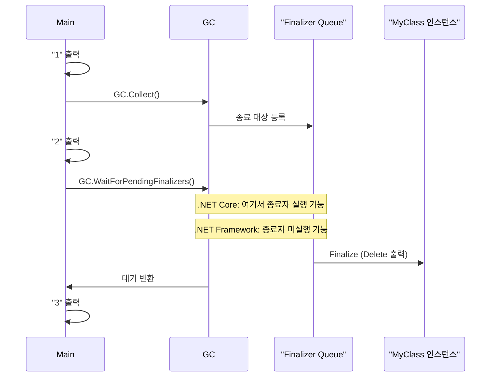

## 개요

C++에 익숙한 개발자가 C#으로 넘어올 때, 클래스 소멸자(destructor)에 해당하는 **Finalizer(종료자)** 에서 자원을 정리하려는 경우가 많다. 그러나 C#과 .NET의 가비지 수집(GC) 모델에서는 **종료자 호출 시점이 런타임(.NET Framework vs .NET Core/.NET 5+)에 따라 다르며**, `GC.WaitForPendingFinalizers()`도 이름과 달리 “모든 대기 중인 종료자가 끝날 때까지 블로킹”을 보장하지 않을 수 있다. 이 포스트에서는 동일한 샘플 코드를 .NET Framework와 .NET Core에서 실행한 결과를 비교하고, 런타임별 동작 차이의 원인과 함께 **리소스 해제는 IDisposable 패턴으로 명시적으로 하는 것**을 권장하는 이유를 정리한다.

**이 포스트가 도움이 되는 대상**

- C++에서 C#/.NET으로 전환한 개발자
- Finalizer와 `GC.WaitForPendingFinalizers()` 동작을 정확히 알고 싶은 개발자
- .NET Framework와 .NET Core/.NET 5+ 간 이식성을 고려하는 개발자
- 관리/비관리 리소스 해제 패턴을 정리하고 싶은 개발자

---

## 배경: C++ 소멸자와 C# 종료자의 차이

C++에서는 객체 수명이 스코프나 `delete`로 명확히 끝나며, 소멸자가 **정해진 시점**에 호출된다. 반면 C#에서는 가비지 수집기가 객체를 회수할 **시점을 결정**하며, 종료자(Finalizer)는 그 과정의 일부로 **비결정적으로** 실행된다. 따라서 “종료자에서만” 리소스를 해제하면 시점을 보장할 수 없고, 런타임 구현에 따라 앱 종료 시에는 아예 호출되지 않을 수도 있다.

---

## 샘플 코드

아래 코드는 `MyClass`에서 생성 시 "Create", 종료자에서 "Delete"를 출력하고, `Main`에서는 참조를 `null`로 둔 뒤 `GC.Collect()`와 `GC.WaitForPendingFinalizers()`를 호출해 개발자가 최대한 종료 시점을 끌어오려는 예제다.

```csharp
using System;
using System.Collections.Generic;
using System.Linq;
using System.Text;
using System.Threading.Tasks;

namespace ConsoleApp8
{
    class Program
    {
        static void Main(string[] args)
        {
            MyClass a = new MyClass();

            a = null;

            Console.WriteLine("1");
            GC.Collect();
            Console.WriteLine("2");
            GC.WaitForPendingFinalizers();
            Console.WriteLine("3");
        }
    }
    internal class MyClass
    {
        public MyClass()
        {
            Console.WriteLine("Create");
        }

        ~MyClass()
        {
            Console.WriteLine("Delete");
        }
    }
}
```

- `Console.WriteLine("1")` → `GC.Collect()` → `Console.WriteLine("2")` → `GC.WaitForPendingFinalizers()` → `Console.WriteLine("3")` 순서로 실행된다.
- .NET Framework와 .NET Core에서 "2"와 "3" 사이에 "Delete"가 찍히는지 여부가 다르게 나올 수 있다.

---

## 실행 결과

### .NET Core에서 동작한 결과

```text
Create
1
2
Delete
3
```

여기서는 `GC.WaitForPendingFinalizers()`가 반환되기 **전에** 종료자가 실행되어 "Delete"가 "2"와 "3" 사이에 출력된다. 즉, 대기 중인 종료자가 한 번 실행된 뒤 "3"이 찍힌다.

### .NET Framework에서 동작한 결과

```text
Create
1
2
3
```

동일한 코드인데 **"Delete"가 출력되지 않는다.** `GC.WaitForPendingFinalizers()`는 반환되지만, 해당 런타임의 GC/종료 스레드 스케줄링에 따라 종료자가 아직 실행되지 않았거나, 앱이 곧 종료되는 상황에서 종료자 실행이 생략될 수 있다. 즉, “이름만으로는 종료가 완료된 것을 보장하지 않는다”는 점이 드러난다.

---

## 런타임별 동작 차이 요약

동일한 호출 순서를 다이어그램으로 정리하면 다음과 같다. 실제로는 런타임·버전·부하에 따라 종료자 실행 시점이 달라질 수 있다.



- **.NET Core / .NET 5+**: 앱 종료 시 종료자를 호출한다는 **보장이 없으며**, 중간에 `GC.Collect()` + `WaitForPendingFinalizers()`를 호출하면 위 예처럼 "2"와 "3" 사이에 "Delete"가 나올 수 있다.
- **.NET Framework**: 앱 종료 전에 미회수 객체의 종료자를 호출하려는 시도는 있으나, **언제 어떤 스레드에서 실행될지는 구현에 따르며**, 위와 같은 짧은 Main에서는 "Delete"가 나오지 않을 수 있다.

따라서 **종료자 호출 시점에 의존해 리소스를 해제하면 안 되고**, 이름과 달리 `GC.WaitForPendingFinalizers()`만으로는 “지금 당장 모든 종료가 끝났다”를 보장할 수 없다.

---

## 결론 및 권장사항

- **종료자(Finalizer)에만 의존한 리소스 해제는 피하는 것이 좋다.**  
  [Microsoft Learn – 종료자를 사용하여 리소스 해제](https://learn.microsoft.com/ko-kr/dotnet/csharp/programming-guide/classes-and-structs/finalizers#using-finalizers-to-release-resources)에서도 종료자는 “객체가 종료될 수 있을 때” GC가 `Finalize`를 실행하는 방식이라 **호출 시점이 보장되지 않는다**고 명시하고 있다.
- **`GC.WaitForPendingFinalizers()`는 이름과 다르게 동작할 수 있다.**  
  “대기 중인 종료자가 모두 끝날 때까지 기다린다”로 오해하기 쉽지만, 런타임·상황에 따라 종료자가 아직 실행되지 않은 상태에서 반환될 수 있으므로, 이 API에만 의존해 리소스 정리 시점을 보장하면 안 된다.
- **리소스 해제는 IDisposable과 Dispose 패턴으로 명시적으로 처리하는 것이 적합하다.**  
  [Microsoft Learn – 리소스의 명시적 해제](https://learn.microsoft.com/ko-kr/dotnet/csharp/programming-guide/classes-and-structs/finalizers#explicit-release-of-resources) 및 [Dispose 메서드 구현](https://learn.microsoft.com/ko-kr/dotnet/standard/garbage-collection/implementing-dispose)에서 설명하듯, 비용이 큰 외부 리소스는 `IDisposable.Dispose()`(및 `using` 문)로 **결정적으로** 해제하고, 종료자는 `Dispose`가 호출되지 않았을 때의 **최후의 안전망**으로만 두는 편이 안전하다.
- **.NET Core / .NET 5+에서는 앱 종료 시 종료자 실행이 보장되지 않는다.**  
  [dotnet/csharpstandard #291](https://github.com/dotnet/csharpstandard/issues/291)에서처럼, 명세 수준에서 “앱 종료 전에 종료자를 호출한다”는 보장이 약화되었고, .NET Core 계열은 앱 종료 시 종료자를 호출하지 않는 구현이다. 따라서 종료 시점에 꼭 실행되어야 하는 정리는 `ProcessExit` 등에서 `Dispose`를 호출하는 방식으로 처리해야 한다.

---

## 참고 문헌

1. **Microsoft Learn – 파이널라이저(C# 프로그래밍 가이드)**  
   [https://learn.microsoft.com/ko-kr/dotnet/csharp/programming-guide/classes-and-structs/finalizers](https://learn.microsoft.com/ko-kr/dotnet/csharp/programming-guide/classes-and-structs/finalizers)  
   종료자 정의, 호출 시점 비결정성, 리소스 해제 시 IDisposable 권장 내용이 정리되어 있다.

2. **Microsoft Learn – Dispose 메서드 구현**  
   [https://learn.microsoft.com/ko-kr/dotnet/standard/garbage-collection/implementing-dispose](https://learn.microsoft.com/ko-kr/dotnet/standard/garbage-collection/implementing-dispose)  
   IDisposable과 Dispose(bool) 패턴, 종료자와의 역할 분리, SafeHandle 사용 권장 등이 설명되어 있다.

3. **GitHub – dotnet/csharpstandard #291: Spec shouldn't promise that finalizers run on application termination**  
   [https://github.com/dotnet/csharpstandard/issues/291](https://github.com/dotnet/csharpstandard/issues/291)  
   .NET Framework와 .NET Core에서 앱 종료 시 종료자 호출 여부가 다르다는 점과, 명세에서 “종료 시 종료자 호출” 보장이 완화된 배경이 논의되어 있다.
