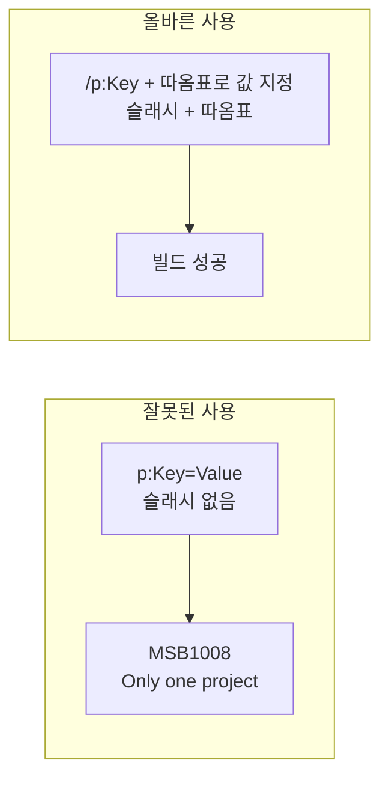

## 개요

`.NET` CLI로 슬루션을 빌드할 때 **MSBUILD : error MSB1008: Only one project can be specified.** 가 발생하는 경우가 있습니다. 이 오류는 프로젝트/슬루션을 **한 개만** 지정해야 하는데, MSBuild가 인자를 잘못 해석해 여러 프로젝트가 지정된 것처럼 인식할 때 나타납니다.  
실제로는 **`/p`(property) 옵션을 잘못 쓰거나**, 옵션과 슬루션 경로의 **순서·따옴표** 때문에 파서가 다음 인자를 스위치로 잘못 읽는 경우가 대부분입니다.

이 포스트에서는 **오류 원인**, **올바른 명령 형식**, **권장 빌드 순서**, 그리고 **CI·스크립트에서 피할 실수**까지 정리합니다.

---

## 오류가 나는 명령 예

다음처럼 `dotnet build`에 `p:DefineConstants=TEST`처럼 **슬래시 없이** 옵션을 주고, 슬루션 파일을 넘기면 MSBuild가 인자를 잘못 해석합니다.

```bash
dotnet build --no-restore p:DefineConstants=TEST Sample.sln
```

실제로는 아래와 같이 전달되며:

```text
/usr/share/dotnet-build-tools/sdk/dotnet build --no-restore p:DefineConstants=TEST Sample.sln /nodeReuse:false /p:UseSharedCompilation=false
```

에러 메시지는 다음과 같습니다.

```text
Microsoft (R) Build Engine version 16.5.0+d4cbfca49 for .NET Core
Copyright (C) Microsoft Corporation. All rights reserved.

MSBUILD : error MSB1008: Only one project can be specified.
Switch: Sample.sln

For switch syntax, type "MSBuild -help"
```

여기서 **Switch: Sample.sln** 은, MSBuild가 **프로젝트/슬루션 경로가 아니라 스위치**로 `Sample.sln`을 인식했다는 뜻입니다.  
원인은 앞선 인자 파싱 오류(예: `p:DefineConstants=TEST`에서 `/` 누락, 또는 값에 공백이 있는데 따옴표 없음)로 인해 프로젝트 위치가 밀리거나, 슬루션이 스위치로 먹힌 경우입니다.

---

## 원인 정리

| 원인 | 설명 |
|------|------|
| **`/p` 누락** | `p:DefineConstants=TEST`처럼 앞에 `/`가 없으면 MSBuild가 이를 프로젝트 경로로 착각할 수 있고, 그 다음 `Sample.sln`이 스위치로 해석됨 |
| **공백·특수문자** | `/p:SomeKey=Value With Space`처럼 값에 공백이 있으면 반드시 `"/p:SomeKey=Value With Space"` 또는 `'/p:SomeKey=Value With Space'`로 감싸야 함 |
| **따옴표 불균형** | `/p:OutDir="C:\path`처럼 닫는 따옴표가 없으면 이후 인자들이 한 덩어리로 묶여 MSB1008을 유발 |
| **인자 순서** | 일부 환경에서는 **슬루션/프로젝트 경로를 마지막**에 두는 것이 안전함 |

---

## 올바른 명령 형식

- **속성 전달**: 반드시 **`/p:Key=Value`** 형식. 앞의 **`/`** 를 빼면 안 됨.
- **값에 공백/특수문자**: `"/p:DefineConstants=TEST"`, `"/p:Platform=Any CPU"` 처럼 **따옴표로 감싸기**.
- **슬루션/프로젝트**: 하나만 지정. 경로에 공백이 있으면 큰따옴표로 감싸기.

**잘못된 예:**

```bash
dotnet build --no-restore p:DefineConstants=TEST Sample.sln
```

**올바른 예:**

```bash
dotnet build --no-restore /p:DefineConstants="TEST" Sample.sln
```

`restore` → `clean` → `build` 순서로 실행할 때 예시는 아래와 같습니다.

```bash
dotnet restore Sample.sln -s /nuget
dotnet build --no-restore Sample.sln
dotnet clean
dotnet build --no-restore /p:DefineConstants="TEST" Sample.sln
```

---

## 해결 흐름 요약

아래 다이어그램은 **잘못된 사용** 시 MSB1008이 나고, **올바른 형식**으로 수정하면 빌드가 성공하는 흐름을 나타냅니다.



- **WrongCmd**: `p:DefineConstants=TEST`처럼 `/` 없이 사용 → MSBuild가 인자 해석 오류 → **MSB1008**.
- **CorrectCmd**: `/p:DefineConstants="TEST"`처럼 `/`와 값 따옴표 사용 → **빌드 성공**.

---

## 단계별 해결 절차

1. **명령어에서 `/p` 확인**  
   `p:...`가 아니라 **`/p:...`** 인지 확인합니다.

2. **값에 공백·특수문자 있으면 따옴표**  
   예: `/p:DefineConstants="TEST"`, `/p:Platform="Any CPU"`.

3. **슬루션/프로젝트는 하나만**  
   `dotnet build`에는 한 개의 `.sln` 또는 `.csproj`만 넘깁니다.

4. **경로에 공백이 있으면 경로도 따옴표**  
   예: `dotnet build "C:\My Solutions\Sample.sln"`.

5. **CI·Bash·PowerShell**  
   변수 치환 시 따옴표 누락되지 않게: `"/p:Version=${VERSION}"` 형태로 사용합니다.

---

## 참고 문헌

- [dotnet build - .NET CLI (Microsoft Learn)](https://learn.microsoft.com/en-us/dotnet/core/tools/dotnet-build)  
  - `-p|--property:<NAME>=<VALUE>` 형식과 MSBuild 옵션 전달 방법 공식 문서.
- [MSBUILD : error MSB1008: Only one project can be specified (Stack Overflow)](https://stackoverflow.com/questions/3779701/msbuild-error-msb1008-only-one-project-can-be-specified)  
  - PublishDir·경로 따옴표, Git Bash에서 `//p:` 사용 등 다양한 원인과 해결 제시.
- [MSBuild error MSB1008 only one project can be specified – Switch: SonarScanner.MSBuild.exe (SonarSource Community)](https://community.sonarsource.com/t/msbuild-error-msb1008-only-one-project-can-be-specified-switch-sonarscanner-msbuild-exe/26900)  
  - SonarScanner·MSBuild 연동 시 동일 오류 케이스 참고.

---

## 요약

| 항목 | 내용 |
|------|------|
| **오류** | MSB1008: Only one project can be specified. |
| **주요 원인** | `/p` 옵션의 `/` 누락, 값의 공백·따옴표 미사용으로 인자 파싱 오류 → 슬루션 파일이 스위치로 인식됨 |
| **해결** | `/p:Key="Value"` 형식 사용, 슬루션/프로젝트 하나만 지정, 경로·값에 따옴표 적용 |

`.NET` CLI와 MSBuild를 쓸 때는 **옵션 형식(`/p:...)`과 따옴표 사용**을 일관되게 지키면 MSB1008을 대부분 피할 수 있습니다.
