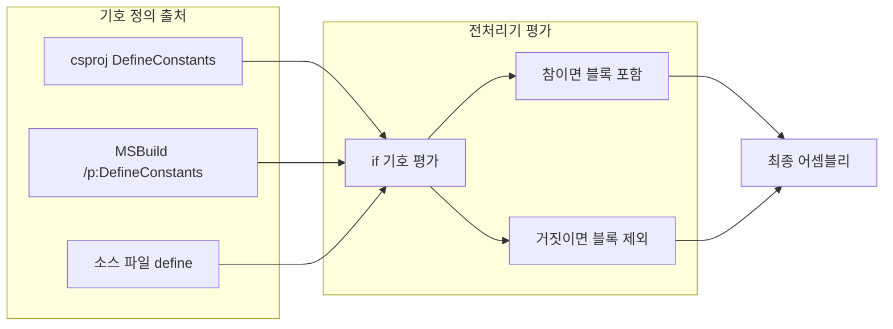

## 개요

**.NET·C#** 환경에서 **조건부 컴파일(Conditional Compilation)**은 빌드 시점에 특정 기호(symbol)가 정의되어 있는지에 따라 코드 블록을 포함하거나 제외하는 기능이다. 디버그 전용 로그, 플랫폼별 API 분기, 기능 플래그, 다중 대상 프레임워크(TFM) 대응 등에 쓰인다. 이 글에서는 전처리기 지시문(`#if`, `#elif`, `#define` 등), 미리 정의된 기호(DEBUG, TRACE, TFM 기호), **.csproj**와 **MSBuild**에서 기호를 정의·전달하는 방법, 플랫폼별 조건부 컴파일 예시를 다루고, 흐름을 Mermaid로 정리한 뒤 참고 문헌을 제시한다. C#·.NET Core/5+ 프로젝트를 다루는 개발자와 CI/CD·크로스 플랫폼 빌드를 설정하는 이들에게 유용하다.

---

## 조건부 컴파일이란

**조건부 컴파일**은 컴파일러가 **전처리기 기호**의 정의 여부를 보고, 조건에 맞는 코드만 최종 이진에 포함시키는 방식이다. C/C++의 매크로와 달리 C#에서는 **기호에 값을 할당할 수 없고**, “정의됨/정의되지 않음”만 판단한다. 런타임 `if`와 달리, 선택되지 않은 블록은 **컴파일 결과물에 포함되지 않으므로** 배포 크기와 동작을 구성별로 분리할 수 있다. 예: Debug 빌드에서만 상세 로그를 넣고, Release에서는 해당 코드 자체가 제거되도록 할 수 있다.

---

## C# 전처리기 지시문

C#에는 별도 전처리기 실행 단계는 없지만, 다음 지시문을 **조건부 컴파일**에 사용한다.

| 지시문 | 설명 |
|--------|------|
| `#if` | 조건부 컴파일 시작. 지정한 기호가 정의된 경우에만 이어지는 코드 컴파일 |
| `#elif` | 이전 `#if`/`#elif`가 거짓일 때 추가 조건 평가 |
| `#else` | 앞선 모든 조건이 거짓일 때 컴파일할 블록 |
| `#endif` | 조건부 블록 종료 |
| `#define` | 파일 내에서 기호 정의(같은 파일 내 상단에서만 유효) |
| `#undef` | 기호 정의 취소 |

`#if` 식에서는 `!`, `&&`, `||`와 괄호를 쓸 수 있다. 기호는 “정의됐는지”만 검사 가능하다.

```csharp
#if DEBUG
    Console.WriteLine("Debug version");
#endif

#if !MYTEST
    Console.WriteLine("MYTEST is not defined");
#endif

#if (NET6_0_OR_GREATER || NETSTANDARD2_0_OR_GREATER)
    Console.WriteLine("Using .NET 6+ or .NET Standard 2+ code.");
#else
    Console.WriteLine("Using older code.");
#endif
```

`#define`은 **해당 소스 파일에서만** 유효하며, **다른 명령보다 앞**에 두어야 한다. 프로젝트 전역 기호는 **.csproj**의 `DefineConstants`나 컴파일러 옵션으로 정의한다.

---

## 미리 정의된 기호

빌드 시스템과 SDK가 자동으로 넣어 주는 기호가 있다.

- **DEBUG**, **TRACE**: 빌드 구성(Configuration)에 따라 설정된다. 보통 Debug 구성에서는 DEBUG·TRACE 둘 다, Release에서는 TRACE만 정의되는 경우가 많다.
- **대상 프레임워크(TFM) 기호**: SDK 스타일 프로젝트에서는 대상 TFM에 따라 `NET48`, `NETCOREAPP3_1`, `NET6_0`, `NETSTANDARD2_0` 등이 정의된다. .NET 5+ SDK에서는 `NET6_0_OR_GREATER` 같은 `_OR_GREATER` 기호도 사용할 수 있다.
- **플랫폼 기호**: OS별 TFM을 지정했을 때 `WINDOWS`, `LINUX`, `OSX` 등이 정의될 수 있다(문서·SDK 버전 확인 필요).

TFM·플랫폼 기호 목록은 [Microsoft Learn – C# 전처리기 지시문](https://learn.microsoft.com/ko-kr/dotnet/csharp/language-reference/preprocessor-directives)의 “조건부 컴파일” 표를 참고하면 된다.

---

## .csproj에서 기호 정의 (DefineConstants)

**SDK 스타일** `.csproj`에서는 `<PropertyGroup>` 안에 `DefineConstants`로 기호를 정의한다. 여러 기호는 **세미콜론(;)**으로 구분한다. 기존 값에 **추가**하려면 `$(DefineConstants);MY_SYMBOL`처럼 기존 속성을 참조하면 된다.

```xml
<PropertyGroup>
  <TargetFramework>net6.0</TargetFramework>
  <DefineConstants>$(DefineConstants);MY_FLAG;CUSTOM_SYMBOL</DefineConstants>
</PropertyGroup>
```

구성(Debug/Release)별로 다르게 주려면 `Condition`을 쓴다.

```xml
<PropertyGroup Condition="'$(Configuration)'=='Debug'">
  <DefineConstants>DEBUG;TRACE;VERBOSE_LOGGING</DefineConstants>
</PropertyGroup>
<PropertyGroup Condition="'$(Configuration)'=='Release'">
  <DefineConstants>TRACE</DefineConstants>
</PropertyGroup>
```

플랫폼별로 기호를 주는 예(빌드 시점 OS에 따라 Windows/OSX/Linux 등)는 [Magnus Montin – Platform Conditional Compilation in .NET Core](https://blog.magnusmontin.net/2018/11/05/platform-conditional-compilation-in-net-core/)에서 .NET Core 2.x 기준으로 `IsWindows`/`IsOSX`/`IsLinux` 조건과 `DefineConstants`를 설정하는 방법을 설명하고 있다. 최신 TFM에서는 OS별 TFM·플랫폼 기호를 먼저 확인하는 것이 좋다.

---

## MSBuild 명령줄에서 기호 전달

CI/CD나 스크립트에서 **MSBuild**를 호출할 때 `DefineConstants`를 덮어쓰려면 `/p:DefineConstants=...`를 사용한다.

```batch
msbuild MyProject.csproj /p:Configuration=Release /p:DefineConstants="TRACE;MY_SYMBOL"
```

주의: `/p:DefineConstants`를 지정하면 **프로젝트에 설정된 DefineConstants를 완전히 대체**하는 동작이 많다. 따라서 필요한 기호(TRACE, DEBUG 등)를 모두 나열해야 할 수 있다. 여러 기호는 **세미콜론**으로 구분하며, 일부 환경에서는 공백으로 구분하는 방식이 쓰이기도 하니 사용 중인 MSBuild/도구 문서를 확인하는 것이 좋다([Stack Overflow – Defining conditional compilation symbols in MSBuild](https://stackoverflow.com/questions/479979/msbuild-defining-conditional-compilation-symbols)).

---

## 조건부 컴파일 결정 흐름 (Mermaid)

아래 다이어그램은 “기호 정의 위치 → 전처리기 평가 → 포함 여부”를 단순화한 흐름이다. 노드 ID는 camelCase이며, 라벨에 등호·특수문자가 있을 경우 큰따옴표로 감쌌다.



---

## 플랫폼별 조건부 컴파일 예시

빌드하는 **OS**에 따라 다른 코드를 넣고 싶을 때는, 먼저 사용 중인 SDK가 제공하는 플랫폼 기호(예: WINDOWS, LINUX, OSX)를 확인한 뒤, .csproj에서 해당 기호를 설정하거나 SDK 기본값을 활용한다. 한 예로 (구 .NET Core 2.x 스타일) 빌드 머신 OS에 따라 `Windows`/`OSX`/`Linux` 기호를 넣고 소스에서 다음과 같이 쓸 수 있다.

```csharp
#if Linux
    Console.WriteLine("Built on Linux!");
#elif OSX
    Console.WriteLine("Built on macOS!");
#elif Windows
    Console.WriteLine("Built on Windows!");
#endif
```

실제로 사용할 기호 이름과 .csproj 설정은 대상 프레임워크와 빌드 환경에 맞게 조정해야 한다. .NET 5+ 및 최신 SDK에서는 [전처리기 지시문 문서](https://learn.microsoft.com/ko-kr/dotnet/csharp/language-reference/preprocessor-directives)의 “플랫폼 기호” 표를 참고하면 된다.

---

## .csproj Condition에서 DefineConstants 확인

`ItemGroup`이나 `PropertyGroup`의 `Condition`에서 “특정 기호가 DefineConstants에 포함돼 있는지” 확인하고 싶을 때는, MSBuild 속성 `$(DefineConstants)` 문자열을 검사한다. 예: `SECURE` 기호가 있을 때만 특정 파일을 컴파일에서 제외하는 경우([Stack Overflow – How to check for conditional compilation symbols in csproj](https://stackoverflow.com/questions/61122780/how-to-check-for-conditional-compilation-symbols-in-csproj)):

```xml
<ItemGroup Condition="$(DefineConstants.Contains('SECURE'))">
  <Compile Remove="SecureClass.cs" />
  <None Include="SecureClass.cs" />
</ItemGroup>
```

조건식을 복잡하게 쓰고 싶다면 MSBuild의 `Choose`/`When`/`Otherwise`와 `Condition`을 함께 사용할 수 있다([MSBuild conditional constructs](https://learn.microsoft.com/en-us/visualstudio/msbuild/msbuild-conditional-constructs)).

---

## 활용 사례 요약

| 목적 | 방법 |
|------|------|
| Debug 전용 로그 | `#if DEBUG` … `#endif` 로 감싼 로그 코드 |
| TFM별 API 분기 | `#if NET48` / `#else` 에서 WebClient vs HttpClient 등 |
| 플랫폼별 구현 | OS별 기호로 `#if WINDOWS` / `#elif LINUX` 등 분기 |
| 기능 플래그(빌드 타임) | .csproj 또는 MSBuild `/p:DefineConstants`에 기호 추가 후 `#if FEATURE_X` |
| 파일 자체 제외 | `DefineConstants`를 Condition에서 검사해 `<Compile Remove="..." />` 등으로 제어 |

---

## 주의사항

- **`/p:DefineConstants`** 사용 시: 프로젝트에 설정된 기호가 **전부 대체**될 수 있으므로, 필요한 DEBUG·TRACE·TFM 관련 기호를 함께 넘기거나, 프로젝트에서 `$(DefineConstants);EXTRA_SYMBOL` 형태로 추가하는 방식이 안전하다.
- **`#define`**은 해당 **파일 내에서만** 유효하고, 파일 상단에 두어야 한다. 프로젝트 전역 기호는 .csproj나 MSBuild로 정의하는 것이 좋다.
- C#에서는 기호에 **숫자 값을 할당할 수 없다**. 상수는 `const`나 설정 파일 등으로 관리한다.

---

## 참고 문헌

1. **Microsoft Learn – C# 전처리기 지시문**  
   [https://learn.microsoft.com/ko-kr/dotnet/csharp/language-reference/preprocessor-directives](https://learn.microsoft.com/ko-kr/dotnet/csharp/language-reference/preprocessor-directives)  
   조건부 컴파일, #if/#elif/#else/#endif, #define/#undef, 미리 정의된 TFM·플랫폼 기호 표.

2. **Magnus Montin – Platform Conditional Compilation in .NET Core**  
   [https://blog.magnusmontin.net/2018/11/05/platform-conditional-compilation-in-net-core/](https://blog.magnusmontin.net/2018/11/05/platform-conditional-compilation-in-net-core/)  
   .NET Core에서 빌드 OS에 따라 Windows/OSX/Linux 기호를 .csproj에 설정하고 Docker·WSL로 검증하는 방법.

3. **Stack Overflow – Defining conditional compilation symbols in MSBuild**  
   [https://stackoverflow.com/questions/479979/msbuild-defining-conditional-compilation-symbols](https://stackoverflow.com/questions/479979/msbuild-defining-conditional-compilation-symbols)  
   `/p:DefineConstants`로 명령줄에서 기호를 넘기는 방법과 동작 방식.

4. **Stack Overflow – How to check for conditional compilation symbols in csproj**  
   [https://stackoverflow.com/questions/61122780/how-to-check-for-conditional-compilation-symbols-in-csproj](https://stackoverflow.com/questions/61122780/how-to-check-for-conditional-compilation-symbols-in-csproj)  
   `$(DefineConstants.Contains('SYMBOL'))`로 ItemGroup Condition에서 기호 여부 확인.

5. **Microsoft Learn – MSBuild conditional constructs**  
   [https://learn.microsoft.com/en-us/visualstudio/msbuild/msbuild-conditional-constructs](https://learn.microsoft.com/en-us/visualstudio/msbuild/msbuild-conditional-constructs)  
   Choose/When/Otherwise를 이용한 조건부 속성·항목 설정.
