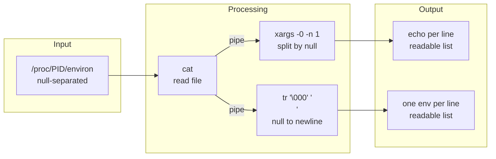

## 개요

리눅스에서 **실행 중인 프로세스의 환경변수**를 확인해야 할 때가 있다. 디버깅, 설정 검증, 컨테이너·서비스 환경 추적 등에서 유용하다. 커널이 제공하는 **가상 파일시스템 /proc**을 통해 각 프로세스의 `environ`을 읽을 수 있으며, 환경변수는 **널 문자(`\0`)로 구분**되어 있어 단순 `cat`만으로는 가독성이 떨어진다. 이 글에서는 `/proc/<pid>/environ` 읽기 방법, **xargs -0** 및 **tr**을 이용한 널 구분자 처리, 실전 예제와 데이터 흐름 다이어그램을 다룬다.

**대상 독자**: 리눅스 셸을 다루는 개발자·운영자, 프로세스 환경을 점검해야 하는 경우.

---

## 기본 개념

### /proc와 프로세스 정보

리눅스의 **/proc**은 디스크가 아닌 커널이 제공하는 **가상(페이도) 파일시스템**이다. 각 실행 중인 프로세스마다 `/proc/<pid>/` 디렉터리가 있으며, 그 안의 파일들을 읽어 해당 프로세스의 명령줄(`cmdline`), 환경(`environ`), 열린 파일(`fd/`), 메모리 맵(`maps`) 등을 조회할 수 있다.

- **경로**: `/proc/<pid>/environ`
- **내용**: 해당 프로세스가 **execve(2)** 시점에 넘겨받은 **초기 환경변수**가 널 문자(`\0`)로 구분된 형태로 저장됨
- **주의**: 프로세스가 실행 중 `putenv(3)` 등으로 환경을 바꾼 경우, `/proc/.../environ`에는 반영되지 않는다(초기 스냅샷만 제공).

### 환경변수 구분자: 왜 널 문자인가

유닉스/리눅스에서 환경변수는 **키=값** 쌍이며, 프로세스 메모리와 **execve(2)** 인자 전달 형식상 **널 문자(`\0`)**로 구분된다. 공백·줄바꿈은 값 안에 들어갈 수 있으므로 구분자로 쓰이지 않는다. 따라서 `cat /proc/<pid>/environ`을 하면 한 줄로 이어져 보이고, 변수 경계를 구분하기 어렵다.

---

## 데이터 흐름: environ 읽기부터 한 줄씩 출력까지

다음 Mermaid 다이어그램은 `/proc/<pid>/environ`에서 읽은 널 구분 데이터를 가독 있게 만드는 흐름을 보여 준다.



- **ProcEnviron**: 널로 구분된 환경변수 원시 데이터
- **CatCmd** → **XargsZero** → **EchoOut**: `cat ... | xargs -0 -n 1 echo` 경로
- **CatCmd** → **TrCmd** → **TrOut**: `cat ... | tr '\000' '\n'` 경로(매뉴얼 권장 방식)

---

## 사용법과 실전 예제

### 1. 기본 확인: PID로 환경변수 보기

PID가 1000인 프로세스의 환경변수 원시 덤프:

```bash
cat /proc/1000/environ
```

출력은 한 덩어리로 나오므로 변수 경계가 보이지 않는다.

### 2. xargs -0으로 한 변수당 한 줄 출력

표준 입력을 **널 문자(`\0`)** 기준으로 나누려면 `xargs`의 **-0** 옵션을 쓴다. **-n 1**은 인자 하나마다 명령을 한 번씩 실행한다(기본 명령은 `echo`).

```bash
cat /proc/1000/environ | xargs -0 -n 1 echo
```

- **-0**: 구분자를 널 문자로 사용(공백·따옴표 해석 없음)
- **-n 1**: 한 인자마다 `echo` 한 번 실행 → 한 줄에 하나의 `KEY=VALUE` 출력

### 3. tr으로 널을 줄바꿈으로 치환 (매뉴얼 권장)

[proc_pid_environ(5)](https://man7.org/linux/man-pages/man5/proc_pid_environ.5.html)에서는 다음을 권장한다.

```bash
cat /proc/1000/environ | tr '\000' '\n'
```

`\000`(널)을 `\n`(줄바꿈)으로 바꿔서 환경변수마다 한 줄씩 출력한다. `xargs` 없이 단순 치환이므로 스크립트에서도 안전하게 쓸 수 있다.

### 4. 현재 셸 프로세스의 환경변수 보기

```bash
cat /proc/$$/environ | tr '\000' '\n'
```

`$$`는 현재 셸의 PID이므로, 자신이 실행 중인 셸의 환경을 확인할 수 있다.

### 5. 특정 변수만 골라보기

```bash
cat /proc/1000/environ | tr '\000' '\n' | grep -E '^PATH=|^HOME='
```

### 6. xargs -0의 다른 활용: find -print0와 조합

`xargs -0`은 **find -print0**와 함께 쓰면 파일 경로에 공백·줄바꿈이 있어도 안전하게 처리할 수 있다. 환경변수 읽기와 같은 맥락으로, “널로 구분된 입력”을 다룰 때의 표준 패턴이다.

```bash
find /tmp -name "*.log" -type f -print0 | xargs -0 -n 1 echo
```

---

## 요약 표

| 목적 | 명령 예시 |
|------|-----------|
| 원시 덤프 | `cat /proc/<pid>/environ` |
| 한 줄에 한 변수 (xargs) | `cat /proc/<pid>/environ \| xargs -0 -n 1 echo` |
| 한 줄에 한 변수 (tr, 매뉴얼 권장) | `cat /proc/<pid>/environ \| tr '\000' '\n'` |
| 현재 셸 환경 | `cat /proc/$$/environ \| tr '\000' '\n'` |
| 특정 변수만 | `cat /proc/<pid>/environ \| tr '\000' '\n' \| grep '^KEY='` |

---

## 참고 문헌

1. **proc_pid_environ(5)** – Linux manual page (environ 파일 형식, tr 사용 예시)  
   [https://man7.org/linux/man-pages/man5/proc_pid_environ.5.html](https://man7.org/linux/man-pages/man5/proc_pid_environ.5.html)

2. **proc(5)** – process information pseudo-filesystem  
   [https://man7.org/linux/man-pages/man5/proc.5.html](https://man7.org/linux/man-pages/man5/proc.5.html)

3. **xargs(1)** – build and execute command lines from standard input (-0 옵션)  
   [https://man7.org/linux/man-pages/man1/xargs.1.html](https://man7.org/linux/man-pages/man1/xargs.1.html)
