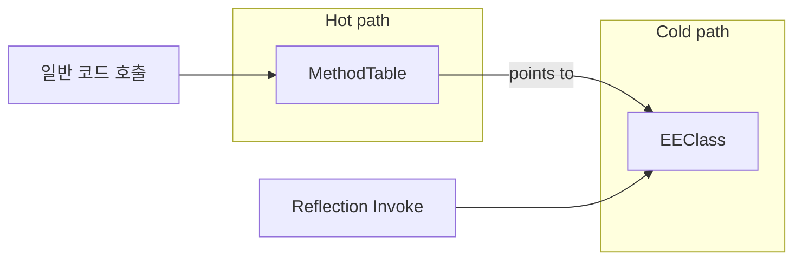

본문은 [Why is reflection slow?](https://mattwarren.org/2016/12/14/Why-is-Reflection-slow/)(Matt Warren)를 참고하여 작성·보강하였습니다.

## 개요

.NET에서 **리플렉션(Reflection)**은 타입·멤버·어셈블리 메타데이터를 실행 시점에 조회·호출하는 API다. ORM, JSON 직렬화, 객체 매핑 등에서 널리 쓰이지만, **일반 코드 대비 수백 배 느리다**는 인식이 있다. 이 글에서는 (1) CLR 타입 시스템 설계 목표, (2) 리플렉션이 느려지는 구체적 원인, (3) EEClass·MethodTable 구조, (4) Get/Set 벤치마크, (5) 실무 대안까지 정리한다.

**대상 독자**: C#·.NET으로 성능 민감한 코드를 다루는 개발자, 리플렉션 사용처를 이해하고 싶은 개발자.

---

## CLR 타입 시스템 설계 목표와 비목표

리플렉션이 느린 이유의 첫 번째는 **설계상 빠르게 만드는 것이 목표가 아니었기 때문**이다.

CLR 타입 시스템 문서([Design Goals and Non-goals](https://github.com/dotnet/coreclr/blob/32f0f9721afb584b4a14d69135bea7ddc129f755/Documentation/botr/type-system.md#design-goals-and-non-goals))에 따르면:

- **Goals(목표)**  
  - 타입 정보는 NGEN 이미지에 저장 가능해야 한다.  
  - 타입 로드 시 최소한의 데이터만 로드한다.  
  - GC/스택 워커가 락 없이, 할당 없이 필요한 정보에 접근할 수 있어야 한다.  
  - **실행 중인 일반(비리플렉션) 코드가 런타임에 필요로 하는 정보 접근은 매우 빨라야 한다.**

- **Non-Goals(비목표)**  
  - **모든 리플렉션 사용이 빠를 필요는 없다.**  
  - 메타데이터의 모든 정보가 CLR 데이터 구조에 그대로 반영될 필요는 없다.

즉, **일반 실행 경로는 극도로 최적화되지만, 리플렉션 경로는 그렇지 않다**는 설계이다.

---

## EEClass와 MethodTable: Hot / Cold 분리

타입 정보는 **MethodTable**과 **EEClass**로 나뉜다. [Type Loader - Key Data Structures](https://github.com/dotnet/coreclr/blob/32f0f9721afb584b4a14d69135bea7ddc129f755/Documentation/botr/type-loader.md#key-data-structures) 요약:

- **MethodTable**: 프로그램이 안정 상태에서 자주 쓰는 **"hot" 데이터**만 보관. 캐시·워킹셋 효율을 위해 최소화.
- **EEClass**: 타입 로딩, JIT, **리플렉션**에 주로 쓰이는 **"cold" 데이터** 보관. 각 MethodTable이 하나의 EEClass를 가리킨다.

리플렉션은 이 "cold" 쪽(EEClass·메타데이터)을 찾아가므로, 일반 실행 경로보다 캐시 친화적이지 않고 접근 비용이 크다.

---

## 리플렉션이 느려지는 세 가지 원인

### 1. 메서드·멤버 정보 조회(Fetching Method / Member Information)

`PropertyInfo`, `MethodInfo`, `FieldInfo` 등을 얻기 위해 메타데이터를 찾고, 파싱하고, 래퍼 객체를 만든다. 런타임은 **RuntimeTypeCache**로 한 번 조회한 멤버를 캐시하므로, 같은 타입에 대한 반복 조회는 상대적으로 저렴해진다. 그럼에도 **최초 조회 비용**과 **Invoke 시마다 거치는 내부 경로**는 일반 호출보다 훨씬 길다.

### 2. 인자 검증 및 에러 처리(Argument Validation and Error Handling)

`Invoke(obj, args)` 시 다음이 수행된다.

- **대상 객체 타입 검사**: 예를 들어 `string`의 `Length` 프로퍼티를 얻어두고 `Uri` 인스턴스에 대해 `GetValue`를 호출하면 `TargetException`이 발생한다. 이는 호출 시점에 타입 일치 여부를 검사하기 때문이다.
- **인자 개수·타입 검사**: 인자를 `object[]`로 넘기기 때문에 런타임에 개수와 타입을 검사하고, 필요 시 **박싱**이 일어나 추가 비용이 발생한다.

즉, 매 호출마다 검증과 변환 비용이 든다.

### 3. 보안 검사(Security Checks)

리플렉션으로 **아무 메서드나** 호출할 수는 없다. [Dangerous APIs](https://github.com/dotnet/coreclr/blob/32f0f9721afb584b4a14d69135bea7ddc129f755/src/vm/dangerousapis.h)처럼 신뢰된 프레임워크 코드만 호출 가능한 메서드가 있고, Code Access Security 등에 따른 **동적 보안 검사**가 Invoke 경로에서 수행된다.

---

## 리플렉션 호출 경로(Call Stack) 요약

`MethodInfo.Invoke`는 내부적으로 다음과 같은 경로를 따른다(요약).

1. `System.Reflection.RuntimeMethodInfo.Invoke` → `UnsafeInvokeInternal`
2. `System.RuntimeMethodHandle.PerformSecurityCheck` 등 보안 관련 호출
3. `System.RuntimeMethodHandle.InvokeMethod`(네이티브): 여기서 인자 검증, 마샬링, 실제 호출이 이루어진다. 이 단일 메서드만 해도 수백 줄 규모다.

즉, **한 번의 리플렉션 Invoke마다** 위와 같은 관리/네이티브 경로가 반복되므로, 일반 직접 호출보다 수백 배 느려질 수 있다.

---

## 리플렉션 비용 정량화: Get / Set 벤치마크

아래는 **프로퍼티 직접 접근**과 **리플렉션 Get/Set**을 [BenchmarkDotNet](http://benchmarkdotnet.org/)으로 측정한 대표 결과다. 프로퍼티는 컴파일러가 get/set 메서드로 만들고, 단순 백킹 필드일 때 JIT가 인라인하므로 **직접 접근이 가장 유리한 상황**이다. 반대로 리플렉션은 **가장 불리한 상황**에서 측정된 수치다. ORM, JSON 직렬화, 객체 매핑 등은 이런 패턴을 반복하므로 참고할 만하다.

### Reading a Property (Get)

| Method | Mean | StdErr | Scaled | Bytes Allocated/Op |
|--------|-----:|-------:|-------:|-------------------:|
| GetViaProperty | 0.2159 ns | 0.0047 ns | 1.00 | 0.00 |
| GetViaReflection | 197.9258 ns | 0.2704 ns | 923.08 | 0.01 |

### Writing a Property (Set)

| Method | Mean | StdErr | Scaled | Bytes Allocated/Op |
|--------|-----:|-------:|-------:|-------------------:|
| SetViaProperty | 1.4043 ns | 0.0200 ns | 6.55 | 0.00 |
| SetViaReflection | 287.1039 ns | 0.3288 ns | 1,338.99 | 115.63 |

**해석**: Get은 약 **920배**, Set은 약 **1,300배** 정도 느리고, Set 시 **할당(약 116 B/op)** 이 발생한다. 반복 호출이 많은 경로에서는 이 차이가 그대로 병목이 될 수 있다.

---

## 실무 대안 요약

리플렉션 자체는 **한두 번 초기화**에만 쓰고, **반복 호출은 다른 경로**로 하는 것이 좋다.

1. **PropertyInfo / MethodInfo 캐싱**  
   매번 `GetProperty`/`GetMethod`를 부르지 말고, 한 번 얻은 `PropertyInfo`/`MethodInfo`를 재사용하면 조회 비용은 줄어든다. 다만 **Invoke 비용**은 그대로이므로, 호출이 빈번하면 여전히 느리다.

2. **Delegate 생성 후 호출**  
   `Delegate.CreateDelegate`로 `Func<T, TResult>` 등 강타입 델리게이트를 만들고, 이후에는 해당 델리게이트만 호출한다. 리플렉션 검사·마샬링은 델리게이트 생성 시 한 번만 이루어지고, 이후 호출은 일반 메서드 호출에 가깝다. 다만 **구체 타입을 컴파일 타임에 알아야** 하는 제약이 있다.

3. **Expression Tree 컴파일**  
   `Expression` API로 getter/setter를 표현한 뒤 `Compile()`해 델리게이트로 만든다. `object`를 받는 형태로 만들 수 있어, 구체 타입을 모를 때도 활용 가능하다.

4. **IL Emit / Sigil**  
   동적으로 IL을 생성해 메서드를 만드는 방식. 최고 성능이 필요할 때 사용하며, 구현 난이도와 유지보수 비용이 크다.

5. **FastMember 등 전용 라이브러리**  
   멤버 접근만 반복하는 시나리오라면 [FastMember](https://www.nuget.org/packages/FastMember/)처럼 리플렉션을 내부에서 한 번만 쓰고 델리게이트로 캐싱하는 라이브러리를 쓰는 것도 방법이다.

정리하면, **성능이 중요하면 리플렉션 Invoke를 반복하지 말고, 한 번만 사용해 델리게이트(또는 그에 준하는 경로)를 만들고 이후에는 그 경로만 사용**하는 것이 핵심이다.

---

## 참고 문헌

1. Matt Warren, [Why is reflection slow?](https://mattwarren.org/2016/12/14/Why-is-Reflection-slow/) — CLR 설계 목표, 호출 경로, 벤치마크, 대안 정리.
2. .NET CoreCLR, [Type System Overview - Design Goals and Non-goals](https://github.com/dotnet/coreclr/blob/32f0f9721afb584b4a14d69135bea7ddc129f755/Documentation/botr/type-system.md#design-goals-and-non-goals).
3. .NET CoreCLR, [Type Loader - Key Data Structures (EEClass, MethodTable)](https://github.com/dotnet/coreclr/blob/32f0f9721afb584b4a14d69135bea7ddc129f755/Documentation/botr/type-loader.md#key-data-structures).
4. [BenchmarkDotNet](https://benchmarkdotnet.org/) — .NET 벤치마크 도구.
5. Jon Skeet, [Making Reflection fly and exploring delegates](https://codeblog.jonskeet.uk/2008/08/09/making-reflection-fly-and-exploring-delegates/) — 델리게이트 기반 고성능 리플렉션 패턴.
