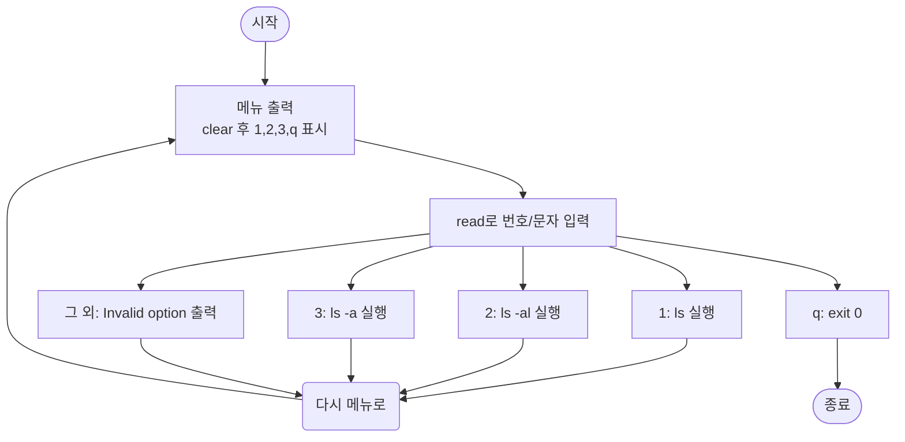

터미널에서 반복해서 명령을 실행할 때, 매번 긴 명령어를 치기보다 **숫자 하나로 메뉴를 골라 실행**하는 방식을 쓰면 편하다. 예를 들어 개발 중에 디렉터리 목록을 `ls`, `ls -al`, `ls -a` 등으로 자주 바꿔 보는 경우, 숫자 1·2·3만 입력해 선택할 수 있게 하면 효율이 올라간다. 이 글에서는 Bash에서 **숫자를 입력받아 해당 명령을 실행하는 반복 메뉴 셸 스크립트**를 만드는 방법을 다룬다. **while** 루프와 **case** 문을 이용한 패턴, 화면 정리·입력·종료 처리, 그리고 메뉴를 늘리거나 실무에서 쓸 때의 주의점까지 정리한다.

## 왜 숫자 메뉴인가

긴 옵션이 붙은 명령을 자주 바꿔 가며 쓸 때, 숫자 한두 자리로 선택할 수 있으면 타이핑이 줄고 실수가 줄어든다. 스크립트로 묶어 두면 **동일한 작업을 여러 환경(서버·로컬·CI)**에서 같은 방식으로 실행할 수 있고, 팀원에게 "1번 메뉴 실행해줘"처럼 지시하기도 쉽다. 따라서 **반복 메뉴(메뉴 표시 → 입력 받기 → 분기 실행 → 다시 메뉴)** 구조를 한 번 익혀 두면, 단순한 운영·자동화 스크립트를 빠르게 설계할 수 있다.

## 핵심 구조: while + case

Bash에서 이런 반복 메뉴를 만들 때 쓰는 전형적인 구조는 두 가지다. 첫째, **무한 루프**로 메뉴를 계속 보여 주고 입력을 받는 **while true** (또는 `while :`) 구문이다. 둘째, 입력값에 따라 실행할 명령을 나누는 **case ... esac** 다중 분기다. 이 둘을 묶으면 "메뉴 출력 → 사용자 입력 → case로 분기 → 명령 실행 → (종료가 아니면) 다시 메뉴" 흐름이 완성된다. **exit**으로 스크립트를 끝내는 선택지(예: `q`)를 하나 두면, 무한 루프에서 안전하게 빠져나올 수 있다.

## 전체 예제 코드

아래 스크립트는 메뉴에서 **1**이면 `ls`, **2**면 `ls -al`, **3**이면 `ls -a`를 실행하고, **q**를 입력하면 스크립트를 종료한다. 매번 메뉴를 보여 주기 위해 루프 시작 시 **clear**로 화면을 지우고, **read**로 한 줄 입력을 받은 뒤 **case**로 분기한다.

```bash
while true; do
  clear
  echo '
1. cmd 1
2. cmd 2
3. cmd 3
q. end
'
  echo -n "select: "
  read -r no
  case $no in
    1) ls ;;
    2) ls -al ;;
    3) ls -a ;;
    q) exit 0 ;;
    *) echo "Invalid option." ;;
  esac
  echo ""
  echo "Press Enter to continue..."
  read -r
done
```

- **clear**: 매 반복마다 화면을 비워 메뉴만 보이게 한다. (원문의 `clean`은 일반 셸 명령이 아니며, 화면 지우기는 **clear**를 사용한다.)
- **read -r no**: 한 줄을 읽어 변수 `no`에 넣는다. `-r`은 백슬래시 이스케이프를 해석하지 않도록 해서 입력을 그대로 받는다.
- **case $no in ... esac**: `no` 값이 `1`, `2`, `3`, `q`일 때 각각 다른 명령을 실행하고, 그 외(`*`)는 "Invalid option."을 출력한다.
- **exit 0**: `q` 선택 시 종료 코드 0으로 스크립트를 끝낸다.
- 마지막 **read -r**: 결과를 읽을 시간을 주고, Enter로 다음 메뉴로 넘어가게 할 수 있다(선택 사항).

## 실행 흐름 다이어그램

메뉴 표시 → 입력 → 분기 → (종료 또는 반복) 흐름은 아래와 같다.



노드 ID는 **camelCase/PascalCase**로만 쓰고, 라벨에 콜론·공백이 있어도 Mermaid 문법을 위해 노드 텍스트는 짧게 두었다. "1: ls 실행"처럼 **콜론·등호**가 들어가는 설명이 필요하면 해당 노드 라벨을 큰따옴표로 감싼 형태(예: `Case1["1: ls 실행"]`)를 사용하면 된다.

## 메뉴 확장과 종료·에러 처리

메뉴를 늘리려면 **case**에 패턴과 실행할 명령을 추가하면 된다. 숫자뿐 아니라 문자(예: `a`, `b`)나 복수 문자도 패턴으로 쓸 수 있다. 종료는 **q** 하나가 아니라 `q|Q|exit`처럼 여러 패턴을 `|`로 묶어 줄 수 있다.  
입력이 비어 있거나 숫자/문자 외 값이 들어오는 경우, 위 예제에서는 `*)` 브랜치에서 "Invalid option."을 출력하고 다시 메뉴로 돌아가므로, 최소한의 **에러 처리**가 들어가 있다. 실무에서는 **입력 검증**(예: 숫자만 허용, 빈 입력 재입력 유도)을 더 넣으면 스크립트가 견고해진다.

## 언제 쓰고 언제 피할지

- **쓸 만한 경우**: 동일한 몇 가지 명령을 반복해 실행할 때, 터미널에서 간단한 메뉴로 선택하고 싶을 때, 옵션이 다른 명령들을 한 스크립트로 통합해 팀에서 공유할 때.
- **피하는 편이 나은 경우**: 메뉴가 매우 많아지면(예: 20개 이상) case 문이 비대해지고 유지보수가 어려우므로, 그때는 번호 대신 **선택 목록(select)**이나 **다이얼로그(whiptail/dialog)** 등 다른 UI를 고려하는 것이 좋다. 또한 **비대화형 자동화**(CI, cron)에서는 사용자 입력이 없으므로 이 패턴 대신 인자·환경 변수로 분기하는 방식이 맞다.

## 핵심 요약

| 항목 | 내용 |
|------|------|
| 반복 구조 | `while true`로 무한 루프, 매 턴에 `clear` 후 메뉴 출력 |
| 입력 | `read -r no`로 한 줄 입력, `case $no in`으로 분기 |
| 종료 | `q` 등 한 패턴에서 `exit 0` 호출 |
| 확장 | case에 패턴과 명령 추가, `q\|Q`처럼 여러 패턴 가능 |
| 주의 | `clean`이 아니라 **clear**, `read`는 `-r` 권장, 비대화형 자동화에는 부적합 |

이 글을 읽은 뒤에는 **while true + case**로 숫자/문자 메뉴를 만드는 방법을 설명할 수 있고, 주어진 메뉴에 항목을 추가하거나 종료·에러 처리 방식을 바꿀 수 있으며, "대화형 메뉴"와 "인자 기반 자동화" 중 어떤 상황에 이 패턴을 쓸지 구분할 수 있다.
