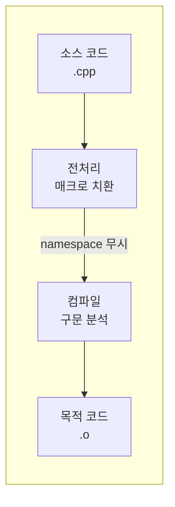

C/C++에서 상수나 매크로를 **namespace** 안에 두어 다른 코드와 분리하고 싶은 경우가 있다. 그러나 **전처리기(preprocessor)** 지시자인 `#define`은 소스 코드의 텍스트 치환만 수행할 뿐, C++의 **namespace**나 **클래스 스코프**를 전혀 인식하지 않는다. 그 결과, `#define`을 namespace 블록 안에 써도 전역과 동일하게 동작하며, “이 namespace 안에서만 쓰이게 하자”는 의도는 달성되지 않는다. 이 글에서는 그 이유를 컴파일 단계와 함께 설명하고, namespace 경계를 지키며 상수를 쓰는 올바른 방법을 정리한다.

## 전처리기와 컴파일 단계

**전처리기(preprocessor)**는 컴파일러가 C/C++ 문법을 해석하기 **이전**에 동작하는 별도 단계다. [C preprocessor](https://en.wikipedia.org/wiki/C_preprocessor)는 `#include`, `#define`, `#ifdef` 같은 지시자를 처리하고, 매크로를 **순수 텍스트 치환**으로 확장한다. 이때 **namespace, 클래스, 함수** 같은 C++ 구문은 아직 파싱되지 않은 “그냥 문자열”이므로, 전처리기는 “이 치환이 어떤 스코프에 속한다”는 개념 자체를 갖지 않는다.

아래 다이어그램은 소스 코드가 실행 파일이 되기까지의 단계를 단순화한 것이다. 전처리 단계에서 `#define`이 모두 확장된 뒤에야 컴파일러가 namespace를 인식한다.



정리하면, **#define은 “컴파일 단계 이전”에 이미 전역처럼 치환되기 때문에**, namespace로 경계를 나눌 수 없다.

## namespace 안에 #define을 쓴 경우

개발자가 “이 상수는 `MyNamespace` 안에서만 쓰겠다”고 생각하고 아래처럼 작성할 수 있다.

```cpp
namespace MyNamespace
{
  #define SOME_VALUE 0xDEADBABE
}
```

의도는 “`SOME_VALUE`를 `MyNamespace` 내부로 한정”하는 것이지만, 전처리기는 `namespace` 키워드의 의미를 모른다. 전처리 단계를 지나면 `#define SOME_VALUE 0xDEADBABE`는 그냥 “`SOME_VALUE`라는 토큰을 `0xDEADBABE`로 치환하라”는 규칙으로만 등록되고, 그 규칙은 **파일(또는 번역 단위) 전체**에 적용된다. 따라서 다른 namespace나 전역에서도 `SOME_VALUE`를 사용하면 동일하게 `0xDEADBABE`로 치환된다. 즉, **namespace로 경계를 나눈다는 목적은 사라지고, define은 사실상 전역 매크로처럼 동작**한다.

## namespace 경계를 지키는 상수 정의 방법

상수를 **특정 namespace(또는 클래스) 안에서만 쓰이게** 하려면, 전처리기가 아닌 **C++ 언어의 스코프 규칙**을 사용해야 한다. 대표적인 방법은 아래와 같다.

**`const` 상수**

```cpp
namespace MyNamespace
{
  const unsigned int SOME_VALUE = 0xDEADBABE;
}
```

`const`는 언어 차원의 객체이므로 namespace 스코프를 그대로 따른다. `MyNamespace::SOME_VALUE`로만 접근 가능하고, `::SOME_VALUE`처럼 전역에서는 보이지 않는다.

**`constexpr` (C++11 이후)**

```cpp
namespace MyNamespace
{
  constexpr unsigned int SOME_VALUE = 0xDEADBABE;
}
```

컴파일 타임 상수로 쓰이면서도 namespace 경계를 지킨다. 가능하면 `const`보다 `constexpr`을 쓰는 편이 타입 안전성과 최적화 측면에서 유리하다.

**`enum` / `enum class`**

```cpp
namespace MyNamespace
{
  enum class Code : unsigned int { SOME_VALUE = 0xDEADBABE };
  // 사용: Code::SOME_VALUE
}
```

여러 상수를 한 묶음으로 두고 이름 공간을 나누고 싶을 때 유용하다.

**`inline` 변수 (C++17)**

헤더에서 namespace 스코프 상수를 정의할 때 ODR(One Definition Rule)을 지키려면 `inline`을 붙일 수 있다.

```cpp
namespace MyNamespace
{
  inline constexpr unsigned int SOME_VALUE = 0xDEADBABE;
}
```

위 예시들은 모두 **컴파일러가 구문을 해석한 뒤**에만 의미가 있으므로, namespace·클래스 스코프가 정확히 적용된다.

## #define vs 스코프 있는 상수 비교

| 항목 | #define | const / constexpr / enum |
|------|---------|---------------------------|
| 스코프 | 전처리 단계에서 결정되지 않음 → 사실상 전역 | namespace·클래스·블록 스코프 적용 |
| 타입 | 없음(텍스트 치환) | 명시적 타입 |
| 디버깅 | 심볼로 보기 어려움 | 변수/열거자로 추적 가능 |
| 이름 충돌 | 다른 헤더와 쉽게 충돌 | 스코프로 격리 |
| 조건부 컴파일 | #ifdef 등과 조합 가능 | 불가(대신 constexpr if 등 활용) |

namespace 안에서 “이 상수만 이 범위에 두고 싶다”면 **#define이 아니라 const/constexpr/enum**을 사용하는 것이 맞다.

## 언제 #define을 쓸 수 있는가

**#define**은 다음처럼 “범위 제한”이 목적이 아닐 때만 쓰는 것이 좋다.

- **조건부 컴파일**: `#ifdef`, `#if defined(...)` 등으로 플랫폼·빌드 옵션에 따라 코드 분기
- **include guard**: `#ifndef HEADER_H` / `#define HEADER_H` / `#endif`
- **로그/디버그 매크로**: `__FILE__`, `__LINE__` 등과 조합한 매크로
- **레거시·서드파티 코드**와의 호환으로 어쩔 수 없이 매크로를 쓰는 경우

반대로, “이 상수를 이 namespace/클래스 안에만 두고 싶다”는 요구에는 **#define은 부적합**하므로, 위에서 말한 const·constexpr·enum을 사용해야 한다.

## 마무리 및 체크리스트

- **전처리기**는 컴파일 전에 동작하며, **namespace·클래스 같은 C++ 스코프를 인식하지 않는다.**  
- **#define**은 텍스트 치환이므로 namespace 안에 써도 **범위가 제한되지 않고**, 사실상 전역 매크로처럼 동작한다.  
- namespace(또는 클래스) 경계 안에서 상수를 두려면 **const**, **constexpr**, **enum** / **enum class** 등 **언어의 스코프 규칙**을 사용해야 한다.  
- 조건부 컴파일·include guard·디버그 매크로처럼 “범위 제한”이 목적이 아닐 때만 #define을 쓰고, “이 상수를 이 범위에만 두고 싶다”면 #define 대신 const/constexpr/enum을 선택한다.

**적용 체크리스트**

- [ ] namespace 안에 상수를 두고 싶을 때 **#define 대신 const / constexpr / enum**을 사용하는가?
- [ ] 매크로는 **조건부 컴파일·include guard·레거시 호환** 등 필요한 경우에만 쓰는가?
- [ ] 새로 작성하는 C++ 코드에서는 **타입과 스코프가 있는 상수**를 우선하는가?
