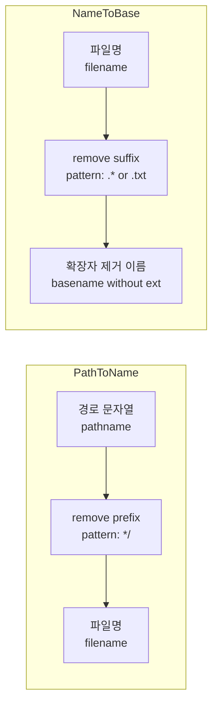
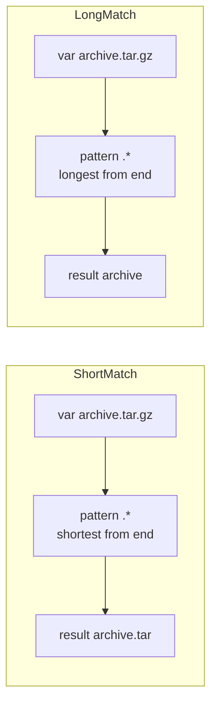

Bash 셸 스크립트에서 **파일 경로**(pathname) 문자열을 다룰 때, 전체 경로가 아니라 **파일명만** 필요하거나 **확장자를 뺀 이름만** 필요할 때가 많다. 예를 들어 같은 디렉터리에 로그를 만들거나, 파일명만 바꿔서 다른 경로에 저장하는 경우다. 이런 요구를 **외부 명령 없이** 변수만으로 처리하려면 Bash의 **parameter expansion**(매개변수 확장)을 쓰면 된다. 이 글에서는 경로 제거(`${var##*/}`)와 확장자 제거(`${var%.*}`, `${var%.txt}`)의 의미·사용법·엣지 케이스, 그리고 `basename`과의 관계를 정리한다.

---

## 개요: 왜 Parameter Expansion으로 파일명을 다루는가

**Parameter expansion**은 변수 값에 대해 패턴 매칭을 적용해 앞뒤를 잘라 내는 Bash 내장 기능이다. `dirname`·`basename`처럼 별도 프로세스를 띄우지 않으므로 스크립트가 가벼워지고, 루프 안에서 수많은 경로를 처리할 때 유리하다. 다만 **Bash 전용**이므로 POSIX sh만 쓰는 환경에서는 `basename`·`dirname`을 써야 한다. 정리하면, Bash 스크립트에서 경로·확장자 제거가 반복될 때 parameter expansion을 쓰고, 이식성이 최우선이면 표준 명령을 쓰는 것이 좋다.

---

## 기본 개념: #, ##, %, %%

Bash 매뉴얼에 따르면, **패턴 제거**는 다음 네 가지 형태가 있다.

- **`${parameter#word}`**: 앞에서 **가장 짧게** 매칭되는 부분 제거.
- **`${parameter##word}`**: 앞에서 **가장 길게** 매칭되는 부분 제거.
- **`${parameter%word}`**: 뒤에서 **가장 짧게** 매칭되는 부분 제거.
- **`${parameter%%word}`**: 뒤에서 **가장 길게** 매칭되는 부분 제거.

`word`는 **glob 패턴**(`*`, `?`, `[...]` 등)으로 해석된다. `*`는 "아무 문자나 0개 이상"이므로, 경로에서 "마지막 `/` 앞까지"를 없애려면 앞에서 가장 길게 매칭하는 `##`에 `*/`를 쓰고, "마지막 `.` 뒤 확장자"를 없애려면 뒤에서 가장 짧게 매칭하는 `%`에 `.*`를 쓰면 된다.

---

## 전체 흐름 한눈에 보기

아래 다이어그램은 "전체 경로 문자열 → 파일명만"과 "파일명 → 확장자 제거" 두 가지 흐름을 요약한다. 둘 다 변수 하나로 처리할 수 있다.



---

## 경로 제거하고 파일명만 추출

앞쪽에서 **"어떤 문자든 + `/`"** 를 **가장 길게** 한 번에 제거하면, 마지막 `/` 뒤의 파일명만 남는다. 이때 쓰는 형태가 **`${parameter##*/}`** 이다. `##`은 앞에서 최대 매칭, `*/`는 "슬래시를 포함한 앞부분 전부"에 해당한다.

```bash
s=/the/path/foo.txt
echo "${s##*/}"
# 출력: foo.txt
```

| 입력 예시 | `${var##*/}` 결과 |
|-----------|-------------------|
| `/the/path/foo.txt` | `foo.txt` |
| `./relative/bar.sh` | `bar.sh` |
| `no-slash` | `no-slash` |
| `path/to/dir/` | 빈 문자열(마지막이 `/`이면 그 앞이 파일명으로 간주되지 않음) |

경로 끝에 **trailing slash**가 있으면 `*/`가 "dir/"까지 통째로 매칭해 빈 문자열이 나올 수 있으므로, 필요하면 끝 슬래시를 제거한 뒤 적용하거나 `basename`을 쓰는 편이 안전하다.

---

## 파일명에서 확장자 제거

### 고정 확장자(.txt 등) 제거

확장자가 **고정**되어 있을 때(예: 항상 `.txt`)는 **`${parameter%.txt}`** 처럼 접미사를 그대로 적으면 된다. `%`는 뒤에서 **가장 짧게** 매칭하므로, `.txt`만 제거된다. 동작은 `basename string .txt`와 같다.

```bash
s=foo.txt
echo "${s%.txt}"
# 출력: foo
```

### 임의 확장자 제거: ". 뒤 전부"

확장자가 **가변**일 때(예: `.txt`, `.tar.gz` 등 어떤 확장자든 "마지막 점 뒤"를 없애고 싶을 때)는 **`${parameter%.*}`** 를 쓴다. `%`는 뒤에서 가장 짧게, `.*`는 "점 + 임의 문자"이므로 **마지막 점과 그 뒤**가 제거된다.

```bash
s=foo.txt
echo "${s%.*}"
# 출력: foo

s=archive.tar.gz
echo "${s%.*}"
# 출력: archive.tar  (마지막 .gz만 제거됨)
```

`.tar.gz`처럼 점이 여러 개인 경우, `%.*`는 **가장 짧은** 매칭이므로 **마지막 점 뒤(.gz)** 만 제거되고 `archive.tar`가 된다. "첫 번째 점 뒤 전부"를 제거하려면 `%%.*`(가장 길게 매칭)를 쓰면 된다. 그러면 `archive`만 남는다.



---

## 방법 비교와 사용 기준

| 목적 | Parameter expansion | basename / dirname |
|------|--------------------|---------------------|
| 경로 → 파일명 | `${var##*/}` | `basename "$var"` |
| 파일명 → 확장자 제거(고정) | `${var%.txt}` | `basename "$var" .txt` |
| 파일명 → 확장자 제거(임의, 마지막 점) | `${var%.*}` | — |
| 이식성 | Bash 전용 | POSIX·모든 셸 |
| 프로세스 | 없음(내장) | 서브프로세스 실행 |
| 엣지 케이스 | trailing slash 등 직접 처리 | 규격으로 정의됨 |

**판단 기준 요약**

- **Bash 스크립트이고** 경로·확장자 제거가 자주 반복될 때: parameter expansion 사용을 권장한다. 루프 안에서 특히 유리하다.
- **POSIX sh만 쓰는 환경**이거나 **이식성·엣지 케이스**(루트 `/`, trailing slash 등)를 규격에 맡기고 싶을 때: [파일 경로에서 디렉터리 경로와 파일명 추출하기](/post/2019/2019-02-13-extrac-directory-path-and-file-name/)에서 다룬 것처럼 `basename`·`dirname` 사용을 권장한다.
- **공백·특수문자**가 포함된 경로는 변수를 반드시 큰따옴표로 감싼다: `"${var##*/}"`, `"${var%.*}"`.

---

## 마무리 및 학습 목표

Bash에서 **경로 문자열 → 파일명**은 `${var##*/}`, **파일명 → 확장자 제거**는 고정 접미사면 `${var%.txt}`, 임의 확장자면 `${var%.*}` 또는 `${var%%.*}`로 처리할 수 있다. 외부 명령 없이 변수만으로 처리되므로 스크립트가 가볍고, 대신 Bash 전용 문법임을 염두에 두면 된다.

**이 글을 읽은 후 달성할 수 있는 것**

- `${parameter#word}`, `##`, `%`, `%%`의 의미(앞/뒤, 최단/최장 매칭)를 설명할 수 있다.
- 경로에서 파일명만 얻을 때 `${var##*/}`를 쓰고, 확장자 제거 시 `${var%.txt}`·`${var%.*}`를 상황에 맞게 선택할 수 있다.
- `.tar.gz`처럼 점이 여러 개일 때 `%`와 `%%`의 차이를 설명하고, 원하는 결과에 맞는 쪽을 고를 수 있다.
- Parameter expansion과 `basename`·`dirname`의 사용 기준(이식성 vs 성능·간결성)을 설명할 수 있다.

**핵심 요약**

| 목적 | 권장 표현 | 비고 |
|------|-----------|------|
| 경로 → 파일명 | `${var##*/}` | Bash 내장, trailing slash 주의 |
| 확장자 제거(고정) | `${var%.txt}` | `basename "$var" .txt`와 동일 |
| 확장자 제거(마지막 점 뒤) | `${var%.*}` | 한 개 점만 제거 |
| 확장자 제거(첫 점 뒤 전부) | `${var%%.*}` | `archive.tar.gz` → `archive` |

---

## 참고 문헌

- GNU, *Bash Reference Manual — Shell Parameter Expansion*, [3.5.3 Shell Parameter Expansion](https://www.gnu.org/software/bash/manual/html_node/Shell-Parameter-Expansion.html).
- The Open Group, *The Single UNIX Specification, Version 4 — basename*, [Base Specifications](https://pubs.opengroup.org/onlinepubs/9699919799/utilities/basename.html).
- 본 블로그, *[Shell] 파일 경로에서 디렉터리 경로와 파일명 추출하기*, [dirname·basename·sed 비교](/post/2019/2019-02-13-extrac-directory-path-and-file-name/).
