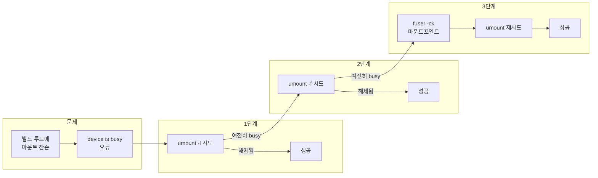

## 개요

리눅스에서 **GBS**(Generic Build System, 예: Tizen GBS)로 패키지를 빌드하다 보면, 빌드 루트(gbsroot)가 정상적으로 언마운트되지 않아 후속 빌드나 정리가 실패하는 경우가 있다. 이때 터미널에는 `device is busy` 메시지가 뜨며, `umount`만으로는 마운트 포인트를 해제하기 어렵다. 이 글에서는 **device is busy**의 원인과 **umount -l·-f** 옵션, **fuser**를 이용한 점유 프로세스 처리까지 포함한 해결 절차를 정리한다.

**대상 독자**: GBS·Tizen 등 리눅스 기반 빌드 환경을 쓰는 개발자, 시스템 관리자.

---

## 문제 상황

GBS 빌드 중 또는 빌드 실패 후 정리 단계에서 다음과 비슷한 로그가 나올 수 있다.

```bash
error: there're mounted directories to build root. Please unmount them manually to avoid being deleted unexpectly:
        / ==> /home1/jong-min.kim/VBS-ROOT/local/BUILD-ROOTS/scratch.armv7l.0/dev/shm
error: <gbs>some packages failed to be built
```

즉, 빌드 루트 아래에 마운트된 디렉터리(예: `dev/shm`)가 남아 있어, 자동 정리 시 예기치 않게 삭제될 수 있다는 경고다. 이 상태에서 수동으로 해당 경로를 언마운트하려 하면:

```bash
$ sudo umount /home1/jong-min.kim/VBS-ROOT/local/BUILD-ROOTS/scratch.armv7l.0/dev/shm
umount: /home1/jong-min.kim/VBS-ROOT/local/BUILD-ROOTS/scratch.armv7l.0/dev/shm: device is busy.
        (In some cases useful info about processes that use
         the device is found by lsof(8) or fuser(1))
```

**원인**: 해당 파일시스템(또는 마운트 포인트)을 어떤 프로세스가 사용 중이기 때문이다. 예를 들어 현재 작업 디렉터리가 그 안에 있거나, 파일을 열어 두었거나, 공유 메모리 등을 사용 중일 수 있다. 커널은 “사용 중인” 파일시스템을 즉시 언마운트하지 않도록 되어 있어 `device is busy`가 발생한다.

---

## 해결 흐름도

아래는 **device is busy**가 났을 때 시도할 수 있는 해결 절차를 요약한 흐름이다.



- **1단계**: `umount -l`(lazy umount)로 시도.
- **2단계**: 안 되면 `umount -f`(force) 시도.
- **3단계**: 그래도 실패하면 `fuser -ck`로 해당 경로를 사용하는 프로세스를 종료한 뒤 `umount` 재시도.

---

## 해결 방법 1: umount -l / -f 옵션

### umount -l (lazy umount)

`-l`(또는 `--lazy`)은 **지연 언마운트**다. 즉시 마운트를 끊지 않고, 해당 파일시스템을 사용하는 프로세스가 모두 빠져 나갈 때까지 기다렸다가 그때 해제한다. GBS 빌드 루트처럼 일시적으로 프로세스가 붙어 있는 경우에 유용하다.

```bash
$ sudo umount -l /home1/jong-min.kim/VBS-ROOT/local/BUILD-ROOTS/scratch.armv7l.0/dev/shm
```

`/etc/mtab`에 기록하지 않으려면 `-n`을 함께 쓸 수 있다.

```bash
$ sudo umount -nl /home1/jong-min.kim/VBS-ROOT/local/BUILD-ROOTS/scratch.armv7l.0/dev/shm
```

많은 경우 이렇게 하면 원하는 대로 디렉터리가 언마운트된다.

### umount -f (force)

`-f`(또는 `--force`)는 **강제 언마운트**를 시도한다. 주로 NFS처럼 원격이 끊겼을 때 사용하며, 로컬 파일시스템에서는 **안 되는 경우도 있다**. `-l`로 해결되지 않을 때 시도해 볼 수 있다.

```bash
$ sudo umount -f /path/to/mountpoint
```

**주의**: force 옵션은 시스템 호출이 멈출 수 있어, 가능하면 절대 경로를 쓰고 심볼릭 링크를 피하는 것이 좋다(공식 매뉴얼 권장).

---

## 해결 방법 2: fuser로 점유 프로세스 확인·종료 후 umount

`device is busy` 메시지에서도 안내하듯, 해당 장치·파일을 사용 중인 프로세스를 찾으려면 **lsof(8)** 또는 **fuser(1)**를 쓸 수 있다. 여기서는 **fuser**를 이용해 “마운트 포인트를 쓰는 프로세스를 종료한 뒤 umount”하는 방법을 정리한다.

### 기본 사용 패턴

```bash
fuser -ck /path/to/mountpoint
umount /path/to/mountpoint
```

- `-k`: 해당 파일(또는 파일시스템)을 사용하는 **모든 프로세스에 SIGKILL**을 보낸다.
- `-c`: 지정한 경로를 **마운트된 파일시스템**으로 간주하고, 그 파일시스템을 사용하는 프로세스를 대상으로 한다. (일부 환경에서는 `-m`과 동일한 의미로 쓰인다.)

예시(마운트 포인트 기준):

```bash
$ sudo fuser -ck /home1/jong-min.kim/VBS-ROOT/local/BUILD-ROOTS/scratch.armv7l.0/dev/shm
$ sudo umount /home1/jong-min.kim/VBS-ROOT/local/BUILD-ROOTS/scratch.armv7l.0/dev/shm
```

**주의**: `-k`는 프로세스를 강제 종료하므로, 중요한 작업이 그 안에서 돌고 있지 않은지 확인한 뒤 사용해야 한다. 확인만 하고 싶다면 `-k` 없이 `fuser -v` 또는 `fuser -uv`로 어떤 프로세스가 붙어 있는지 먼저 보는 것이 좋다.

### fuser 주요 옵션 요약

| 옵션 | 설명 |
|------|------|
| `-a` | 사용 중이지 않은 파일까지 모두 표시 |
| `-k` | 지정한 파일·파일시스템을 사용하는 프로세스에 SIGKILL 전송 |
| `-i` | 프로세스를 종료하기 전에 사용자에게 확인 (kill 시) |
| `-n space` | 지정한 공간(file, udp, tcp 등)에서만 검색 |
| `-s` | 결과를 간략히 출력 |
| `-u` | PID와 함께 프로세스 소유자(사용자) 표시 |
| `-v` | 자세한(verbose) 출력, ps 스타일로 표시 |
| `-m` | 경로를 마운트 포인트로 간주하고 해당 파일시스템 사용 프로세스만 대상 |

예: 먼저 누가 쓰는지 확인한 뒤 종료하려면:

```bash
$ fuser -uv /path/to/mountpoint
$ sudo fuser -k -i /path/to/mountpoint
```

---

## 주의사항 및 요약

- **umount -l**: “지연 언마운트”로, 사용 중인 프로세스가 없어질 때까지 기다렸다가 해제한다. GBS 빌드 루트 정리 시 **우선 시도**할 만한 방법이다.
- **umount -f**: 강제 시도이며, 로컬 파일시스템에서는 실패할 수 있다. NFS 등에서 유용하다.
- **fuser -ck**: 해당 경로(또는 파일시스템)를 사용하는 프로세스를 **종료**하므로, 중요한 서비스나 작업이 그 안에 있으면 중단될 수 있다. 가능하면 `fuser -v` 등으로 점유 프로세스를 확인한 뒤 사용한다.
- GBS 빌드 실패 후 정리할 때는, 위 순서(1. umount -l → 2. umount -f → 3. fuser -ck 후 umount)대로 적용하면 대부분의 **device is busy** 상황을 정리할 수 있다.

---

## 참고 문헌

1. [umount(8) - Linux manual page](https://man7.org/linux/man-pages/man8/umount.8.html) — util-linux, 마운트 해제 및 `-l`, `-f` 등 옵션 설명.
2. [fuser(1) - Linux manual page](https://man7.org/linux/man-pages/man1/fuser.1.html) — 파일·소켓을 사용하는 프로세스 확인 및 종료.
3. [lsof(8) - Linux manual page](https://man7.org/linux/man-pages/man8/lsof.8.html) — 열린 파일 목록 확인 시 `fuser`와 함께 자주 참고되는 도구.
