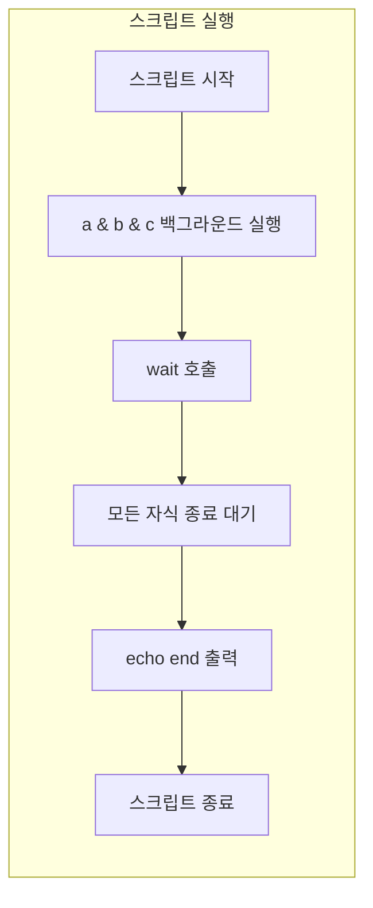

`wait`는 Bash·POSIX 셸 **빌트인**으로, 백그라운드로 실행한 서브프로세스(또는 job)의 종료를 대기할 때 사용한다. 특정 PID·job 번호만 기다리거나, **모든** 백그라운드 자식 프로세스가 끝날 때까지 기다릴 수 있어, 병렬 작업 스크립트와 배치 자동화에서 필수적으로 쓰인다.

## 사용법

```text
wait [-fn] [-p varname] [id ...]
```

- **인자 없음**: 현재 셸이 알고 있는 모든 백그라운드 job·프로세스 치환(process substitution)이 종료될 때까지 대기한 뒤, 반환값 0을 돌려준다.
- **id 있음**: 각 `id`는 **PID** 또는 **job 명세(jobspec)** 이다. job 명세는 `%1`, `%2`, `%+` 등 `jobs`로 보이는 형태다. 지정한 id들이 모두 종료될 때까지 대기하며, **마지막 id**의 종료 상태가 `wait`의 반환값이 된다.

## 옵션

| 옵션 | 설명 |
|------|------|
| **-n** | 지정한 id 중 **아무 하나**라도 완료되면 곧바로 반환하고, 그 프로세스(또는 job)의 종료 상태를 반환한다. id를 주지 않으면 “아무 자식 하나” 완료 대기. 해당하는 자식이 없으면 127 반환. |
| **-p varname** | `-n`과 함께 쓸 때 유용하다. 완료된 job/프로세스의 식별자(PID 또는 job ID)를 변수 `varname`에 넣어 준다. |
| **-f** | job control이 켜져 있을 때, 각 id가 **실제로 종료(terminate)**될 때까지 기다린다. 상태만 바뀌는 것이 아니라 종료될 때까지 대기한다. |

> job control이 꺼져 있으면 `wait`와 `kill`은 job 명세를 받지 못하고 **PID만** 받을 수 있다.

## 동작 흐름 요약

아래 Mermaid는 “여러 백그라운드 작업을 띄운 뒤 `wait`로 모두 기다리는” 전형적인 흐름을 나타낸다.



## 예시

### 1. 전체 백그라운드 작업 종료 대기

`a`, `b`, `c`를 백그라운드로 실행한 뒤, 셸은 `wait`에서 세 작업이 모두 끝날 때까지 대기한 다음 `"end"`를 출력한다.

```bash
#!/bin/bash

a &
b &
c &

wait
echo "end"
```

### 2. job 번호로 특정 job만 대기

`jobs`로 확인하는 백그라운드 job 번호(`%1`, `%2` 등)로 대기할 수 있다.

```bash
sleep 10 &
sleep 5 &
wait %2   # 두 번째 job(5초 sleep)만 기다림
echo "두 번째 작업만 완료됨"
wait      # 나머지 job도 모두 대기
```

### 3. PID로 특정 프로세스만 대기

`$!`로 마지막 백그라운드 프로세스의 PID를 저장한 뒤, 해당 PID만 기다린다.

```bash
long_running_task &
pid=$!
wait $pid
echo "long_running_task 종료, 종료 코드: $?"
```

### 4. 여러 PID를 순서대로 대기

여러 개의 id를 넘기면, **모두** 종료될 때까지 대기하고, **마지막** id의 종료 상태가 반환된다.

```bash
job1 &
p1=$!
job2 &
p2=$!
wait $p1 $p2
echo "두 작업 모두 완료, 마지막 종료 코드: $?"
```

### 5. 첫 번째로 끝나는 작업만 대기 (Bash -n)

`-n`을 사용하면 id 중 **하나**라도 끝나면 즉시 반환한다. 먼저 끝난 작업의 종료 상태를 알 수 있다.

```bash
slow_task &
fast_task &
wait -n
echo "먼저 끝난 작업의 종료 코드: $?"
wait
```

### 6. -n과 -p로 “어떤 job이 끝났는지” 확인

`-n`과 `-p`를 함께 쓰면, 완료된 job/프로세스의 식별자가 변수에 들어간다.

```bash
task_a &
task_b &
wait -n -p done_id
echo "완료된 ID: $done_id, 종료 코드: $?"
wait
```

### 7. 병렬 다운로드 후 한꺼번에 대기

여러 파일을 동시에 받은 뒤, 모두 끝날 때까지 기다리는 패턴이다.

```bash
wget -q -O file1.zip "https://example.com/file1.zip" &
wget -q -O file2.zip "https://example.com/file2.zip" &
wait
echo "다운로드 모두 완료"
```

### 8. 종료 코드 검사

`wait`의 반환값은 마지막으로 대기한 id의 종료 상태이므로, 실패 여부를 판단할 수 있다.

```bash
failing_cmd &
pid=$!
wait $pid
exitcode=$?
if [ "$exitcode" -ne 0 ]; then
  echo "작업 실패, 종료 코드: $exitcode"
  exit "$exitcode"
fi
```

### 9. 시그널로 종료된 프로세스 대기

프로세스를 시그널로 종료한 뒤 `wait`로 정리하면, 반환값이 128보다 클 수 있다(시그널 번호 + 128 등). POSIX 동작은 구현에 따라 다를 수 있다.

```bash
sleep 1000 &
pid=$!
kill -TERM "$pid"
wait $pid
echo "종료 코드: $?"
```

### 10. 서브쉘에서의 주의점

`( wait )` 또는 `nohup wait ...`처럼 **서브쉘·별도 실행 환경**에서 `wait`를 호출하면, 그 환경에는 “알고 있는” 자식이 없으므로 `wait`는 곧바로 반환한다. 대기하려면 **현재 셸**에서 `wait`를 실행해야 한다.

## 반환값 요약

| 상황 | 반환값 |
|------|--------|
| 인자 없이 호출 후 모든 자식 종료 | 0 |
| 지정한 id들이 모두 종료됨 | 마지막 id의 종료 상태(0–126 등) |
| 지정한 id가 셸의 자식이 아님 | 127 |
| `wait`가 시그널에 의해 중단됨 | 128 초과 (시그널 관련) |
| `-n` 사용 시, 대기할 자식이 없음 | 127 |

## 참고 문헌

- [GNU Bash Manual – Job Control Builtins (wait)](https://www.gnu.org/software/bash/manual/html_node/Job-Control-Builtins.html)  
- [man7.org – wait(1p)](https://man7.org/linux/man-pages/man1/wait.1p.html)  
- [GNU Bash Manual – Job Control Basics](https://www.gnu.org/software/bash/manual/html_node/Job-Control-Basics.html)
