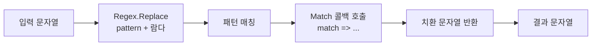

## 개요

문자열에서 원하는 부분을 **검색·치환·삭제**할 때 정규식(Regex)은 매우 유용하다. C#에서는 `Regex.Replace`만으로도 단순 문자열 치환이 가능하지만, **검색된 각 매치(Match)를 그대로 활용해** 치환 결과를 만들고 싶을 때가 있다. 예를 들어 매치 전체가 아니라 `Match.Value`를 가공하거나, 캡처 그룹을 조합해 새 문자열을 만드는 경우다.

이 글에서는 **`Regex.Replace`의 Match 평가 오버로드**를 사용해, 검색된 Match 객체를 람다에서 재사용하는 방법을 정리한다. 실전 예제(JSON 유사 문자열에서 쌍따옴표로 감싼 숫자만 숫자로 바꾸기), 이스케이프 처리 주의사항, 온라인 도구 활용 팁까지 포함했다.

**대상 독자**: C#으로 문자열 처리를 하며, 정규식과 `Regex.Replace` 기본 사용법을 알고 있는 개발자.

---

## Match 객체와 람다 사용

`Regex.Replace`에는 여러 오버로드가 있다. 그중 다음 시그니처는 **각 매치마다 `Match` 객체를 인자로 받는 대리자(또는 람다)**를 호출하고, 반환된 문자열로 치환한다.

```csharp
public static string Replace(
    string input,
    string pattern,
    MatchEvaluator evaluator
)
```

`MatchEvaluator`는 `Match`를 받아 `string`을 반환하는 대리자다. 즉, **매치 결과를 그대로 재사용**해 치환 문자열을 결정할 수 있다. 단순 고정 문자열 치환이 아니라, 매치 위치·캡처 그룹·`Value` 등을 활용한 동적 치환이 가능해진다.

---

## 동작 흐름

`Regex.Replace`에 패턴과 Match 평가 람다를 넘기면, 내부적으로 아래와 같은 흐름으로 동작한다.



각 매치마다 람다가 한 번씩 호출되고, 반환된 문자열이 해당 매치 전체를 대체한다.

---

## 예제: 쌍따옴표로 감싼 숫자만 숫자로 치환

예를 들어 `{ id:'Outsider', sex:"23" }` 같은 문자열에서, **쌍따옴표로 감싼 숫자**(`"23"`)만 **따옴표 없이** `23`으로 바꾸고 싶다고 하자. 즉 결과는 `{ id:'Outsider', sex:23 }`이 되어야 한다.

- 정규식으로 `"[0-9]+"` 같은 패턴을 쓰면, 매치되는 부분은 `"23"`이다.
- 이 매치를 그대로 쓰지 말고, **따옴표를 제거한 값**으로 치환하려면 `Match`를 받아 `match.Value`에서 `"`를 제거해 반환하면 된다.

---

### 샘플 코드

```csharp
using System;
using System.Text.RegularExpressions;

string str = "{ id:'Outsider', sex:\"23\" }";
Console.WriteLine(str);

str = Regex.Replace(str, "\"[0-9]+\"", match => match.Value.Replace("\"", ""));
Console.WriteLine(str);
```

- 패턴 `"\"[0-9]+\""`는 C# 문자열 안에서 쌍따옴표로 감싼 연속 숫자에 매칭된다.
- 람다 `match => match.Value.Replace("\"", "")`는 매치된 문자열에서 쌍따옴표를 제거한 값을 반환하므로, `"23"`이 `23`으로 치환된다.

---

### 실행 결과

```json
{ id:'Outsider', sex:"23" }
{ id:'Outsider', sex:23 }
```

---

## 이스케이프 처리 주의사항

정규식과 C# 문자열 리터럴 모두에서 **역슬래시(`\`)와 따옴표(`"`)**는 이스케이프가 필요하다.

- **C#**: 문자열 안에서 `"`는 `\"`, `\`는 `\\`로 쓴다. 정규식에서 `\d`를 쓰려면 C#에서는 `"\\d"` 또는 verbatim 문자열 `@"\d"`로 써야 한다.
- **온라인 도구(예: [RegExr](https://regexr.com/))**: 보통 한 겹만 이스케이프한다. 사이트에서 테스트한 패턴을 C# 코드에 넣을 때, C# 문자열 규칙에 맞게 다시 이스케이프해야 한다. 예: 사이트에서 `"[0-9]+"`로 테스트했다면, C#에서는 `"\"[0-9]+\""`처럼 따옴표를 이스케이프해 넣어야 한다.

IDE에서 매번 빌드해 보며 정규식을 확인하는 것은 시간이 걸리므로, 온라인에서 패턴을 검증한 뒤 코드에 반영할 때만 이스케이프 규칙을 한 번 더 점검하는 것이 좋다.

---

## 실전 팁: RegExr로 패턴 검증

[RegExr](https://regexr.com/)에서는 정규식을 실시간으로 입력하고, 샘플 텍스트에 대한 매치 결과를 바로 확인할 수 있다. PCRE·JavaScript 계열 문법을 지원하므로, C#과 차이가 있는 부분(예: 일부 확장 구문)만 주의하면 된다.

- **장점**: 빌드 없이 패턴을 빠르게 조정할 수 있다.
- **주의**: 사이트에서 만든 패턴을 C# `Regex`에 넣을 때는 **C# 문자열 리터럴용 이스케이프**를 적용해야 한다. `"`, `\` 등을 빠뜨리지 않도록 하자.

---

## 정리

- C#에서 **검색된 Match를 재사용해 치환**하려면 `Regex.Replace(string input, string pattern, MatchEvaluator evaluator)` 오버로드를 사용한다.
- 람다 `match => ...`에서 `match.Value`, `match.Groups` 등을 활용해 치환 문자열을 만들 수 있다.
- 정규식과 C# 문자열의 **이스케이프 규칙**을 구분해, 온라인 도구에서 검증한 뒤 코드에 넣을 때 따옴표·역슬래시를 올바르게 이스케이프한다.
- RegExr 등 온라인 도구로 패턴을 먼저 검증하면 개발 효율이 높아진다.

이 포스트에서 다룬 Match 재사용 패턴을 응용하면, JSON 유사 문자열 가공, 로그 포맷 변환, 템플릿 치환 등 다양한 문자열 처리에 활용할 수 있다.
