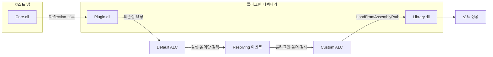

## 개요

이 포스트는 **C#/.NET** 환경에서 메인 애플리케이션과 **다른 디렉터리**에 있는 플러그인 DLL을 로드할 때, 플러그인이 참조하는 **의존 DLL을 찾지 못하는 문제**를 해결하는 방법을 다룹니다. **Custom AssemblyLoadContext**와 **AssemblyDependencyResolver**, 그리고 **Resolving 이벤트**를 활용한 두 가지 접근을 설명하고, 실전 코드와 주의사항을 정리합니다.

**대상 독자**: .NET Core/5+ 플러그인 구조를 설계하는 개발자, Reflection으로 외부 DLL을 로드하는 기능을 구현·유지보수하는 엔지니어.

---

## 문제 정의

### 배경 시나리오

다음과 같이 세 개의 DLL이 있다고 가정합니다.

- **Core.dll** — 메인 호스트 애플리케이션
- **Plugin.dll** — 플러그인 (Core가 Reflection으로 로드)
- **Library.dll** — Plugin.dll이 참조하는 라이브러리

배치 구조는 다음과 같습니다.

- Core.dll은 **애플리케이션 실행 디렉터리**(예: `app/`)에 있고,
- Plugin.dll과 Library.dll은 **같은 플러그인 디렉터리**(예: `app/plugins/`)에 있습니다.

이때 Core가 Plugin.dll만 `LoadFromAssemblyPath` 등으로 로드하면, 런타임은 **Plugin의 의존성인 Library.dll**을 **기본(Default) AssemblyLoadContext** 기준으로 찾습니다. 기본 컨텍스트는 보통 실행 디렉터리(`app/`)를 보기 때문에, `app/plugins/`에 있는 Library.dll을 찾지 못해 **FileNotFoundException** 또는 어셈블리 로드 실패가 발생합니다.

### 의존성 로딩 실패 흐름

아래 다이어그램은 기본 컨텍스트만 사용할 때의 실패 흐름과, Custom ALC·Resolving으로 해결하는 흐름을 요약합니다.



본 다이어그램은 규칙을 준수했습니다. 노드 ID는 공백 없이 camelCase/PascalCase를 사용했고 예약어(end, subgraph, graph 등)는 사용하지 않았습니다. 엣지 라벨에 특수문자·등호가 포함될 경우 `"..."` 로 감쌌으며, 줄바꿈이 필요할 때는 `</br>` 을 사용합니다.

---

## 해결 방법 1: AssemblyDependencyResolver 사용

**.NET Core 3.0+** 에서는 [AssemblyDependencyResolver](https://learn.microsoft.com/ko-kr/dotnet/api/system.runtime.loader.assemblydependencyresolver)를 사용해, **주 어셈블리 경로**를 기준으로 해당 디렉터리의 `.deps.json` 및 어셈블리를 해석하도록 할 수 있습니다. 플러그인이 **단일 폴더에 배치**되고 `*.deps.json`이 있다면 이 방식이 권장됩니다.

공식 문서: [.NET에서 어셈블리 언로드 기능 사용 및 디버그](https://learn.microsoft.com/ko-kr/dotnet/standard/assembly/unloadability).

### 예제: 수집 가능한 Custom AssemblyLoadContext

```csharp
using System.Reflection;
using System.Runtime.Loader;

namespace complex
{
    class TestAssemblyLoadContext : AssemblyLoadContext
    {
        private AssemblyDependencyResolver _resolver;

        public TestAssemblyLoadContext(string mainAssemblyToLoadPath) : base(isCollectible: true)
        {
            _resolver = new AssemblyDependencyResolver(mainAssemblyToLoadPath);
        }

        protected override Assembly? Load(AssemblyName name)
        {
            string? assemblyPath = _resolver.ResolveAssemblyToPath(name);
            if (assemblyPath != null)
            {
                return LoadFromAssemblyPath(assemblyPath);
            }

            return null;
        }
    }
}
```

- **생성자**: 로드할 **주 어셈블리 경로**(예: Plugin.dll 전체 경로)를 넘기면, `AssemblyDependencyResolver`가 같은 디렉터리의 `.deps.json`과 DLL을 사용해 의존성을 해석합니다.
- **Load override**: 의존 어셈블리 요청이 올 때마다 `ResolveAssemblyToPath`로 경로를 얻고, 있으면 `LoadFromAssemblyPath`로 해당 ALC에 로드합니다. `null`을 반환하면 기본 컨텍스트에서 찾도록 넘깁니다.
- **isCollectible: true**: 플러그인을 나중에 언로드할 수 있게 하려면 수집 가능한 ALC를 사용합니다. 언로드 시 참조 정리 요구사항은 공식 문서를 참고하는 것이 좋습니다.

이렇게 하면 Plugin.dll과 같은 폴더에 있는 Library.dll이 자동으로 이 컨텍스트에서 로드됩니다.

---

## 해결 방법 2: Custom Resolver와 Resolving 이벤트

`.deps.json`이 없거나, **여러 디렉터리**를 검색해야 하거나, **부가적인 해석 로직**이 필요한 경우에는 **AssemblyLoadContext.Resolving** 이벤트를 사용해 직접 어셈블리를 찾아 로드할 수 있습니다.

[AssemblyLoadContext](https://learn.microsoft.com/ko-kr/dotnet/api/system.runtime.loader.assemblyloadcontext) 문서에 따르면, **Resolving** 이벤트는 해당 컨텍스트에서 어셈블리 로드를 시도했다가 **확인에 실패했을 때** 발생합니다. 이때 핸들러에서 원하는 경로(예: 플러그인 디렉터리)의 DLL을 찾아 `LoadFromAssemblyPath`로 반환하면 됩니다.

### 예제: 검색 디렉터리 기반 Custom Loader

아래 코드는 **등록한 디렉터리 목록**에서 요청된 어셈블리 이름과 일치하는 DLL을 찾아 로드하는 방식입니다.

```csharp
using System.Linq;
using System.Reflection;
using System.Runtime.Loader;

namespace complex
{
    public class AssemblyLoader : AssemblyLoadContext
    {
        private const string DllAssemblySuffix = ".dll";
        private static readonly string[] s_suffixes = new[] { DllAssemblySuffix };

        private SortedSet<string> _dllDirectories = new SortedSet<string>();
        private HashSet<FileInfo> _assemblyCache = new HashSet<FileInfo>();

        public AssemblyLoader()
        {
            AssemblyLoadContext.Default.Resolving += OnResolving;
        }

        public void AddSearchableDirectory(string directory)
        {
            if (Directory.Exists(directory))
            {
                _dllDirectories.Add(directory);

                foreach (var file in Directory.GetFiles(directory))
                {
                    var info = new FileInfo(file);
                    if (s_suffixes.Any(s => string.Equals(s, info.Extension, StringComparison.OrdinalIgnoreCase)))
                    {
                        _assemblyCache.Add(info);
                    }
                }
            }
        }

        public void RemoveSearchableDirectory(string directory)
        {
            _dllDirectories.Remove(directory);
            _assemblyCache.RemoveWhere(x => x.DirectoryName == directory);
        }

        private Assembly? Resolve(AssemblyName assemblyName)
        {
            foreach (string suffix in s_suffixes)
            {
                var info = _assemblyCache.FirstOrDefault(x =>
                    string.Equals(x.Name, assemblyName.Name + suffix, StringComparison.OrdinalIgnoreCase));

                if (info != null)
                {
                    return LoadFromAssemblyPath(info.FullName);
                }
            }

            return null;
        }

        private Assembly? OnResolving(AssemblyLoadContext context, AssemblyName assemblyName)
        {
            return Resolve(assemblyName);
        }
    }
}
```

- **Default.Resolving**: 기본 컨텍스트에서 어셈블리 확인에 실패할 때만 호출됩니다. Plugin.dll을 이 ALC가 아닌 Default에서 로드했다면, Plugin이 참조하는 Library.dll을 찾을 때 Default의 Resolving이 발생하므로, 위처럼 Default에 핸들러를 붙이면 플러그인 폴더에서 Library.dll을 찾아 로드할 수 있습니다.
- **AddSearchableDirectory**: 플러그인 디렉터리(및 필요 시 추가 경로)를 등록하고, 해당 폴더의 `.dll` 파일 목록을 캐시합니다.
- **Resolve**: `AssemblyName.Name`과 일치하는 DLL 파일을 캐시에서 찾아, 현재 ALC의 `LoadFromAssemblyPath`로 로드합니다. 버전·문화권 등은 단순화한 예제이므로, 필요하면 `AssemblyName` 전체를 고려해 확장할 수 있습니다.

이렇게 하면 Plugin.dll을 로드할 때 Library.dll 확인에 실패하면 `OnResolving`이 호출되고, Plugin과 같은 폴더에 있는 Library.dll을 로드해 문제를 해결할 수 있습니다.

---

## 방법 비교 및 선택 가이드

| 항목 | AssemblyDependencyResolver | Custom Resolver + Resolving |
|------|----------------------------|-----------------------------|
| **전제 조건** | 주 어셈블리와 같은 폴더에 `.deps.json` 존재 권장 | 없음 (파일 시스템만 있으면 가능) |
| **검색 범위** | 단일 주 어셈블리 경로 기준 | 여러 디렉터리 등록 가능 |
| **버전/의존성 해석** | .deps.json 기반으로 정확 | 직접 구현 필요 (이름만 보는 단순 구현 가능) |
| **유지보수** | .NET 제공 타입 활용으로 비교적 단순 | 검색 로직·캐시·스레드 안전 등 직접 관리 |
| **언로드** | 수집 가능 ALC와 함께 사용 가능 | 동일 (ALC 설계에 따라 적용) |

- **플러그인이 단일 폴더 + .deps.json** → **방법 1** 우선 검토.
- **.deps.json 없음, 여러 경로 검색, 특수 규칙 필요** → **방법 2** 또는 두 방식을 조합해 사용.

---

## 주의사항 및 한계

- **Resolving 등록 위치**: 위 예제는 `Default.Resolving`에 등록해, Default 컨텍스트에서 실패한 경우에만 동작합니다. Custom ALC에서 플러그인을 로드한다면, 그 Custom ALC의 `Resolving`에 등록하거나, 해당 ALC의 `Load` override에서 처리하는 편이 일관됩니다.
- **수집 가능 ALC(isCollectible)**: 언로드를 사용할 경우, ALC 밖에서 해당 어셈블리의 타입·인스턴스·Assembly 참조를 모두 정리해야 합니다. 그렇지 않으면 언로드가 완료되지 않을 수 있습니다. 자세한 내용은 [어셈블리 언로드 문서](https://learn.microsoft.com/ko-kr/dotnet/standard/assembly/unloadability)를 참고하세요.
- **동일 이름·다른 버전**: 여러 플러그인에서 같은 이름의 다른 버전 DLL을 쓰는 경우, 어떤 컨텍스트에 어떤 버전을 로드할지 명확히 설계해야 합니다. 단순 디렉터리 검색만으로는 버전 충돌이 생길 수 있습니다.
- **스레드 안전성**: 위 Custom Loader 예제는 디렉터리 추가/제거와 캐시 수정 시 동시 접근을 가정하지 않습니다. 다중 스레드에서 사용할 경우 락 또는 동기화 구조를 고려해야 합니다.

---

## 참고 문헌

1. [.NET에서 어셈블리 언로드 기능을 사용하고 디버그하는 방법](https://learn.microsoft.com/ko-kr/dotnet/standard/assembly/unloadability) — 수집 가능한 AssemblyLoadContext, AssemblyDependencyResolver, 언로드 시 주의사항.
2. [AssemblyLoadContext 클래스 (System.Runtime.Loader)](https://learn.microsoft.com/ko-kr/dotnet/api/system.runtime.loader.assemblyloadcontext) — Load, Resolving, Unload 등 API 설명.
3. [AssemblyLoadContext.Resolving 이벤트](https://learn.microsoft.com/ko-kr/dotnet/api/system.runtime.loader.assemblyloadcontext.resolving) — Resolving 이벤트 시그니처와 동작.

위 문서들은 모두 **learn.microsoft.com** 기준으로 접근 가능한 공식 문서입니다.
