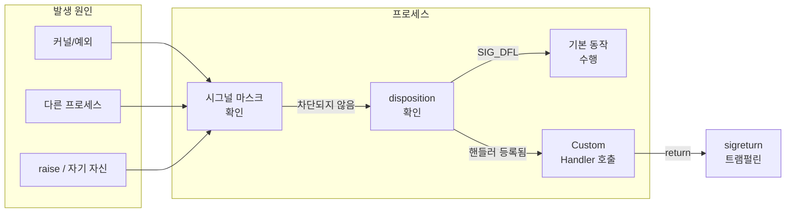

## 개요

리눅스·유닉스에서 **시그널(Signal)**은 프로세스에 비동기 이벤트를 전달하는 메커니즘이다. 커널·다른 프로세스·키보드 인터럽트 등에서 발생한 시그널을 프로세스가 받으면, 기본 동작(종료·코어 덤프·무시 등)이 수행되거나, 개발자가 등록한 **Custom Signal Handler**가 호출된다. 이 글에서는 **sigaction(2)**을 사용해 시그널 핸들러를 등록하는 방법, 시그널의 종류와 기본 동작, **async-signal-safe** 함수 사용의 중요성, 그리고 실전 예제를 다룬다.

**이 글을 통해 얻을 수 있는 것**

- 시그널의 종류와 기본 동작(terminate, core, ignore, stop, continue) 이해
- `sigaction` 구조체와 `SA_SIGINFO` 플래그를 이용한 확장 정보 수신
- 시그널 핸들러 내에서 호출해도 안전한 함수만 사용해야 하는 이유와 목록 참조 방법
- 실전에서 바로 쓸 수 있는 C 예제 코드

---

## 시그널의 종류

리눅스는 **표준 시그널(Standard signals)**과 **실시간 시그널(Real-time signals, SIGRTMIN~SIGRTMAX)**을 지원한다. 표준 시그널 중 자주 쓰이는 것만 정리하면 다음과 같다.

| 시그널     | 기본 동작 | 설명 |
|-----------|----------|------|
| **SIGINT**  | Term | 키보드 인터럽트 (Ctrl+C) |
| **SIGQUIT** | Core | 키보드 Quit (Ctrl+\\) |
| **SIGILL**  | Core | 잘못된 명령어 |
| **SIGABRT** | Core | `abort(3)` 호출 |
| **SIGFPE**  | Core | 산술 예외 (0으로 나누기 등) |
| **SIGSEGV** | Core | 잘못된 메모리 참조 (Segmentation fault) |
| **SIGPIPE** | Term | 읽는 쪽이 없는 파이프에 쓰기 |
| **SIGALRM** | Term | `alarm(2)` 타이머 만료 |
| **SIGTERM** | Term | 종료 요청 (기본 kill) |
| **SIGCHLD** | Ign | 자식 프로세스 상태 변경 |
| **SIGUSR1**, **SIGUSR2** | Term | 사용자 정의 (의미 없음, 앱에서 정의) |
| **SIGKILL** | Term | 강제 종료 (캐치·블록·무시 불가) |
| **SIGSTOP** | Stop | 일시 정지 (캐치·블록·무시 불가) |

**기본 동작**: Term(프로세스 종료), Core(종료 + 코어 덤프), Ign(무시), Stop(정지), Cont(정지 해제).

---

## 시그널 처리 흐름

시그널이 발생하면 커널이 해당 프로세스(또는 스레드)에 전달하고, 등록된 disposition에 따라 기본 동작을 수행하거나 사용자 핸들러를 호출한다. 흐름을 단순화하면 아래와 같다.



핸들러는 **비동기**로 호출될 수 있으므로, 실행 중이던 코드(시스템 콜·라이브러리 함수)가 언제든 중단된 상태에서 핸들러가 실행된다. 이 점이 **async-signal-safe** 제약의 이유다.

---

## sigaction을 사용하여 Custom Signal Handler 등록하기

`signal(2)`보다 이식성과 제어력이 좋은 **sigaction(2)**으로 핸들러를 등록한다.

### 구조체와 플래그

- **sa_handler** / **sa_sigaction**: 핸들러 함수 포인터. `SA_SIGINFO`를 쓰면 `sa_sigaction`이 사용되며, 시그널 번호·`siginfo_t`·`ucontext_t`를 인자로 받는다.
- **sa_mask**: 핸들러 실행 동안 블록할 시그널 집합.
- **sa_flags**: 동작 수정. 자주 쓰는 것:
  - **SA_SIGINFO**: 핸들러에 `(int signo, siginfo_t *info, void *ucontext)` 전달.
  - **SA_RESTART**: 일부 시스템 콜이 시그널 후 자동 재시작.
  - **SA_NODEFER**: 핸들러 실행 중 같은 시그널이 다시 전달될 수 있게 함(재진입 시 유의).

### 등록 절차

1. `struct sigaction`을 0으로 초기화.
2. `sa_sigaction`(또는 `sa_handler`)에 핸들러 함수 지정.
3. `sa_flags`에 `SA_SIGINFO` 등 필요한 플래그 설정.
4. `sigaction(signum, &act, NULL)`(또는 기존 동작 저장용으로 `oldact` 사용) 호출.

아래 예제는 **SIGSEGV**에 대해 `SA_SIGINFO | SA_UNSUPPORTED | SA_EXPOSE_TAGBITS`로 등록한 뒤, 핸들러 안에서 커널이 해당 플래그를 지원하는지 확인하는 패턴이다. (Linux 5.11+ 플래그 탐지용)

---

## async-signal-safe 함수를 사용해야 한다

시그널 핸들러는 **메인 프로그램 실행의 임의 지점**에서 비동기로 호출된다. 이때 일반 라이브러리 함수(예: `printf`, `malloc`, `pthread_mutex_lock`)를 호출하면, 내부 상태가 일관되지 않은 상황에서 재진입할 수 있어 **미정의 동작**이 된다.

- **stdio**: `printf` 등은 정적 버퍼와 인덱스를 쓰므로, 메인에서 `printf` 실행 중에 핸들러가 같은 `printf`를 호출하면 버퍼가 꼬인다.
- **malloc**: 힙 메타데이터가 손상될 수 있다.

따라서 시그널 핸들러 안에서는 **async-signal-safe**로 보장된 함수만 호출해야 한다. POSIX가 보장하는 목록은 **signal-safety(7)**에 있으며, `_exit`, `write`, `sigaction`, `raise` 등 제한된 집합만 안전하다. `printf`, `malloc`, `free` 등은 **핸들러 내에서 호출하면 안 된다**.

| 사용 가능(예) | 사용 금지(예) |
|--------------|----------------|
| `_exit`, `_Exit` | `exit`, `printf`, `malloc` |
| `write(2)` | `printf`, `fprintf`, `puts` |
| `sigaction`, `raise` | `pthread_mutex_lock`, `malloc` |

자세한 목록과 주의사항은 [signal-safety(7)](https://man7.org/linux/man-pages/man7/signal-safety.7.html)를 참고한다.

---

## 실전 예제: SIGSEGV 핸들러와 플래그 지원 탐지

아래 코드는 SIGSEGV에 Custom Handler를 등록한 뒤 `raise(SIGSEGV)`로 발생시키고, 핸들러 안에서 `sigaction(SIGSEGV, NULL, &oldact)`으로 커널이 반환한 `oldact.sa_flags`를 확인해 `SA_UNSUPPORTED`·`SA_EXPOSE_TAGBITS` 지원 여부를 판별한다. 핸들러 내에서는 **async-signal-safe**인 `sigaction`, `_exit`만 사용한다.

```c
// 42jerrykim.github.io에서 더 많은 정보를 확인할 수 있다
#include <signal.h>
#include <stdlib.h>
#include <stdio.h>
#include <unistd.h>

void handler(int signo, siginfo_t *info, void *context)
{
    struct sigaction oldact;

    if (sigaction(SIGSEGV, NULL, &oldact) == -1 || (oldact.sa_flags & SA_UNSUPPORTED) || !(oldact.sa_flags & SA_EXPOSE_TAGBITS))
    {
        _exit(EXIT_FAILURE);
    }
    _exit(EXIT_SUCCESS);
}

int main(void)
{
    struct sigaction act = { 0 };

    act.sa_flags = SA_SIGINFO | SA_UNSUPPORTED | SA_EXPOSE_TAGBITS;
    act.sa_sigaction = &handler;
    if (sigaction(SIGSEGV, &act, NULL) == -1)
    {
        perror("sigaction");
        exit(EXIT_FAILURE);
    }

    raise(SIGSEGV);
}
```

- **핸들러 안**: `sigaction`, `_exit`만 사용 → async-signal-safe 준수.
- **main**: `perror`, `exit`는 핸들러가 아닌 일반 흐름에서만 호출되므로 사용 가능.

---

## 정리

- **시그널**은 비동기 이벤트 전달 메커니즘이며, 표준 시그널과 실시간 시그널이 있다.
- **Custom Handler**는 **sigaction(2)**으로 등록하고, `SA_SIGINFO`로 `siginfo_t` 등을 받을 수 있다.
- 핸들러 내부에서는 **async-signal-safe** 함수만 써야 하며, 목록은 **signal-safety(7)**을 참고한다.
- 실무에서는 핸들러를 짧게 유지하고, 가능하면 플래그·파일 디스크립터·원자적 변수 등으로 메인 루프에 알린 뒤, 메인에서 안전한 함수로 처리하는 패턴을 권장한다.

---

## 참고 문헌

- [signal(7) - Linux manual page](https://man7.org/linux/man-pages/man7/signal.7.html): 시그널 개요, 표준/실시간 시그널, disposition, 시그널 마스크.
- [sigaction(2) - Linux manual page](https://man7.org/linux/man-pages/man2/sigaction.2.html): 시그널 동작 설정·조회, `struct sigaction`, `sa_flags`, `siginfo_t`.
- [signal-safety(7) - Linux manual page](https://man7.org/linux/man-pages/man7/signal-safety.7.html): 시그널 핸들러에서 호출 가능한 async-signal-safe 함수 목록과 주의사항.
