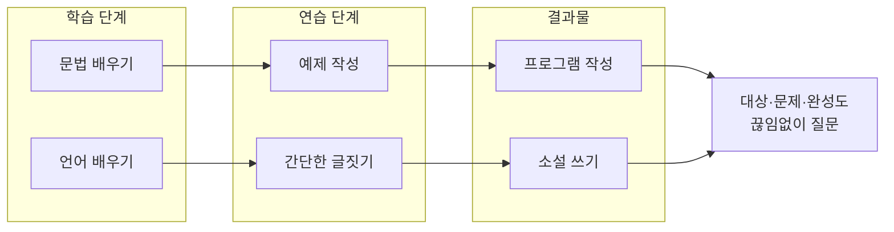

SW 개발자가 일과 성장에서 품어야 할 **기본 마음가짐**과 **필수 원칙**을 정리한다. 프로그램과 소설의 비유, **장난감**과 **제품**의 차이, 애플·아이폰·SNS·자율주행·AI 등 혁신 사례를 통해 "어떤 생각으로 설계하고 구현할 것인가"를 구체적으로 다룬다.

---

## SW란 무엇인가?

**소프트웨어(SW)**는 컴퓨터가 수행할 작업을 지시하는 프로그램과 데이터의 집합이다. 단순히 문법을 아는 수준을 넘어, **누구를 위한 것인지**, **어떤 문제를 해결하는지**, **어디까지 완성도를 높일지**를 끊임없이 묻는 태도가 개발자에게는 필수다.

### SW와 소설

SW 제작과 소설 집필은 단계가 잘 대응한다. 둘 다 **기초 학습 → 소규모 연습 → 완성된 결과물**이라는 흐름을 따른다.

| SW | 소설 |
|----|------|
| 문법 배우기 | 언어 배우기 |
| 예제 작성 | 간단한 글짓기(메모, 일기 등) |
| 프로그램 작성 | 소설책 쓰기 |

아래 다이어그램은 이 대응 관계와, 좋은 결과물로 나아가기 위한 사고 단계를 요약한다.

### 좋은 SW(소설)가 되기 위한 조건

좋은 SW와 좋은 소설은 공통으로 **명확한 대상**, **해결하려는 문제(또는 메시지)**, **일관된 완성도**를 요구한다. 독자·사용자가 "누구인지", 그들이 "무엇을 얻는지", 그리고 "어디까지 다듬었는지"를 개발자·작가가 스스로 설명할 수 있어야 한다. 그래야 **장난감** 수준을 넘어 **제품**이 된다.

---

## 장난감 vs 제품

**장난감**은 만들면서 배우거나, 개인용으로 쓰기에 충분한 수준이다. **제품**은 불특정 다수 사용자를 전제로, 품질·안정성·유지보수·배포·지원까지 고려한 결과물이다. 스티브 워즈니악이 IBM 시절 개인용으로 만든 컴퓨터는, 스티브 잡스와의 협업을 거쳐 **애플 I/II**라는 제품으로 탈바꿈했다. 같은 기술이라도 "누구를 위해, 어떤 기준으로 완성할 것인가"에 따라 장난감과 제품이 갈린다.

{: .align-center}

스티브 워즈니악이 IBM에서 일할 때 개인용으로 사용할 컴퓨터를 스티브 잡스가 제품으로 탈바꿈시킴

{: .align-center}

| 구분 | 장난감 | 제품 |
|------|--------|------|
| 대상 | 자신 또는 소수 | 불특정 다수 사용자 |
| 목표 | 학습·실험·개인 만족 | 문제 해결·가치 전달·수익·영향력 |
| 완성도 | 동작하면 충분 | 품질·안정성·보안·문서·지원 |
| 유지보수 | 선택 사항 | 필수(패치·호환·업데이트) |
| 배포·지원 | 없거나 최소 | 채널·고객 지원·피드백 루프 |

---

## 아이폰의 등장

2007년 아이폰은 **휴대전화 + PDA + 인터넷 + 미디어**를 하나의 제품으로 통합했다. 기존 PDA와 스마트폰은 "기능의 나열"에 머물렀고, 아이폰은 **터치 인터페이스**, **앱 생태계**, **사용자 경험(UX)**을 제품의 중심에 두었다. "무엇을 넣을까"보다 "사용자가 어떻게 느끼고 쓰게 할까"를 설계의 기준으로 삼은 사례다.

{: .align-center}

### Personal Digital Assistant(개인용 디지털 단말기)

PDA는 스케줄·연락처·메모 등 개인 정보를 관리하는 휴대 기기였다. 아이폰은 이 기능에 **전화·웹·이메일·카메라·앱**을 통합하고, **멀티터치·직관적 UI**로 "제품" 수준의 경험을 제공했다.

{: .align-center}

{: .align-center}

{: .align-center}

---

## 차이점은 무엇일까요?

같은 카테고리 안에서도 **포지셔닝·대상·기능 집중**에 따라 제품이 갈린다. 차이를 명확히 알면, "우리 제품은 어디에 초점을 둘 것인가"를 설계 단계에서부터 정할 수 있다.

### Social Networking Service

SNS는 모두 "연결"과 "콘텐츠 공유"를 바탕으로 하면서, **미디어 형태·대상·사용 방식**에서 차이를 만든다.

{: .align-center}

| 서비스 | 한글명 | 차이점(포지셔닝) |
|--------|--------|------------------|
| Facebook | 페이스북 | 친구·가족 중심, 텍스트·사진·동영상, 광고·페이지·그룹 |
| Instagram | 인스타그램 | 이미지·스토리 중심, 시각적 브랜딩·인플루언서 |
| Youtube | 유튜브 | 동영상 중심, 구독·채널·장편 콘텐츠 |
| Twitter | 트위터 | 짧은 텍스트·실시간·뉴스·이슈 |
| Tiktok | 틱톡 | 초단편 영상·알고리즘 추천·젊은 층 |

**공통점**: 사용자 생성 콘텐츠(UGC), 소셜 그래프(팔로우·친구), 참여(좋아요·댓글·공유), 개인화·추천 알고리즘.

### iPhone vs Galaxy

둘 다 스마트폰 **제품**이지만, **생태계·OS·타깃·디자인 철학**에서 차이가 있다.

{: .align-center}

| 구분 | 아이폰 | 갤럭시 |
|------|--------|--------|
| 생태계 | Apple 하드웨어·iOS·앱스토어·서비스 통합 | 삼성·Android·다양한 제조사·Google 서비스 |
| 타깃·이미지 | 프리미엄·일관된 UX·보안·프라이버시 강조 | 다양한 가격대·기능·맞춤화·호환성 |
| 디자인 | 단순·일관성·장기 지원 | 기능·화면·스타일러스 등 선택지 확대 |

**공통점**: 고성능 SoC, 카메라·배터리·디스플레이 경쟁, 앱 생태계, 클라우드·연동 서비스.

### 다양한 회사와 브랜드 전략

한 회사가 **여러 브랜드·제품선**을 두는 이유는 **세그먼트(대상)·가격대·사용 목적**을 나누기 위해서다. 코카콜라 계열, 메타(Facebook·Instagram·WhatsApp), 알파벳(Google·YouTube·Waymo 등)처럼, "같은 기술·플랫폼"이라도 **누구에게**, **어떤 가치**로 전달할지에 따라 제품과 서비스가 나뉜다.

| 이미지 | 설명 |
|--------|------|
|  | 코카콜라의 다양한 브랜드 |

{: .align-center}

{: .align-center}

**결론**: 차이를 설계하는 것은 "기술 스택"만이 아니라 **대상·가치 제안·완성도 기준**을 정하는 일이다. 개발자도 "우리 제품의 차이점"을 한 문장으로 말할 수 있어야 한다.

---

## 혁신 사례: 자율주행과 AI

### 테슬라 vs 웨이모

자율주행에서 **테슬라**는 수백만 대의 실차 데이터와 점진적 OTA 업데이트로 **레벨 2~3** 수준의 보조 주행을 대량에 적용한다. **웨이모**는 제한된 지역·로봅시에서 **완전 자율(레벨 4)**를 목표로 한다. 같은 "자율주행"이라도 **전략(데이터 vs 안전·규제)**과 **상용화 방식**이 다르다.

{: .align-center}

### 딥블루 vs 알파고

**딥블루**(1997)는 체스에서 규칙·탐색·하드웨어에 의존한 전문가 시스템에 가깝고, **알파고**(2016)는 바둑에서 **딥러닝·강화학습·몬테카를로 탐색**을 결합해 인간 최고 수준을 넘었다. "AI"라는 단어는 같아도, **문제 정의·데이터·알고리즘·인프라**가 달라지면 제품의 가능성이 달라진다.

{: .align-center}

{: .align-center}

**결론**: 혁신은 "기술 자체"보다 **어떤 문제를, 어떤 제약 안에서, 누구를 위해** 풀 것인지에 따라 형태가 정해진다. 개발자는 기술 선택과 함께 **문제 정의**와 **제품 포지셔닝**을 함께 설계해야 한다.

---

## SW로 구현할 때 생각해야 할 것

좋은 SW를 만들려면 **구현 전**에 다음을 명확히 하는 것이 우선이다.

1. **대상**: 이 SW의 주 사용자(페르소나)는 누구인가? 그들이 가진 맥락·제약은 무엇인가?
2. **문제**: 어떤 문제를 해결하는가? "기능 나열"이 아니라 "해결하는 문제 한 줄"로 말할 수 있어야 한다.
3. **차이점**: 비슷한 제품·서비스와 비교했을 때, 우리만의 차이는 무엇인가? (속도·UX·가격·보안·생태계 등)
4. **완성도 기준**: 어디까지를 "출시 가능"으로 볼 것인가? 성능·안정성·보안·문서·테스트·배포·모니터링 중 최소 기준을 정한다.
5. **장난감 vs 제품**: 현재 결과물이 "개인용·실험용"인지 "제품(다수 사용자·유지보수·지원)"인지 구분하고, 제품이라면 배포·지원·피드백 루프를 설계에 포함한다.

이후에 **기술 스택·아키텍처·API·테스트·문서화**를 결정하면, "무엇을 위한 구현인지"가 흐려지지 않는다.

---

## 핵심 요약

| 항목 | 내용 |
|------|------|
| SW와 소설 | 문법/언어 → 예제/글짓기 → 프로그램/소설 순으로 대응하며, 좋은 결과물은 대상·문제·완성도를 묻는 태도에서 나온다. |
| 장난감 vs 제품 | 장난감은 학습·개인용, 제품은 불특정 다수·품질·유지보수·배포·지원까지 고려한 결과물이다. |
| 차이점 설계 | SNS·스마트폰·자율주행·AI 등 동일 카테고리 안에서도 포지셔닝·대상·전략에 따라 제품이 갈린다. |
| 구현 전 질문 | 대상, 해결하는 문제, 경쟁 대비 차이점, 완성도 기준, 장난감/제품 구분을 먼저 정한 뒤 기술을 선택한다. |

---

## 이 글을 읽은 후 할 수 있는 것

- **SW와 소설의 비유**로 개발 단계(학습·연습·결과물)를 설명할 수 있다.
- **장난감**과 **제품**의 차이를 기준(대상·완성도·유지보수·배포)으로 구분할 수 있다.
- 자신이 만드는 SW의 **대상·해결 문제·차이점**을 한 문장씩 말할 수 있다.
- 새로운 기능·기술을 도입할 때 "누구를 위해, 어떤 문제를, 어느 수준까지" 적용할지 판단할 수 있다.

---

## 참고 문헌·자료

- Walter Isaacson, *Steve Jobs*, Simon & Schuster, 2011.
- Apple Keynote 2007 — iPhone introduction.
- DeepMind, "Mastering the game of Go with deep neural networks and tree search", *Nature*, 2016.
