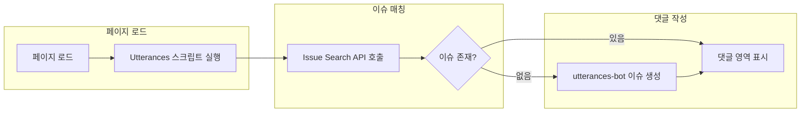

정적 사이트인 GitHub Pages에는 기본적으로 댓글 기능이 없습니다. Disqus, Utterances, Giscus 같은 위젯을 붙여야 독자와 소통할 수 있습니다. 이 글에서는 **Utterances**를 선택하는 이유, Disqus와의 차이, 설치·설정 방법, 그리고 언제 쓰고 피할지까지 정리합니다.

---

## 왜 댓글 위젯이 필요한가

GitHub Pages는 Jekyll·Hugo 등으로 빌드한 HTML을 호스팅하는 **정적 사이트**입니다. 서버 사이드 로직이 없기 때문에 댓글을 저장·조회하려면 외부 서비스가 필요합니다. 대표적으로 **Disqus**와 **Utterances**가 널리 쓰입니다. 과거에는 Disqus가 많이 쓰였지만, 광고 비중이 커지면서 개발자·기술 블로그에서는 **Utterances**로 옮기는 경우가 늘었습니다.

---

## Disqus와 Utterances 비교

선택 시 참고할 수 있도록 두 서비스를 요약하면 아래와 같습니다.

| 항목 | Disqus | Utterances |
|------|--------|------------|
| **데이터 저장** | Disqus 서버 | GitHub Issues |
| **로그인** | Disqus·소셜·이메일 가입 | GitHub 계정만 사용 |
| **광고** | 유료 플랜 전까지 광고 노출 | 없음, 추적 없음 |
| **비용** | 무료 플랜에 광고·제한 있음 | 무료, 오픈소스 |
| **관리** | Disqus 대시보드 | GitHub 이슈·알림으로 관리 |
| **댓글 형식** | 제한적 서식 | Markdown 지원 |
| **잠금(Lock-in)** | Disqus 전용 데이터 | 이슈로 내보내기·이전 용이 |

Disqus는 한 때 댓글 영역 아래에 **한 페이지 넘게 광고**가 들어가는 경우가 있어, 게시글과 댓글을 구분하기 어렵고 가독성이 떨어지는 문제가 있었습니다. Utterances는 GitHub 이슈를 쓰기 때문에 광고가 없고, 개발자에게 친숙한 환경에서 알림·관리를 할 수 있습니다.

---

## Utterances란

**Utterances**는 GitHub Issues를 댓글 스레드로 쓰는 경량 댓글 위젯입니다. Vanilla TypeScript로 만들어져 있어 프레임워크 의존이 없고, [Primer](https://primer.style/) 스타일로 GitHub와 비슷한 톤을 냅니다. 데이터가 모두 GitHub에 있기 때문에 추적·광고가 없고, 이슈로 내보내기·백업이 쉽습니다.

동작 흐름은 다음과 같습니다. 페이지가 로드되면 Utterances 스크립트가 **GitHub Issue Search API**로 현재 페이지 URL·pathname·title에 해당하는 이슈를 찾습니다. 없으면 첫 댓글 작성 시 **utterances-bot**이 해당 레포지토리에 이슈를 자동 생성합니다. 댓글을 달 때는 GitHub OAuth로 Utterances 앱에 권한을 주거나, 직접 해당 이슈 페이지에서 댓글을 남길 수 있습니다.



---

## Utterances의 장점

- **별도 가입 불필요**: 개발자 대부분이 이미 가진 GitHub 계정만으로 댓글 작성이 가능해, 블로그 운영자와 독자 모두 추가 가입 부담이 적습니다.
- **관리 부담 적음**: 댓글 = 이슈이므로 GitHub 알림·이슈 목록으로 관리할 수 있고, 익숙한 환경에서 운영할 수 있습니다.
- **댓글 알림**: 새 댓글이 올라오면 해당 이슈가 생성·업데이트되므로 GitHub 이메일 알림을 받을 수 있어, 독자와의 소통 타이밍을 놓치지 않기 쉽습니다.
- **설치·설정 단순**: GitHub에 Utterances 앱 설치 → 댓글용 레포지토리 생성·권한 부여 → 페이지에 스크립트 한 줄 삽입으로 끝납니다.
- **Markdown 지원**: GitHub 플랫폼을 쓰기 때문에 댓글에 Markdown을 그대로 사용할 수 있습니다.
- **광고·추적 없음**: 무료이고, 광고가 없으며 데이터가 GitHub에만 있어 프라이버시 측면에서 유리합니다.

아래는 Utterances를 적용했을 때 댓글 영역이 깔끔하게 보이는 예시입니다. (실제 화면은 레포지토리·테마에 따라 다를 수 있습니다.)


---

## Utterances 설치 방법

설치는 **저장소 준비 → Utterances 앱 연결 → 스크립트 삽입** 순서로 진행하면 됩니다.

### 1단계: 댓글용 GitHub 저장소 준비

댓글을 저장할 전용 **퍼블릭** 저장소를 하나 만듭니다. 예: `my-blog-comments`. 이 저장소의 Issues가 활성화되어 있어야 합니다 (기본값이 활성화).

### 2단계: Utterances 앱 설치

1. [Utterances 공식 웹사이트](https://utteranc.es/)에 접속합니다.
2. **"Install Utterances"** 또는 GitHub 앱 설치 링크를 눌러 **utterances** 앱을 GitHub 계정(또는 조직)에 설치합니다.
3. 설치 시 **"Only select repositories"**를 선택한 뒤, 방금 만든 댓글용 저장소만 선택해 권한을 제한할 수 있습니다.

### 3단계: 스크립트 설정값 정하기

공식 사이트에서 다음 항목을 선택·입력합니다.

- **Repository**: `소유자/저장소이름` 형식 (예: `username/my-blog-comments`).
- **Issue mapping**: 페이지와 이슈를 어떻게 매칭할지. 보통 **pathname**, **url**, **title**, **og:title** 중 하나를 쓰며, pathname이면 URL 경로 기준으로 한 이슈가 한 페이지에 대응됩니다.
- **Issue term**: 이슈가 없을 때 자동 생성되는 이슈의 제목에 들어갈 문구 (예: `Comment`).
- **Theme**: `github-light`, `github-dark`, `preferred-color-scheme` 등.

### 4단계: 스크립트 코드 삽입

사이트에서 생성해 준 스크립트 태그를, 댓글을 보여줄 위치에 넣습니다. Hugo라면 single 페이지 템플릿의 본문 아래, partial로 넣는 방식이 일반적입니다.

```html
<script src="https://utteranc.es/client.js"
  repo="소유자/저장소이름"
  issue-term="pathname"
  theme="github-light"
  crossorigin="anonymous"
  async>
</script>
```

`repo`, `issue-term`, `theme` 값을 3단계에서 정한 대로 맞춥니다. 저장 후 배포하면 해당 경로에 첫 댓글이 등록될 때 이슈가 생성되고, 이후에는 그 이슈에 댓글이 달립니다.

---

## 언제 Utterances를 쓰고, 언제 피할지

**쓰기 좋은 경우**

- GitHub Pages·Hugo·Jekyll 등 **정적 블로그**에 댓글을 붙이고 싶을 때.
- 독자층이 **개발자·기술 사용자**라 GitHub 계정 보유 가능성이 높을 때.
- **광고·추적 없이** 무료로 운영하고 싶을 때.
- 댓글 데이터를 **GitHub 이슈**로 두고 백업·이전을 쉽게 하고 싶을 때.

**피하거나 대안을 고려할 경우**

- 독자 대부분이 **비개발자**라 GitHub 가입 진입장벽이 클 때 (Disqus·Giscus 등과 비교 검토).
- **비공개·내부용** 블로그처럼 이슈를 퍼블릭으로 두기 어려울 때.
- GitHub API **rate limit**을 신경 써야 하는 트래픽이 매우 큰 사이트일 때.

---

## 마무리 및 참고 자료

Utterances는 GitHub Issues 기반의 경량 댓글 위젯으로, 정적 블로그에 광고 없이 댓글을 붙이기에 적합합니다. 설치가 단순하고, Markdown·알림·데이터 소유 측면에서 개발자 친화적입니다. 반대로 독자가 GitHub에 익숙하지 않다면 진입장벽을 고려해 다른 서비스와 비교해 보는 것이 좋습니다.

**설치 체크리스트**

- [ ] 댓글용 퍼블릭 GitHub 저장소 생성 및 Issues 활성화
- [ ] Utterances 앱을 해당 저장소에만 권한 부여해 설치
- [ ] `repo`, `issue-term`, `theme` 등 스크립트 옵션 확인
- [ ] 본문 하단에 `utteranc.es/client.js` 스크립트 삽입 후 배포
- [ ] 테스트 댓글 작성으로 이슈 생성·표시 확인

**참고 문헌**

1. [Utterances 공식 웹사이트](https://utteranc.es/) — 설치·설정 안내 및 스크립트 생성
2. [utterance/utterances (GitHub)](https://github.com/utterance/utterances) — 오픈소스 저장소 및 이슈
3. [GitHub REST API - Search issues and pull requests](https://docs.github.com/en/rest/search/search?apiVersion=2022-11-28#search-issues-and-pull-requests) — Utterances가 페이지–이슈 매칭에 사용하는 API
