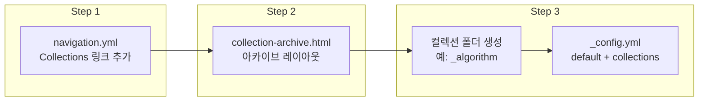

## 개요

포스팅만으로도 블로그 운영은 가능하지만, **종류별로 세분화된 글을 한곳에 모아 두고 싶을 때**는 Jekyll의 **Collections** 기능이 적합하다. 이 글에서는 Collections를 도입해 "다시 찾아볼 만한 글"만 정리해 보여 주는 페이지를 만드는 방법을 단계별로 정리한다.

**대상 독자**: Jekyll 블로그를 운영 중이며, 카테고리와 별도로 "선별된 콜렉션" 페이지가 필요한 경우.

---

## Collections란 무엇인가

- **카테고리**: 모든 글을 기준으로 분류해 보여 준다.
- **Collections**: 특정 폴더(`_컬렉션명`) 안의 문서만 골라서 하나의 묶음으로 보여 준다.

즉, "알고리즘 정리", "시리즈 모음", "추천 포스트"처럼 **일부 글만 선정해 모아 보는 용도**로 쓰면 된다.

---

## 장점과 단점

### 장점

- 기존 카테고리는 **전체 글**을 기준으로 하므로, "꼭 다시 보고 싶은 글"만 따로 묶기 어렵다.
- Collections는 **해당 컬렉션 폴더에 넣은 글만** 표시하므로, 재방문·시리즈·주제별 정리를 명확히 할 수 있다.

### 단점

- **Posts에 있는 글** → Collections 페이지에서 링크로 노출하는 것은 가능하다.
- **Collection으로만 지정된 글** → 기본 Posts 목록에는 나타나지 않으며, Jekyll 기본 기능만으로는 "Collections 전용 글을 Posts에도 보이게" 하려면 추가 작업이 필요하다.

이 점을 감안해 "일반 포스트"와 "컬렉션 전용 정리글"을 구분해 사용하는 것이 좋다.

---

## 적용 절차 요약

Collections를 쓰려면 아래 **세 가지**를 모두 해야 한다. 하나라도 빠지면 해당 컬렉션 글이 목록에 제대로 나오지 않는다.

1. **네비게이션에 Collections 링크 추가** (`_data/navigation.yml`)
2. **Collections 아카이브 페이지 생성** (`_pages/` + `collection-archive.html` 등)
3. **컬렉션 폴더 생성 + `_config.yml` 설정** (default, collections)

다음 Mermaid 다이어그램은 이 절차의 흐름을 보여 준다.



---

## 1. 링크 만들기 (navigation.yml)

메인 페이지에서 Collections 페이지로 들어갈 수 있도록 `_data/navigation.yml`에 항목을 추가한다.

```yaml
main:
  - title: "Posts"
    url: /posts/
  - title: "Categories"
    url: /categories/
  - title: "Tags"
    url: /tags/
  - title: "Collections"
    url: /collections/
  - title: "About"
    url: /about/
```

---

## 2. Collections 아카이브 페이지 만들기

Collections 목록을 렌더링할 레이아웃이 필요하다. `_pages/`에 `collection-archive.html`을 두고, `site.collections`를 순회해 각 컬렉션과 문서를 출력한다.

전체 레이아웃 코드는 아래 Gist에서 확인할 수 있다.

- [collection-archive.html](https://gist.github.com/42jerrykim/3ff61cafb5a9b285bef00fc12092b21f)

요약하면:

- `site.collections`에서 `output == false`가 아닌 컬렉션만 사용한다.
- `posts` 컬렉션은 "Posts not in the collection" 등 별도 제목으로 처리할 수 있다.
- 각 컬렉션별로 `collection.Title`(머리글)과 문서 목록을 보여 주고, 필요 시 `archive-single.html`을 include 해 포스트 스타일로 렌더링한다.

---

## 3. Collections에 표시되는 글 작성하기

컬렉션에 글이 보이려면 **다음 세 가지를 모두** 적용해야 한다.

| 순서 | 작업 | 설명 |
|------|------|------|
| ① | 별도 폴더에 글 작성 | 예: 최상위에 `_algorithm` 폴더 생성 후 `bubblesort.md` 등 작성 |
| ② | `_config.yml`의 `defaults`에 해당 컬렉션 설정 | 경로·타입 지정, 레이아웃·toc 등 공통 값 부여 |
| ③ | `_config.yml`의 `collections`에 컬렉션 등록 | `output: true`, `permalink`, 머리글용 `Title` 등 |

하나라도 누락되면 해당 컬렉션 문서가 아카이브에 나타나지 않거나 오류가 날 수 있다.

### 3-1. 별도 폴더에 글 작성하기

예시처럼 최상위 레벨에 `_algorithm` 폴더를 만들고, 그 안에 `bubblesort.md` 같은 문서를 넣는다. **Posts와 달리 파일명에 날짜를 넣지 않아도** 동작한다.


문서 front matter는 최소한 `title`만 있어도 된다.

```yaml
---
title: "Bubble Sort"
---

게시물 내용을 작성한다.
```

### 3-2. _config.yml의 defaults에 추가하기

컬렉션 문서에 공통으로 적용할 레이아웃·toc·댓글 등을 `defaults`로 지정한다. 아래 Gist는 `_algorithm` 타입에 대한 예시다.

- [defaults 설정 예시 (_config1.yml)](https://gist.github.com/42jerrykim/e2f763e399b19830c19c4266df17fef8)

예시 요약:

```yaml
defaults:
  - scope:
      path: ""
      type: algorithm
    values:
      layout: single
      author_profile: true
      share: true
      toc: true
      toc_sticky: true
      toc_icon: "align-left"
      comments: true
```

`scope.type`을 컬렉션 이름(예: `algorithm`)과 맞추면, 해당 컬렉션 문서에 목차(toc) 등이 적용된다.

### 3-3. _config.yml의 collections에 추가하기

컬렉션을 사이트에 등록하고, 아카이브에서 쓰일 **머리글(Title)** 과 URL 구조(permalink)를 정한다.

- [collections 설정 예시 (_config2.yml)](https://gist.github.com/42jerrykim/c21893cc7ef9fb248d3e290cbaac400e)

예시 요약:

```yaml
collections:
  algorithm:
    Title: "Algorithm"
    output: true
    permalink: /collections/:collection/:path/
```

`Title`에 적은 문자열이 Collections 아카이브 페이지에서 해당 컬렉션의 **머리글로 표시**된다.

---

## 주의사항 정리

- **defaults / collections / 폴더 구조** 세 가지가 모두 맞아야 컬렉션 글이 정상 노출된다.
- 컬렉션 전용 글은 기본 Posts 목록에는 안 나온다. "일반 포스트에도 보이게" 하려면 별도 플러그인이나 스크립트가 필요할 수 있다.
- `path`가 빈 문자열이면 해당 `type`의 모든 문서에 defaults가 적용되므로, 컬렉션별로 다른 레이아웃을 쓰고 싶다면 `path`를 컬렉션 디렉터리로 한정하는 편이 안전하다.

---

## 총평 및 활용 방향

- **카테고리**: 블로그의 모든 글을 분류해 보여 주는 용도.
- **Collections**: "다시 찾아볼 만한 글", "시리즈 모음", "주제별 정리"처럼 **일부만 선정해 모아 보는 용도**로 쓰면 좋다.

둘을 함께 사용하면 일반 포스트 흐름과 선별된 정리 페이지를 구분해 운영하기 수월하다.

---

## 참고 문헌

1. [Jekyll Collections (공식 문서)](https://jekyllrb.com/docs/collections/) — Collections 개념과 설정 방법.
2. [collection-archive.html Gist](https://gist.github.com/42jerrykim/3ff61cafb5a9b285bef00fc12092b21f) — 아카이브 레이아웃 예시.
3. [Jekyll Configuration (공식 문서)](https://jekyllrb.com/docs/configuration/) — `_config.yml`의 `defaults`, `collections` 옵션 설명.
