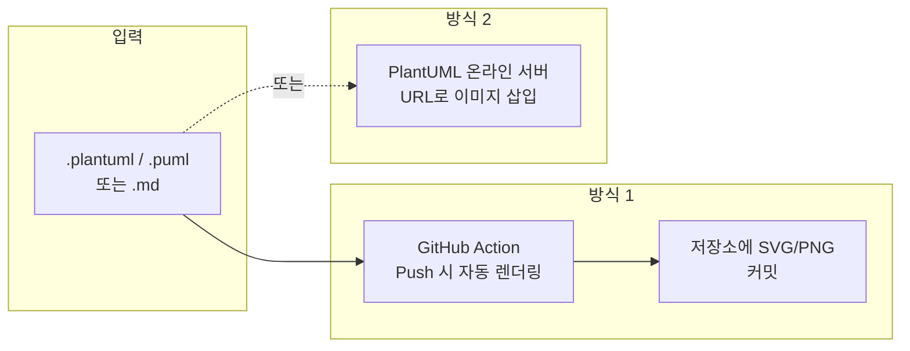
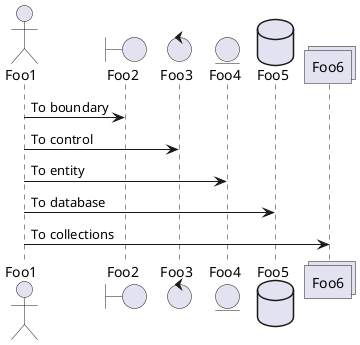

## 개요

### 이 포스트에서 다루는 내용

[Jekyll](https://jekyllrb.com/) 기반 블로그나 [GitHub Pages](https://pages.github.com/)에서 **PlantUML**을 사용해 시퀀스 다이어그램, 클래스 다이어그램, 액티비티 다이어그램 등을 텍스트로 작성하고, 빌드·배포 과정에서 이미지로 렌더링하는 방법을 정리했다. 두 가지 실전 방식(GitHub Action 활용 vs PlantUML 온라인 서버 URL 삽입)을 비교하고, 적용 시 주의할 점까지 함께 다룬다.

### 추천 대상

- Jekyll 또는 GitHub Pages로 기술 블로그를 운영하는 사람
- UML 다이어그램을 코드와 함께 버전 관리하고 싶은 사람
- 마크다운 문서 안에서 다이어그램을 유지보수하기 쉬운 형태로 넣고 싶은 사람

---

## PlantUML이란

[PlantUML](https://plantuml.com/)은 **텍스트 기반으로 UML 및 다양한 다이어그램을 그려 주는 오픈소스 도구**다. 온라인에서 바로 편집·미리보기가 가능하고, VS Code 확장, IntelliJ 플러그인, CLI 등 다양한 환경에서 사용할 수 있다. 시퀀스, 유스케이스, 클래스, 액티비티, 컴포넌트, 상태 다이어그램 등 UML 표준은 물론, Gantt, 마인드맵, ER 다이어그램 등도 지원한다. 공식 문서는 [PlantUML Language Reference Guide](https://plantuml.com/guide)에서 확인할 수 있다.

---

## Jekyll에서 PlantUML을 쓰는 두 가지 방식

Jekyll(및 GitHub Pages)은 기본적으로 PlantUML을 실행하지 않는다. 따라서 **다이어그램 소스를 이미지(SVG/PNG)로 바꾼 뒤** 그 결과물을 블로그에 넣는 방식이 필요하다. 크게 다음 두 가지를 쓸 수 있다.



| 구분 | 방식 1: GitHub Action | 방식 2: 이미지 URL 삽입 |
|------|----------------------|-------------------------|
| **동작** | Push 시 Action이 `.plantuml` 등을 렌더링해 SVG/PNG를 저장소에 커밋 | PlantUML 온라인 서버 URL을 마크다운 이미지로 삽입 |
| **장점** | 소스와 결과물이 함께 버전 관리됨, 화질·포맷 제어 가능, 오프라인 빌드와 무관 | 설정 없이 바로 사용 가능, URL만 있으면 편집 가능 |
| **단점** | 워크플로·저장소 설정 필요 | URL 변경 시 문서 깨짐, 외부 서비스 의존 |

아래에서 각 방식을 구체적으로 설명한다.

---

## 방식 1: GitHub Action으로 PlantUML 렌더링하기

[GitHub Marketplace](https://github.com/marketplace?query=plantuml)에서 "plantuml"로 검색하면 여러 Action을 찾을 수 있다. 그중에서도 [Generate PlantUML](https://github.com/marketplace/actions/generate-plantuml)([grassedge/generate-plantuml-action](https://github.com/grassedge/generate-plantuml-action))은 Push 이벤트에 반응해 저장소 내 PlantUML 파일을 렌더링하고, 생성된 SVG(또는 PNG) 파일을 같은 저장소에 커밋해 준다.

### 적용 절차 요약

1. **워크플로 파일 추가**  
   `.github/workflows/` 아래에 YAML 파일을 만들고, `on: push`로 Push 시 실행되게 설정한다.  
2. **PlantUML 소스 파일 작성**  
   확장자는 `.plantuml`, `.puml`, `.pml`, `.pu` 중 하나를 사용한다.  
3. **Push**  
   Push가 되면 Action이 PlantUML 서버로 소스를 보내 렌더링하고, 생성된 이미지 파일을 지정한 경로(기본값은 소스와 같은 디렉터리)에 커밋한다.  
4. **마크다운에서 이미지 참조**  
   커밋된 SVG/PNG 경로를 마크다운 이미지 문법으로 넣으면, Jekyll 빌드 시 해당 다이어그램이 그대로 노출된다.

### 주의할 점

- 이 Action은 **별도의 PlantUML 소스 파일**(`.plantuml` 등)을 기준으로 동작한다. 마크다운 파일 안에 `@startuml` … `@enduml` 블록만 넣고 "자동으로 같은 이름의 SVG가 생길 것"이라고 기대하면 동작하지 않을 수 있다.  
- 따라서 **`.plantuml` 파일을 만들고**, 그 파일 내용에 다이어그램 코드를 넣은 뒤, 같은 이름으로 생성되는 SVG를 마크다운에서 참조하는 방식**으로 사용하는 것이 안전하다.

### 예: 시퀀스 다이어그램 파일

예를 들어 `md-sample-sequence.plantuml` 파일을 만들고 아래와 같이 채운다.



Push 후 Action이 성공적으로 실행되면, 같은 디렉터리(또는 `path`로 지정한 위치)에 `md-sample-sequence.svg` 등이 생성·커밋된다. 마크다운에서는 다음과 같이 참조하면 된다.

```markdown

```

실제 렌더 결과 예시는 아래와 같다.


---

## 방식 2: PlantUML 온라인 서버 URL로 이미지 삽입하기

[PlantUML 웹 서버](https://www.plantuml.com/plantuml/uml/SyfFKj2rKt3CoKnELR1Io4ZDoSa70000)에 접속하면, URL에 인코딩된 다이어그램 소스를 넣어 실시간으로 편집·미리보기할 수 있다. 이 URL에서 **이미지 포맷 경로**(예: `png`, `svg`)로 바꾼 주소를 마크다운 이미지로 넣으면, 별도 빌드 없이 브라우저가 해당 URL을 요청해 다이어그램을 불러온다.

### 적용 방법

1. PlantUML 온라인 편집기에서 다이어그램을 작성하거나, 기존 소스를 붙여 넣는다.  
2. **PNG**로 내보내는 경우 예:  
   `https://www.plantuml.com/plantuml/png/...`  
   형태의 URL을 복사한다.  
3. 마크다운에 다음처럼 이미지로 삽입한다.

```markdown

```

| PNG URL 예시 |
|:--:|
|  |

URL에서 `png`를 제거하면 다시 편집 화면으로 돌아가는 장점이 있지만, **다이어그램을 수정하면 URL이 바뀌므로** 기존 포스트의 이미지가 깨질 수 있다. 링크 유지·버전 관리 측면에서는 방식 1이 유리하다.

---

## 두 방식 비교 정리

| 항목 | GitHub Action 사용 | 이미지 URL 삽입 |
|:--|:--|:--|
| **설정** | 워크플로 + PlantUML 파일 필요 | 없음 |
| **유지보수** | 소스(.plantuml)만 수정 후 Push하면 자동 반영 | URL 변경 시 문서 수동 수정 |
| **화질** | SVG 사용 시 선명하고 확대에 유리 | PNG 기본, 해상도 제한 가능 |
| **오프라인/캐시** | 저장소에 파일이 있으므로 빌드·배포와 독립 | PlantUML 서버 가용성에 의존 |

실제로 GitHub Action으로 생성한 SVG를 사용하면 확대·축소 시에도 선명하고, 나중에 다이어그램을 고칠 때도 소스만 고치면 되므로 **장기적으로는 Action 방식을 추천**한다.

---

## 결론

- **PlantUML**은 텍스트로 UML·기타 다이어그램을 작성할 수 있는 오픈소스 도구이며, Jekyll/GitHub Pages와 연동할 때는 **이미지로 렌더링한 결과**를 넣는 방식이 필요하다.  
- **GitHub Action**을 쓰면 Push 시 자동으로 `.plantuml` 파일을 SVG(또는 PNG)로 만들어 저장소에 커밋하므로, 소스와 결과물을 함께 버전 관리할 수 있고 화질·유지보수 측면에서 유리하다.  
- **PlantUML 온라인 서버 URL**을 이미지로 삽입하는 방식은 설정이 없이 바로 쓸 수 있지만, URL 변경·외부 서비스 의존에 주의해야 한다.  
- Jekyll 블로그에서 다이어그램을 오래 유지하고 수정할 계획이라면, **방식 1(GitHub Action + .plantuml 파일)**을 우선 적용하고, 필요 시 공식 가이드([PlantUML Guide](https://plantuml.com/guide), [generate-plantuml-action](https://github.com/grassedge/generate-plantuml-action))를 참고해 확장하는 것을 권한다.
