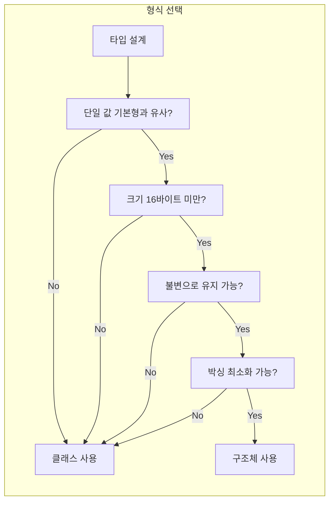

이 포스트에서는 C#에서 **클래스(class)** 와 **구조체(struct)** 를 언제 사용할지 결정할 때 필요한 차이점, 성능·메모리 영향, 그리고 선택 가이드라인을 정리한다. 규칙만 나열하지 않고, 할당·배열·박싱·복사·전달 방식까지 구체적으로 다룬다.

---

## 이 포스트에서 다루는 내용

- 클래스(참조 형식)와 구조체(값 형식)의 **핵심 차이 요약**
- **메모리 할당 위치**(힙 vs 스택·인라인)와 GC 영향
- **배열 할당 방식**(아웃 오브 라인 vs 인라인)과 참조 집약성
- **박싱·언박싱**이 성능에 미치는 영향
- **복사·전달 방식**과 **불변성** 권장 이유
- **구조체를 쓸 때**와 **클래스를 쓸 때**의 실무 기준
- 참고할 수 있는 공식 문서 링크

---

## 클래스와 구조체 한눈에 비교

아래 표는 선택 시 자주 참고하는 비교 요약이다.

| 구분 | 클래스 (참조 형식) | 구조체 (값 형식) |
|------|-------------------|------------------|
| 할당 위치 | 힙 | 스택 또는 포함 형식 인라인 |
| 해제 | GC 수집 | 스택 해제 또는 포함 형식 해제 시 |
| 배열 요소 | 힙 객체 참조(아웃 오브 라인) | 인라인 실제 인스턴스 |
| 할당 비용 | 참조 복사(상대적으로 저렴) | 전체 값 복사 |
| 전달 방식 | 참조 전달 | 값 복사 전달 |
| 박싱 | 없음 | 인터페이스/object로 캐스팅 시 발생 |

선택 흐름을 도식화하면 다음과 같다.

---

## 메모리 할당과 해제

- **클래스**: 인스턴스가 **힙**에 할당되고, 가비지 수집기(GC)에 의해 수집된다. 할당·해제 비용과 GC 부하는 상대적으로 크다.
- **구조체**: **스택**에 할당되거나, 이를 포함하는 형식(클래스/구조체) 안에 **인라인**으로 들어간다. 스택이 해제되거나 포함 형식이 해제될 때 함께 정리되므로, 할당·해제 비용이 일반적으로 더 낮다.

따라서 수명이 짧고 크기가 작은 값은 구조체로 두면 GC 부담을 줄일 수 있다.

---

## 배열 할당 방식과 참조 집약성

- **클래스 배열**: 요소가 **힙에 있는 객체를 가리키는 참조**만 갖는다(아웃 오브 라인). 배열 자체는 참조들의 연속이고, 실제 인스턴스는 흩어져 있을 수 있어 **참조 집약성(locality of reference)** 이 나쁠 수 있다.
- **구조체 배열**: 요소가 **실제 구조체 인스턴스**로 배열 메모리에 **인라인**으로 들어간다. 연속 메모리이므로 캐시 친화적이고, 할당·해제도 클래스 배열보다 저렴한 경우가 많다.

대량의 작은 값을 연속으로 다룰 때는 구조체 배열이 유리한 경우가 많다.

---

## 박싱과 언박싱

값 형식(구조체)을 **참조 형식**(`object`)이나 **구현한 인터페이스** 타입으로 캐스팅하면 **박싱(boxing)** 이 일어나 힙에 객체가 만들어진다. 반대로 그 객체에서 다시 값 형식으로 꺼내는 것을 **언박싱(unboxing)** 이라 한다. 박싱된 객체는 GC 대상이 되므로, 빈번한 박싱·언박싱은 힙 사용과 GC에 부정적이다.

참조 형식(클래스)은 같은 타입으로 캐스팅해도 박싱이 발생하지 않는다.

자세한 설명과 예제는 [Boxing 및 Unboxing (C# 프로그래밍 가이드)](https://learn.microsoft.com/ko-kr/dotnet/csharp/programming-guide/types/boxing-and-unboxing)를 참고하면 된다.

---

## 복사·전달 방식과 불변성

- **클래스**: 할당은 **참조 복사**이다. 같은 인스턴스를 가리키는 참조가 여러 개일 수 있고, 한 쪽에서 변경하면 다른 참조에도 그대로 반영된다.
- **구조체**: 할당은 **전체 값 복사**이다. 인수로 넘기거나 반환할 때도 **복사본**이 만들어지므로, 변경 가능(mutable) 구조체는 호출자·피호출자 간 동작이 헷갈리기 쉽다. 따라서 **구조체는 가능한 한 불변(immutable)** 으로 두는 것이 권장된다.

---

## 구조체를 쓸 때와 클래스를 쓸 때

**구조체를 고려할 조건**은 대략 다음과 같다. 다음을 **모두** 만족할 때만 구조체를 쓰는 것이 안전하다.

- 논리적으로 **단일 값**이거나 기본 형식(`int`, `double` 등)과 비슷한 의미를 가진다.
- **인스턴스 크기가 16바이트 미만**이다.
- **불변**으로 설계할 수 있다.
- **박싱을 자주 하지 않아도** 된다.

**그 외**에는 형식을 **클래스**로 정의하는 것이 일반적이다. 프레임워크에서도 대부분의 타입은 클래스이며, 구조체는 위 조건에 맞는 작은 값 타입에 한해 사용하는 것이 좋다.

---

## 결론

- **클래스**: 참조 형식, 힙 할당·GC, 참조 복사·참조 전달. 대부분의 도메인 타입과 복잡한 객체에 사용.
- **구조체**: 값 형식, 스택·인라인 할당, 값 복사·값 전달. 작고(16바이트 미만), 짧은 수명, 불변, 박싱을 피할 수 있는 단일 값에 사용.

형식의 인스턴스가 **작고**, **수명이 짧고**, **다른 객체에 포함되는 경우**가 많다면 클래스 대신 구조체를 검토해 보자. 위 네 가지 조건(단일 값·16바이트 미만·불변·박싱 최소)을 모두 만족하지 않으면 구조체보다 클래스를 선택하는 것이 안전하다.

---

## 참고 문헌

1. [Boxing 및 Unboxing - C# 프로그래밍 가이드 \| Microsoft Learn](https://learn.microsoft.com/ko-kr/dotnet/csharp/programming-guide/types/boxing-and-unboxing)
2. [값 형식 - C# 참조 \| Microsoft Learn](https://learn.microsoft.com/ko-kr/dotnet/csharp/language-reference/builtin-types/value-types)
3. [참조 형식 - C# 참조 \| Microsoft Learn](https://learn.microsoft.com/ko-kr/dotnet/csharp/language-reference/keywords/reference-types)
4. [구조체 형식 - C# 참조 \| Microsoft Learn](https://learn.microsoft.com/ko-kr/dotnet/csharp/language-reference/builtin-types/struct)
