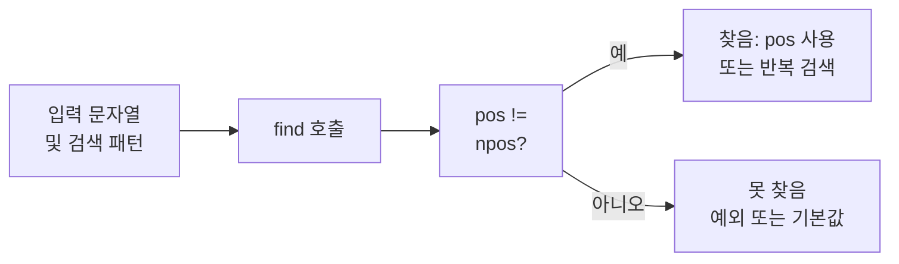

## 개요

C++ 표준 라이브러리의 `std::string::find`는 문자열 안에서 **부분 문자열(substring)** 또는 **문자 한 개**가 처음 나타나는 위치를 찾을 때 씁니다. 서브스트링 존재 여부 확인, 파싱, 치환 전 검색 등 실무에서 자주 쓰이므로 원형·반환값·`npos` 처리만 정확히 알아두면 됩니다.

**이 포스트에서 다루는 내용**
- `find`의 네 가지 오버로드와 인자·반환값
- `string::npos` 의미와 검사 방법
- 반복 검색·부분 길이 지정 등 실전 패턴
- `rfind`, `find_first_of` 등 관련 함수 간단 정리

**추천 대상**: C++ 초급 이상, 문자열 처리·파싱 코드를 작성하는 개발자.

---

## 함수 원형

`<string>`에 정의된 `find` 오버로드는 다음과 같습니다.

```cpp
// 서브스트링 검색 (string 또는 C 스타일 문자열)
size_t find(const string& str, size_t pos = 0) const;
size_t find(const char* s, size_t pos = 0) const;
size_t find(const char* s, size_t pos, size_t n) const;
// 단일 문자 검색
size_t find(char c, size_t pos = 0) const;
```

---

## 인자 설명

| 인자 | 설명 |
|------|------|
| `str` | 찾고자 하는 `std::string` 객체 |
| `s` | 찾고자 하는 C 스타일 문자열을 가리키는 포인터 |
| `pos` | 검색을 시작할 위치(인덱스). 기본값 `0`이면 맨 앞부터 검색 |
| `n` | (세 번째 오버로드) `s`에서 **연속으로 일치해야 하는 최소 문자 개수** |
| `c` | 찾고자 하는 단일 문자 |

`pos`를 사용하면 "이미 찾은 위치 다음부터" 다시 찾는 반복 검색이 가능합니다.

---

## 반환값과 npos

- **성공**: 부분 문자열(또는 문자)이 **처음 나타나는 위치의 인덱스**를 `size_t`로 반환합니다.
- **실패**: 일치하는 곳이 없으면 **`std::string::npos`**를 반환합니다. `npos`는 `size_t`의 최댓값으로 정의된 상수입니다.

검사할 때는 반드시 `npos`와 비교해야 합니다. 반환값을 그대로 인덱스로 쓰면 안 됩니다.

```cpp
size_t pos = s1.find(s2);
if (pos != string::npos) {
    // 찾음: pos 사용 가능
} else {
    // 못 찾음
}
```

---

## find 사용 흐름

아래는 "문자열에서 패턴을 찾고, 결과에 따라 분기"하는 일반적인 흐름을 나타낸 것입니다.



---

## 기본 예시

문자열 `"hello! C world"`에서 `"world"`가 있는지 확인하고, 있는 경우 그 위치를 출력하는 예입니다.

```cpp
#include <iostream>
#include <string>

int main()
{
    std::string s1 = "hello! C world";
    std::string s2 = "world";

    size_t pos = s1.find(s2);
    if (pos != std::string::npos) {
        std::cout << "found!" << '\n';
        std::cout << pos << '\n';  // 9
    } else {
        std::cout << "not found" << '\n';
    }
}
```

**결과**

```
found!
9
```

인덱스 `9`부터 `"world"`가 시작합니다. `using namespace std;` 대신 `std::`를 명시한 것은 전역 네임스페이스 오염을 줄이기 위함입니다.

---

## 실전 패턴

### 1. 반복 검색 (모든 등장 위치 찾기)

`pos`를 이전에 찾은 위치 + 1로 두고 반복하면, 패턴이 나오는 모든 위치를 찾을 수 있습니다.

```cpp
std::string text = "one two one two";
std::string word = "one";
size_t pos = 0;
while ((pos = text.find(word, pos)) != std::string::npos) {
    std::cout << "Found at index " << pos << '\n';
    pos += 1;  // 다음 위치부터 검색
}
```

### 2. 부분 길이 지정 (세 번째 오버로드)

`find(const char* s, size_t pos, size_t n)`은 `s`의 **앞 n글자만** 패턴으로 사용합니다. null 종료와 상관없이 "버퍼의 앞 n바이트"만 비교할 때 유용합니다.

```cpp
std::string haystack = "abcdef";
char buf[] = "abcXYZ";
// buf의 앞 3글자 "abc"만 검색
size_t p = haystack.find(buf, 0, 3);
// p == 0
```

### 3. 단일 문자 검색

한 글자만 찾을 때는 `find(char c, size_t pos = 0)`를 사용합니다.

```cpp
std::string s = "hello";
size_t i = s.find('l');  // 2
size_t j = s.find('l', 3);  // 3 (두 번째 'l')
```

---

## 주의사항

- **반환값 타입**: `find`는 `size_t`를 반환합니다. `int`나 `ssize_t`에 담지 말고, `size_t`로 받은 뒤 `npos`와 비교하세요.
- **npos 검사 필수**: 반환값을 인덱스로 쓰기 전에 반드시 `!= std::string::npos`인지 확인해야 합니다. 검사 없이 사용하면 잘못된 인덱스로 접근할 수 있습니다.
- **pos 범위**: `pos >= size()`이면 검색하지 않고 곧바로 `npos`를 반환합니다.

---

## 관련 함수

| 함수 | 설명 |
|------|------|
| `rfind` | **끝에서부터** 역방향으로 검색. 마지막 등장 위치를 구할 때 사용 |
| `find_first_of` | 인자로 넘긴 "문자 집합"에 속한 문자가 **처음** 나오는 위치 |
| `find_last_of` | 문자 집합에 속한 문자가 **마지막**으로 나오는 위치 |
| `find_first_not_of` / `find_last_not_of` | 집합에 **없는** 문자가 처음/마지막으로 나오는 위치 |

단순 "서브스트링 포함 여부"만 필요할 때는 `find` 한 번과 `npos` 비교가 가장 직관적입니다.

---

## 참고 문헌

- [cppreference.com – std::basic_string::find](https://en.cppreference.com/w/cpp/string/basic_string/find) – find 오버로드 및 반환값 설명
- [cppreference.com – std::basic_string](https://en.cppreference.com/w/cpp/string/basic_string) – std::string 개요 및 멤버 목록
- [C++ Standard – string.find](https://eel.is/c++draft/string.find) – 표준 초안에서 find 사양 확인
