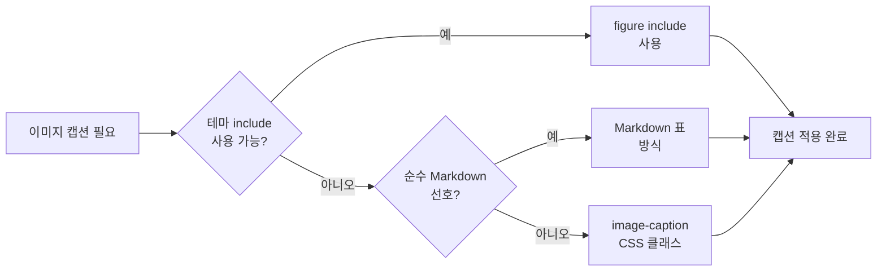

## 개요

Jekyll로 블로그나 문서 사이트를 운영할 때, 본문 이미지에 **캡션(설명 문구)**을 달고 싶은 경우가 많다. 테마에 따라 기본 지원이 있기도 하고, 없으면 Markdown과 CSS만으로 직접 구현해야 한다. 이 포스트에서는 **Minimal Mistakes** 테마를 기준으로, 이미지 캡션을 넣는 **세 가지 방법**을 소개하고 각각의 장단점과 선택 기준을 정리한다.

**대상 독자**: Jekyll·GitHub Pages로 블로그를 운영 중이거나, Markdown 기반 정적 사이트에서 이미지+캡션 레이아웃을 맞추고 싶은 개발자·블로거.

---

## 방법 선택 흐름

캡션 구현 방식을 고를 때는 **테마 의존도**와 **Markdown 중심 여부**를 먼저 보는 것이 좋다. 아래 흐름은 상황별로 어떤 방법을 쓰면 좋을지 정리한 것이다.



- **테마에 figure include가 있다** → `` 사용이 가장 간단하다.
- **가능한 한 Markdown만 쓰고 싶다** → 표를 이용해 이미지와 캡션을 한 덩어리로 묶는 방식을 추천한다.
- **Markdown 이미지 문법은 유지하되, 캡션만 클래스로 스타일링하고 싶다** → Kramdown의 `{:.image-caption}` + CSS 조합을 쓰면 된다.

---

## 방법 1: figure include (테마 헬퍼)

[Minimal Mistakes의 Figure 헬퍼](https://mmistakes.github.io/minimal-mistakes/docs/helpers/#figure)를 사용하면 `<figure>`·`<figcaption>`이 자동으로 생성된다. 테마 문서에 나온 대로 `image_path`, `alt`, `caption` 등을 넘기면 된다.

| 파라미터   | 필수 여부 | 설명 |
|-----------|-----------|------|
| `image_path` | 필수 | 이미지 경로(절대 URL 또는 사이트 내 경로). |
| `alt`        | 선택 | 대체 텍스트. |
| `caption`    | 선택 | 캡션 내용. Markdown 지원. |
| `popup`      | 선택 | 클릭 시 팝업 확대 여부. |

### 작성 예시

```liquid

```

### 미리 보기



테마를 쓰는 경우 **코드 변경 없이** 캡션과 접근성(alt)을 함께 챙길 수 있어서, 별도 CSS를 손대고 싶지 않을 때 적합하다.

---

## 방법 2: image-caption CSS 클래스 (Kramdown)

Jekyll이 Kramdown을 사용한다면, 이미지 바로 다음 줄에 **임의의 클래스**를 붙일 수 있다. 이걸 이용해 캡션처럼 보이게 스타일을 주는 방식이다.

### Markdown

```markdown


{:.image-caption}
그림 1.1 엔지니어링 직원 수의 증가 추이
```

### CSS 예시

```css
.image-caption {
    text-align: center;
    font-size: small;
}

img {
    width: 100%;
}
```

### 미리 보기


{:.image-caption}
그림 1.1 엔지니어링 직원 수의 증가 추이

기존 Markdown 이미지 문법을 그대로 쓰고, 캡션 텍스트만 클래스로 꾸미는 형태라 **마크다운 중심**으로 가져가기 좋다. 다만 Kramdown 문법에 의존하므로, 다른 마크다운 엔진으로 이전할 때는 호환성을 한 번 확인하는 것이 좋다.

---

## 방법 3: Markdown 표로 이미지·캡션 묶기 (최종 적용 예시)

**Markdown만으로** 이미지와 캡션을 한 덩어리로 만들고, 표를 이용해 가운데 정렬과 캡션 스타일을 맞추는 방법이다. Jekyll/테마 기능에 덜 의존하고, 다른 정적 생성기(Hugo 등)로 옮겨도 재사용하기 쉽다.

표 한 셀에 이미지, 그 아래 셀에 캡션을 두고, CSS로 표와 이미지 너비·정렬만 조정하면 된다.

### Markdown

```markdown
|  |
|:--: |
| *그림 1.1 엔지니어링 직원 수의 증가 추이* |
```

### CSS 예시

```css
table {
    display: revert;
    margin-left: auto;
    margin-right: auto;
    width: 100%;
}

img {
    width: 100%;
}
```

### 미리 보기 (단일 이미지)

|  |
|:--: |
| *그림 1.1 엔지니어링 직원 수의 증가 추이* |

### 여러 이미지 나란히

표에 열을 두 개 넣으면 캡션 있는 이미지를 가로로 여러 개 배치할 수 있다.

|  |  |
|:--:|:--: |
| *그림 1.1 엔지니어링 직원 수의 증가 추이* | *그림 1.2 참고용 예시* |

표를 쓰면 **문서 구조가 단순**하고, 테마를 바꿔도 Markdown 소스만 있으면 비슷한 레이아웃을 다시 만들기 쉽다. 다만 표 문법이 조금 길어지므로, 캡션이 많은 글에서는 스니펫이나 단축 입력을 두고 쓰는 것을 권한다.

---

## 방법 비교 요약

| 구분 | figure include | image-caption 클래스 | Markdown 표 |
|------|----------------|----------------------|-------------|
| **테마 의존** | 있음(Minimal Mistakes 등) | 없음(Kramdown만) | 없음 |
| **Markdown 중심** | 낮음(Liquid 사용) | 높음 | 높음 |
| **다중 이미지 배치** | include 반복 또는 gallery | 문단·클래스 반복 | 표 열 추가로 용이 |
| **이전 용이성** | 테마별로 상이 | 엔진 호환 확인 필요 | 다른 SSG에서도 재사용 용이 |
| **추천 상황** | 해당 테마 사용 시 기본 선택 | 기존 MD 이미지 유지하고 캡션만 스타일링할 때 | 테마에 덜 의존하고 이식성을 중시할 때 |

---

## 정리 및 권장

- **Minimal Mistakes를 쓰고 있다면** → 우선 **figure include**로 통일하면 관리가 쉽다.
- **가능한 한 Markdown과 CSS만 쓰고 싶다면** → **표 방식**으로 이미지와 캡션을 묶고, 필요 시 **image-caption 클래스**를 보조로 쓰면 된다.
- 본문에 사용한 외부 이미지 URL은 접근 불가 시 유지보수에 불리하므로, 가능하면 **사이트 내부 asset 경로**로 두는 것을 권한다.

위 세 가지를 조합해 블로그 규모와 테마, 이전 계획에 맞게 선택하면 된다.
