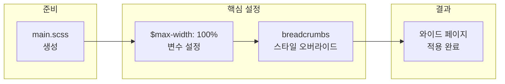

## 개요

[Minimal Mistakes](https://github.com/mmistakes/minimal-mistakes)는 Jekyll용 인기 정적 사이트 테마로, GitHub Pages와 잘 맞으며 문서·블로그·포트폴리오에 널리 쓰인다. 기본 설정에서는 콘텐츠 영역에 **최대 너비(max-width)** 가 걸려 있어 큰 화면에서도 가운데 좁은 영역만 사용한다. [연도별 아카이브 샘플](https://mmistakes.github.io/minimal-mistakes/year-archive/)에서도 이 제한을 확인할 수 있다.

**이 포스트가 도와주는 경우**

- GitHub Pages 등에 Minimal Mistakes를 쓰고 있고, **전체 폭에 가까운 와이드 레이아웃**을 원할 때
- 테마 기본 스타일은 유지하면서 **SCSS 변수와 오버라이드만으로** 레이아웃만 바꾸고 싶을 때
- **Breadcrumbs(베타)** 를 켜 둔 상태에서 최대 너비를 바꾼 뒤 정렬이 깨지는 문제를 해결하고 싶을 때

**전제 조건**

- Jekyll 프로젝트에 [Minimal Mistakes 테마가 이미 적용](https://mmistakes.github.io/minimal-mistakes/docs/quick-start-guide/)되어 있어야 한다.
- `assets/css/` 디렉터리를 사용할 수 있어야 한다(테마 gem 또는 포크 기준).

---

## 적용 흐름

와이드 페이지를 적용하는 전체 단계는 아래와 같다.



1. **main.scss 추가** — 테마 문서의 Customizing 절차에 따라 `assets/css/main.scss`를 만들고 기본 `@import`를 넣는다.
2. **최대 너비 확장** — `@import` **이전에** `$max-width: 100%;`를 선언한다.
3. **Breadcrumbs 정렬 수정** — `@import` **이후에** `.breadcrumbs` 블록을 오버라이드해 넓은 화면에서도 정렬이 맞도록 한다.

---

## 사전 준비

- [Minimal Mistakes 공식 문서 – Stylesheets > Customizing](https://mmistakes.github.io/minimal-mistakes/docs/stylesheets/#customizing)에 따르면, 테마 스타일을 바꾸려면 **사이트 쪽에** `assets/css/main.scss`를 두고 그 안에서 변수 오버라이드와 추가 스타일을 작성하면 된다.
- Gem으로 설치했다면 `bundle show minimal-mistakes`로 gem 경로를 확인한 뒤, 해당 gem의 `assets/css/main.scss` 내용을 참고해 동일한 구조로 사이트용 파일을 만든다.

---

## 1단계: main.scss 추가하기

`assets/css/main.scss` 파일을 생성하고 아래 내용으로 채운다. 상단의 `---`는 Jekyll용 front matter이며, SCSS는 그 아래부터 작성한다.

```scss
---
## Only the main Sass file needs front matter (the dashes are enough)
---

@charset "utf-8";

@import "minimal-mistakes/skins/{{ site.minimal_mistakes_skin | default: 'default' }}"; // skin
@import "minimal-mistakes"; // main partials
```

이렇게 하면 테마의 스킨과 메인 partial이 그대로 로드되고, 이후 이 파일에 넣는 변수·규칙이 그 위에 덮어쓰기 된다.

---

## 2단계: 최대 넓이 확장하기

**반드시** 모든 `@import` **보다 위에** 다음 한 줄을 넣는다.

```scss
$max-width: 100%;
```

테마 내부에서 레이아웃 너비는 `$max-width` 변수로 제어된다. 이 값을 `100%`로 두면 콘텐츠 영역이 뷰포트 폭 전체를 쓰게 된다. `@import` 뒤에 넣으면 변수가 이미 로드된 기본값을 바꾸지 못하므로, **파일 상단 `@charset` 다음, `@import` 이전**에 두어야 한다.

예시는 다음과 같다.

```scss
---
## Only the main Sass file needs front matter (the dashes are enough)
---

@charset "utf-8";

$max-width: 100%;

@import "minimal-mistakes/skins/{{ site.minimal_mistakes_skin | default: 'default' }}"; // skin
@import "minimal-mistakes"; // main partials
```

---

## 3단계: Breadcrumbs 정렬 오류 수정하기

[공식 문서의 Breadcrumbs (beta)](https://mmistakes.github.io/minimal-mistakes/docs/navigation/#breadcrumbs-beta)를 사용 중이라면, `$max-width`를 바꾼 뒤 **breadcrumbs 영역이 넓은 화면에서 기대한 대로 정렬되지 않는** 경우가 있다. 테마 기본 스타일이 고정된 max-width를 전제로 하기 때문이다.

이를 해결하려면 **`@import` 블록 아래**, 즉 partial이 모두 로드된 뒤에 `.breadcrumbs`를 오버라이드한다. 아래 블록을 main.scss **맨 아래**에 추가한다.

```scss
.breadcrumbs {
    @include clearfix;
    margin: 0 auto;
    max-width: 100%;
    padding-left: 1em;
    padding-right: 1em;
    font-family: $sans-serif;
    -webkit-animation: $intro-transition;
    animation: $intro-transition;
    -webkit-animation-delay: 0.3s;
    animation-delay: 0.3s;

    @include breakpoint($x-large) {
        max-width: $max-width;
    }

    ol {
        padding: 0;
        list-style: none;
        font-size: $type-size-6;

        @include breakpoint($large) {
            float: right;
            width: calc(100% - #{$right-sidebar-width-narrow});
        }

        @include breakpoint($x-large) {
            width: calc(100% - #{$right-sidebar-width});
        }
    }

    li {
        display: inline;
    }

    .current {
        font-weight: bold;
    }
}
```

Breadcrumbs를 사용하지 않는다면 이 단계는 생략해도 된다.

---

## 주의사항 및 트러블슈팅

| 항목 | 설명 |
|------|------|
| **변수 위치** | `$max-width: 100%;`는 반드시 **모든 `@import` 이전**에 둔다. 그렇지 않으면 적용되지 않는다. |
| **Breadcrumbs** | `breadcrumbs: true`인데 넓은 화면에서 깨진다면, 위 `.breadcrumbs` 오버라이드를 **`@import` 아래**에 추가했는지 확인한다. |
| **캐시** | 변경 후에도 화면이 안 바뀌면 브라우저 캐시를 비우거나 `jekyll build`를 다시 실행해 본다. |
| **Gem 업그레이드** | 테마 gem을 올린 뒤 스킨·변수명이 바뀌었을 수 있으므로, [공식 문서](https://mmistakes.github.io/minimal-mistakes/docs/stylesheets/)와 릴리스 노트를 확인하는 것이 좋다. |

---

## 최종 코드 예시

아래는 **main.scss 전체**를 한 번에 적용할 때 참고할 수 있는 예시다.

```scss
---
## Only the main Sass file needs front matter (the dashes are enough)
---

@charset "utf-8";

$max-width: 100%;

@import "minimal-mistakes/skins/{{ site.minimal_mistakes_skin | default: 'default' }}"; // skin
@import "minimal-mistakes"; // main partials

.breadcrumbs {
    @include clearfix;
    margin: 0 auto;
    max-width: 100%;
    padding-left: 1em;
    padding-right: 1em;
    font-family: $sans-serif;
    -webkit-animation: $intro-transition;
    animation: $intro-transition;
    -webkit-animation-delay: 0.3s;
    animation-delay: 0.3s;

    @include breakpoint($x-large) {
        max-width: $max-width;
    }

    ol {
        padding: 0;
        list-style: none;
        font-size: $type-size-6;

        @include breakpoint($large) {
            float: right;
            width: calc(100% - #{$right-sidebar-width-narrow});
        }

        @include breakpoint($x-large) {
            width: calc(100% - #{$right-sidebar-width});
        }
    }

    li {
        display: inline;
    }

    .current {
        font-weight: bold;
    }
}
```

위와 같이 적용하면 본 블로그처럼 와이드한 페이지 레이아웃을 사용할 수 있다.

---

## 참고 문헌

1. [Minimal Mistakes – GitHub repository](https://github.com/mmistakes/minimal-mistakes) — 테마 소스 및 이슈·문서 링크.
2. [Minimal Mistakes – Stylesheets (Customizing)](https://mmistakes.github.io/minimal-mistakes/docs/stylesheets/#customizing) — main.scss 생성, 변수 오버라이드, 스타일 커스터마이징 방법.
3. [Minimal Mistakes – Navigation (Breadcrumbs beta)](https://mmistakes.github.io/minimal-mistakes/docs/navigation/#breadcrumbs-beta) — Breadcrumbs 활성화 및 설정.
4. [Minimal Mistakes – Year archive (샘플)](https://mmistakes.github.io/minimal-mistakes/year-archive/) — 기본 레이아웃·너비 동작 확인용 데모 사이트.

---

## 요약

- **목표**: Minimal Mistakes 테마에서 페이지 최대 너비 제한을 풀고 와이드 레이아웃을 쓰기.
- **방법**: (1) `assets/css/main.scss` 생성 후 (2) `@import` **앞에** `$max-width: 100%;` 추가, (3) Breadcrumbs 사용 시 `@import` **뒤에** `.breadcrumbs` 오버라이드 추가.
- **주의**: 변수는 반드시 `@import` 이전에 두고, Breadcrumbs 오버라이드는 이후에 둔다. 적용 후에는 빌드·캐시를 확인하면 된다.
