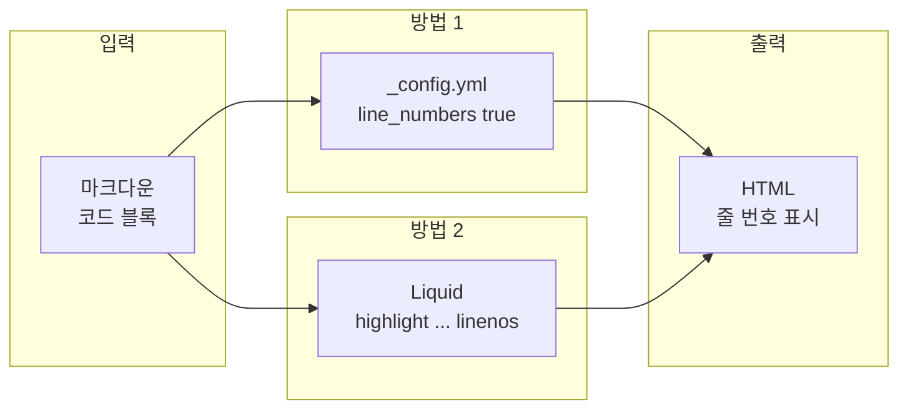

## 개요

Jekyll로 구성된 블로그나 문서 사이트는 마크다운과 호환되는 **Kramdown**을 엔진으로 쓰는 경우가 많다. Kramdown은 기본 마크다운 문법을 그대로 지원하면서 코드 블록, 표, 각주 등 확장 기능을 제공한다. 다만 코드 블록(`` ``` ``)을 사용할 때 **줄 번호(Line Number)**가 기본으로 나오지 않아, 긴 코드를 공유하거나 리뷰할 때 불편하다. 이 포스트에서는 Kramdown과 Rouge를 사용하는 Jekyll 환경에서 코드 영역에 줄 번호를 표시하는 **두 가지 방법**을 정리하고, 줄바꿈과의 충돌 이슈까지 다룬다.

**대상 독자**: Jekyll + Kramdown + Rouge 조합으로 블로그·문서를 운영 중인 개발자, 코드 가독성을 높이고 싶은 작성자.

**목표**:  
- 전역 설정만으로 모든 코드 블록에 줄 번호 적용(방법 1)  
- 특정 블록만 Liquid 태그로 줄 번호 적용(방법 2)  
- 줄 번호와 자동 줄바꿈을 함께 쓸 때의 한계 이해

---

## 왜 줄 번호가 필요한가

IDE나 코드 뷰어처럼, 텍스트/코드를 다루는 도구 대부분은 왼쪽에 라인 번호를 표시하는 기능을 제공한다.

|  |
| :----------------------------------------------------------------------------: |
| 이클립스의 라인 번호 출력 기능                                                |

마크다운 자체에는 이 기능이 없지만, Jekyll + Kramdown + Rouge 조합에서는 설정과 Liquid 태그로 동일한 효과를 낼 수 있다. 아래 흐름은 두 가지 접근을 한눈에 보여 준다.



---

## 방법 1: _config.yml로 전역 설정

**장점**: 기존 마크다운 코드 블록(`` ```언어 ``)을 그대로 두고, **출력되는 모든 코드 블록**에 줄 번호가 붙는다.  
**단점**: 사이트 전역에 적용되므로, 줄 번호가 필요 없는 블록까지 영향을 받는다.

### 설정 절차

1. 프로젝트 루트의 `_config.yml`을 연다.
2. `markdown`이 `kramdown`으로 지정돼 있는지 확인한다.
3. 아래와 같이 `kramdown` 옵션에 Rouge용 `syntax_highlighter_opts`를 넣고, `block`에 `line_numbers: true`를 준다.

```yaml
markdown: kramdown
kramdown:
  highlighter: rouge
  syntax_highlighter_opts:
    block:
      line_numbers: true
```

본문에서는 여전히 `` ```python `` 같은 펜스 코드 블록만 사용하면 되고, 빌드 결과물에서만 줄 번호가 나타난다. Kramdown 공식 문서의 [Rouge 옵션](https://kramdown.gettalong.org/syntax_highlighter/rouge.html)에서 `line_numbers` 등 추가 옵션을 확인할 수 있다.

---

## 방법 2: Liquid `highlight` 태그로 블록 단위 적용

**장점**: 줄 번호가 필요한 코드 블록만 골라서 적용할 수 있다.  
**단점**: 기존 `` ``` `` 블록을 Liquid 태그로 **일일이 바꿔야** 한다.

### 사용법

코드 블록의 위아래에 Liquid `highlight` 태그를 쓰고, 옵션으로 `linenos`를 준다.

```liquid

def hello():
    print("world")

```

- `python`: 언어(rouge가 지원하는 이름 사용).  
- `linenos`: 이 블록에만 줄 번호를 켠다.

기존에 `` ```python `` … `` ``` `` 로 작성한 부분을 위 형태로 치환하면 해당 블록만 줄 번호가 붙는다. 블록이 많은 경우 검색·치환으로 일괄 변경하는 방법도 있다.

---

## 방법 비교 요약

| 구분           | 방법 1 (_config.yml)     | 방법 2 (highlight linenos)   |
| -------------- | ------------------------ | ----------------------------- |
| 적용 범위      | 전역(모든 코드 블록)     | 해당 블록만                   |
| 기존 글 수정   | 불필요                   | 해당 블록을 Liquid로 교체 필요 |
| 유지보수       | 설정 한 번으로 통일      | 블록마다 태그 유지            |
| 세밀한 제어    | 없음                     | 블록 단위로 on/off 가능       |

전체 블로그의 코드 블록에 줄 번호를 통일하고 싶다면 **방법 1**, 일부 글이나 블록만 줄 번호를 쓰고 싶다면 **방법 2**를 선택하면 된다.

---

## 여담: 줄 번호와 자동 줄바꿈

코드에 줄 번호를 넣었다면, 긴 줄을 자동으로 줄바꿈하고 싶을 수 있다. 하지만 **줄 번호와 자동 줄바꿈은 함께 쓰기 어렵다.**

`main.scss`(또는 사용 중인 스타일시트)에 다음을 추가하면 코드 블록에 자동 줄바꿈(`white-space: pre-wrap`)을 줄 수 있다.

```css
code.highlighter-rouge {
  white-space: pre-wrap;
}
```

이렇게 하면 긴 줄이 줄바꿈되지만, Rouge가 만드는 줄 번호는 **원래의 논리적인 한 줄당 하나**로 매겨진다. 줄바꿈으로 시각적으로 여러 줄로 나뉜 부분은 여전히 같은 번호로 묶이기 때문에, “3번 줄이 화면에서는 두 줄로 보인다”처럼 번호와 시각적 줄 수가 어긋나 보일 수 있다. 이는 Jekyll/Kramdown/Rouge 구조상 줄 번호가 `<td>` 단위로 붙기 때문이다.

**실무 권장**: 다른 개발자와 “몇 번째 줄”로 소통하는 데 줄 번호가 유리하므로, **자동 줄바꿈을 포기하고 줄 번호를 쓰는 쪽을 추천**한다. 코드는 가능한 한 한 화면을 넘지 않도록 짧게 쓰고, 줄 수를 줄이는 것은 작성자의 몫으로 두는 것이 좋다.

---

## 결론

- **방법 1**: `_config.yml`에 `kramdown.syntax_highlighter_opts.block.line_numbers: true`를 두면, 기존 마크다운 코드 블록을 그대로 써도 모든 코드 블록에 줄 번호가 표시된다.
- **방법 2**: `` … ``로 필요한 블록만 줄 번호를 켤 수 있다.
- 줄 번호와 `white-space: pre-wrap` 자동 줄바꿈은 함께 쓰면 번호와 시각적 줄이 어긋나므로, **줄 번호 우선**으로 두고 코드 길이는 작성 단계에서 줄이는 편이 낫다.

이렇게 설정하면 Jekyll + Kramdown 환경에서도 IDE처럼 코드 블록에 줄 번호를 넣어 가독성과 소통을 높일 수 있다.

---

## 참고 문헌

1. [Kramdown – Syntax highlighting with Rouge](https://kramdown.gettalong.org/syntax_highlighter/rouge.html) — Rouge 옵션(`line_numbers` 등) 공식 문서.
2. [github code block에 line number 추가하기](https://helloyjam.github.io/github/markdown-code-linenumber/) — Jekyll/GitHub Pages에서 코드 블록 줄 번호 설정 요약.
3. [Rouge (GitHub)](https://github.com/jneen/rouge) — Rouge 문법 하이라이터 저장소 및 사용법.
