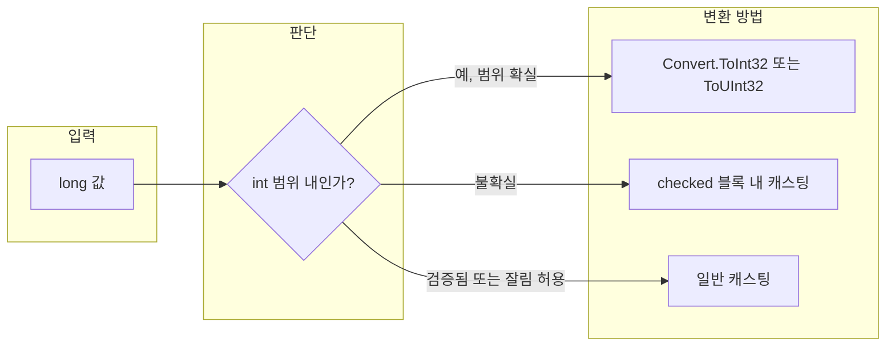

C#에서 **long**(64비트 정수)을 **int**(32비트 부호 있음) 또는 **uint**(32비트 부호 없음)로 바꾸는 일은 API 응답 처리, 파일 크기·인덱스 계산, 레거시 코드 연동 등에서 자주 필요하다. 단순히 캐스팅만 하면 오버플로우 시 값이 잘리거나 예기치 않은 결과가 나올 수 있어, 변환 방법과 사용 시점을 구분해 두는 것이 중요하다. 이 글에서는 **Convert** 클래스, 명시적 캐스팅, **checked** 블록을 각각 언제 쓰면 좋은지, 그리고 오버플로우·예외를 어떻게 다루면 좋은지 정리한다.

## 변환 방법 개요

long을 int 또는 uint로 바꾸는 대표적인 방법은 세 가지다. **Convert** 클래스의 `ToInt32`·`ToUInt32`를 쓰는 방법, C# 연산자 **(int)**·**(uint)** 로 캐스팅하는 방법, **checked** 문맥 안에서 캐스팅해 오버플로우 시 예외를 받는 방법이다. 목표 타입이 int인지 uint인지, 그리고 값이 범위를 벗어날 수 있는지 여부에 따라 선택이 달라진다.

- **Convert 클래스**: 변환 실패 시 `OverflowException`을 던지므로, “범위를 벗어나면 반드시 알리고 싶을 때” 적합하다.
- **캐스팅**: 컴파일러가 허용하면 그대로 잘라 넣는다. 오버플로우 시 예외 없이 상위 비트가 버려진 값이 나올 수 있다.
- **checked + 캐스팅**: 오버플로우가 나면 `OverflowException`이 발생한다. 기본 정수 연산이 unchecked인 환경에서도, 특정 구간만 예외로 감지하고 싶을 때 유용하다.

아래 Mermaid 흐름도는 “long 값을 int 또는 uint로 써야 하는 상황”에서 어떤 방법을 고려할지 한눈에 보여 준다.



- **int 범위 내가 확실할 때**: `Convert.ToInt32(long)` 또는 `Convert.ToUInt32(ulong)`으로 명시적 변환을 하고, 필요하면 그 결과를 다시 캐스팅해 쓸 수 있다.
- **범위가 불확실할 때**: `checked((int)longValue)` 처럼 **checked** 안에서 캐스팅하면 오버플로우 시 예외로 바로 알 수 있다.
- **일반 캐스팅**: “이미 검증된 값”이거나, 의도적으로 상위 비트를 버려도 되는 경우에만 사용하는 것이 안전하다.

## Convert 클래스로 변환하기

[Convert 클래스](https://docs.microsoft.com/ko-kr/dotnet/api/system.convert)(`System` 네임스페이스)는 기본 데이터 형식을 다른 기본 형식으로 바꿀 때 쓰는 정적 메서드들을 제공한다. long → int·uint의 경우 **ToInt32(Int64)** 와 **ToUInt32(UInt64)** 가 해당한다. (부호 있는 long을 uint로 바꿀 때는 음수 여부를 먼저 검사하는 것이 좋다.)

Convert는 변환 결과가 대상 타입의 표현 범위를 벗어나면 **OverflowException**을 던진다. 따라서 “범위를 넘으면 반드시 예외로 처리하고 싶다”는 요구에 잘 맞는다. 반대로, 예외 없이 값을 잘라 넣고 싶다면 Convert 대신 unchecked 캐스팅을 써야 한다.

### ToInt32(long) 예시

`Convert.ToInt32(long)`은 64비트 부호 있는 정수를 32비트 부호 있는 정수로 변환한다. 값이 int의 범위(−2,147,483,648 ~ 2,147,483,647)를 벗어나면 OverflowException이 발생한다.

```csharp
long vIn = 0;
int vOut = Convert.ToInt32(vIn);
// vOut == 0
```

범위 안의 일반적인 값도 같은 방식으로 처리할 수 있다.

```csharp
long vIn = 1000L;
int vOut = Convert.ToInt32(vIn);
// vOut == 1000
```

범위를 벗어나는 값은 실행 시 예외가 난다.

```csharp
long vIn = 3_000_000_000L;  // int.MaxValue(2,147,483,647) 초과
int vOut = Convert.ToInt32(vIn);  // OverflowException
```

실무에서는 파일 크기·API 응답의 수치 등을 long으로 받은 뒤, “인덱스나 길이로 쓸 수 있는지” 검사한 다음에만 int로 변환하는 패턴을 권장한다. 아래 “언제 어떤 방법을 쓸지” 절에서 정리한다.

### ToUInt32(long) 및 ToUInt32(ulong) 예시

부호 없는 32비트 정수(uint)가 필요할 때는 **ToUInt32**를 쓴다. 인자 타입에 따라 다음 두 가지가 있다.

- **ToUInt32(ulong)**: ulong을 uint로 변환. ulong 값이 uint 범위(0 ~ 4,294,967,295)를 넘으면 OverflowException.
- **ToUInt32(long)**: long을 uint로 변환. 음수이거나 uint 최댓값을 넘으면 OverflowException.

원문에서 다루었던 “long 0을 uint로” 변환은 다음과 같이 쓸 수 있다.

```csharp
long vIn = 0;
uint vOut = Convert.ToUInt32(vIn);
// vOut == 0
```

ulong을 받는 API나 연산 결과라면 ulong 오버로드를 쓰는 것이 타입 의미상 더 맞다.

```csharp
ulong vIn = 0;
uint vOut = Convert.ToUInt32(vIn);
// vOut == 0
```

음수 long을 ToUInt32(long)에 넘기면 OverflowException이 발생한다. “long이 음수일 수 있는데 uint로 써야 한다”는 요구는 보통 설계를 다시 검토하는 것이 좋다.

## 캐스팅과 checked 사용

C#에서 **(int)longValue**, **(uint)ulongValue**처럼 캐스팅하면 컴파일러가 비트를 잘라 넣기만 한다. 기본적으로 정수 연산·캐스팅은 **unchecked**이므로, 범위를 넘어가도 예외 없이 상위 비트가 잘린 값이 나온다. 이 동작이 의도한 것이라면 그대로 쓰면 되고, “범위를 넘으면 반드시 예외로 알고 싶다”면 **checked** 블록이나 **checked** 식 안에서 캐스팅하면 된다.

```csharp
long big = 3_000_000_000L;
int a = (int)big;                    // unchecked: 잘린 값 (의도에 따라 위험)
int b = checked((int)big);            // OverflowException
int c = Convert.ToInt32(big);         // OverflowException
```

정리하면, **의도적으로 오버플로우를 허용하지 않을 때**는 Convert 또는 checked 캐스팅을 쓰고, **이미 범위를 검증했거나 상위 비트를 버려도 되는 경우**에만 일반 캐스팅을 사용하는 것이 안전하다.

## 오버플로우와 예외 처리

long이 int·uint 범위를 벗어나면 다음처럼 동작한다.

| 방법 | 오버플로우 시 동작 |
|------|---------------------|
| **Convert.ToInt32 / ToUInt32** | `OverflowException` 발생 |
| **checked((int)longValue)** | `OverflowException` 발생 |
| **(int)longValue (unchecked)** | 예외 없음, 상위 비트 잘림 |

실무에서는 “외부 입력·API·파일 크기”를 long으로 받은 뒤 int로 쓸 때, 가능하면 **범위 검사**를 먼저 하고 변환하는 패턴을 권한다. 예를 들어 int로 쓸 수 있는지 확인한 뒤 Convert나 checked를 사용하면, 잘못된 값이 그대로 인덱스나 길이로 쓰이는 것을 막을 수 있다.

```csharp
public static int? TryToInt32(long value)
{
    if (value < int.MinValue || value > int.MaxValue)
        return null;
    return Convert.ToInt32(value);
}
```

이렇게 하면 “변환 가능할 때만 int로, 아니면 null” 같은 명시적 처리로 예외를 줄일 수 있다.

## 방법별 비교와 선택 기준

아래 표는 long → int·uint 변환 방법을 한눈에 비교한 것이다.

| 구분 | Convert | checked + 캐스팅 | 일반 캐스팅 |
|------|---------|-------------------|-------------|
| **오버플로우 시** | 예외 | 예외 | 잘림(예외 없음) |
| **호출 형태** | `Convert.ToInt32(v)` 등 | `checked((int)v)` | `(int)v` |
| **추천 상황** | 범위 검사 후 또는 “실패 시 예외”가 맞을 때 | 일부 구간만 예외로 감지하고 싶을 때 | 이미 검증된 값, 또는 의도적 잘림 |

**언제 무엇을 쓸지** 요약하면 다음과 같다.

- **Convert**: API·설정·파일 등 “외부에서 온 long”을 int·uint로 바꿀 때, 범위를 넘기면 실패(예외)로 두고 싶을 때.
- **checked 캐스팅**: 기본이 unchecked인 프로젝트에서, 특정 변환만 오버플로우 시 예외로 처리하고 싶을 때.
- **일반 캐스팅**: 이미 “int 범위 안”이 검증된 값이거나, 상위 비트를 버려도 되는 비트 연산·호환 목적일 때만 사용한다.

## 마무리 및 핵심 요약

C#에서 long을 int 또는 uint로 바꿀 때는 **Convert** 클래스의 `ToInt32`·`ToUInt32`, **checked** 캐스팅, **일반 캐스팅** 세 가지를 구분해 쓸 수 있다. Convert와 checked는 오버플로우 시 예외를 주므로 “범위를 넘기면 반드시 알리고 싶을 때” 적합하고, 일반 캐스팅은 예외 없이 비트를 잘라 넣기 때문에 “이미 검증된 값”이나 의도적 잘림에만 쓰는 것이 좋다. 실무에서는 long으로 들어온 값을 int·uint로 쓰기 전에 범위를 한 번 검사하고, 필요하면 `TryToInt32` 같은 헬퍼로 예외 대신 null/실패를 반환하도록 하면 안정성을 높일 수 있다.

- **핵심 요약**
  - **Convert.ToInt32 / ToUInt32**: 범위 초과 시 `OverflowException`. 외부 입력·API 결과를 int·uint로 바꿀 때 권장.
  - **checked 캐스팅**: 해당 구간만 오버플로우 시 예외로 감지할 때 사용.
  - **일반 캐스팅**: 검증된 값 또는 의도적 잘림일 때만 사용하고, 그 외에는 Convert 또는 checked를 우선한다.
