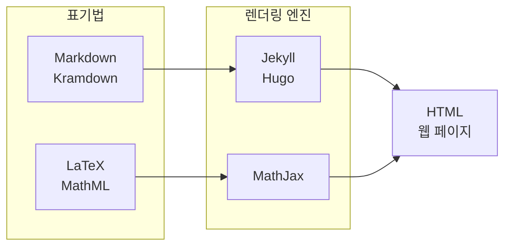

## 도입: 왜 웹에서 수식인가

수학자 전용이 아니더라도, 분수·제곱근·행렬처럼 **수식으로 표현해야 읽기 좋은 내용**은 블로그·기술 문서·교육 자료에 자주 등장한다. 본문만으로는 한계가 있으므로 **표기법(마크업)**과 **렌더링 엔진**을 조합해 웹 페이지에 수식을 넣는 방법을 익혀 두는 것이 유용하다. 이 글에서는 **Markdown·Jekyll** 환경에서 **LaTeX** 문법과 **MathJax**를 사용해 수식을 작성·표시하는 절차와 문법 요약, 사용 시 판단 기준을 다룬다.

---

## 정의와 원칙: LaTeX와 MathJax

문서를 조판할 때 문자·도형·수식을 조합해 표현하는 체계 중 하나가 **LaTeX**(레이텍·라텍)이다. LaTeX을 쓰면 수식이 포함된 문서를 정돈되게 만들 수 있어, 수리·과학 분야 논문 작성에 널리 쓰인다. **MathJax**는 LaTeX, MathML, AsciiMath 같은 **표기법**을 받아 웹에서 **수식으로 렌더링**해 주는 오픈소스 **JavaScript 엔진**이다. Markdown으로 글을 쓰고 Jekyll 등으로 HTML을 만드는 것처럼, 수식은 LaTeX 표기로 작성한 뒤 MathJax가 해당 문자열을 찾아 수식으로 바꿔 준다.

요약하면, **표기법(무엇을 쓸지)**과 **렌더링 엔진(누가 그걸 그려 줄지)**을 구분해서 이해하면 된다. 게시글은 Markdown·Kramdown 등으로 쓰고 Jekyll·Hugo 등으로 HTML을 만들며, 수식은 LaTeX·MathML 등으로 쓰고 MathJax 등으로 브라우저에 그리게 된다.

아래 다이어그램은 **표기법과 렌더링 엔진의 대응 관계**를 한눈에 보여 준다.



| 타입   | 표기법 예시              | 렌더링 엔진 예시   |
|--------|--------------------------|--------------------|
| 게시글 | Markdown, Kramdown       | GitHub, Jekyll, Hugo |
| 수식   | LaTeX, MathML, AsciiMath | MathJax            |

표기법을 정한 뒤 적절한 엔진을 쓰면, 텍스트와 수식이 함께 있는 문서를 웹에서 일관되게 표시할 수 있다. 자세한 스펙은 [MathJax 공식 문서](https://docs.mathjax.org/en/latest/)를 참고하면 된다.

---

## MathJax 적용 방법

[MathJax 공식 사이트](https://www.mathjax.org/)의 [Getting Started](https://docs.mathjax.org/en/latest/web/start.html)에 따르면, 웹 페이지에 스크립트만 추가하면 수식 렌더링을 켤 수 있다. 여기서는 **Web Integration** 방식으로 적용한다.

### Web Integration으로 넣기

다음 두 줄을 HTML의 `<head>` 안에 넣는다.

```html
<script src="https://polyfill.io/v3/polyfill.min.js?features=es6"></script>
<script id="MathJax-script" async src="https://cdn.jsdelivr.net/npm/mathjax@3/es5/tex-mml-chtml.js"></script>
```

첫 줄은 구형 브라우저용 ES6 폴리필, 두 줄은 MathJax 3의 TeX·MathML 입력과 HTML+CSS 출력을 묶은 번들이다. 이 코드만 추가하면 해당 페이지 안의 **`$...$`로 감싼 문자열**을 LaTeX로 해석해 수식으로 바꾼다. Jekyll 테마에서는 `_includes/head.html` 또는 레이아웃의 head 영역에 위 스크립트를 두면 된다.

|  |
|:--:|
| *MathJax 스크립트 설치 방법* |

---

## 수식 작성하기: 인라인과 구분자

스크립트 적용 후에는 본문 중 **`$`로 앞뒤를 감싼 부분**이 LaTeX 문법으로 해석된다. 한 개의 `$`로 감싼 것은 인라인 수식(문장 안에 들어가는 수식), `$$` 두 개로 감싼 것은 블록 수식(한 줄을 차지하는 수식)으로 처리되는 경우가 많다. (사이트·엔진 설정에 따라 `\(...\)`, `\[...\]` 구분자를 쓰는 경우도 있다.)

예: `$( a^2 )$`는 인라인으로 \(a^2\)처럼 보이고, 블록으로 쓰면 아래와 같다.

$$( a^2 )$$

즉, **`$ 수식 $`** 형태만 지키면 나머지는 LaTeX 문법에 맞게 작성하면 된다. 결과적으로 \(a^2\) 같은 수식이 문장 속에 자연스럽게 들어간다.

---

## LaTeX 문법 요약

LaTeX 수식 문법 전체는 [LaTeX 공식 문서 – Typesetting mathematics](https://www.latex-project.org/help/documentation/#typesetting-complex-mathematics)에서 확인할 수 있다. 여기서는 블로그·문서에서 자주 쓰는 항목만 정리한다.

### 이차방정식의 근의 공식

인라인: `$x = {-b \pm \sqrt{b^2-4ac} \over 2a}$`  
블록 예:

$$x = {-b \pm \sqrt{b^2-4ac} \over 2a}$$

### 첨자(위·아래)

아래첨자 `_`, 위첨자 `^`. 한 글자만 쓸 때는 `a_1`, `a^2`처럼 그대로 두고, 두 글자 이상이면 중괄호로 묶는다.

- `$a_1, a^2, a_1^2$` → \(a_1, a^2, a_1^2\)
- `$y_i=x_i^3+x_{i-1}^2+x_{i-2}$` → \(y_i=x_i^3+x_{i-1}^2+x_{i-2}\)

### 분수

**방법 1.** `\over`: `\over` 왼쪽 전체가 분자, 오른쪽 전체가 분모.  
**방법 2.** `\frac{분자}{분모}`: 인자 두 개를 각각 분자·분모로 사용.

예:

- `$s^2+2s+s\over s+\sqrt s+1$` → \(s^2+2s+s\over s+\sqrt s+1\)
- `$\frac{1+s}{s(s+2)}$` → \(\frac{1+s}{s(s+2)}\)

### 절댓값(크기 맞춤 괄호)

키보드 `|`만 쓰면 분수처럼 큰 수식에 맞게 늘어나지 않는다. **`\left`, `\right`**와 **`\lvert`, `\rvert`**를 쓰면 수식 높이에 맞게 절댓값 기호가 늘어난다.

- `$\vert x \vert$` → \(\vert x \vert\)
- `$\left\lvert \frac{s^2+1}{s^3+2s^2+3s+1} \right\rvert$` → \(\left\lvert \frac{s^2+1}{s^3+2s^2+3s+1} \right\rvert\)

---

## Cheat Sheet와 추가 참고

LaTeX 수식 명령어를 자주 잊는다면 **요약 문서(Cheat Sheet)**를 옆에 두는 것이 좋다. 공식 문서의 [Writing mathematics for MathJax](https://docs.mathjax.org/en/latest/basic/mathematics.html)와 [TeX and LaTeX Support](https://docs.mathjax.org/en/latest/input/tex/index.html)에 입력 문법이 정리되어 있으며, 기호를 그리면 LaTeX 명령을 추천해 주는 [Detexify](https://detexify.kirelabs.org/classify.html)도 유용하다. (과거에 쓰이던 Google Drive 치트시트 링크는 접근 불가 시 공식 문서로 대체하는 것을 권장한다.)

---

## 언제 쓰고 언제 피할지

- **쓸 만한 경우**: 수식이 있는 기술 블로그, 강의 노트, 수학·과학·공학 문서, 논문 요약, 인라인 수식이 필요한 설명.
- **피하거나 대체할 경우**: 수식이 거의 없는 일반 일기형 블로그(로딩 비용만 늘어남), 이미지로만 수식을 넣어도 되는 단순 자료, 오래된 브라우저만 지원해야 하는 환경(필요 시 서버 사이드 렌더링·이미지 변환 검토).

정리하면, **수식이 문서의 가독성·정확성에 기여할 때** MathJax를 쓰고, 수식이 없거나 단순한 경우에는 불필요한 스크립트 로딩을 줄이는 편이 좋다.

---

## 이 글을 읽은 후 할 수 있는 일(학습 목표)

- **LaTeX**와 **MathJax**의 역할 차이(표기법 vs 렌더링 엔진)를 설명할 수 있다.
- Jekyll·정적 사이트에 MathJax 스크립트를 추가해 인라인·블록 수식을 표시할 수 있다.
- 인라인 `$...$`와 블록 `$$...$$` 구분자를 알고, 첨자·분수·절댓값 등 기본 LaTeX 문법으로 수식을 작성할 수 있다.
- 수식이 필요한 문서인지 여부에 따라 MathJax 도입 여부를 판단할 수 있다.

---

## 참고 문헌

- [The LaTeX Project](https://www.latex-project.org/) — LaTeX 공식 프로젝트
- [MathJax Documentation](https://docs.mathjax.org/en/latest/) — MathJax 4.x 공식 문서
- [MathJax로 LaTeX 사용하기](https://johngrib.github.io/wiki/mathjax-latex/) — John Grib 위키
- [MathJax로 수식 입력하는 방법](https://sasamath.com/blog/tip-collection/how-to-write-equations-in-mathjax/) — SASA Math
- [[LaTeX] Markdown 수식 작성법](https://velog.io/@d2h10s/LaTex-Markdown-%EC%88%98%EC%8B%9D-%EC%9E%91%EC%84%B1%EB%B2%95) — Velog
