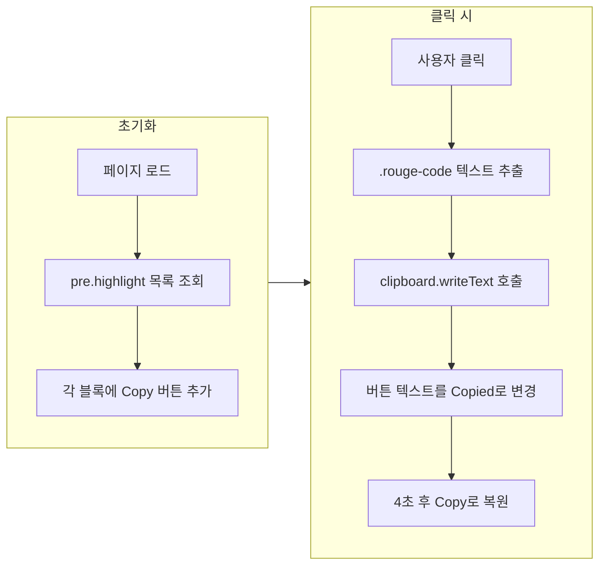

## 개요

개발 블로그에서 코드 블록 옆에 **Copy code to clipboard** 버튼이 있으면, 독자가 스니펫을 그대로 복사해 사용하기 편하다. Jekyll 기반 사이트에서는 마크다운 원문을 건드리지 않고, **JavaScript로 렌더된 코드 블록에만** 버튼을 붙이는 방식이 재사용성과 유지보수 측면에서 유리하다.

- **대상**: Jekyll(특히 Minimal Mistakes 테마)을 쓰는 블로그 운영자
- **목표**: `pre.highlight` 코드 블록마다 Copy 버튼을 붙이고, 클릭 시 클립보드에 복사·피드백(예: "Copied") 표시
- **요약**: 스크립트로 버튼을 동적 생성하고, Clipboard API로 복사한 뒤, CSS로 호버/포커스 시에만 버튼을 노출하는 구성이다.

아래는 적용 후 코드 블록 예시다.

|  |
| :------------------------------------------------------------------: |
| 코드 블록 우측 상단 Copy 버튼 (호버 시 노출) |

---

## 적용 코드

### JavaScript: 버튼 생성 및 클립보드 복사

성격이 급한 사람을 위한 **즉시 붙여 넣기용** 전체 코드다. Jekyll이 렌더한 `pre.highlight` 블록을 찾아 각각에 Copy 버튼을 만들고, 클릭 시 `.rouge-code` 내용을 클립보드에 복사한다.

```html
<script>
  var codeBlocks = document.querySelectorAll('pre.highlight');

  codeBlocks.forEach(function (codeBlock) {
    var copyButton = document.createElement('button');
    copyButton.className = 'copy btn'; // Minimal Mistakes 버튼 스타일 활용
    copyButton.type = 'button';
    copyButton.ariaLabel = 'Copy code to clipboard';
    copyButton.innerText = 'Copy';

    codeBlock.append(copyButton);

    copyButton.addEventListener('click', function () {
      var code = codeBlock.querySelector('.rouge-code').innerText.trim();
      window.navigator.clipboard.writeText(code);

      copyButton.innerText = 'Copied';

      var fourSeconds = 4000;
      setTimeout(function () {
        copyButton.innerText = 'Copy';
      }, fourSeconds);
    });
  });
</script>
```

- **선택자**: `pre.highlight` — Rouge 문법 강조 사용 시 Jekyll이 붙이는 클래스.
- **버튼 클래스**: `copy`(직접 스타일링) + `btn`(Minimal Mistakes 기본 버튼 스타일).
- **접근성**: `ariaLabel`로 스크린 리더에 "Copy code to clipboard" 안내.
- **복사 API**: `navigator.clipboard.writeText()` 사용(최신 브라우저). 구형 환경이면 fallback(예: `document.execCommand('copy')`)을 고려할 수 있다.
- **피드백**: 클릭 후 4초 뒤에 "Copy"로 되돌린다. 필요 시 `setTimeout` 시간만 조정하면 된다.

### CSS: 버튼 위치 및 호버 시 노출

버튼을 코드 블록 우측 상단에 두고, 기본은 반투명·호버/포커스/액티브 시에만 선명하게 보이도록 한다.

```css
pre.highlight {
  .copy {
    color: $text-color;
    position: absolute;
    right: 1rem;
    top: 1rem;
    opacity: 20%;
    background: $primary-color;
  }

  &:active .copy,
  &:focus .copy,
  &:hover .copy {
    opacity: 1;
  }
}
```

- **위치**: `position: absolute` + `right`/`top`으로 블록 안 우상단 고정. `pre.highlight`에 `position: relative`가 있어야 한다(Minimal Mistakes 기본 스타일에서 보통 포함).
- **가독성**: 평소 20% 투명도로 숨기고, 호버·포커스·액티브 시 100%로 표시해 코드 가독성을 해치지 않는다.

위 스타일은 `main.scss`(또는 테마에서 코드 블록 스타일을 오버라이드하는 SCSS)에 추가하면 된다.

---

## 동작 흐름

Copy 버튼이 붙은 코드 블록에서 사용자가 클릭했을 때의 흐름은 아래와 같다.



- **초기화**: DOM에서 `pre.highlight`를 모두 찾은 뒤, 각 요소에 Copy 버튼을 한 번만 추가한다.
- **클릭 시**: 해당 블록의 코드 문자열을 가져와 클립보드에 쓰고, 버튼 라벨을 "Copied"로 바꾼 뒤 4초 후 "Copy"로 되돌린다.

---

## 스크립트·CSS 배치 위치

- **스크립트**: 게시글을 렌더하는 레이아웃에 넣으면 된다. 본 블로그에서는 `_includes/page__date.html`에 추가해, 글이 있는 페이지에서만 실행되도록 했다. 레이아웃 구조에 따라 `_layouts/single.html` 또는 `_layouts/post.html`에 직접 넣어도 된다.
- **CSS**: `assets/css/main.scss`(또는 테마의 메인 SCSS)에 위 `pre.highlight .copy` 블록을 추가했다.

다른 레이아웃을 쓰는 경우 [GitHub 커밋(Reevid.github.io)](https://github.com/Reevid/Reevid.github.io/commit/4173b700ae7252bfb5d10860295d888bdaf023d6)에서 `page__date.html`과 `main.scss` 수정 예시를 참고하면 된다.

---

## 참고 자료

- [Jekyll: Copy code to clipboard (remarkablemark)](https://remarkablemark.org/blog/2021/06/01/add-copy-code-to-clipboard-button-to-jeyll-site/) — 비슷한 방식의 버튼 추가와 Rouge 선택자 설명.
- [jekyll-clipboardjs (GitHub)](https://github.com/marcoaugustoandrade/jekyll-clipboardjs) — Clipboard.js를 활용한 Jekyll 플러그인 예시.
- [How to Add a Copy-to-Clipboard Button to Jekyll (Aleksandr Hovhannisyan)](https://www.aleksandrhovhannisyan.com/blog/how-to-add-a-copy-to-clipboard-button-to-your-jekyll-blog/) — Liquid include와 JavaScript 조합으로 버튼을 붙이는 다른 구현 방식.

---

## 결론

마크다운 원본은 그대로 두고, **JavaScript로 렌더 결과에만** Copy 버튼을 붙이면 다른 퍼블리싱 환경(예: Hugo, Notion 내보내기)에서도 동일한 마크다운을 재사용할 수 있다. Jekyll·Minimal Mistakes 환경에서는 위 스크립트와 CSS만 레이아웃·SCSS에 넣으면 코드 블록마다 Copy to clipboard 버튼이 동작하며, 필요 시 복사 실패 시 fallback이나 접근성 보강(키보드 포커스, 알림 메시지 등)을 단계적으로 추가하면 된다.
