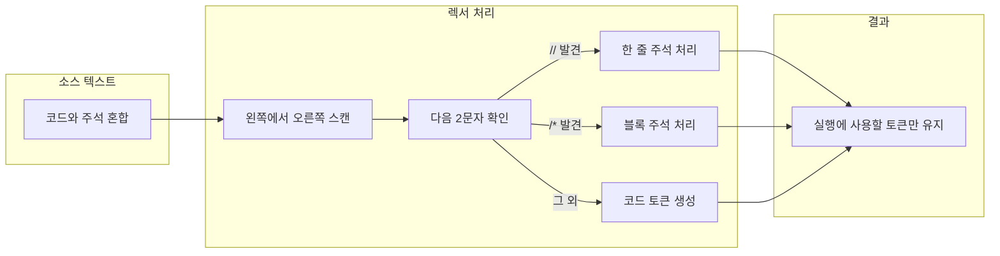

자바스크립트(JavaScript)에서 주석(Comment)은 HTML 주석과 문법이 다르다. 한 줄 주석(`//`), 여러 줄 주석(`/* */`), 그리고 스크립트 최상단에서만 쓰는 Hashbang(`#!`)까지 문법을 정리하고, HTML과의 혼동을 피하는 방법, 배포 시 주의사항, Clean Code·JSDoc 관점까지 함께 다룬다.

## 목차

1. [한 줄 주석 (Line comment)](#한-줄-주석-line-comment)
2. [여러 줄 주석 (Block comment)](#여러-줄-주석-block-comment)
3. [주석 파싱 흐름 (구조 이해)](#주석-파싱-흐름-구조-이해)
4. [스크립트 내 `<!-- //-->` 사용 이유](#스크립트-내----사용-이유)
5. [Hashbang 주석](#hashbang-주석)
6. [주의할 점](#주의할-점)
7. [베스트 프랙티스와 JSDoc](#베스트-프랙티스와-jsdoc)
8. [참고 문헌](#참고-문헌)

---

## 한 줄 주석 (Line comment)

한 줄 주석은 `//`로 만든다. `//` 앞까지는 코드로 해석되고, 같은 줄에서 `//` 이후는 모두 주석으로 처리된다.

```js
// single line comment
```

인라인으로 코드 오른쪽에 설명을 달 때도 `//`를 쓴다.

```js
const message = "hi"; // 인사 메시지
```

파서는 소스를 왼쪽에서 오른쪽으로 읽으며, `//`를 만나면 해당 줄의 끝(줄 종결자)까지를 주석으로 간주하고 토큰으로 사용하지 않는다.

---

## 여러 줄 주석 (Block comment)

여러 줄을 주석으로 만들 때는 `/*`와 `*/`로 둘러싼다.

```js
/*
  Comment 1
  Comment 2
*/
```

한 줄만 감싸도 되고, 줄 중간에 넣어서 일부만 주석 처리할 수도 있다.

```js
/* 한 줄 블록 주석 */
const greeting = "Hello " + name /* name 변수 삽입 */ + "!";
```

읽기 쉽게 매 줄 앞에 `*`를 붙이는 스타일도 흔히 쓰인다.

```js
/*
 * Comment 1
 * Comment 2
 */
```

다만 *Clean Code* 등에서는 “코드 자체로 설명하고, 주석은 왜(Why)에만 쓴다”는 관점을 강조한다. 단순히 “무엇을 하는지”만 나열하는 장문의 블록 주석은 코드가 바뀔 때 갱신되지 않기 쉽고, 오히려 잘못된 정보가 될 수 있어 권장하지 않는다. 정리·문서화가 필요하면 JSDoc 형태의 블록 주석을 사용하는 편이 낫다.

---

## 주석 파싱 흐름 (구조 이해)

렉서(lexer)가 소스 텍스트를 처리할 때 주석이 어떻게 구분되는지 흐름을 간단히 도식화하면 아래와 같다. 주석은 실행에는 기여하지 않는 “불필요한 입력 요소”로 분류되어 제거된다.



노드 ID는 camelCase·PascalCase를 사용했고, 엣지 라벨에 따옴표가 포함된 문자열은 큰따옴표로 감쌌다.

---

## 스크립트 내 `<!-- //-->` 사용 이유

오래된 코드에서는 `<script>` 안에 HTML 주석처럼 `<!--`와 `//-->`를 쓰는 패턴을 볼 수 있다.

```html
<script type="text/javascript">
<!--
  // 실제 자바스크립트 코드
  console.log("hello");
//-->
</script>
```

`<!--` … `-->`는 **HTML 주석**이다. 과거에는 JavaScript를 지원하지 않는 브라우저가 `<script>` 내용을 그대로 HTML로 해석하려다 `function`, `for`, `if` 같은 키워드에서 오류를 내는 경우가 있었다. 그래서 스크립트 내용을 HTML 주석으로 감싸 두면, JS를 모르는 브라우저는 그 구간을 무시하고, JS 엔진이 있는 브라우저는 `<script>` 안의 내용을 스크립트로 해석할 때 `<!--`와 `//-->`를 각각 한 줄 주석 시작으로 처리해 실행에 포함시킨다. 즉, “초기 브라우저 오작동 방지”용 레거시 패턴이다.

현재 대부분의 브라우저는 JavaScript를 지원하므로, 새로 작성하는 코드에서는 `<!-- //-->`를 사용할 필요가 없다. 레거시 코드를 유지보수할 때만 의미를 알아두면 된다.

---

## Hashbang 주석

스크립트 또는 모듈 파일의 **맨 처음**, 그 앞에 공백 없이 `#!`로 시작하는 주석을 Hashbang 주석이라고 한다. 한 줄 전체가 주석처럼 취급되며, 주로 Node.js 등에서 실행 인터프리터 경로를 지정할 때 쓴다.

```js
#!/usr/bin/env node

console.log("Hello world");
```

브라우저에서는 일반 주석과 동일하게 무시되고, 쉘에서 직접 실행할 때만 의미를 가진다. Hashbang은 파일당 하나만 허용되며, 반드시 첫 줄에 와야 한다. 자세한 내용은 [MDN Lexical grammar - Comments](https://developer.mozilla.org/en-US/docs/Web/JavaScript/Reference/Lexical_grammar#comments)를 참고하면 된다.

---

## 주의할 점

- **클라이언트에 노출됨**: HTML 문서에 넣은 자바스크립트는 사용자가 “소스 보기”로 확인할 수 있다. 주석 역시 그대로 보이므로, 개발용 메모·비밀·내부 이슈 등 공개되면 안 되는 내용은 주석에 남기지 말고, 배포 전 제거하거나 빌드/번들 단계에서 제거하는 것이 좋다.
- **민감 정보**: API 키, 비밀번호, 토큰, 내부 URL 등은 코드·주석 어디에도 넣지 않고, 환경 변수나 서버 측 설정으로만 다루는 것이 안전하다.

---

## 베스트 프랙티스와 JSDoc

- **무엇(What)보다 왜(Why)**: 코드만 봐도 무엇을 하는지 드러나게 작성하고, 주석은 “왜 이렇게 했는지”, “어떤 제약/이슈가 있는지”에 집중하는 것이 유지보수에 유리하다.
- **함수·클래스·공개 API 문서화**: 공개 API나 복잡한 함수는 [JSDoc](https://jsdoc.app/) 형식의 블록 주석으로 매개변수, 반환값, 예외, 사용 예를 적어 두면 IDE 자동완성·타입 힌트·문서 생성에 도움이 된다.

```js
/**
 * 사용자 이름을 받아 인사 문구를 만든다.
 * @param {string} name - 사용자 이름
 * @returns {string} "Hello, {name}!" 형식의 문자열
 */
function greet(name) {
  return `Hello, ${name}!`;
}
```

- **죽은 코드 제거**: 실행되지 않는 코드를 주석으로 남겨 두기보다는 버전 관리(Git)에 맡기고, 필요하면 이력에서 복구하는 편이 낫다.

---

## 참고 문헌

1. [MDN – JavaScript Lexical grammar: Comments](https://developer.mozilla.org/en-US/docs/Web/JavaScript/Reference/Lexical_grammar#comments) – 한 줄/블록/Hashbang 주석 문법과 동작 설명.
2. [ECMAScript® 2023 Language Specification](https://262.ecma-international.org/14.0/) – 공식 언어 명세(주석은 렉시컬 문법에서 정의됨).
3. [JSDoc – Getting started](https://jsdoc.app/) – JSDoc을 이용한 JavaScript API 문서화 방법.

이 포스트는 위 규칙과 참고 문헌을 반영해 2026년 3월에 전면 보강하였다. 42jerrykim.github.io에서 더 많은 글을 볼 수 있다.
