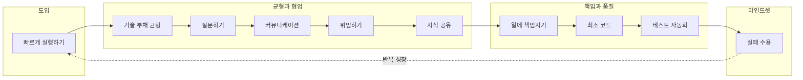

이 글은 저자가 실제로 함께 일하며 만난, 가장 뛰어나다고 느꼈던 소프트웨어 엔지니어에게서 배우고 느낀 **10가지 교훈**을 정리한 것이다. 원문은 Santiago Pino의 「Lessons learned from the smartest Software Engineer I've met」이며, 해당 원문 URL은 현재 접근 불가하여 링크는 생략했다. 학교와 독학만으로는 채우기 어려웠던 **실전에서의 판단과 습관**을 한 사람의 스타일을 통해 요약한 글로, 주니어·미들 개발자와 개발자 성장에 관심 있는 독자에게 도움이 되도록 구성했다.

아래에서는 먼저 10가지 교훈을 표로 한눈에 보여 준 뒤, 각 교훈을 문단으로 풀어 쓰고, 실행 흐름을 Mermaid로 시각화한다. 마지막에는 **적용 체크리스트**, **평가 기준**, **참고 문헌**을 두어 스스로 점검하고 더 읽어볼 수 있게 했다.

## 10가지 교훈 한눈에 보기

| 번호 | 교훈 | 핵심 메시지 |
|------|------|-------------|
| 1 | 빠른 것이 좋은 것보다 낫다 | "충분히 좋은" 솔루션으로 먼저 시장·피드백을 잡고, 끊임없이 첫 번째가 되는 데 집중한다. |
| 2 | 기술 부채에 대해 다시 생각하기 | 기술 부채는 적절히 사용하면 핵심 일을 앞당기는 수단이 된다. 균형이 중요하다. |
| 3 | 바보 같은 질문은 없다 | 질문 한 번으로 해결할 수 있는데 돌아서는 것은 손해다. 더 똑똑하고 빠르게 일하는 쪽이 낫다. |
| 4 | 스킬에 날개를 다는 커뮤니케이션 | 기술만으로는 한계가 있다. 생각을 명확히 전달하고, 커뮤니케이션에 공을 들인다. |
| 5 | 당신이 할 수 있다고 해서 꼭 당신이 해야 하는 것은 아니다 | 중요한 일에 집중하려면 위임을 배우고, 우선순위를 정해 다른 이에게 맡긴다. |
| 6 | 남김없이 공유하라 | 나만 아는 것은 핵심 인재가 되게 하지 않는다. 지식을 공유하고 주변을 성공시키는 쪽이 빠르다. |
| 7 | 일에 책임을 져라 | 문제가 생기면 "다음에는 무엇을 바꿀 수 있을까?"를 묻고, 자기 성찰을 반복한다. |
| 8 | 최고의 코드는 아무것도 작성하지 않는 것이다 | 코드에는 책임이 따른다. 가능한 적은 코드로 해결하고, 노코드·기존 솔루션을 고려한다. |
| 9 | 내가 테스트하지 않으면 결국 문제가 된다 | 테스트 케이스 작성에 시간을 쓰지 않으면 나중에 더 큰 대가를 치른다. 자동화된 테스트는 기본이다. |
| 10 | 실패를 받아들여라 | 실패 없이는 배움이 없다. 도전하고, 넘어지고, 배우고, 다시 시도하는 과정을 받아들인다. |

## 10가지 교훈의 실행 흐름

아래 다이어그램은 10가지 교훈이 **실행·사고의 흐름**으로 어떻게 이어질 수 있는지 요약한 것이다. 노드는 각 교훈의 핵심 행동을 나타낸다.

---

## 1. 빠른 것이 좋은 것보다 낫다

대부분의 상황에서는 **"충분히 좋은"** 솔루션만 있어도 시간, 돈, 관심을 얻을 수 있다. 많은 사람이 너무 오래, 너무 많이 고민한다. 처음부터 완벽하게 하려 하는데, 이는 명백한 실수다. 끊임없이 **첫 번째(1위)가 되는 것**에 집중해야 한다. 그게 여러분이 쏟은 시간이 가치 있었음을 증명하는 가장 좋은 방법이다.

적용 포인트: MVP를 정하고, 배포·피드백 루프를 짧게 가져가며, "나중에 개선"할 부분과 "지금 꼭 해야 할" 부분을 구분한다.

---

## 2. 기술 부채(Technical Debt)에 대해 다시 생각하기

많은 사람이 기술 부채를 죄악처럼 말하지만, 그 자체가 나쁜 것은 아니다. **어떻게 쓰는지**를 모를 뿐이다. 적절히만 사용한다면, 기술 부채는 "가장 중요한 일을 하기 위해 다른 모든 것을 잠시 미루는 것"이라는 **긍정적인 의미**로 해석할 수 있다. 중요한 것은 **균형**이다. 너무 과하면 문제가 되지만, 부채가 전혀 없다는 것은 오히려 관련 없는 일에 시간을 쓰고 있을 수 있다는 신호다.

적용 포인트: 부채를 인지하고, 상환 계획을 두며, 핵심 기능·비즈니스 가치에 우선순위를 두고 부채를 허용할 구간을 명확히 한다.

---

## 3. 바보 같은 질문은 없다

질문 하나만 하면 답을 얻을 수 있는 문제를 두고 돌아서는 사람을 보는 것은 괴롭다. **항상 질문하라.** 더 열심히 일한다고 점수를 더 주는 것이 아니다. 더 똑똑하고 빠르게 일하는 쪽이 훨씬 낫다. 바보 같은 질문은 없다는 것을 기억하라.

> "질문하는 사람은 5분 동안 바보가 된다. 하지만 질문하지 않는 사람은 영원히 바보에서 벗어나지 못한다." — 중국 속담

적용 포인트: 막히면 먼저 주변에 질문하고, 질문을 정리해서 올리며, 답을 받은 뒤에는 정리·공유해서 팀에 환원한다.

---

## 4. 스킬에 날개를 다는 커뮤니케이션 능력

자신의 생각을 **명확하게 전달하는 능력**이 있다는 것은 큰 자산이다. 그런데 많은 사람이 이에 대해 걱정조차 해 본 적이 없다. 스킬만으로는 높은 곳까지 올라가기 어렵다. 가능한 한 시간을 투자해 **다른 사람과 소통하는 방법**을 배우고, 공을 두 배로 들여보라.

적용 포인트: 문서·발표·대화에서 "목적·배경·결론·다음 액션"을 짧게 정리하는 습관을 들이고, 피드백을 구한다.

---

## 5. 당신이 할 수 있다고 해서 꼭 당신이 해야 하는 것은 아니다

가장 중요한 일에 집중하려면 **다른 이에게 최대한 많이 위임**해야 한다. 우선순위를 정하고, **위임하는 법**을 배우라.

당신의 경력에 변화를 가져올 귀중한 스킬은 다음과 같다.

- 중요하고 영향도가 큰 일 찾기
- "내 시간이 낭비되고 있다"는 것을 인식하기
- 효율적으로 위임하는 법 배우기

적용 포인트: 할 일 목록에서 "나만 해야 하는가?"를 묻고, 위임 가능한 항목은 적절한 사람에게 넘기며, 위임 후에도 결과와 품질을 점검하는 루프를 둔다.

---

## 6. 남김없이 공유하라

나만 안다고 해서 여러분이 핵심 인재가 되는 것이 아니다. 오히려 대부분의 경우 그 반대다. 사람들은 **자기 발전에 도움을 주는 이**와 함께하고 싶어 한다. 가진 지식을 남김없이 공유하라. 주변 사람들을 성공시키려 노력하는 것이 팀의 핵심 인재가 되는 가장 빠른 길이다.

적용 포인트: 문서화, 코드 리뷰, 세미나·블로그 발표, 온보딩 자료 정리 등으로 지식을 남기고, 팀이 그걸 재사용할 수 있게 한다.

---

## 7. 일에 책임을 져라

문제가 발생할 때마다 스스로에게 **"다음에는 무엇을 바꿀 수 있을까?"**라고 물어야 한다. 무슨 일이 있어도 자기 성찰이 필요하다. 누구나 자기 합리화는 쉽다. 잘못됐을 때 항상 핑계를 찾고 남 탓만 한다면, 평생 그저 그런 인재로 남게 된다.

적용 포인트: 사후 분석(회고)에서 "내가 통제할 수 있었던 요인"을 찾고, 다음 액션을 구체적으로 정한 뒤 실행한다.

---

## 8. 최고의 코드는 아무것도 작성하지 않는 것이다

내가 작성한 코드에는 **책임**이 따른다. 여러분이 쓰는 모든 코드는 시간이 지나도 따라다니는 꼬리표와 같고, 직접 책임져야 한다. **가능한 한 적은 수의 코드**로 문제를 해결하는 방법을 배우라. 노코드(No-code) 솔루션은 과소평가되지만 잠재력이 크다.

적용 포인트: 새 기능 전에 "기존 라이브러리·서비스·설정으로 해결할 수 있는가?"를 먼저 묻고, 정말 필요할 때만 새 코드를 추가한다.

---

## 9. 내가 테스트하지 않으면 결국 문제가 된다

"코드에 문제가 있으면 어차피 나와겠지"라는 안일한 생각은 버려야 한다. 오늘 **테스트 케이스 작성**에 시간을 쓰지 않으면, 내일 더 큰 대가를 치르게 된다. 자동화된 테스트가 없으면 그건 이미 문제다.

적용 포인트: 핵심 로직·API·데이터 변환에는 단위·통합 테스트를 두고, CI에서 자동으로 돌리며, 리팩토링 시에도 테스트를 유지·보강한다.

---

## 10. 실패를 받아들여라

실패가 없으면 배울 수 없다. 아직 실패한 적이 없다면, **도전적인 과제**를 시도해 본 적이 없는 것이다. 실패하고, 거기서 배우고, 다시 시도하라. 더 높은 목표를 세우고 두려워하지 마라. 가끔 "내가 부족하다"고 느끼는 것은 좋은 신호다. 자신을 채찍질하고 성장하고 있다는 뜻이다. 쉬운 일만 하고 있으면 스스로를 의심할 기회도 없다. 단, "실패를 좋아한다"는 뜻이 아니다. **성공을 열망**하되, 수백 번 넘어진 뒤에야 비로소 성공할 수 있다는 사실을 명심하라.

적용 포인트: 작은 실험·프로토타입으로 먼저 실패 비용을 줄이고, 회고에서 원인과 교훈을 정리한 뒤 다음 목표에 반영한다.

---

## 정리: 핵심 메시지

시간이 많이 흐른 지금도, 저자는 끊임없이 **기본적이지만 핵심적인 것들**을 실천하려 노력한다. 한 일을 돌아보고, 다른 사람과 이야기하고, 필요한 부분은 바꾸고 다시 받아들이며, 이를 무시할 때 어떤 결과가 오는지 스스로 상기한다. 아래는 이 교훈들이 성공적인 커리어에 도움이 되었던 요약이다.

- **첫 번째가 되는 것**에 집중하라. 기회를 만들고, 옳았음을 증명하라.
- **기술 부채**도 적절히 사용하면 도움이 된다. 균형을 의식하라.
- 기꺼이 **도움을 주고받을 수 있는 사람**과 함께하고, 끊임없이 **질문**하라.
- **커뮤니케이션**은 기술에 날개를 단다.
- **중요하고 영향도가 큰 일**에 집중하고, 나머지는 **위임**할 수 있다.
- 가진 **지식을 남김없이 공유**하라.
- 문제를 피하지 말고 **한 일에 책임**을 지라.
- 작성한 **코드에는 책임**이 따른다. 코드는 적을수록 좋다.
- **테스트 자동화**는 기본이다. 소홀히 하지 말라.
- 더 높은 목표를 세우고 안주하지 말라. **실패하고, 배우고, 성장하고, 다시 시도**하라.

---

## 적용 체크리스트

다음은 이 10가지 교훈을 일상에 적용할 때 스스로 점검해 볼 수 있는 체크리스트다.

| 영역 | 확인 항목 |
|------|-----------|
| 실행 | MVP를 정했는가? 배포·피드백 주기를 짧게 잡았는가? |
| 기술 부채 | 부채를 인지하고, 상환 계획이나 허용 구간을 두었는가? |
| 질문 | 막힐 때 먼저 질문·검색했는가? 질문을 정리해 공유했는가? |
| 커뮤니케이션 | 목적·배경·결론·다음 액션을 짧게 전달하는가? |
| 위임 | "나만 해야 하는가?"를 묻고, 위임 가능한 일을 넘겼는가? |
| 공유 | 지식을 문서·코드 리뷰·발표로 남기고 있는가? |
| 책임 | 문제 후 "다음에 내가 바꿀 수 있는 것"을 찾았는가? |
| 코드 | 새 코드 전에 기존 솔루션·노코드 가능성을 검토했는가? |
| 테스트 | 핵심 로직에 자동화된 테스트가 있고, CI에서 돌고 있는가? |
| 실패 | 도전적인 목표를 두고, 실패에서 교훈을 뽑아 다음에 반영하는가? |

---

## 이 글을 읽은 후 할 수 있는 것 (평가 기준)

- **설명**: 10가지 교훈 각각의 의미와 "왜 중요한지"를 자신의 말로 설명할 수 있다.
- **구분**: 기술 부채를 "무조건 나쁜 것"이 아니라 "균형과 사용 방식"의 문제로 구분할 수 있다.
- **선택**: 주어진 상황에서 "빠른 실행 vs 완벽한 설계", "직접 수행 vs 위임", "새 코드 vs 기존 솔루션" 중 어떤 쪽이 더 나은지 판단할 수 있다.
- **적용**: 위 체크리스트를 활용해 주간·월간 회고에서 한두 가지라도 구체적인 액션으로 바꿀 수 있다.

---

## 참고 문헌

1. **Santiago Pino**, 「Lessons learned from the smartest Software Engineer I've met」 (원문 URL은 현재 접근 불가하여 생략).
2. **Martin Fowler**, *Refactoring: Improving the Design of Existing Code* (2nd ed.), [Refactoring.com](https://refactoring.com/) — 리팩터링 정의, 작은 단계, 테스트와의 관계.
3. **Kent Beck et al.**, [Manifesto for Agile Software Development](https://agilemanifesto.org/) (2001) — 개인과 상호작용, 소통, 변화에 대응하는 개발의 원칙.
4. **Robert C. Martin**, *Clean Code* (2008) — 읽기 좋은 코드, 책임, 테스트 가능한 설계 등 개발자 습관과 품질.
