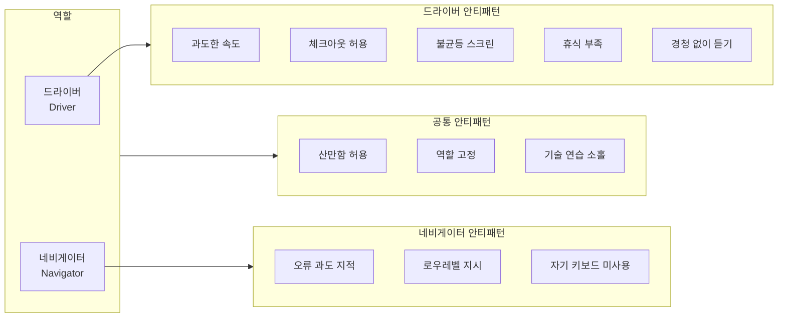

---
categories:
  - Programming
date: "2022-03-15T00:00:00Z"
lastmod: "2026-03-16"
description: "페어 프로그래밍에서 네비게이터와 드라이버가 흔히 저지르는 안티 패턴을 역할별로 정리하고, 로우레벨 지시·과도한 속도·체크아웃된 파트너 방치 등 구체적 사례와 개선 방법, 휴식·역할 전환·피드백 등 실전 팁을 소개합니다. 추천 대상·역할 구조 다이어그램·실무 체크리스트를 담았습니다."
header:
  teaser: /assets/images/undefined/ewsLyNGXWFsUNt6P.jpg
tags:
  - Implementation
  - 구현
  - Keyboard
  - 키보드
  - Career
  - 커리어
  - Best-Practices
  - Code-Review
  - 코드리뷰
  - Clean-Code
  - 클린코드
  - Documentation
  - 문서화
  - Education
  - 교육
  - Guide
  - 가이드
  - Tutorial
  - 튜토리얼
  - Review
  - 리뷰
  - Technology
  - 기술
  - Productivity
  - 생산성
  - Workflow
  - 워크플로우
  - Agile
  - 애자일
  - Scrum
  - TDD
  - Refactoring
  - 리팩토링
  - Testing
  - 테스트
  - Debugging
  - 디버깅
  - Design-Pattern
  - 디자인패턴
  - IDE
  - VSCode
  - Vim
  - Git
  - GitHub
  - Open-Source
  - 오픈소스
  - Innovation
  - 혁신
  - Troubleshooting
  - 트러블슈팅
  - Configuration
  - 설정
  - How-To
  - Tips
  - Comparison
  - 비교
  - Reference
  - 참고
  - Blog
  - 블로그
  - Web
  - 웹
  - Markdown
  - 마크다운
  - Migration
  - 마이그레이션
  - Hardware
  - 하드웨어
  - Software-Architecture
  - 소프트웨어아키텍처
  - Code-Quality
  - 코드품질
  - Pitfalls
  - 함정
  - Psychology
  - 심리학
  - Beginner
  - Case-Study
  - Readability
  - Maintainability
  - Interface
  - 인터페이스
  - Automation
  - 자동화
  - DevOps
  - Problem-Solving
  - 문제해결
title: "[Programming] 페어 프로그래밍 안티 패턴과 개선 방법"
---

## 개요

**페어 프로그래밍(Pair Programming)**은 애자일 개발 방법론의 하나로, 한 대의 개발 PC에서 두 명의 개발자가 함께 작업하는 협업 방식이다. **드라이버(Driver)**가 키보드를 잡고 실제 코드를 작성하고, **네비게이터(Navigator)**가 전략과 방향을 제시하며, 두 역할을 주기적으로 바꾸어 가며 진행한다. 지식 공유, 버그 조기 발견, 코드 품질 향상 등의 이점이 있지만, 잘못된 습관이 쌓이면 오히려 피로와 불만만 커질 수 있다. 이 글에서는 역할별로 흔히 나타나는 **안티 패턴**과 그 개선 방법, 실전에서 쓸 수 있는 팁을 정리한다.

**추천 대상**: 페어 프로그래밍을 처음 시도하는 개발자, 이미 하고 있지만 효율이 낮다고 느끼는 팀, 리모트/온사이트 페어링 환경을 개선하고 싶은 팀.

---

## 역할 구조와 안티 패턴 개요

페어 프로그래밍의 두 역할과, 각 역할·공통으로 나타나는 안티 패턴의 관계를 아래와 같이 구분할 수 있다.

---

## 네비게이터가 피해야 할 안티 패턴

### 1. 오류를 너무 빨리·자주 지적하기

드라이버가 문법 오류나 오타를 스스로 발견해 수정할 시간을 주지 않고, 작은 실수까지 즉시 짚어내면 **흐름이 끊기고** 상대는 시선과 판단을 의식하게 된다. 네비게이터의 임무는 "틀린 단어를 바로 고치는 것"이 아니라 **큰 그림(로직, 설계, 우선순위)**을 함께 보는 것이다.

**개선**: 사소한 오타·문법은 일정 시간 기다린 뒤, 그래도 수정되지 않으면 한꺼번에 짚어 주거나, "이 부분 한번 확인해 볼까요?"처럼 제안 형태로 말한다.

### 2. 로우레벨한 지시 하기

"그 다음에 세미콜론 치고, 엔터 두 번 하고…"처럼 **코드를 불러 주는 수준**, 심지어 키 입력 단위로 지시하면 드라이버는 생각할 여지가 없고, 네비게이터는 말만 바쁘게 되며 둘 다 피로해진다.

**개선**:
- 드라이버가 이해할 수 있는 **가장 높은 수준의 추상화**로 전달한다. 예: "여기서 예외를 잡아서 로그 남기고 재시도하는 흐름이 필요해 보여요."
- 말로 설명하기 어렵다면, **잠시 드라이브를 넘겨 받아** 직접 스케치한 뒤 다시 키보드를 넘긴다.
- "지금 생각한 걸 코드로 한번 옮겨 볼래요?"처럼 결과만 전달하고 구현은 드라이버에게 맡긴다.

### 3. 자신의 키보드를 사용하지 않는 것

한 사람의 키보드만 쓰면 역할을 바꿀 때마다 자리·장비가 바뀌고, "말로 설명하기 애매한 것"을 **타이핑으로 보여 주기**가 어렵다.

**개선**: 페어링 세션마다 **각자 자신의 키보드를 가져와** 시작 전에 연결해 둔다. 마우스도 있으면 좋고, 없어도 키보드만 있어도 역할 전환이 수월해진다.

---

## 드라이버가 피해야 할 안티 패턴

### 1. 너무 빨리 드라이빙하기

에디터와 단축키에 익숙한 드라이버는 **숙련된 네비게이터도 따라가기 어려운 속도**로 코드를 작성하기 쉽다. 상대가 따라오고 있는지 확인하지 않고 최고 속도로 조작하면, 네비게이터는 이해를 포기하고 "체크아웃" 상태가 된다.

**개선**:
- 페어가 따라오고 있다는 **확신이 없으면** 속도를 낮춘다.
- **하는 일을 입으로 말하면서** 입력한다. "이제 이 함수를 호출하는 쪽을 수정할게요."

### 2. 체크아웃된 네비게이터를 방치하기

너무 빨리 진행하거나, 네비게이터가 이해하지 못하는 작업을 계속하면 **주의가 흐트러진다**. 한쪽이 조용히 있으면 "이해하고 있는지" 확인해야 한다.

**개선**:
- 나쁜 질문: "이거 이해하는 거 맞죠?" (압박·부담)
- 좋은 질문: "**어떤 부분이 따라가기 어렵나요?**" (구체적 피드백 유도)
- 페어링은 **지속적인 쌍방 소통**이 전제다. 당신이나 네비게이터가 오래 조용하면, 멈추고 "지금까지 흐름 괜찮았어요?"처럼 체크인한다.

### 3. 동등하지 않은 스크린 접근

모니터가 한쪽에 치우쳐 있거나, 한 사람만 편한 각도로 보이면 **잠재적으로 불평등한 관계**가 느껴질 수 있다. 페어는 "하나의 단위"이고, 둘 중 누구도 더 우선되지 않아야 한다.

**개선**: 모니터를 **두 사람 사이 중앙**에 두고, 둘 다 같은 조건으로 보이는지 확인한다. 폰트 크기를 키우는 것도 도움이 된다.

### 4. 휴식하지 않는 것

페어링은 **일반적인 혼자 코딩보다 훨씬 더 소모적**이다. 집중과 대화를 동시에 하기 때문이다. 휴식 없이 길게 끌면 효율과 관계 모두 떨어진다.

**개선**:
- **뽀모도로 테크닉**을 활용해 작업/휴식 길이를 정한다.
- 세션 시작 전에 **선호하는 작업 구간 길이(예: 25분)와 휴식 길이(예: 5분)**를 맞춘다.
- 타이머로 역할 전환 시점을 알리면, 휴식과 역할 교대를 함께 가져갈 수 있다.

### 5. 경청하지 않고 듣기

타이핑을 하면서 동시에 말을 제대로 듣기 어렵다. 네비게이터가 제안할 때도 손이 키보드에 있으면 "반쯤만 듣고" 진행하게 되기 쉽다.

**개선**: 네비게이터가 **제안이나 설명을 할 때는 키보드에서 손을 뗀다**. 더 나아가 몸을 돌려 **아이컨택**을 하면, 상대는 "진심으로 듣고 있다"고 느끼고 소통 품질이 올라간다.

---

## 둘 다 피해야 할 안티 패턴

### 1. 비생산적인 산만함을 허용하는 것

알림, 메시지, 이메일이 켜져 있으면 **집중이 깨진다**. 페어링 시간은 "우리 둘만의 시간"으로 정하고, 외부 인터럽트를 최소화하는 것이 좋다.

**개선**:
- 페어링 **시작 전**에 컴퓨터·휴대폰 **알림을 모두 끈다**.
- 세션 중 알림/문자를 받으면 사과하고, 그다음에는 다시 안 울리게 설정한다.
- 다른 모니터에 이메일·메신저를 **열어 두지 않는다**.
- (페어링이 아닐 때도 인터럽트를 줄이는 것은 생산성을 높이는 가장 빠른 방법 중 하나다.)

### 2. 역할을 바꾸지 않는 것

드라이빙과 네비게이션은 **서로 다른 종류의 피로**를 준다. 한 역할만 계속하면 그쪽 뇌·집중이 빨리 소진된다. 역할을 바꾸면 "쉬던 부분을 쓰고, 쓰던 부분을 쉬게" 할 수 있다.

**개선**:
- **주기적으로 드라이버를 교체**한다. 예: 25분마다, 또는 한 작업 단위가 끝날 때마다.
- "이번 구간 끝나면 키보드 바꿀게요"처럼 **전환 시점을 미리 말**해 두면 자연스럽다.
- **타이머**를 걸어 두고, 알람이 울리면 역할을 바꾸도록 습관화한다.

### 3. 페어 프로그래밍을 "기술"로 연습하지 않는 것

페어 프로그래밍은 **배워야 하는 기술**이다. 처음에는 잘하기 어렵고, 숙련된 개발자라도 **연습 없이** 좋은 파트너가 되기 어렵다. 어려운 첫 경험 후 포기하거나, "우리끼리는 안 맞아"로 끝내기 전에, **방법을 바꿔 가며 연습**할 가치가 있다.

**개선**:
- 각 세션 **후에** 페어와 짧게 **피드백**을 나눈다. "오늘 어떤 점이 좋았고, 어떤 점이 따라가기 어려웠나요?"
- "다음엔 어떻게 하면 더 잘할 수 있을까?"를 한두 가지만 정해 다음 세션에 반영한다.
- 연습 없이 잘되기를 기대하지 말고, **지속적으로 개선**하는 습관을 들인다.

---

## 실전 팁 요약

| 구분 | 피할 것 | 할 것 |
|------|--------|--------|
| **네비게이터** | 사소한 오류 즉시 지적, 키 입력 수준 지시, 키보드 없이 참여 | 높은 수준으로 제안, 필요 시 잠시 드라이브해서 스케치, 자기 키보드 사용 |
| **드라이버** | 최고 속도로만 진행, 조용한 파트너 방치, 한쪽에 치우친 모니터, 휴식 생략, 말할 때도 타이핑 | 말하면서 코딩, "어디가 어려웠나요?" 체크인, 중앙 배치·폰트 확대, 뽀모도로·역할 전환 타이머, 말할 때 손 떼기·아이컨택 |
| **공통** | 알림 켜두기, 한 역할 고정, "연습 없이 잘될 거" 기대 | 알림 차단, 주기적 역할 전환, 세션 후 피드백·다음 개선점 정하기 |

---

## 마치며

페어 프로그래밍 안티 패턴은 **한쪽만의 문제가 아니라 역할과 환경이 함께 만든다**. 네비게이터는 "큰 그림과 추상화"를, 드라이버는 "속도 조절과 경청"을, 둘 다 "역할 전환·휴식·집중 환경·피드백"을 의식하면, 단순히 버그를 줄이는 것을 넘어 **서로 배우고 설계 품질을 높이는** 협업으로 발전시킬 수 있다. 이 글의 내용을 체크리스트처럼 세션 전·중·후에 돌아보며, 팀에 맞게 조금씩 조정해 보길 권한다.
