---
categories:
  - CSS
date: "2022-03-16T00:00:00Z"
lastmod: "2026-03-16"
description: "CSS의 탄생(1996)과 서식·컨텐츠 분리 의도부터 시멘틱 웹, BEM, Flexbox, CSS Modules·CSS in JS, Tailwind·Atomic CSS에 이르기까지, 문서에서 웹 앱으로 전환되며 복잡해진 CSS의 역사와 방법론·스펙·도구의 흐름을 상세히 정리하고, IE11 퇴장 이후의 최신 스펙과 프론트엔드 CSS 선택 가이드를 제시한다."
draft: false
tags:
  - CSS
  - HTML
  - JavaScript
  - Web
  - 웹
  - Frontend
  - 프론트엔드
  - History
  - 역사
  - Technology
  - 기술
  - Tutorial
  - 튜토리얼
  - Guide
  - 가이드
  - Reference
  - 참고
  - Best-Practices
  - Review
  - 리뷰
  - Blog
  - 블로그
  - Documentation
  - 문서화
  - Open-Source
  - 오픈소스
  - Innovation
  - 혁신
  - Troubleshooting
  - 트러블슈팅
  - Configuration
  - 설정
  - How-To
  - Tips
  - Comparison
  - 비교
  - Career
  - 커리어
  - Education
  - 교육
  - Workflow
  - 워크플로우
  - Migration
  - 마이그레이션
  - Performance
  - 성능
  - Design-Pattern
  - 디자인패턴
  - React
  - Vue
  - Angular
  - Node.js
  - Clean-Code
  - 클린코드
  - Refactoring
  - 리팩토링
  - Maintainability
  - Modularity
  - Software-Architecture
  - 소프트웨어아키텍처
  - Git
  - GitHub
  - IDE
  - VSCode
  - Backend
  - 백엔드
  - API
  - JSON
  - Security
  - 보안
  - Caching
  - 캐싱
  - SEO
  - Scalability
  - 확장성
  - Async
  - 비동기
  - Deployment
  - 배포
  - Automation
  - 자동화
  - DevOps
  - Agile
  - 애자일
  - Networking
  - 네트워킹
  - Culture
  - 문화
  - Science
  - 과학
  - Markdown
  - 마크다운
  - Internet
  - 인터넷
  - Beginner
  - Advanced
  - Case-Study
  - Deep-Dive
  - 실습
  - Productivity
  - 생산성
  - Cloud
  - 클라우드
  - Mobile
  - 모바일
title: "[CSS] CSS 역사로 알아보는 CSS가 어려워진 이유"
---

> **원문**: [CSS 역사로 알아보는 CSS가 어려워진 이유](https://velog.io/@teo/css-history-1) (velog, 테오)

## 개요

이 글은 **CSS의 탄생과 발전 과정**을 따라가며, CSS가 왜 복잡해졌는지와 그 시대적 배경, 다양한 CSS 방법론·기술의 진화, 그리고 오늘날 많이 쓰이는 CSS in JS·Atomic CSS 등의 현대적 흐름까지 정리한다. 규모가 커진 CSS를 안정적으로 다루기 어렵게 만든 구조적 한계와, 이를 보완하기 위해 등장한 스펙·도구를 이해하는 데 목적이 있다.

**추천 대상**: 프론트엔드 개발자, 웹 퍼블리셔, CSS를 체계적으로 정리하고 싶은 학습자. CSS는 배우기 어렵지 않지만 “이렇게 쓰는 게 맞는가?”라는 의문이 드는 경우, 역사와 맥락을 알면 과거 자료와 최신 트렌드를 구분하고 상황에 맞는 도구를 고르는 데 도움이 된다.

---

## CSS가 어려워진 이유

### 프롤로그

CSS는 **문서에서 서식과 컨텐츠를 분리**하기 위해 만들어졌다. 초기에는 문서와 서식을 잘 나누어 같은 컨텐츠에 다양한 서식을 적용하는 방향으로 발전했지만, 웹이 **문서를 넘어 서비스·애플리케이션**으로 확장되면서 CSS에도 여러 요구가 쌓였고, 그 과정에서 시행착오와 우회 방식이 난립했다. 그런 방식들이 팁에서 출발해 “정석”처럼 재생산되면서, 무엇이 좋은 CSS인지 판단하기 어려워졌다.

### 두 가지 어려움

1. **구조적 한계**  
   문서를 꾸미기 위해 설계된 CSS는, “문서를 꾸미는 방법으로 앱을 만드는” 과도기를 겪었다. 그래서 대형 서비스를 CSS만으로 안정적으로 유지하기 어렵고, 그 부족함을 메우기 위해 PostCSS, CSS Modules, CSS in JS, Atomic CSS 같은 **도구와 패러다임이 계속 늘어났다**.

2. **선택의 어려움**  
   새 스펙·도구가 나와도 브라우저 지원과 시점 때문에 당장 쓰기 어렵고, 기존 방식만 고수하면 레거시가 된다. **언제 무엇으로 갈아탈지**, 어떤 기능이 어떤 맥락에서 나왔는지 꾸준히 보고 학습해, 적당한 시기에 더 나은 방법으로 업데이트해야 한다.

### 나만의 Best Practice를 꾸준히 만들자

웹 산업은 분야마다 요구가 다르므로 하나의 기술이 정답이 아니다. CSS도 상황(홈페이지 vs 솔루션, 백엔드 vs 프론트엔드)에 따라 좋은 방법이 달라진다. **깊은 이해보다 숙달과 연습**이 중요하고, 반복하면서 자기만의 루틴을 갖고, 도구와 스펙을 주기적으로 점검하는 것이 낡은 개발자가 되지 않는 길이다. IE11 퇴출 이후 CSS 스펙과 도구가 다시 활발히 움직이고 있으므로, 역사를 알아두면 새 스펙·도구가 나왔을 때도 맥락을 이해하는 데 도움이 된다.

---

## CSS 역사 타임라인

아래 다이어그램은 CSS와 관련 스펙·도구·패러다임의 대략적인 흐름을 한눈에 보여 준다.

```mermaid
flowchart LR
  subgraph docEra["문서 시대"]
    nodeA["HTML 1990"]
    nodeB["inline-style</br>문제점"]
    nodeC["CSS1 1996</br>Selector Ruleset"]
    nodeD["Cascade</br>Specificity"]
  end
  subgraph solutionEra["솔루션 시멘틱"]
    nodeE["Zen Garden 2003</br>시멘틱 웹"]
    nodeF["Sass 2006</br>Pre-processor"]
    nodeG["jQuery Ajax 2008</br>프론트엔드 탄생"]
  end
  subgraph appEra["웹 앱 컴포넌트"]
    nodeH["React 2013</br>컴포넌트"]
    nodeI["BEM 2013</br>방법론"]
    nodeJ["Flexbox 2013</br>레이아웃 스펙"]
    nodeK["IE11 정체 2015</br>방파제"]
  end
  subgraph modernEra["현대 JS 보완 Atomic"]
    nodeL["CSS Modules 2015</br>Scope"]
    nodeM["CSS-in-JS 2016</br>Styled-Components"]
    nodeN["Tailwind 2017</br>Utility-First"]
    nodeO["Grid Variables 2017</br>신 스펙"]
    nodeP["IE11 퇴장 2020</br>Grid 변수 부상"]
    nodeQ["On-demand Atomic</br>UnoCSS 등"]
  end
  nodeA --> nodeB
  nodeB --> nodeC
  nodeC --> nodeD
  nodeD --> nodeE
  nodeE --> nodeF
  nodeF --> nodeG
  nodeG --> nodeH
  nodeH --> nodeI
  nodeH --> nodeJ
  nodeJ --> nodeK
  nodeK --> nodeL
  nodeL --> nodeM
  nodeM --> nodeN
  nodeN --> nodeO
  nodeO --> nodeP
  nodeP --> nodeQ
```

---

## 시대별 흐름 요약

### 문서와 서식의 분리 (1990년대)

- **HTML(1990)**: 하이퍼텍스트 문서 공유를 위해 만들어졌고, 미리 정의된 태그로 서식을 입혔다. 커스텀 서식을 위해 **inline-style**이 쓰였으나, 같은 서식을 여러 곳에 반복하고 수정할 때 유지보수가 어려웠다.
- **CSS 탄생(1996)**: 스타일을 HTML에서 분리해, **선택자(selector)** 로 원하는 요소를 골라 **선언(declarations)** 을 일괄 적용하는 방식이 표준화되었다. 선택자와 선언을 합쳐 **Ruleset**이라 부른다.
- **Cascade와 Specificity**: 여러 Ruleset이 겹칠 때 “어떤 서식을 우선할지” 규칙이 필요해졌다. **Cascade**는 단순한 것을 먼저, 구체적인 것을 나중에 덧칠하는 방식이고, **Specificity(명시도)** 는 선택자마다 부여된 우선순위다. 순서가 아니라 명시도로 적용 순서가 정해지도록 설계되었으나, 나중에 “덮으려면 더 복잡한 선택자나 `!important`를 써야 하는” **Specificity 전쟁**을 낳았다.

### 솔루션·시멘틱 웹 (2000년대)

- **게시판·쇼핑몰 보편화**: HTML 작성 주체가 백엔드가 되면서, **HTML을 건드리지 않고 CSS만으로 디자인을 커스터마이즈**해야 하는 요구가 커졌다.
- **CSS Zen Garden(2003)**: 같은 시멘틱 HTML에 서로 다른 CSS를 입혀 전혀 다른 디자인을 보여 주는 사이트가 등장했다. 시멘틱 웹과 CSS 기초를 익히는 참고 자료로 여전히 유효하다. 다만 “하나의 HTML에 여러 테마” 방식은 현대의 컴포넌트 기반 서비스와는 맞지 않는다.
- **Selector 복잡화**: HTML을 수정할 수 없는 환경에서 원하는 디자인을 만들려면 정교한 선택자가 필요했고, 선택자가 복잡해질수록 Specificity가 올라가 덮어쓰기 위해 더 복잡한 선택자나 `!important`가 난무하는 부작용이 생겼다.
- **Sass(2006)**: 중첩 선택자와 변수 등으로 CSS를 확장하는 **Pre-processor**가 등장했다. Less(2009), Stylus(2010) 등이 뒤를 이었고, Sass가 점유율 1위를 유지했다. CSS 구조상 진정한 재사용은 한계가 있었고, 나중에 Atomic CSS 등에서 재사용 접근이 달라진다.

### 시멘틱과 HTML5·CSS3

- **시멘틱**: “어떻게 보일지”가 아니라 **의미**에 초점을 두는 것이 중요해졌다. 클래스 이름도 `.error`처럼 의미를 담는 쪽이 `.red`, `.#f00`보다 유지보수에 유리하다. HTML을 수정할 수 없을 때 특히 그렇다.
- **jQuery·Ajax(2008)**: 백엔드는 JSON을 만들고, HTML·CSS·데이터 연동은 **프론트엔드(JS)** 가 담당하는 구조로 바뀌었다. HTML 편집권이 프론트엔드로 넘어오면서, 복잡한 선택자보다 **class 추가 등 HTML 수정으로 단순한 선택자**를 쓰는 쪽으로 흐름이 바뀌었다.

### 웹 애플리케이션과 컴포넌트 (2010년대 초반)

- **React 등 프레임워크(2013)**: 페이지 단위 문서가 아니라 **컴포넌트 단위** 개발이 자리 잡았다. 그런데 CSS는 **전역 스코프**와 **Specificity** 때문에 컴포넌트와 스타일의 범위가 맞지 않았고, “문서용 스펙으로 앱을 꾸미는” 한계가 뚜렷해졌다. “엘리먼트 가운데 정렬 7가지 방법” 같은 주제가 유행한 것도 그 과도기를 반영한다.
- **CSS 방법론과 BEM(2013)**: 이름 짓기 컨벤션, Specificity 관리, 팀 협업을 위한 아키텍처를 목표로 OOCSS, SMACSS, ITCSS 등이 논의되었고, **BEM(Block__Element--Modifier)** 이 널리 쓰이는 방법론으로 자리 잡았다. class만 사용하고 네이밍 규칙으로 구조를 표현하며 Specificity를 하나로 맞추는 방식이다.
- **Flexbox(2013)**: float·table·absolute·margin으로 레이아웃을 만들던 시대를 넘어, **애플리케이션 레이아웃용 스펙**이 표준으로 자리 잡았다. 오늘날 웹 레이아웃의 기본은 Flexbox다.
- **Handoff 도구(Zeplin 2014 등)**: 디자이너와 개발자 역할이 나뉘면서, “디자인을 CSS로 잘 구현하는 것”보다 “디자인을 flexbox 등으로 구조화·컴포넌트화하는 것”이 더 중요해졌다.
- **IE11 정체(2015)**: IE11이 비공식적으로 업데이트가 중단되면서, 새 CSS 스펙을 써도 IE11에서 지원하지 않아 사용을 꺼리게 되었고, **CSS의 신문물을 막는 방파제** 역할을 했다. 그 결과 CSS 스펙으로 해결하기보다 **JS로 CSS 부족함을 메우는** 시도(CSS Modules, CSS in JS 등)가 활발해졌다.

### JS로 CSS 보완 (2015년~)

- **CSS Modules(2015)**: 컴포넌트에서 CSS를 불러오면 **해당 컴포넌트에만 적용되도록** 컴파일해 주는 도구다. **Global Scope** 문제를 JS 빌드 단계에서 완화했다. CSS Modules를 쓰면 BEM 같은 방법론 의존도가 줄어든다.
- **CSS in JS(Styled-Components 2016 등)**: Selector 대신 **컴포넌트에 Property·Value를 붙이는** 방식으로, Specificity·전역 네임스페이스·Dead Code 제거·의존성 관리 등 CSS 구조적 한계를 JS 영역에서 해결하려는 접근이다. 런타임 비용을 줄이기 위한 Zero-Runtime·Near-Zero 같은 개념도 등장했다.
- **Tailwind CSS(2017)·Utility-First**: “지금까지의 CSS는 틀렸다”는 식으로 **Utility-First(Atomic)** 방식을 전면에 내세운 프레임워크가 등장했다. 시멘틱이 중요하던 시절에는 `.mt10` 같은 클래스가 안티패턴으로 취급되기도 했으나, 하나의 디자인 시스템·컴포넌트 기반 개발이 일반화된 환경에서는 클래스 이름을 짓지 않아도 되고, Specificity가 동일한 유틸 클래스로 관리할 수 있다는 장점이 부각되었다. 워드프레스처럼 HTML이 고정된 테마 환경에는 맞지 않지만, 프론트엔드가 마크업을 통제하는 프로젝트에서는 널리 쓰인다.
- **CSS Variables·Grid Layout(2017)**: 변수는 Sass 등 Pre-processor의 동기 중 하나였고, IE11을 제외한 브라우저에서 **CSS 변수**가 표준으로 쓰이기 시작했다. **Grid Layout**도 표준으로 나왔으나 IE11과 스펙 차이 때문에 초기에는 활용이 제한적이었다.

### IE11 퇴장 이후 (2020년~)

- **IE11 공식 지원 종료(2020)**: MS가 IE11 지원 종료를 발표하면서, 2015년 이후 묶여 있던 **5년치 CSS 스펙**을 본격적으로 쓸 수 있게 되었다. Grid Layout 사용 비율도 크게 올라갔다.
- **Figma 등 디자인 툴**: Zeplin을 넘어 Figma가 디자인·핸드오프의 표준에 가까워지면서, 개발자도 Figma의 CSS Inspect 등과 함께 협업하는 흐름이 일반화되었다.
- **On-demand Atomic CSS**: 미리 정의된 유틸만 쓰는 방식의 한계(수치·색상 조합 등)를 넘어, **필요한 조합을 입력하면 그에 맞는 CSS를 생성하는** On-demand Atomic CSS(UnoCSS 등)가 성장했다. Tailwind 계열도 비슷한 방향으로 진화하고 있다.

---

## 방법론·스펙·도구 정리

| 구분 | 대표 사례 | 요약 |
|------|-----------|------|
| **언어·스펙** | CSS1(1996), CSS3, Flexbox(2013), Grid·Variables(2017) | 문서용에서 앱 레이아웃·변수·레이어까지 확장 |
| **Pre-processor** | Sass(2006), Less, Stylus | 중첩·변수로 CSS 확장, 재사용은 구조적 한계 |
| **방법론** | OOCSS, SMACSS, ITCSS, **BEM**(2013) | 네이밍·Specificity·아키텍처, BEM이 실무 표준에 가까움 |
| **JS 기반** | PostCSS, Autoprefixer, **CSS Modules**(2015), **CSS in JS**(2016~) | 스코프·Specificity·번들과 결합 |
| **Utility·Atomic** | **Tailwind**(2017), On-demand Atomic(UnoCSS 등) | 클래스 이름 부담 감소, 동일 Specificity·번들 최적화 |

---

## 현재 트렌드와 정리

- **CSS in JS**와 **Atomic CSS(Utility-First·On-demand)** 가 두 갈래로, 프레임워크·번들러와 함께 진화하고 있다.
- IE11 퇴장으로 **Grid Layout**, **CSS Variables**, **Cascade Layers** 등 최신 스펙 사용이 늘었다.
- 시멘틱·BEM은 여전히 유효하지만, 컴포넌트·디자인 시스템 중심 개발에서는 CSS만으로의 구조 한계를 느끼고 JS·Atomic으로 보완하는 흐름이 지배적이다.

**한 줄 요약**: CSS는 문서용으로 설계되었고, 웹이 앱으로 커지면서 구조적 한계가 드러났다. 그 한계를 메우기 위해 방법론(BEM), Pre-processor(Sass), JS 기반(CSS Modules, CSS in JS), Atomic(Tailwind, On-demand)이 순차적으로 등장했으며, 오늘날은 프로젝트 성격에 맞게 이 도구들을 조합해 “나만의 Best Practice”를 꾸준히 갱신하는 것이 중요하다.

---

## 요약 (체크리스트)

- CSS는 **문서에서 서식과 컨텐츠를 분리**하기 위해 만들어졌다.
- **솔루션(백엔드가 HTML 제공)** 기반으로 CSS만 커스터마이즈하는 요구가 커지면서 **시멘틱 웹·복잡한 Selector**로 진화했다.
- CSS 규모는 커졌지만 스펙 발전이 늦어 **Sass 등 문법 확장** 방향으로 발전했다.
- **백엔드는 데이터(JSON), 프론트엔드는 HTML·CSS·연동** 담당으로 분리되며 웹 앱 방식이 정착했다.
- **문서용 스펙으로 앱을 만드는 과도기**를 겪었고, **Flexbox** 등 앱용 레이아웃 스펙이 활성화되었다.
- **컴포넌트 기반 프레임워크** 보편화로 CSS의 **전역 스코프·Specificity** 문제가 두드러졌다.
- Selector는 **단순화** 방향으로 진화하고, **컴포넌트에 맞는 CSS 설계**가 주요 아젠다가 되었다.
- **BEM**이 방법론의 승자로 남았으나, 구조 한계를 느끼고 **PostCSS, CSS Modules, CSS in JS**로 보완하는 흐름이 이어졌다.
- **Utility-First(Tailwind)** 가 CSS 쪽에서의 대안으로 부상했다.
- **IE11** 방파제가 무너지며 **Grid, CSS Variables** 등 신 스펙 사용이 늘었다.
- 현재는 **CSS in JS**와 **Atomic CSS** 두 갈래로 프레임워크·번들 생태계와 함께 진화 중이다.

---

## 참고 문헌

1. [Cascading Style Sheets, level 1 (W3C Recommendation)](https://www.w3.org/TR/REC-CSS1/) — CSS1 스펙 (1996).
2. [BEM — Introduction](https://getbem.com/introduction/) — BEM 방법론 소개.
3. [Tailwind CSS](https://tailwindcss.com/) — Utility-first CSS 프레임워크.
4. [CSS 역사로 알아보는 CSS가 어려워진 이유](https://velog.io/@teo/css-history-1) — 본문 원문 (velog, 테오).
5. [Frontend Evolution (ManzDev)](https://github.com/ManzDev/frontend-evolution) — 프론트엔드·CSS 생태계 연대기 참고.
