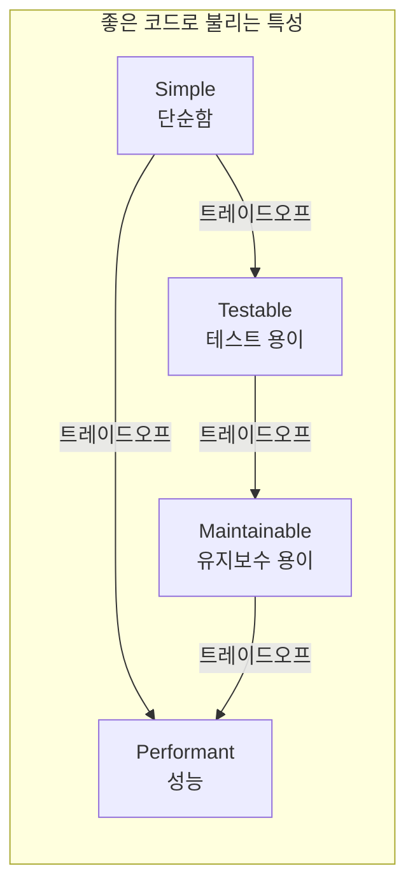

## 도입: 왜 '클린 코드'를 다시 보는가

지금은 누구나 클린 코드를 위해 노력하는 것처럼 보인다. 하지만 **어떻게** 클린한 코드에 다가가는지 설명하는 글은 찾기 힘들다. 개발자들은 어떤 것이 더 클린한지 모여서 토론하고, 다른 개발자들은 클린 코드를 연습하고 있다고 확신한다. 이 글은 [There's No Such Thing as Clean Code](https://www.steveonstuff.com/2022/01/27/no-such-thing-as-clean-code)(Steve Barnegren, 2022)를 번역·요약하고, 비판적 관점을 보강한 것이다.

결론부터 말하면, **클린 코드와 같은 것은 없다**고 보는 편이 기술적 논의에 유리하다. **클린(clean)**이란 단어로는 유용함을 측정할 수 없다. 클린은 코드를 설명하지 않기 때문에, 코드는 '클린하다'고 말하는 것만으로는 어떤 특성도 전달되지 않는다.

> 나도 물론 위선자이다. 나 자신도 결백하지 않다. 과거에 '클린'이라는 단어를 많이 사용했었다. '클린'을 사용하는 사람을 얕보지 않는다는 것도 분명히 하고 싶다. 마케팅이나 비전을 설명할 때 '클린'은 훌륭한 선택이다. 그러나 **기술적인 관점**에서는 몇 가지 문제를 일으킨다.

아래에서는 (1) 클린 코드 담론이 놓치기 쉬운 점, (2) 좋은 코드 특성 간 **트레이드오프**, (3) **구체적 용어** 사용의 필요성, (4) 결론 및 참고 문헌을 다룬다.

---

## 클린 코드는 정말 좋은 것인가?

사람들이 코드를 **클린하다**고 말할 때는, 사실 일부 코드가 **어떤 의미에서 좋다**는 뜻으로 쓰는 경우가 많다. 코드는 여러 이유로 좋을 수 있다. 예를 들면 다음과 같은 특성이다.

- **Readable**(가독성), **Understandable**(이해 가능), **Simple**(단순)
- **Performant**(성능), **Safe**(안전), **Elegant**(우아)
- **Testable**(테스트 가능), **Encapsulated**(캡슐화), **Scalable**(확장 가능)
- **Maintainable**(유지보수 가능), **Reusable**(재사용 가능), **Easy to delete**(삭제하기 쉬움)
- **Neat and tidy**(단정하고 깔끔), **Noninvasive**(비침습적), **Systematic**(체계적), **Consistent**(일관된)

그러나 이런 특성들은 서로 **동시에 극대화하기 어렵다**. 가장 단순한 코드가 가장 테스트하기 쉬운 것은 아니다. 인터페이스와 의존성 주입(Dependency Injection)은 테스트를 편하게 만들지만, 코드 구조는 단순함과는 거리가 생긴다. Singleton에 대한 과한 의존은 이해는 쉽게 할 수 있지만, 애플리케이션의 **유지보수성**에는 도움이 되지 못할 수 있다.

일부 특성은 이론적으로 **상충하는 성향**을 가지고 있어, 동시에 모두 만족시킬 수 없다. 공학은 **트레이드오프**의 문제이므로, 어떤 장단점이 있는지 알고 팀원과 논의할 필요가 있다.

아래 다이어그램은 '좋은 코드'로 불리는 특성들 사이의 긴장 관계를 개념적으로 나타낸 것이다. 한쪽을 추구하면 다른 쪽이 희생되는 경우가 많다는 점을 보여 준다.

정리하면, **클린하다 = 좋다**라고 말하는 것만으로는 어떤 특성을 우선시하는지, 어떤 비용을 감수하는지 전혀 전달되지 않는다.

---

## 코드가 왜 좋은지 설명할 수 있어야 한다

누군가 솔루션이 **클린하다**고 말할 때, 그 이유를 합리화하지 못하고 "그냥 더 나은 선택이다"라고만 하는 경우가 있다. 기술적 솔루션에 대해 **의미 있는 토론**을 하려면, 다른 솔루션 대비 **좋은 점을 명확히 설명**할 수 있어야 한다. 단순히 "클린하다"고 주장하는 것은, 마치 신비한 **clean-o-meter**로 각 솔루션을 재는 것과 같다.

어떤 접근이 다른 접근보다 더 좋거나 나쁜 **이유를 표현하는 것**은 실제로 상당히 어렵지만, 갈고닦을 가치가 있는 기술이다. 다음 두 가지 중 어떤 논의가 더 유용한지 비교해 보자.

| 방식 | 예시 | 평가 |
|------|------|------|
| 모호한 표현 | "솔루션 X가 더 클린해 보이기 때문에 좋다." | 이유가 전달되지 않음. |
| 구체적 표현 | "솔루션 X는 코어 로직과 에러 메시지 표현을 디커플링해서, 두 가지를 동시에 생각하지 않아도 되어 이해하기 쉽다. 목(mock)을 쓸 수 있어 테스트도 쉽다. 부모 객체에 의존성을 주입해야 하는 비용은 있지만, 테스트 용이성을 위한 트레이드오프로 감수할 만하다." | 장단점과 트레이드오프가 명확함. |

**트레이드오프**를 말할 때는 솔루션의 장단점이 명확히 전달된다. **클린**이라는 단어는 아이디어를 명확히 하기보다, 아이디어를 **대체하는 변명**이 되기 쉽다.

---

## 확실한 용어를 사용해야 한다

일반적으로 코딩은 **팀 단위**로 진행된다. 원하는 것을 위해 혼자 해킹할 수도 있겠지만, 보통은 공통의 아이디어를 논의하는 팀에서 일한다. 특정 **언어**를 사용해 기술 솔루션에 대해 토론하고, 팀 전체가 공통으로 이해하는 것은 서로를 이해하는 데 매우 중요하다.

**클린 코드**는 사람마다 **다른 의미**로 받아들여진다. 어떤 사람에게는 "구조적으로 잘 정의된 것"이 클린 코드이고, 다른 사람에게는 "포맷팅이 잘 되어 있고 심플한 코드"가 클린 코드일 수 있다.

반면 **캡슐화(encapsulated)**, **테스트 용이성(testable)**, **목 생성 용이성(mockable)**, **재사용성(reusable)** 같은 용어는 팀이 **공통으로 합의**할 수 있는 의미를 가진다. 프로젝트에 영향을 미치는 코드의 특성을 이런 **명확한 단어**로 설명할 때, 팀원들은 같은 이해를 공유할 수 있다.

**클린**은 **좋다**와 비슷한 수준의 단어다. "이 코드는 클린하다"라고 말하는 것과 "이 코드는 좋다"라고 말하는 것은 정보량이 거의 같다. 그렇다고 해서 구체적인 근거로 정당화해야 할 의무가 사라지는 것은 아니다.

---

## 그렇다면 클린 코드는 무엇인가?

결론적으로, **모든 면에서 확실한 것은 아니지만** "코드가 클린해 보일 때" 사람들은 클린 코드라고 부른다. 단지 솔루션이 **올바른 것처럼 보이는** 경우와 비슷하다. 때로는 코드가 왜 좋은지 **알고 있지만**, 명확하게 **말로 설명하지 못할** 때가 있다.

직관적으로 아는 감각을 키우는 것은 좋다. 하지만 그에 머무르지 말고, **더 파고 들어서** "왜 이 코드를 좋다고 생각하는지"를 명확히 표현할 수 있어야 한다. 다른 솔루션 대비 어떤 **장단점**이 있는지, 프로젝트에 **가장 적합한 특성**인지 살펴야 하고, 결국에는 지금 선택이 올바른 해결책이 아닐 수도 있다.

희망적으로 말하면, 프로젝트에 **클린 코드**가 꼭 필요한 것은 아닐 수 있다. 프로젝트에 필요한 **____ 코드**를 찾는 것이 중요하다. 그 빈칸을 채우는 것은, 가독성·테스트 용이성·성능·유지보수성·단순함 등 **구체적인 특성**을 고민하는 일이다.

---

## 핵심 요약

| 항목 | 내용 |
|------|------|
| 클린의 한계 | '클린'은 측정 가능한 특성이 아니며, 기술적 논의에서 정보를 거의 전달하지 않는다. |
| 좋은 코드 특성 | 가독성, 테스트 용이성, 유지보수성, 단순함 등은 서로 트레이드오프 관계에 있을 수 있다. |
| 논의 방식 | "클린하다" 대신 **왜** 좋은지, 어떤 **트레이드오프**를 감수하는지 구체적으로 말하는 것이 좋다. |
| 용어 | 팀이 공통으로 이해할 수 있는 **캡슐화, 테스트 용이성, mockable, 재사용성** 등 구체적 용어를 사용하자. |
| 목표 | 프로젝트에 필요한 **특성**을 채운 코드를 고민하는 것이 중요하다. |

---

## 참고 문헌

1. **Steve Barnegren**, [There's No Such Thing as Clean Code](https://www.steveonstuff.com/2022/01/27/no-such-thing-as-clean-code) (2022). — 본문의 주요 번역·요약 원천.
2. **Robert C. Martin**, [What Is Clean Code?](https://www.informit.com/articles/article.aspx?p=1235624&seqNum=3), InformIT. — *Clean Code: A Handbook of Agile Software Craftsmanship* 1장 발췌. 클린 코드에 대한 다양한 정의와 "코드 감각(code-sense)" 논의.
3. **O'Reilly**, [Clean Code: A Handbook of Agile Software Craftsmanship, 2nd Edition](https://www.oreilly.com/library/view/clean-code-a/9780135398586/). — Uncle Bob의 클린 코드 저서 개요 및 목차.
