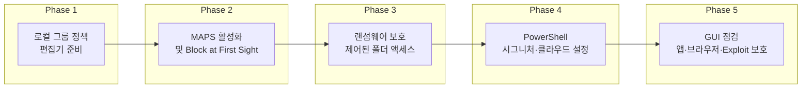

> **원문**: [Windows Defender is enough, if you harden it](https://0ut3r.space/2022/03/06/windows-defender/) (0ut3r.space, 2022)

---

## 도입: 왜 Windows Defender 강화인가

비싼 상용 안티바이러스를 반드시 써야 할 필요는 없다. 일반 사용자가 웹 서핑·업무·개인 문서 보관 정도라면, **Windows에 기본 포함된 Microsoft Defender(구 Windows Defender)**만으로도 충분한 수준의 보호가 가능하다. 다만 기본 설정 그대로 두기보다는, **로컬 그룹 정책·MAPS·랜섬웨어 보호·PowerShell**을 이용해 몇 가지를 켜 두는 것이 좋다. 이 글은 추가 프로그램 없이 Defender만으로 PC를 안전하게 쓰고 싶은 독자를 위한 실전 설정 가이드다.

어떤 안티바이러스도 “완벽”하지는 않다. 사용자가 링크를 함부로 열거나, 출처 불명 파일을 실행하면 유료 솔루션도 뚫릴 수 있다. 그럼에도 백그라운드에서 **실시간 검사·정의 업데이트·클라우드 연동**이 돌아가야, 실수 한 번에 전체가 위험해지는 상황을 줄일 수 있다. Microsoft Defender는 Windows 계정·앱 및 브라우저 제어·방화벽·네트워크 보호까지 한 묶음으로 제공하며, [AV-Comparatives](https://www.av-comparatives.org/vendors/microsoft/), [AV-Test](https://www.av-test.org/en/antivirus/home-windows/) 같은 독립 테스트에서도 최근에는 상위권을 유지한다. 정리하면, **설정만 잘 한다면 추가 안티바이러스 없이 Defender만으로도 충분하다**는 전제 아래, “어떻게 설정할지”에 초점을 맞춘다.

---

## 정의·원칙: Defender와 MAPS

**Microsoft Defender Antivirus**(과거 이름: Windows Defender)는 Windows 10/11에 기본 포함된 **실시간 맬웨어·스파이웨어 방어** 솔루션이다. 계정 보호, 앱 및 브라우저 제어, 방화벽, 네트워크 보호가 하나의 “Windows 보안” 인터페이스에 통합되어 있다. GUI에 노출된 옵션은 많지 않지만, **로컬 그룹 정책**과 **PowerShell**로 노출되지 않은 기능까지 조정할 수 있다.

**MAPS**(Microsoft Advanced Protection Service)는 Defender의 **클라우드 기반 보호**다. 의심스러운 파일 정보를 Microsoft에 보내고, 전 세계 샘플 기반으로 더 빠르게 위협을 판별·차단한다. MAPS를 켜면 **Block at First Sight**, 확장 클라우드 검사(Extended Cloud Check) 등과 함께 동작해, 로컬 정의만으로는 알 수 없는 신규 악성코드에 대한 대응이 빨라진다. 따라서 “Defender 강화”의 핵심은 **MAPS 활성화 + 클라우드 검사 수준·타임아웃 조정 + 랜섬웨어 보호 + 정의 업데이트 주기**라고 보면 된다.

---

## Defender 강화 흐름 한눈에 보기

아래 다이어그램은 이 글에서 다루는 **Defender 강화 단계**를 순서대로 보여 준다. 로컬 정책·GUI·PowerShell을 조합해 적용하면 된다.



---

## 로컬 그룹 정책 설정

Defender의 고급 옵션 상당수는 **로컬 그룹 정책**(Local Group Policy)으로만 켤 수 있다. 로컬 그룹 정책 편집기(`gpedit.msc`)는 **Windows Pro·Enterprise**에 기본 포함되어 있고, **Windows Home**에서는 별도로 활성화해야 한다. Home 사용자는 [Microsoft 문서](https://learn.microsoft.com/en-us/windows/client-management/manage-windows-11-settings-with-group-policy) 또는 신뢰할 수 있는 출처의 “Windows Home에서 gpedit 활성화” 방법을 검색해 적용한 뒤 아래 경로로 들어가면 된다. PowerShell만 쓰고 싶다면 이번 절은 “어떤 정책이 있는지” 이해용으로 읽고, 실제 값은 다음 **PowerShell** 절에서 `Set-MpPreference`로 적용해도 된다.

정책 경로(Windows 버전에 따라 이름이 조금 다를 수 있음):

- **Computer Configuration** → **Administrative Templates** → **Windows Components** → **Windows Defender Antivirus** (또는 **Microsoft Defender Antivirus**) → **MAPS**
- 동일하게 **MpEngine** 하위에 **클라우드 보호 수준**, **확장 클라우드 검사** 항목이 있다.

---

## MAPS 및 클라우드 보호 설정

MAPS와 클라우드 관련 항목을 **로컬 그룹 정책**에서 아래처럼 설정한다.

| 정책 항목 | 권장 설정 | 설명 |
|-----------|-----------|------|
| Join Microsoft MAPS | 사용(Enabled), **Advanced Membership** | 위협·추가 데이터를 Microsoft에 보내 클라우드 보호 강화 |
| Configure the "Block at First Sight" feature | 사용(Enabled) | 첫 발견 시 차단으로 신규 위협 대응 속도 향상 |
| Configure the local setting override for reporting to Microsoft MAPS | 사용(Enabled) | MAPS 보고를 로컬에서 강제 |
| Send file samples when further submission is required | **Send safe samples** 권장 | 추가 분석이 필요할 때 안전한 샘플만 자동 전송 |
| Select cloud protection level (MpEngine) | **High blocking level** | 의심스러운 파일을 더 적극적으로 차단 |
| Configure extended cloud check (MpEngine) | 사용(Enabled), **50**초 | 기본 10초에 더해 최대 50초까지 클라우드 검사 대기 |

설정 후 **재부팅**을 한 번 하면 정책이 안정적으로 적용된다. MAPS를 GUI나 정책 없이 **PowerShell**로만 설정하려면 다음 절의 `Set-MpPreference` 예시를 사용하면 된다.

---

## 랜섬웨어 보호(제어된 폴더 액세스)

랜섬웨어는 문서·사진 등 중요한 폴더를 암호화해 복구를 어렵게 만든다. Defender의 **랜섬웨어 보호**는 **제어된 폴더 액세스**(Controlled Folder Access)를 통해, 지정한 폴더에 “허용 목록에 없는” 프로그램이 쓰기 접근하는 것을 막는다.

**설정 방법**: 시작 메뉴에서 **Windows 보안** → **바이러스 및 위협 방지** → 아래쪽 **랜섬웨어 보호** → **랜섬웨어 보호 관리** → **제어된 폴더 액세스**를 **켬**으로 두면 된다. 기본으로 문서·사진 등 중요한 사용자 폴더가 보호되며, 필요하면 “보호된 폴더”에 디렉터리를 추가하거나 “허용된 앱”에 신뢰하는 프로그램을 넣을 수 있다. 정상적인 설치 프로그램이 차단되면 알림이 뜨므로, 그때 해당 앱만 허용 목록에 추가하면 된다.

---

## PowerShell로 Defender 설정하기

관리자 권한 **PowerShell**에서 `Get-MpPreference`로 현재 설정을 확인하고, `Set-MpPreference`로 아래 항목들을 조정할 수 있다. 공식 문서는 [Set-MpPreference (Defender) | Microsoft Learn](https://learn.microsoft.com/en-us/powershell/module/defender/set-mppreference)을 참고하면 된다.

### 시그니처(정의) 업데이트

정의를 **1시간마다** 확인하고, **스캔 전에 항상 최신 정의**를 받은 뒤 스캔이 돌도록 설정한다.

```powershell
# 1시간마다 정의 업데이트 확인 (단위: 시간)
Set-MpPreference -SignatureUpdateInterval 1

# 스캔 실행 전 정의 업데이트 확인
Set-MpPreference -CheckForSignaturesBeforeRunningScan 1
```

### MAPS·클라우드·PUA (PowerShell만 사용할 때)

로컬 그룹 정책을 쓰지 않고 PowerShell로만 MAPS·클라우드·PUA를 켜는 예시는 아래와 같다.

```powershell
# MAPS: 2 = Advanced, 1 = Basic, 0 = 비활성화
Set-MpPreference -MAPSReporting 2

# 샘플 제출: 1 = 안전한 샘플만 자동 전송 (권장)
Set-MpPreference -SubmitSamplesConsent 1

# 클라우드 차단 수준: 0~6, 5 = High blocking level
Set-MpPreference -CloudBlockLevel 5

# 확장 클라우드 검사 대기 시간(초): 최대 50
Set-MpPreference -CloudExtendedTimeout 50

# PUA(Potentially Unwanted Application) 검사: 1 = 사용
Set-MpPreference -PUAProtection 1
```

각 파라미터의 선택지와 의미는 위 Microsoft Learn 문서의 매개 변수 설명을 참고해, 개인·조직 정책에 맞게 조정하면 된다.

---

## GUI에서 점검할 항목

정책·PowerShell로 “엔진·클라우드·업데이트”를 강화한 뒤에는 **Windows 보안** GUI에서 다음을 한 번씩 확인하는 것이 좋다.

- **앱 및 브라우저 제어**: 스마트스크린, Reputation 기반 보호, Edge 사용 시 **Application Guard(격리된 브라우징)** 등.
- **Exploit 보호**: 앱별·시스템 전체 완화 옵션. 기본 권장 설정이 켜져 있는지 확인.

이 항목들은 주로 “이미 켜져 있는지”만 점검하면 되고, 세부 튜닝은 고급 사용자나 조직 정책에 맞춰 진행하면 된다.

---

## 요약 표: Defender 강화 체크리스트

| 구분 | 항목 | 권장 |
|------|------|------|
| MAPS | MAPS 가입 | Advanced Membership |
| MAPS | Block at First Sight | 사용 |
| MAPS | 클라우드 보호 수준 | High blocking level |
| MAPS | 확장 클라우드 검사 | 50초 |
| 업데이트 | 시그니처 업데이트 간격 | 1시간 |
| 업데이트 | 스캔 전 정의 확인 | 사용 |
| 보호 | 랜섬웨어 / 제어된 폴더 액세스 | 사용 |
| PUA | 잠재적 원치 않는 앱 검사 | 사용 |
| GUI | 앱 및 브라우저 제어·Exploit 보호 | 점검 |

---

## 언제 Defender만 쓰고, 언제 추가 솔루션을 고려할지

- **Defender만으로 충분한 경우**: 일반 가정·개인 업무·웹·이메일·문서 중심 사용, Windows 기본 사용 폴더만 중요하게 다루는 경우. 위 체크리스트대로 강화해 두면 추가 안티바이러스 없이도 무난하다.
- **추가 솔루션을 고려할 수 있는 경우**: 고위험 업무(금융·법률·의료 등), 오래된 레거시 앱·내부 도구가 많아 예외 설정이 복잡한 경우, 또는 조직에서 EDR·SIEM(예: Microsoft Defender for Endpoint, Sentinel)을 쓰는 환경. 이때는 “Defender 끄고 다른 걸 쓴다”보다는 **Defender를 기본으로 두고** 조직 정책에 따라 상위 제품을 함께 쓰는 구성을 많이 쓴다.

정리하면, **“설정만 잘 한다면 Windows Defender로도 충분하다”**는 것은 “아무 설정 없이 기본값만으로”가 아니라, **MAPS·클라우드·랜섬웨어·정의 업데이트**를 위와 같이 한 번씩 설정해 두었을 때를 전제로 한 말이다.

---

## 이 글을 읽은 후 할 수 있는 일(학습 목표)

- **Microsoft Defender**와 **MAPS**의 역할을 설명할 수 있다.
- 로컬 그룹 정책에서 MAPS·클라우드 보호·확장 클라우드 검사를 켜는 경로와 권장값을 안다.
- PowerShell `Set-MpPreference`로 시그니처 업데이트 간격·MAPS·PUA·클라우드 수준을 설정할 수 있다.
- 랜섬웨어 보호(제어된 폴더 액세스)를 GUI에서 활성화하고, 필요 시 폴더·앱 예외를 조정할 수 있다.
- “Defender만 쓸 때”와 “추가 솔루션을 고려할 때”를 구분해 설명할 수 있다.

---

## 참고 문헌

1. **원문**: [Windows Defender is enough, if you harden it](https://0ut3r.space/2022/03/06/windows-defender/) — 0ut3r.space, 2022.
2. **Set-MpPreference (Defender)** — Microsoft Learn.  
   [https://learn.microsoft.com/en-us/powershell/module/defender/set-mppreference](https://learn.microsoft.com/en-us/powershell/module/defender/set-mppreference)
3. **Microsoft – AV-Comparatives** (Defender 독립 테스트 정보).  
   [https://www.av-comparatives.org/vendors/microsoft/](https://www.av-comparatives.org/vendors/microsoft/)
4. **Windows 보안 개요** — Microsoft.  
   [https://www.microsoft.com/en-us/windows/comprehensive-security](https://www.microsoft.com/en-us/windows/comprehensive-security)
