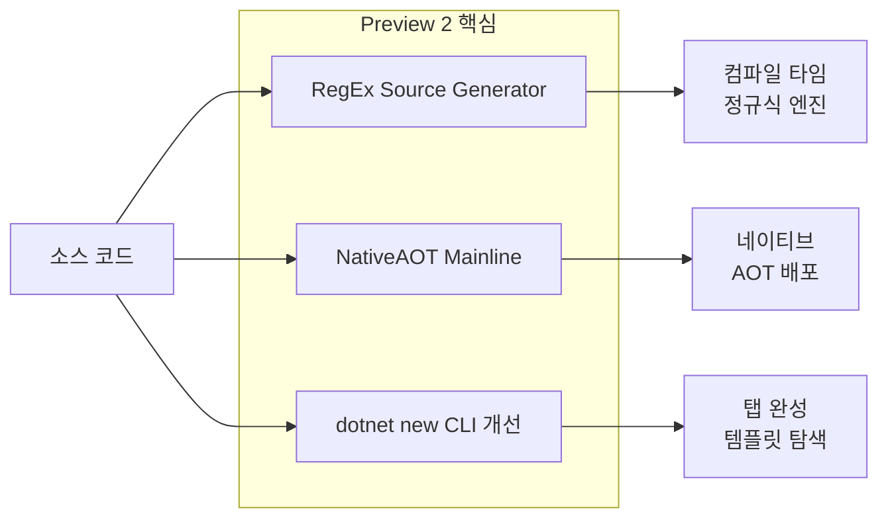

## 개요

.NET 7 Preview 2는 2022년 3월 공개된 두 번째 프리뷰로, **RegEx 소스 생성기**, **NativeAOT의 메인라인 전환**, **dotnet new CLI 개선**을 중심으로 개발 경험과 성능을 한 단계 끌어올렸다. 이 포스트에서는 위 세 가지를 중심으로 변경 사항을 정리하고, 실제 코드 예시와 함께 적용 시 참고할 수 있는 내용을 담았다.

**이 포스트가 도움이 되는 경우**

- .NET 6에서 .NET 7(또는 상위 버전)으로 마이그레이션을 검토 중인 팀
- 정규식 사용이 많은 서비스의 시작 비용·성능을 줄이고 싶은 개발자
- 네이티브 AOT 배포를 고려 중인 C# 개발자
- `dotnet new` 및 CLI 워크플로우 개선에 관심 있는 개발자

---

## .NET 7 Preview 2 주요 변경 사항 개요

Preview 2에서 강조된 세 가지 축은 아래와 같다. 각각 컴파일 타임 최적화, 런타임 배포 모델, 개발자 도구 경험에 초점을 둔다.



---

## RegEx 소스 생성기 (Regex Source Generator)

### 왜 필요한가

기존에는 `new Regex(...)`를 사용하면 **런타임**에 패턴을 파싱하고 엔진을 구성하는 비용이 발생한다. 패턴이 컴파일 타임에 고정되어 있다면, 이 작업을 **컴파일 타임**으로 옮겨 시작 비용을 없애고 트리밍·디버깅에도 유리하게 만들 수 있다. RegEx 소스 생성기는 바로 그 목적으로 Preview 1에 포함되었고, Preview 2 공식 소개에서 다시 강조되었다.

### 사용 방법

1. 해당 타입을 **partial class**로 만든다.
2. `[RegexGenerator("패턴", 옵션)]`을 붙인 **static partial** 메서드를 선언하고, 반환 타입을 `Regex`로 둔다.
3. 소스 생성기가 이 메서드의 구현을 채우며, 패턴이나 옵션을 바꾸면 자동으로 다시 생성된다.

### Before: 런타임 Regex

```csharp
public class Foo
{
  public Regex regex = new Regex(@"abc|def", RegexOptions.IgnoreCase);

  public bool Bar(string input)
  {
    bool isMatch = regex.IsMatch(input);
    // ..
  }
}
```

### After: 소스 생성기 사용

```csharp
public partial class Foo  // partial class로 변경
{
  [RegexGenerator(@"abc|def", RegexOptions.IgnoreCase)]
  public static partial Regex MyRegex();  // partial 메서드 → 소스 생성기가 구현 채움

  public bool Bar(string input)
  {
    bool isMatch = MyRegex().IsMatch(input);  // 생성된 엔진 사용
    // ..
  }
}
```

패턴이 컴파일 타임에 알려져 있다면 위 방식으로 전환하는 것을 권장한다. 자세한 제안과 이슈는 [GitHub - Regex Source Generator (runtime#44676)](https://github.com/dotnet/runtime/issues/44676)에서 확인할 수 있다.

---

## NativeAOT 업데이트

NativeAOT(Ahead-of-Time 컴파일)는 실험 단계였던 [dotnet/runtimelab](https://github.com/dotnet/runtimelab)의 feature/NativeAOT 브랜치에서 **.NET 7 메인라인 개발**로 자리 잡았다. [이전 발표](https://github.com/dotnet/runtime/issues/61231)에 따르면, runtimelab에서 dotnet/runtime 저장소로의 코드 이전 작업이 완료된 상태이며, SDK에서 NativeAOT로 프로젝트를 퍼블리시하는 **일급 지원**은 이후 프리뷰에서 추가될 예정이다.

NativeAOT를 사용하려면 **트리밍(trimming)** 이 필수이므로, 미리 셀프 컨테인드 배포 + 트리밍을 적용해 보며 trim 경고를 제거해 두는 것이 좋다. 라이브러리 작성자라면 [라이브러리 트리밍 준비 가이드](https://docs.microsoft.com/dotnet/core/deploying/trimming/prepare-libraries-for-trimming)를 참고하면 된다.

- 정리: [.NET Runtime - Native AOT](https://github.com/dotnet/runtimelab/tree/feature/NativeAOT) (runtimelab 쪽 정리)
- 이슈·진행 상황: [NativeAOT in .NET 7 #61231](https://github.com/dotnet/runtime/issues/61231)

---

## dotnet new CLI 개선

Preview 2부터 `dotnet new`는 **새 CLI 파서**와 **탭 완성** 지원으로 사용성이 크게 개선되었다.

- **서브커맨드**: `--install`, `--uninstall` 등이 `install`, `uninstall` 형태로 통일되었고, 기존 `--` 접두사 옵션은 하위 호환을 위해 당분간 유지된다.
- **탭 완성**: `dotnet new `<공백> 후 템플릿 이름, `dotnet new web --` 후 옵션, `--auth` 같은 선택 인자의 허용 값 등에서 탭 완성으로 후보를 볼 수 있다.
- 셸별 설정 방법은 [.NET CLI 탭 완성 활성화](https://docs.microsoft.com/dotnet/core/tools/enable-tab-autocomplete) 문서를 참고하면 된다.

템플릿 작성자라면 [dotnet/templating](https://github.com/dotnet/templating) 저장소에서 새 동작과 이슈를 확인할 수 있다.

---

## .NET 7 타겟팅 및 지원 정책

프로젝트에서 .NET 7을 사용하려면 `TargetFramework`를 예를 들어 다음과 같이 지정한다.

```xml
<TargetFramework>net7.0</TargetFramework>
```

플랫폼별 TFM 예: `net7.0-windows`, `net7.0-macos`, `net7.0-ios`, `net7.0-android` 등. .NET 7은 **Current** 릴리스로, 출시일로부터 18개월간 무료 지원·패치가 제공된다. 호환성·변경 사항은 [.NET 7 호환성 문서](https://docs.microsoft.com/dotnet/core/compatibility/7.0)를 참고하는 것이 좋다.

---

## 참고 문헌

1. [Announcing .NET 7 Preview 2 – The New, 'New' Experience](https://devblogs.microsoft.com/dotnet/announcing-dotnet-7-preview-2/) — Microsoft .NET Blog (공식 발표)
2. [.NET 7 Inches Closer to NativeAOT in Preview 2](https://visualstudiomagazine.com/articles/2022/03/17/net-7-preview-2.aspx) — Visual Studio Magazine (NativeAOT·RegEx 소개)
3. [.NET Runtime - Native AOT](https://github.com/dotnet/runtimelab/tree/feature/NativeAOT) — dotnet/runtimelab (NativeAOT 브랜치)
4. [Introduce the new Regex Source Generator (runtime#44676)](https://github.com/dotnet/runtime/issues/44676) — dotnet/runtime (RegEx 소스 생성기 제안)
5. [Moving NativeAOT to mainline (runtime#61231)](https://github.com/dotnet/runtime/issues/61231) — dotnet/runtime (NativeAOT 메인라인 이전 이슈)
