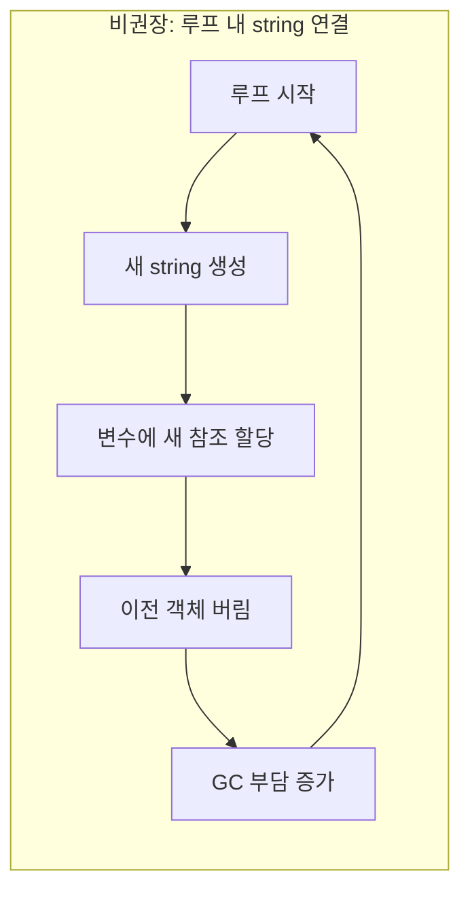
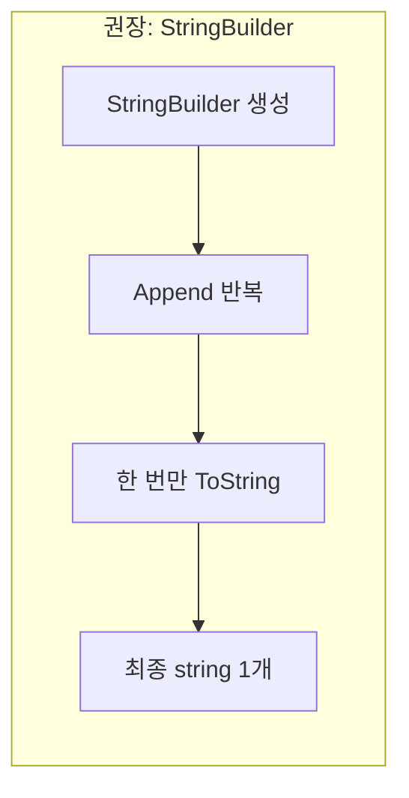

## 개요

C#에서 **한 메서드 안의 로컬 변수**는 그 메서드가 끝날 때 해제된다. Value 타입은 함수 리턴과 동시에 스택에서 해제되고, Reference 타입은 GC(Garbage Collector)에 의해 힙에서 자동 해제된다. 이 글에서는 **레퍼런스 타입 객체를 불필요하게 많이 만드는 실수** 중 하나인, **루프 안에서 `string`을 반복 연결하는 패턴**을 짚고, `StringBuilder`로 바꾸는 방법과 추가 최적화까지 정리한다.

**추천 대상**: .NET/C#으로 문자열을 다루는 개발자, 성능·메모리 이슈에 관심 있는 주니어~미들 개발자.

---

## 문제 상황

아래 예제는 루프를 돌며 `string` 객체를 **N번 새로 생성**한다.

```csharp
public string Get1ToN_Bad(int n)
{
   string s = "";
   for (int i = 1; i <= n; i++)
   {
      s += i.ToString() + ".";
   }
   return s;
}
```

`n`이 작으면 체감이 거의 없지만, **백만·천만**처럼 커지면 지연 시간과 GC 부담이 눈에 띄게 늘어난다.

---

## 원인: string 불변성과 GC 부담

`string`은 **불변(immutable)**이다. 생성 후 내부 값을 바꿀 수 없으므로, `s += ...`처럼 같은 변수에 새 값을 할당하면 내부적으로는 **새 `string` 인스턴스**를 만들고, 그 참조로 변수를 갈아끼운다. 이전 인스턴스는 곧 쓰이지 않게 되어 GC가 나중에 수거한다.

즉, 반복문 한 번마다 **새 객체 생성 → 이전 객체 폐기**가 반복되며, 반복 횟수만큼 임시 객체가 쌓인다.



반면 **권장 방식**은 가변 버퍼 하나를 두고, 마지막에 한 번만 `string`으로 만드는 것이다.



---

## 해결 방법: StringBuilder 사용

객체를 매 반복마다 새로 만들지 않고, **내부 버퍼를 수정 가능한 `StringBuilder`**를 쓰면 된다. 버퍼가 부족할 때만 내부적으로 버퍼를 키우고 복사할 뿐, **StringBuilder 인스턴스 자체를 버리고 새로 만드는 일은 없다**. 따라서 임시 `string` N개가 생기지 않고, GC 부담이 크게 줄어든다.

```csharp
public string Get1ToN_Good(int n)
{
    var sb = new StringBuilder();
    for (int i = 1; i <= n; i++)
    {
        sb.Append(i.ToString()).Append(",");
    }
    return sb.ToString();
}
```

- `Append`는 같은 `StringBuilder`를 반환하므로 `sb.Append(...).Append(...)`처럼 체이닝할 수 있다.
- 최종 결과만 `ToString()`으로 한 번에 `string`으로 만든다.

---

## 추가 최적화와 주의사항

### 1. 초기 용량(capacity) 지정

반복 횟수나 결과 길이를 대략 알 수 있으면, 생성 시 **capacity**를 주면 재할당 횟수가 줄어든다.

```csharp
// 대략 최종 길이를 알 때: 예) n개 숫자 + 구분자
var sb = new StringBuilder(capacity: n * (평균자릿수 + 1));
```

### 2. 루프 안에서의 객체 생성 점검

> 루프를 사용할 때는 **그 안에서 불필요하게 레퍼런스 타입 객체를 반복 생성·폐기하지 않는지** 항상 한 번씩 점검하는 것이 좋다.

`string` 연결뿐 아니라, 리스트/딕셔너리 등을 매 반복마다 `new`하는 패턴도 같은 맥락에서 피하는 것이 좋다.

### 3. StringBuilder가 유리한 경우

- **반복 횟수가 많거나**, **한 번에 붙이는 문자열이 작은 경우**에 `string` 연결보다 `StringBuilder`가 훨씬 유리하다.
- 반대로, 연결 횟수가 매우 적고(예: 2~3번) 코드가 단순하면 `string` 또는 문자열 보간(`$"..."`)만 써도 무방하다.

---

## 정리

| 구분 | 루프 내 `string` 연결 | `StringBuilder` 사용 |
|------|------------------------|----------------------|
| 객체 생성 | 반복마다 새 `string` | `StringBuilder` 1개 + 최종 `string` 1개 |
| GC 부담 | 반복 횟수만큼 임시 객체 | 상대적으로 적음 |
| 권장 상황 | 연결 2~3회 등 소규모 | 반복이 많거나 최종 길이가 클 때 |

C#에서 반복적으로 문자열을 이어 붙일 때는 **`StringBuilder`**를 사용하고, 가능하면 **초기 capacity**까지 지정해 두면 메모리와 성능 측면에서 안정적이다.

---

## 참고 문헌

1. [string 객체 사용에서 흔히 하는 실수](https://www.csharpstudy.com/Mistake/Article/3) — C# 스터디 (예제와 설명)
2. [StringBuilder Class (System.Text)](https://learn.microsoft.com/en-us/dotnet/api/system.text.stringbuilder) — Microsoft Learn (.NET API 문서)
3. [Supplemental API remarks for StringBuilder](https://learn.microsoft.com/en-us/dotnet/fundamentals/runtime-libraries/system-text-stringbuilder) — Microsoft Learn (사용 시 주의사항 및 권장 사항)
