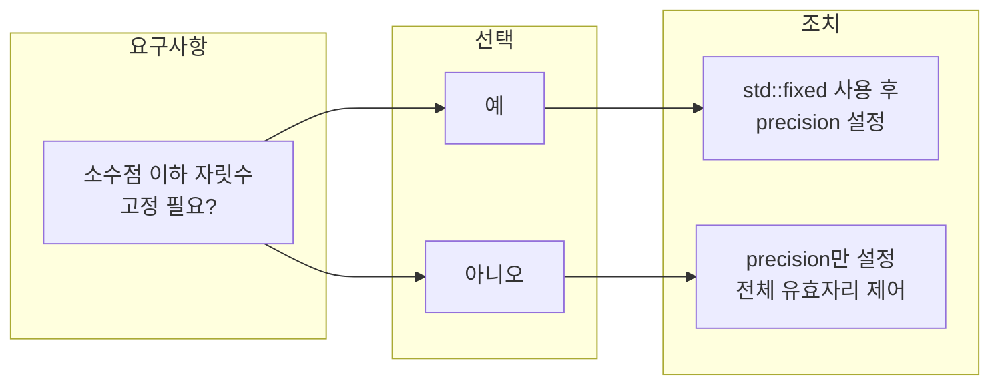

---
categories:
  - Cpp
date: "2022-03-29T00:00:00Z"
lastmod: "2026-03-16"
draft: false
title: "[C++] cout 소수점 자릿수·정밀도 제어 (precision, fixed)"
description: "C++에서 cout으로 실수를 출력할 때 precision과 std::fixed의 차이, 소수점 고정·해제 방법을 예시와 함께 설명한다. 부동소수점 출력 제어의 실전 활용, 자주 겪는 함정, unsetf로 fixed 해제하는 방법과 cppreference 참고 링크까지 정리한 참고 가이드이다."
tags:
  - C++
  - C
  - Implementation
  - 구현
  - Tutorial
  - 튜토리얼
  - Guide
  - 가이드
  - Reference
  - 참고
  - Best-Practices
  - Documentation
  - 문서화
  - Debugging
  - 디버깅
  - Pitfalls
  - 함정
  - Code-Quality
  - 코드품질
  - Readability
  - Beginner
  - Performance
  - 성능
  - Testing
  - 테스트
  - 실습
  - Education
  - 교육
  - Technology
  - 기술
  - Blog
  - 블로그
  - Web
  - 웹
  - Configuration
  - 설정
  - Comparison
  - 비교
  - Tips
  - How-To
  - Cheatsheet
  - 치트시트
  - Quick-Reference
  - Open-Source
  - 오픈소스
  - Productivity
  - 생산성
  - Troubleshooting
  - 트러블슈팅
  - Workflow
  - 워크플로우
  - Migration
  - 마이그레이션
  - Career
  - 커리어
  - Maintainability
  - Modularity
  - String
  - 문자열
  - Math
  - 수학
  - Algorithm
  - 알고리즘
  - Problem-Solving
  - 문제해결
  - Clean-Code
  - 클린코드
  - API
  - Edge-Cases
  - 엣지케이스
  - Error-Handling
  - 에러처리
  - Code-Review
  - 코드리뷰
  - Refactoring
  - 리팩토링
  - Case-Study
  - Deep-Dive
  - Design-Pattern
  - 디자인패턴
  - Interface
  - 인터페이스
  - Git
  - GitHub
  - Review
  - 리뷰
  - Innovation
  - 혁신
  - Markdown
  - 마크다운
  - Compiler
  - 컴파일러
  - Memory
  - 메모리
  - OS
  - 운영체제
  - Data-Structures
  - 자료구조
  - Optimization
  - 최적화
  - Logging
  - 로깅
  - Profiling
  - 프로파일링
  - Benchmark
  - Type-Safety
  - Software-Architecture
  - 소프트웨어아키텍처
  - IDE
  - VSCode
  - Linux
  - 리눅스
  - Windows
  - 윈도우
---

## 도입: 왜 소수점 자릿수를 제어해야 하는가

`cin`, `cout`을 사용할 때 입력은 비교적 단순하지만, **실수(부동소수점) 출력**은 기본 설정만으로는 원하는 형식을 얻기 어렵다. 알고리즘 문제에서 소수점 N자리까지 출력하거나, 로그·리포트에서 일정한 자릿수로 맞추려면 **정밀도(precision)**와 **표기 방식(fixed / default)**을 명시적으로 다뤄야 한다. 이 글에서는 `std::cout.precision()`과 `std::fixed`의 의미, 차이, 그리고 소수점을 “고정”했다가 다시 “해제”하는 방법까지 예시와 함께 정리한다.

---

## 핵심 개념: precision과 fixed

C++ 스트림에서 실수 출력 자릿수를 다루는 요소는 두 가지다.

| 요소 | 역할 |
|------|------|
| `std::cout.precision(n)` | 실수 출력 시 **총 유효 자릿수**를 n으로 설정 (소수점 “아래”만이 아님) |
| `std::fixed` | **고정 소수점 표기**로 전환. 이후에는 `precision(n)`이 “소수점 이하 n자리”를 의미함 |

즉, **precision만 쓸 때**는 “숫자 전체에서 의미 있는 자릿수”를 제한하고, **fixed를 켠 뒤 precision**을 쓰면 “소수점 이하 자릿수”를 고정한다.

---

## 출력 방식 선택 흐름

어떤 경우에 precision만 쓰고, 어떤 경우에 fixed까지 켜야 하는지 아래처럼 정리할 수 있다.



- **소수점 이하 자릿수를 정확히 고정**해야 하면 → `std::fixed` 사용 후 `precision(n)`.
- **전체 유효 자릿수만 제한**하면 될 때 → `precision(n)`만 사용.

---

## precision만 사용할 때: 전체 유효 자릿수

`precision(n)`은 “출력되는 실수 **전체**에서 의미 있는 자릿수를 n개로 제한”한다. 소수점 아래 n자리가 아니다.

```cpp
#include <iostream>

int main()
{
    double a = 1234.5678;
    std::cout.precision(6);

    std::cout << a;  // 1234.5678 → 6자리로 반올림 → 1234.57 출력
}
```

정수 부분이 크면 소수 부분이 잘리고, 작은 수는 소수 쪽으로 더 많이 나온다. 오차 범위를 넓게 두고 싶다면 `precision` 인자를 크게 주면 된다. 반대로 “소수점 아래 정확히 N자리”를 원한다면 이 방식만으로는 부족하다.

---

## fixed 사용: 소수점 이하 자릿수 고정

`std::fixed`는 **고정 소수점 표기**를 켠다. 이 상태에서는 `precision(n)`이 “소수점 이하 n자리”를 의미한다.

```cpp
#include <iostream>

int main()
{
    double a = 3333.333333;

    std::cout.precision(6);
    std::cout << a << std::endl;  // 3333.33 (전체 6자리)

    std::cout << std::fixed;      // 고정 소수점 표기로 전환
    std::cout << a << std::endl;  // 3333.333333 (소수 이하 6자리)

    std::cout.unsetf(std::ios::fixed);  // 고정 소수점 해제
    std::cout << a << std::endl;        // 다시 3333.33
}
```

요약하면 다음과 같다.

- **fixed 적용 전**: `precision(6)` → 전체 유효 자릿수 6.
- **fixed 적용 후**: `precision(6)` → 소수점 이하 6자리.
- **fixed 해제**: `std::cout.unsetf(std::ios::fixed)`로 원래 기본 부동소수점 출력으로 되돌린다.

---

## fixed 해제와 스코프 관리

`std::fixed`는 스트림에 설정되므로, 한 번 켜두면 이후 같은 스트림의 모든 실수 출력에 적용된다. 특정 구간에서만 소수점을 고정하고 싶다면:

1. **해제**: `std::cout.unsetf(std::ios::fixed);`
2. 또는 **매니퓰레이터**: `<iomanip>`의 `std::setprecision(n)`과 조합해 스코프별로 설정을 바꿀 수 있다.

다른 스트림(`std::cerr`, 파일 스트림 등)은 각각 별도 설정이므로, `cout`에만 적용된 상태는 다른 스트림에는 영향을 주지 않는다.

---

## 요약

| 목적 | 사용 방법 |
|------|-----------|
| 전체 유효 자릿수 n개 | `std::cout.precision(n);` 만 사용 |
| 소수점 이하 n자리 고정 | `std::cout << std::fixed;` 후 `std::cout.precision(n);` |
| 고정 소수점 해제 | `std::cout.unsetf(std::ios::fixed);` |

`cin`/`cout` 환경에서 실수 출력을 제어할 때는 “전체 자릿수”와 “소수점 이하 자릿수”를 구분하고, `fixed` 적용 여부에 따라 `precision`의 의미가 달라진다는 점만 기억하면 된다.

---

## 참고 문헌

1. [std::ios_base::precision - cppreference.com](https://en.cppreference.com/w/cpp/io/ios_base/precision) — precision 설정·반환 의미와 기본값.
2. [std::fixed, std::scientific - cppreference.com](https://en.cppreference.com/w/cpp/io/manip/fixed) — 고정/과학적 표기 매니퓰레이터.
3. [std::setprecision - cppreference.com](https://en.cppreference.com/w/cpp/io/manip/setprecision) — precision을 매니퓰레이터로 설정하는 방법.
