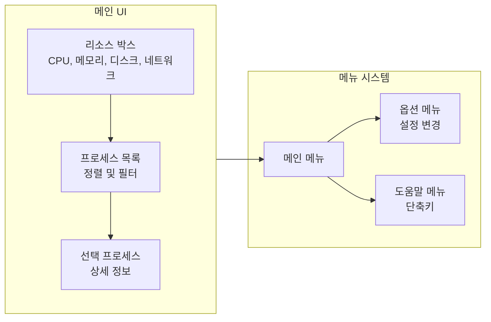

리눅스를 사용할 때 `top` 명령어로 CPU를 모니터링해 본 적이 있는가? 너무 단순한 UI에 아쉬움을 느낀 적이 있는가? CPU 말고 메모리·디스크·네트워크·프로세스를 한 화면에서 보고 싶었다면, **btop++**이 그 답이 될 수 있다. 본 글에서는 btop++의 개요, 설치 방법, 주요 기능, UI 구성, top/htop과의 비교, 장단점과 참고 문헌까지 정리한다.

btop++을 실행하면 아래 그림처럼 다양한 리소스 사용량을 한 화면에서 모니터링할 수 있다.

||
|:---:|
|btop++ 메인 UI: 선택한 프로세스의 상세 정보 표시|

---

## 개요

### btop++이란?

**btop++**은 [aristocratos/btop](https://github.com/aristocratos/btop)에서 개발하는 **시스템 리소스 모니터**다. 프로세서(CPU), 메모리, 디스크, 네트워크, 프로세스 목록을 실시간으로 보여 주며, [bashtop](https://github.com/aristocratos/bashtop)과 [bpytop](https://github.com/aristocratos/bpytop)을 **C++로 재작성·계승**한 프로젝트다. Linux뿐 아니라 macOS, FreeBSD, NetBSD, OpenBSD 등에서도 동작한다.

### 추천 대상

- 서버·PC에서 CPU/메모리/디스크/네트워크 사용량을 한눈에 보고 싶은 사용자
- `top`·`htop`보다 보기 좋고 정보량이 많은 터미널 모니터를 찾는 사람
- 마우스 지원, 테마, 그래프 형태의 히스토리가 필요한 관리자·개발자

---

## 프로젝트 정보 및 특징

[aristocratos/btop](https://github.com/aristocratos/btop) 저장소에서 소스, 이슈, 릴리스, 문서를 확인할 수 있다.

대표적인 특징은 다음과 같다.

- **bashtop/bpytop의 C++ 재작성 버전**: 성능과 이식성 향상
- **다중 리소스 모니터링**: 프로세서, 메모리, 디스크, 네트워크, 프로세스 목록
- **게임형 메뉴 시스템**: 직관적인 메인·옵션·도움말 메뉴
- **전체 마우스 지원**: 강조된 키는 모두 클릭 가능, 프로세스 목록·메뉴 박스에서 스크롤 지원
- **프로세스 제어**: 필터링·정렬·트리 뷰, 선택 프로세스에 시그널 전송, 목록 일시정지
- **네트워크·디스크**: 사용량 그래프, 디스크 IO 속도·활동 표시
- **테마·커스터마이징**: bpytop/bashtop과 호환되는 테마, 그래프 심볼·프리셋 선택

---

## 설치 방법

### Linux (패키지 매니저)

- **Fedora / RHEL 8+ (EPEL)**  
  `sudo dnf install btop` (RHEL 계열은 `sudo dnf install epel-release` 후 설치)
- **openSUSE Tumbleweed**  
  `sudo zypper in btop`
- **Ubuntu 등 Debian 계열**  
  저장소에 따라 `apt install btop` 또는 [최신 릴리스](https://github.com/aristocratos/btop/releases/latest)에서 바이너리 다운로드 후 `make install`

### Linux (소스·릴리스 바이너리)

1. [최신 릴리스](https://github.com/aristocratos/btop/releases/latest)에서 `btop-(VERSION)-(ARCH)-(PLATFORM).tbz` 다운로드 후 압축 해제
2. 해당 폴더에서 `sudo make install` (설치 경로는 `PREFIX=/target/dir`로 지정 가능)
3. (선택) 모든 프로세스에 시그널 전송·Intel GPU/CPU 전력 모니터링 등: `sudo make setcap` 또는 `sudo make setuid`

소스 컴파일은 저장소 클론 후 `make` → `sudo make install`이며, GPU 지원 등 옵션은 [README](https://github.com/aristocratos/btop)의 Compilation 섹션을 참고하면 된다.

### macOS

- **Homebrew**  
  `brew install btop`

### 기타

- FreeBSD: `pkg install btop`
- NetBSD: `pkg_add btop`

---

## 주요 기능 요약

| 영역 | 기능 |
|------|------|
| CPU | 코어별 사용률, 온도(지원 시), 그래프 |
| 메모리 | 사용량·캐시·스왑, 히스토리 그래프 |
| 디스크 | 장치별 IO 활동·속도 |
| 네트워크 | 인터페이스별 트래픽, 자동 스케일 그래프 |
| 프로세스 | 목록·정렬·필터·트리 뷰, 선택 프로세스 상세 정보, 시그널 전송 |
| UI | 마우스 클릭·스크롤, 게임형 메뉴, 테마·그래프 심볼·프리셋 |

(최신 버전에서는 Linux에서 GPU 모니터링 등 추가 기능이 있을 수 있으므로, 필요 시 공식 문서를 참고하는 것이 좋다.)

---

## UI 구성 (기능 흐름)

btop++ 실행 시 화면은 크게 **리소스 박스**(CPU·메모리·디스크·네트워크·프로세스)와 **메뉴 시스템**으로 나뉜다. 아래 다이어그램은 메인 화면에서 접근 가능한 요소와 흐름을 단순화한 것이다.

- **리소스 박스**: 상단에 CPU·메모리·디스크·네트워크 사용량과 그래프가 표시된다.
- **프로세스 목록**: 정렬·필터·트리 뷰를 바꿀 수 있고, 선택한 프로세스의 상세 정보가 보인다.
- **메뉴**: 메인 메뉴에서 옵션(설정)·도움말(단축키)로 진입할 수 있다.

---

## 사용 팁·단축키

- **프로세스 선택**: 방향키(UP/DOWN)로 선택, 엔터로 상세 정보
- **정렬·필터**: 메뉴에서 정렬 기준 변경, 프로세스 이름 등으로 필터
- **시그널**: 선택한 프로세스에 SIGTERM, SIGKILL 등 전송 가능
- **마우스**: 강조된 키는 클릭, 프로세스 목록·메뉴에서 스크롤 지원
- **테마·그래프**: 옵션 메뉴에서 테마·그래프 타입(블록/라인 등)·프리셋 변경

정확한 키는 실행 중 **도움말 메뉴**에서 확인하는 것이 가장 정확하다.

---

## top / htop과의 비교

| 항목 | top | htop | btop++ |
|------|-----|------|--------|
| UI | 텍스트 위주, 단순 | 컬러·바, 대화형 | 컬러·그래프·박스, 게임형 메뉴 |
| 마우스 | 거의 없음 | 제한적 | 전체 지원 |
| 리소스 범위 | CPU·메모리·프로세스 중심 | CPU·메모리·프로세스 | CPU·메모리·디스크·네트워크·프로세스 |
| 그래프 | 제한적 | 제한적 | 네트워크·디스크 등 풍부 |
| 테마·커스터마이징 | 거의 없음 | 제한적 | 테마·심볼·프리셋 |
| 구현 | C (전통적) | C | C++ (bashtop/bpytop 계승) |

`top`은 가볍고 모든 유닉스 계열에 있지만 정보와 UI가 단순하다. `htop`은 그 다음 단계의 대화형 모니터이고, **btop++**은 디스크·네트워크까지 포함하고 UI·테마·마우스 지원이 가장 풍부하다.

---

## 장단점 및 종합 평가

### 장점

- CPU·메모리·디스크·네트워크·프로세스를 **한 화면**에서 확인 가능
- **직관적인 UI**와 마우스 지원으로 학습 부담이 적음
- **테마·그래프·프리셋** 등 커스터마이징이 다양함
- **C++ 기반**으로 상대적으로 가볍고, 다중 플랫폼(Linux, macOS, BSD) 지원
- **오픈소스**이며 bashtop/bpytop 사용자라면 테마 등 이전 설정을 활용하기 쉬움

### 단점

- **터미널 요구 사항**: 24비트 트루컬러 또는 256색, UTF-8 로케일·유니코드 글꼴(그래프용) 권장
- **top/htop 대비 리소스**: 더 많은 메모리·CPU를 쓸 수 있어, 최소 리소스 환경에서는 `top`이 나을 수 있음
- Windows는 공식 지원하지 않음(별도 [btop4win](https://github.com/aristocratos/btop4win) 프로젝트 존재)

### 한 줄 평가

**서버와 데스크톱 모두에서 쓸 수 있는, 보기 좋고 정보량 많은 터미널 리소스 모니터**로, `top`·`htop` 다음 단계로 추천할 만하다.

---

## 참고 문헌

1. [aristocratos/btop — GitHub](https://github.com/aristocratos/btop) — 공식 저장소, README·설치·컴파일·키 바인딩
2. [btop Releases — GitHub](https://github.com/aristocratos/btop/releases/latest) — 최신 릴리스 및 정적 바이너리
3. [bashtop — GitHub](https://github.com/aristocratos/bashtop) — btop++의 전신 프로젝트( Bash )
4. [bpytop — GitHub](https://github.com/aristocratos/bpytop) — Python 버전 전신, 테마 호환 참고
5. [btop4win — GitHub](https://github.com/aristocratos/btop4win) — Windows용 포트(공식 btop과 별도 프로젝트)
