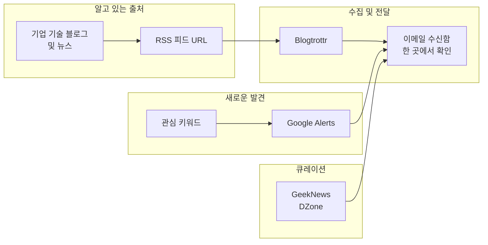

## 개요

빠르게 변하는 IT·개발 분야에서는 최신 소식을 어떻게 받아볼지가 학습과 커리어에 직결된다. 뉴스, 포털, 단체 채팅에서 링크를 따라가는 것만으로는 한계가 있기 때문에, **알아서 들어오는 구독 체계**를 만드는 것이 중요하다.

이 글에서는 **이메일을 중심으로** 개발·IT 최신 정보를 수집하는 방법을 정리한다. Google Alerts, Blogtrottr, 기업 기술 블로그, 뉴스 커뮤니티까지 단계별로 소개하고, 워크플로우와 실전 팁을 함께 다룬다.

**추천 대상**

- 개발·IT 최신 동향을 꾸준히 보고 싶은 개발자·엔지니어
- RSS 리더 이전·EOS(서비스 종료) 대응을 고민하는 사람
- 이메일 한곳에서 블로그·뉴스를 모아보고 싶은 사람

---

## 최신 정보원의 유형

최신 정보를 얻는 경로는 대략 다음과 같이 나눌 수 있다.

| 유형 | 설명 | 예시 |
|------|------|------|
| **기업 기술 블로그·뉴스** | 특정 회사·플랫폼의 공식 기술 콘텐츠 | Samsung Developers, .NET Blog, 카카오테크 |
| **RSS·Atom 피드** | 블로그·뉴스 사이트가 제공하는 피드 URL | 대부분의 기술 블로그 |
| **검색 기반 알림** | 키워드로 웹을 주기적으로 검색해 결과를 전달 | Google Alerts |
| **뉴스·커뮤니티 서비스** | 개발·기술·스타트업 뉴스를 큐레이션해 제공 | GeekNews, DZone |

아래에서는 **이메일을 허브로** 이 네 가지를 어떻게 묶을지 설명한다.

---

## 이메일을 중심으로 쓰는 이유

RSS 리더(Feedly 등)는 서비스마다 UX가 달라서 이전 비용이 크다. [Google Reader](https://en.wikipedia.org/wiki/Google_Reader)가 2013년 종료되면서 수많은 사용자가 다른 리더로 옮겨야 했던 경험이 대표적이다. 그래서 **구독 수단은 이메일**을 기준으로 두는 편이 안정적이다.

- **이메일 주소는 서비스에 묶이지 않음**  
  리더가 사라져도 받은 메일은 그대로 남고, 다른 클라이언트로 이전하기 쉽다.
- **알림·필터·라벨**  
  메일 클라이언트에서 중요도·태그로 정리하고, 검색도 편하다.
- **EOS 대응**  
  RSS→이메일 변환 서비스만 바꾸면 되고, 구독 목록(피드 URL)은 그대로 유지할 수 있다.

따라서 이 글에서 소개하는 방법은 모두 **최종 수신처를 이메일**로 두는 전제로 작성했다.

---

## SW 기술 블로그·뉴스

많은 SW·플랫폼 회사는 기술 블로그나 뉴스 페이지를 운영하며, 여기서 **RSS·Atom 피드** 또는 **뉴스레터**를 제공한다.

### 추천 구독처 예시

- [Samsung Developers Blog](https://developer.samsung.com/blog/en-us) — 삼성 개발자 기술 블로그
- [Samsung Developers News](https://developer.samsung.com/news/en-us) — 삼성 개발자 뉴스·업데이트
- [.NET Blog](https://devblogs.microsoft.com/dotnet/) — .NET·C# 공식 블로그
- [Microsoft Blog](https://blogs.microsoft.com/) — 마이크로소프트 공식 블로그
- [우아한형제들 기술 블로그](https://techblog.woowahan.com/) — 배민 등 우아한형제들 기술 블로그
- [Kakao Tech Blog](https://tech.kakao.com/blog/) — 카카오 기술 블로그

사용 중인 언어·플랫폼(모바일, 백엔드, 클라우드 등)에 맞춰 관심 있는 회사의 **Blog**와 **News**를 찾아 RSS·뉴스레터를 구독하는 것이 첫 단계다.

---

## Blogtrottr: RSS를 이메일로 받기

위와 같은 사이트 대부분은 **RSS·Atom 피드**를 제공한다. 하지만 피드를 **이메일**로 받고 싶다면 중간에 **RSS→이메일** 서비스가 필요하다. 그중 하나가 [Blogtrottr](https://blogtrottr.com/)이다.

- **동작 방식**  
  피드 URL과 수신 이메일을 입력하면, 새 글이 올라올 때마다(또는 다이제스트 주기에 맞춰) 이메일로 발송한다.
- **장점**  
  무료 구간에서 제약이 상대적으로 적고, 피드 URL만 알면 별도 가입 없이 빠르게 설정할 수 있다.
- **활용**  
  Feedly 등 리더 대신, 혹은 리더와 병행해 **중요 피드만 이메일**로 받도록 구성할 수 있다.

비슷한 서비스는 여러 개 있지만, Blogtrottr은 제한이 적어 오래 쓰기 편한 편이다.

---

## Google Alerts: 모르는 키워드까지 커버

RSS·이메일 구독은 **이미 알고 있는 사이트**에만 적용된다. 반면 **아직 모르는 기술·회사·주제**는 검색으로 발견하는 경우가 많다. 이걸 자동화하는 도구가 [Google Alerts](https://www.google.com/alerts)다.

- **동작 방식**  
  원하는 **검색어**를 등록해 두면, Google이 주기적으로 웹을 검색하고 **새 결과가 있을 때 이메일**로 보내 준다.
- **설정**  
  빈도(실시간·일일·주간), 소스(뉴스·블로그·웹·동영상 등), 언어·지역을 선택할 수 있다.
- **활용**  
  새로 관심 생긴 기술명, 라이브러리명, 회사명을 알림으로 등록해 두면, RSS에 없는 소식도 이메일로 수집할 수 있다.

RSS는 “알고 있는 출처”를, Google Alerts는 “키워드 기반 발견”을 담당하게 두면 정보원이 넓어진다.

---

## 뉴스·커뮤니티 서비스

개발·기술·스타트업 뉴스만 모아서 제공하는 서비스도 있다. 기사 형태로 정리되어 있어 **한 번에 여러 출처**를 볼 수 있다.

- [GeekNews](https://news.hada.io/) — 개발·기술·스타트업 뉴스 (한국어)
- [DZone](https://dzone.com/) — 프로그래밍·DevOps 뉴스, 튜토리얼, Refcard 등 (영어)

이런 사이트는 Google Alerts에 **사이트 제한 검색**(예: `site:news.hada.io`)이나 키워드를 넣어 두면 알림으로도 접근할 수 있고, 직접 방문해 북마크·RSS가 있다면 Blogtrottr으로 이메일 구독을 걸 수도 있다.

---

## 최신 정보 수집 워크플로우

아래 플로우는 위에서 설명한 수단을 **한 번에** 어떻게 쓰면 좋을지 요약한 것이다.

- **알고 있는 출처**: 블로그·뉴스 → RSS URL 수집 → Blogtrottr에 등록 → 이메일로 수신.
- **새로운 발견**: 관심 키워드 → Google Alerts 등록 → 검색 결과를 이메일로 수신.
- **큐레이션**: GeekNews·DZone 등은 직접 방문하거나, 필요 시 해당 사이트 RSS를 Blogtrottr에 넣어 이메일로 받을 수 있다.

---

## 실전 활용 팁

1. **구독량 조절**  
   처음에는 소수(5~10개) 피드·알림만 등록하고, 읽는 습관이 잡히면 단계적으로 늘린다.  
2. **이메일 라벨·필터**  
   “개발 뉴스”, “블로그” 등 라벨을 두고 자동 분류해 두면 나중에 검색·정리가 쉽다.  
3. **Google Alerts 키워드**  
   너무 넓은 단어는 노이즈가 많으니, `"특정 기술명"` 또는 `기술명 + tutorial`처럼 구체적으로 잡는 편이 좋다.  
4. **RSS 피드 찾기**  
   블로그·뉴스 페이지에서 “RSS”, “Atom”, “피드”, 오렌지 아이콘 링크를 찾거나, URL에 `/feed`, `/rss`, `/atom.xml` 등을 붙여 보면 된다.  
5. **EOS 대비**  
   Blogtrottr 등 서비스가 바뀌어도 **구독 목록(OPML)**을 내보내 두면, 다른 RSS→이메일 도구로 이전할 수 있다.

---

## 결론

1. **RSS 리더**를 써도 되지만, 장기적으로는 **이메일**을 허브로 두면 서비스 종료·이전에 유리하다.  
2. **관심 있는 회사·플랫폼**의 기술 블로그·뉴스를 찾고, 가능하면 **RSS·뉴스레터**를 구독한다.  
3. **Blogtrottr** 같은 서비스로 RSS를 이메일로 받으면, 한 메일함에서 블로그 업데이트를 확인할 수 있다.  
4. **Google Alerts**에 관심 키워드를 등록해 두면, 아직 모르는 기술·회사에 대한 새 검색 결과도 이메일로 받을 수 있다.  
5. **GeekNews, DZone** 등 뉴스·커뮤니티를 보조 수단으로 두면, 다양한 출처를 한곳에서 볼 수 있다.

정리하면, **이메일 + Blogtrottr + Google Alerts + 기업 블로그·뉴스** 조합으로 최신 정보 수집 파이프라인을 만들고, 필요에 따라 뉴스 서비스를 보태면 된다.

---

## 참고 문헌

1. [Google Reader - Wikipedia](https://en.wikipedia.org/wiki/Google_Reader) — Google Reader 역사 및 종료 배경  
2. [Blogtrottr](https://blogtrottr.com/) — RSS/Atom 피드를 이메일로 배달하는 서비스  
3. [Google Alerts](https://www.google.com/alerts) — 검색어 기반 웹 모니터링 및 이메일 알림
