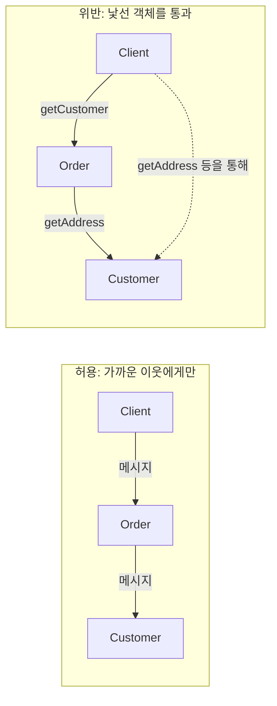
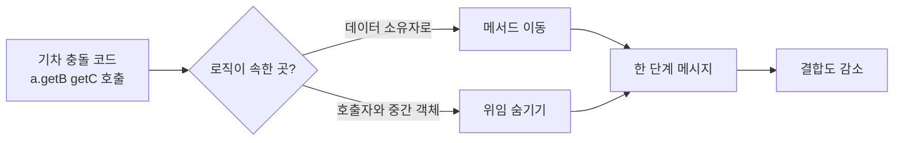

객체지향 설계에서 **결합도**를 낮추고 **응집도**를 높이려면, 객체가 "누구에게 말할 수 있는지"를 명확히 제한하는 것이 중요하다. **디미터의 법칙(Law of Demeter)**은 바로 그 기준을 제시한다. 이 글에서는 법칙의 정의와 탄생 배경, 위반 시 나타나는 신호, 대표적인 안티패턴인 기차 충돌(Train Wreck), 리팩터링 전략, 그리고 언제 적용하고 언제 완화할지에 대한 판단 기준을 다룬다. 규칙을 맹목적으로 따르기보다, 변화에 강한 협력 구조를 만들기 위한 가이드레인으로 활용하는 방법을 정리했다.

## 왜 디미터의 법칙인가?

실무에서는 `order.getCustomer().getAddress().getZipCode()`처럼 점(`.`)이 길게 이어진 코드를 자주 만난다. 이런 코드는 한 객체가 다른 객체의 **내부 구조**를 알고 그걸 통해 또 다른 객체에 접근한다는 뜻이다. 주문(Order)이 고객(Customer)을 알고, 고객이 주소(Address)를 알고, 주소가 우편번호를 갖는다는 **구현 세부사항**이 호출자에게 그대로 노출된다. 나중에 주소 구조가 바뀌거나, 우편번호를 다른 방식으로 제공하게 되면 이 한 줄을 쓰는 모든 곳을 수정해야 한다. 디미터의 법칙은 "낯선 이에게 말하지 말고, 가까운 이웃에게만 말하라"는 한 문장으로, 이런 과도한 결합을 막고 **메시지 중심의 협력**을 유도한다.

디미터의 법칙은 1987년경 **Northeastern University**의 **Demeter 프로젝트**에서 **Ian Holland** 등에 의해 제안되었다. Demeter 프로젝트는 적응형 프로그래밍(adaptive programming)과 관점 지향 프로그래밍(AOP) 연구의 일환이었고, "객체지향 프로그래밍에 대한 객관적인 스타일 감각"을 다룬 OOPSLA '88 논문에서 법칙이 정리되었다. 이름은 그리스 신화의 농업의 여신 **Demeter**에서 따왔으며, 하향식이 아닌 **하위 구조를 최소한으로 아는** 설계 철학을 나타낸다.

> "Only talk to your immediate friends. Each unit should only talk to its friends; don't talk to strangers."  
> — Ian Holland et al., Demeter Project, OOPSLA '88

## 디미터의 법칙(Law of Demeter)이란?

**디미터의 법칙**은 한 객체가 메시지를 보내도 되는 대상을 제한하는 설계 원칙이다. "최소 지식의 원칙(Principle of Least Knowledge)"이라고도 부른다.

객체는 다음 대상으로만 메시지를 보내야 한다.

- **자기 자신** (`this`)
- **자신의 필드**(직접 구성요소)
- **메서드 매개변수**로 받은 객체
- **자신이 직접 생성한** 객체
- **컬렉션에서 한 단계만 거쳐 얻은** 원소(예: 반복문 안에서 컬렉션의 각 원소에 대해 한 번만 메시지 전송)

이 원칙을 지키면 객체는 "가까운 이웃"만 알게 되고, 그 이웃의 내부 구조(다른 객체들의 존재나 관계)는 알 필요가 없어진다. 그 결과 **내부 구현이 감춰지고**, 협력이 **메시지 중심**으로 설계되며, 한 구현 변경이 호출자로 불필요하게 퍼지는 것을 줄일 수 있다.

아래 다이어그램은 "허용되는 협력"과 "위반되는 협력"을 구분한다. 왼쪽은 한 객체가 직접 이웃에게만 메시지를 보내는 경우이고, 오른쪽은 한 객체가 이웃을 통해 낯선 객체에까지 닿는 경우를 나타낸다.



- **허용**: Client는 Order에게만 메시지를 보내고, Order는 자신이 아는 Customer에게만 메시지를 보낸다. Client는 Customer의 존재나 Address를 알 필요가 없다.
- **위반**: Client가 Order를 통해 Customer를 얻고, 다시 그걸 통해 Address 등에 닿는다. Client가 "낯선" 객체(Address)까지 알게 되어 결합도가 높아진다.

## 위반을 의심할 신호

다음과 같은 징후가 보이면 디미터의 법칙 위반을 의심해볼 수 있다.

- **여러 점이 이어진 긴 체인**: `a.getB().getC().doD()`처럼 두 단계 이상을 한 번에 타고 내려가는 호출.
- **게터를 통해 내부를 파고드는 절차적 코드**: 객체에서 값을 꺼내서 호출자에서 연산하는 패턴. 이는 **Feature Envy**(데이터에 대한 관심이 다른 클래스에 있는 냄새)와도 맞닿아 있다.
- **"이 객체의 속성 값들을 꺼내서 내가 처리"하는 패턴**: 데이터 조회에 그치지 않고, 호출자가 그 데이터로 판단·계산·부수 효과를 수행하는 경우.
- **테스트에서 과도한 목(Mock) 또는 스텁**: 한 메서드를 테스트하려면 여러 단계의 협력자를 모두 격리해야 해서 테스트가 복잡해지는 경우.
- **사소한 내부 변경이 광범위한 수정으로 번짐**: 한 클래스의 필드나 협력 구조만 바꿨는데, 그 클래스를 "통해" 접근하던 수많은 호출부가 깨지는 경우.

이런 신호가 보이면 "누가 이 일을 알아야 하는가?", "이 메시지를 받을 객체는 누구인가?"를 다시 묻고, **위임 숨기기**나 **메서드 이동** 같은 리팩터링을 고려하는 것이 좋다.

## 안티패턴: 기차 충돌(Train Wreck)

**기차 충돌(Train Wreck)**은 점이 연속으로 이어져 한 "기차"처럼 보이는 코드를 가리키는 별칭이다. 내부 구조가 외부로 그대로 새어 나가는 전형적인 위반 사례다.

### Before: 내부 구조가 노출된 코드

호출자가 Order → Customer → Address → ZipCode라는 전체 경로를 알고 있어야 한다. Address가 값 객체로 바뀌거나, 우편번호가 다른 객체로 옮겨가면 이 한 줄을 사용하는 모든 코드를 수정해야 한다.

```java
// 내부 구조가 외부로 새는 나쁜 예
String zip = order.getCustomer().getAddress().getZipCode();
```

### After: 의도를 드러내는 메시지

Order가 "고객의 우편번호"를 요청할 수 있는 책임을 갖도록 하면, 호출자는 Order만 알면 된다. Customer나 Address의 존재는 Order 내부로 숨겨진다.

```java
// 의도를 드러내는 메시지
String zip = order.getCustomerZipCode();

// Order 클래스 내부: 위임 숨기기
public class Order {
  private Customer customer;

  public String getCustomerZipCode() {
    return customer.getZipCode();  // Customer가 주소 정보를 캡슐화
  }
}
```

또는 "우편번호를 알려달라"는 요청을 **Customer**에 두고, Customer가 자신이 가진 Address 등과 협력하게 할 수 있다. 즉, 로직이 관심을 갖는 **데이터가 있는 곳**으로 메서드를 옮기는 **메서드 이동(Move Method)**을 적용할 수 있다.

리팩터링 전략을 흐름으로 정리하면 아래와 같다.



- **메서드 이동**: 연산에 필요한 데이터를 가장 많이 가진 객체로 메서드를 옮겨, 그 객체가 "가까운 이웃"만 사용하도록 한다.
- **위임 숨기기**: 중간 객체(Order, Customer 등)에 "의도를 드러내는" 퍼블릭 메서드를 두어, 호출자는 한 단계만 알면 되게 한다.

## 리팩터링 전략 요약

| 전략 | 설명 |
|------|------|
| **메서드 이동(Move Method)** | 로직이 관심을 갖는 데이터가 있는 클래스로 메서드를 옮긴다. |
| **위임 숨기기(Hide Delegate)** | 내부 협력자를 감추는 퍼블릭 메서드를 제공해, 호출자가 한 단계만 알도록 한다. |
| **메서드 추출(Extract Method)** | 반복되는 체인이나 절차를 "의도를 드러내는" 도메인 용어의 메서드로 묶는다. |
| **묻지 말고 말하라(Tell, Don't Ask)** | 데이터를 꺼내서 호출자에서 처리하지 말고, "이 일을 해달라"는 메시지를 보낸다. |
| **파사드/래퍼 도입** | 복잡한 서브시스템을 단순한 인터페이스 하나로 감싼다. |
| **값/DTO 경계 구분** | 시스템 경계(API, DB 등)에서는 단순 데이터 전달용 DTO를 허용하고, 도메인 로직은 도메인 객체에 둔다. |

각 전략은 상황에 따라 단독 또는 조합해서 쓸 수 있다. 공통 목표는 "호출자가 알 필요 없는 구조를 숨기고, 요구사항을 한 문장으로 표현하는 메시지"를 만드는 것이다.

## 균형 있게 적용하기: 언제 완화할 수 있는가?

디미터의 법칙은 **만능 규칙이 아니다**. 다음과 같은 경우에는 점이 두어 개 나오거나, 데이터에 대한 단순 접근이 허용되는 것으로 보는 것이 실용적이다.

- **플루언트 인터페이스/빌더**: `builder.setA(1).setB(2).build()`처럼 **의도된** 체이닝은 같은 객체를 반환하므로, "한 객체에 대한 연속된 메시지"로 해석할 수 있다.
- **값 객체(Value Object)**: `money.amount()`, `duration.toSeconds()`처럼 불변 값 객체에서 짧게 한두 단계 접근하는 것은 흔히 허용된다. 다만 도메인 로직이 값이 아닌 호출자 쪽에 쏠리면 메서드 이동을 고려한다.
- **읽기 전용 DTO/경계 객체**: API 응답, DB 매핑 등 **시스템 경계**에서 단순 데이터 전달용으로 쓰는 DTO는 필드 접근 위주일 수 있다. 이쪽에서는 도메인 로직을 넣지 말고, 도메인으로 넘어온 뒤에는 도메인 객체가 협력하도록 한다.

반대로 **도메인 모델 내부**에서는 "한 점으로 한 단계"를 지키는 편이 변경에 유리하다. "언제 엄격히 적용하고, 언제 실용적으로 완화할지"를 팀과 도메인에 맞춰 정하는 것이 좋다.

## 비판적 시각과 트레이드오프

디미터의 법칙을 지키면 **래퍼 메서드**가 늘어날 수 있다. 모든 경로마다 "위임만 하는" 메서드를 두다 보면 클래스 인터페이스가 비대해지고, 호출 경로가 한 단계 더 늘어나 오버헤드가 생길 수 있다. 이는 **설계 문제**이지 법칙 자체의 필연적 결과는 아니다. "래퍼가 많다"는 것은 보통 "그 객체가 원래 호출자의 직접적인 협력자여야 하는데, 중간에 무언가를 통해서만 접근하고 있다"는 신호일 수 있다. 그럴 때는 **의존성 방향**을 재검토해, 필요한 객체를 직접 주입받거나 구조를 단순화하는 편이 낫다.

실험 연구(Basili et al., 1996)에 따르면, 클래스가 응답할 수 있는 메서드 수(RFC)가 적을수록 결함 가능성이 줄어드는 경향이 있고, 디미터의 법칙을 따르면 RFC를 낮추는 데 도움이 된다. 반면 클래스당 메서드 수(WMC)가 지나치게 늘어나면 결함 가능성이 올라갈 수 있으므로, **작은 위임 메서드만 무한히 늘리기보다**는 "진짜 책임이 있는 메서드"와 "단순 위임"을 구분하고, 필요하면 구조 자체를 단순히 하는 것이 좋다.

## 학습 성과 목표와 판단 기준

이 글을 읽은 뒤에는 다음을 할 수 있도록 목표로 둘 수 있다.

- 디미터의 법칙을 **한 문장으로 설명**하고, "가까운 이웃"이 무엇을 의미하는지 **구체적으로 나열**할 수 있다.
- 주어진 코드에서 **기차 충돌** 또는 **Feature Envy** 징후를 찾고, 어떤 객체에 메시지를 두는 것이 맞을지 **설명**할 수 있다.
- **위임 숨기기**, **메서드 이동**, **Tell, Don't Ask** 중 상황에 맞는 전략을 선택하고, **리팩터링 예시**를 제시할 수 있다.
- **플루언트 API, 값 객체, DTO** 등에서 법칙을 언제 완화해도 되는지 **판단 기준**을 말할 수 있다.

### 적용·회피 판단

| 적용을 강하게 고려할 때 | 완화 또는 예외를 고려할 때 |
|------------------------|---------------------------|
| 도메인 모델 내부의 객체 협력 | 플루언트 빌더·DSL |
| 내부 구조 변경 가능성이 있는 영역 | 불변 값 객체의 짧은 접근 |
| 테스트·유지보수 비용이 높은 체인 | 경계 레이어의 DTO·단순 데이터 전달 |

### 체크리스트

- 퍼블릭 API가 **내부 구조**(다른 객체의 타입·경로)를 노출하지 않는가?
- 점 체이닝 없이 **요구사항을 한 문장으로 표현하는 메시지**가 있는가?
- **데이터 조회**가 아니라 **행동 요청** 메시지가 중심인가?
- 변경 시 **파급 범위**가 작고 **테스트**가 단순한가?
- 빌더/DSL 등 **의도된 체이닝**을 과용하지 않았는가?

## 마무리

디미터의 법칙은 "점을 세 개 이상 쓰지 말라"는 형식적 규칙이 아니라, **변화에 강한 협력 구조**를 만들기 위한 가이드레인이다. "무엇을 해야 하는가"를 **메시지**로 표현하고, "어떻게 하는가"는 객체 내부로 숨기면, 결합도는 낮아지고 응집도는 높아진다. 실무에서는 도메인 영역에서는 원칙을 잘 지키고, 경계·값 객체·의도된 API에서는 판단에 따라 완화하면서, 팀과 함께 적용 수준을 맞추는 것이 좋다.

## 참고 문헌

1. [Law of Demeter](https://en.wikipedia.org/wiki/Law_of_Demeter) — Wikipedia. 역사, 정의, 장단점, 인용.
2. Lieberherr, K., Holland, I., Riel, A. (1988). "Object-Oriented Programming: An Objective Sense of Style". OOPSLA '88. ACM. (Demeter 프로젝트, 법칙의 공식 정리.)
3. Hunt, A., Thomas, D. (1999). *The Pragmatic Programmer*. Addison-Wesley. "The Law of Demeter for Functions" — 실무 관점의 요약과 Tell, Don't Ask와의 연결.
