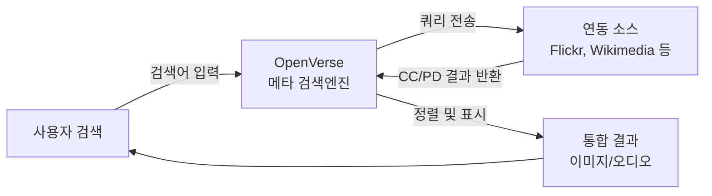

**OpenVerse**는 Creative Commons(CC) 라이선스 및 퍼블릭 도메인(Public Domain)으로 공개된 이미지·오디오를 한곳에서 검색하고 다운로드할 수 있는 **메타 검색엔진**이다. 워드프레스 재단에 합류한 구 CC Search를 리브랜딩한 서비스로, 2022년 기준 8억 건 이상의 창작물을 무료로 이용할 수 있다. 블로그·프레젠테이션·교육 자료·프로토타입 등에 쓸 수 있는 저작권 걱정 없는 미디어를 빠르게 찾고 싶을 때 유용하다.

이 글에서는 OpenVerse의 정의와 배경, 추천 대상, 주요 기능, 연동 소스, 사용 방법, 장단점, 참고 문헌을 정리한다.

## 개요

### OpenVerse란

OpenVerse는 **오픈 라이선스 미디어 전용 메타 검색엔진**이다. 사용자가 입력한 검색어로 여러 오픈 소스·CC 지원 플랫폼을 동시에 조회하고, 결과를 하나의 인터페이스에서 보여 준다. 모든 검색 결과는 [Creative Commons 라이선스](https://creativecommons.org/licenses/) 또는 퍼블릭 도메인에 속하므로, 조건만 지키면 상업·비상업 목적으로 재사용·수정·배포가 가능하다.

원래 **CC Search**라는 이름으로 서비스되다가, 워드프레스 재단과의 통합 이후 **OpenVerse**로 브랜드가 변경되었다. 공식 사이트는 [openverse.org](https://openverse.org/)이며, [WordPress.org Openverse 소개](https://wordpress.org/openverse/)에서도 안내하고 있다.

### 추천 대상

다음과 같은 경우 OpenVerse 사용을 추천한다.

- 블로그·뉴스레터·교육 자료에 쓸 **무료 이미지·사진**을 찾을 때
- **오디오**(BGM, 팟캐스트, 샘플, 효과음)를 라이선스 조건에 맞게 쓰고 싶을 때
- 한 곳에서 **여러 CC/오픈 소스를 통합 검색**하고 싶을 때
- 상업용·비상업용 구분, 저작자 표기 등 **라이선스 조건을 명확히 확인**하고 싶을 때
- 워드프레스·기타 CMS와 연동해 **미디어 라이브러리**를 채우고 싶을 때

반대로, 완전한 올라이트(All Rights Reserved) 상업 이미지나 특정 브랜드 전용 에셋이 필요하다면 OpenVerse보다는 유료 스톡 사이트나 권리 관리 서비스를 쓰는 편이 맞다.

## 검색 흐름과 연동 소스

OpenVerse는 사용자 검색 요청을 받으면, 내부에서 여러 **오픈 미디어 소스**에 쿼리를 보내고 결과를 모아 정렬·필터링해서 보여 준다. 한 번의 검색으로 여러 플랫폼을 동시에 뒤지는 **메타 검색** 구조다.

아래 다이어그램은 검색 요청부터 결과 표시까지의 흐름을 단순화한 것이다.

연동 소스는 이미지·오디오 유형에 따라 다르다. 공식 문서와 서비스 UI 기준으로, 대표적인 연동 소스는 아래와 같다.

| 유형 | 연동 소스 예시 |
|------|----------------|
| 이미지 | Europeana, Flickr, Google Images, Open Clip Art Library, Wikimedia Commons, Smithsonian 등 |
| 오디오 | ccMixter, Jamendo, SoundCloud, SpinXpress, Wikimedia Commons, YouTube 등 |

각 소스는 자체 API·인덱스를 통해 CC 또는 퍼블릭 도메인으로 공개된 항목만 제공하며, OpenVerse는 이들을 **통합 검색·필터(라이선스, 유형, 소스)**로 한 화면에서 다룰 수 있게 한다.

## 주요 기능

- **통합 검색**: 이미지·오디오를 한 인터페이스에서 검색하고, 유형(이미지/오디오)과 라이선스로 필터링할 수 있다.
- **라이선스 표시**: 각 결과에 적용된 CC 라이선스(예: CC BY, CC BY-SA, CC0) 또는 퍼블릭 도메인 여부가 표시되어, 사용 조건을 바로 확인할 수 있다.
- **다운로드·외부 링크**: 원본 파일 다운로드 또는 소스 사이트로 이동하는 링크를 제공한다.
- **저작자 표기 정보**: 저작자명·출처·라이선스 링크를 복사해 붙여 넣기 쉽게 제공하는 경우가 많아, 올바른 표기 준수에 도움이 된다.

워드프레스 사용자는 OpenVerse 플러그인을 통해 미디어 라이브러리에 직접 삽입할 수 있으며, 일반 사용자는 웹에서 [openverse.org](https://openverse.org/)에 접속해 브라우저만으로 검색·다운로드할 수 있다.

## 사용 방법

1. [openverse.org](https://openverse.org/)에 접속한다.
2. 상단 검색창에 키워드(영어·한국어 등)를 입력한다.
3. **이미지** 또는 **오디오** 탭을 선택하고, 필요 시 **라이선스 필터**(예: 상업적 이용 가능, 수정 가능)를 적용한다.
4. 결과에서 원하는 항목을 클릭해 상세 페이지로 들어간 뒤, **다운로드** 또는 **소스 링크**로 원본을 받고, 저작자 표기·라이선스 조건을 확인한다.
5. 사용 시 해당 라이선스 조건(저작자 표기, 동일 조건 허락 등)을 지킨다.

스크린샷은 실제 검색 화면과 결과 목록을 보여 주는 참고용이다.

## 스크린샷

|  |
| :---: |
| OpenVerse 검색 화면 및 결과 예시 |

## 장단점과 활용 시 유의점

### 장점

- **무료**: 서비스 이용과 다운로드 모두 무료이며, 검색 결과는 오픈 라이선스라 조건만 지키면 재사용이 자유롭다.
- **통합 검색**: 여러 소스를 한 번에 검색해 시간을 줄일 수 있다.
- **라이선스 투명성**: CC·퍼블릭 도메인만 다루어, 저작권 리스크를 줄이기 좋다.
- **워드프레스 생태계**: 워드프레스와 연동되어 블로그·사이트 제작 시 편리하다.

### 단점 및 유의점

- **소스 의존**: 연동 소스 API·정책 변경 시 검색 결과나 품질이 달라질 수 있다.
- **언어·키워드**: 검색 품질이 키워드·소스 메타데이터에 따라 달라질 수 있어, 다양한 키워드로 시도해 보는 것이 좋다.
- **상업용·수정 조건**: 라이선스별로 상업적 이용·2차적 저작물 허용 여부가 다르므로, 사용 전 반드시 각 결과의 라이선스를 확인해야 한다.

오픈 라이선스 미디어가 꼭 필요할 때는 OpenVerse를 쓰고, 전용 에셋이나 완전한 권리 확보가 필요할 때는 유료 스톡·권리 관리 서비스를 함께 고려하는 것이 좋다.

## 참고 문헌

- [OpenVerse 공식 사이트](https://openverse.org/) — 서비스 소개 및 검색
- [Creative Commons Licenses](https://creativecommons.org/licenses/) — CC 라이선스 종류 및 조건
- [WordPress.org – Openverse](https://wordpress.org/openverse/) — 워드프레스 생태계 내 OpenVerse 안내

## 한 줄 평

**OpenVerse**는 CC·퍼블릭 도메인 이미지·오디오를 한곳에서 검색·다운로드할 수 있는 메타 검색엔진으로, 블로그·교육·프로토타입에 쓸 무료 미디어를 빠르게 찾을 때 유용하다. 라이선스 조건만 확인하면 저작권 부담 없이 재사용할 수 있다.
