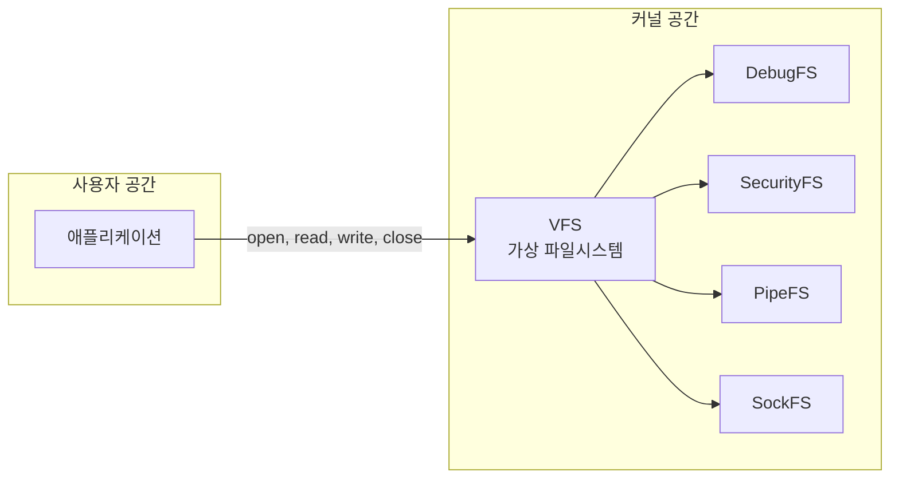

## 개요

이 글은 리눅스 커널이 제공하는 **가상(유사) 파일시스템** 네 가지—**DebugFS**, **SecurityFS**, **PipeFS**, **SockFS**—를 중심으로, 각각의 역할·마운트 방법·주요 API·활용 맥락을 정리한다. 공통 배경인 **가상 파일시스템(VFS)** 개념을 짚은 뒤, 네 파일시스템을 비교 표와 다이어그램으로 한눈에 보이도록 구성했다.

**대상 독자**: 리눅스 시스템 프로그래밍·커널·보안 모듈에 관심 있는 개발자, DevOps·SRE에서 디버깅·보안 정책 점검을 다루는 이.

**참고**: 아래 내용은 [PipeFS, SockFS, DebugFS, and SecurityFS (linux.org)](https://www.linux.org/threads/pipefs-sockfs-debugfs-and-securityfs.9638/)를 참고하여 정리·보강한 것이다.

---

## 가상 파일시스템(VFS)이란

리눅스에서는 ext4, XFS, Btrfs 같은 **실제 파일시스템**과, 디스크가 아닌 **메모리·커널 객체**를 파일처럼 보이게 하는 **가상(유사) 파일시스템**이 함께 동작한다. 사용자 프로그램은 그 종류와 관계없이 `open`, `read`, `write`, `close` 같은 **동일한 시스템 콜**로 접근한다. 이렇게 서로 다른 파일시스템을 **공통 인터페이스**로 추상화하는 커널 계층을 **가상 파일시스템(Virtual Filesystem Switch, VFS)** 이라고 부른다.



VFS 덕분에 실제 저장 매체나 구현이 달라도 동일한 시스템 콜로 파일·디렉터리·소켓·파이프 등을 다룰 수 있다. 아래 네 가지는 그중 **디버깅·보안·파이프·소켓**을 위한 대표적인 가상(유사) 파일시스템이다.

---

## DebugFS

**DebugFS**는 **디버깅용**으로 쓰이는 **램 기반** 가상 파일시스템이다. ProcFS, SysFS와 비슷하게 커널과 사용자 공간 사이의 **인터페이스** 역할을 하며, 다른 점은 **디버그 정보**를 노출한다는 것이다.

### 마운트 및 부팅 시 자동 마운트

- **수동 마운트**:  
  `mount -t debugfs none /sys/kernel/debug`
- **부팅 시 자동 마운트**: `/etc/fstab`에 다음 한 줄 추가  
  `debugfs /sys/kernel/debug debugfs defaults 0 0`

### 커널 옵션

리눅스 커널 설정에서 DebugFS는 **CONFIG_DEBUG_FS**로 불린다. 해당 옵션을 활성화해야 DebugFS를 사용할 수 있다.

### 주요 API (시스템 콜·커널 API)

커널 코드에서 DebugFS에 노드를 만들 때 사용하는 대표 API는 다음과 같다.

| API | 설명 |
|-----|------|
| `debugfs_create_atomic_t()` | atomic_t 값 읽기/쓰기용 파일 생성 |
| `debugfs_create_blob()` | 바이너리 블롭 읽기용 파일 생성 |
| `debugfs_create_bool()` | 불리언 값 읽기/쓰기용 파일 생성 |
| `debugfs_create_dir()` | 디렉터리 생성 |
| `debugfs_create_file()` | 일반 파일 생성 |
| `debugfs_create_regset32()` | 레지스터 값 반환용 파일 생성 |
| `debugfs_create_size_t()` | size_t 값 읽기/쓰기용 파일 생성 |
| `debugfs_create_symlink()` | 심볼릭 링크 생성 |
| `debugfs_create_u{8,16,32,64}()` | 부호 없는 8/16/32/64비트 값 읽기/쓰기 |
| `debugfs_create_u32_array()` | 부호 없는 32비트 배열 읽기용 파일 생성 |
| `debugfs_create_x{8,16,32,64}()` | 16진 부호 없는 값 읽기/쓰기 |
| `debugfs_initialized()` | DebugFS 등록 여부 확인 |
| `debugfs_print_regs32()` | seq_print로 레지스터 집합 출력 |
| `debugfs_remove()` | 파일 또는 디렉터리 삭제 |
| `debugfs_remove_recursive()` | 디렉터리 재귀 삭제 |
| `debugfs_rename()` | 디렉터리·파일 이름 변경 |

---

## SecurityFS

**SecurityFS**는 **커널 보안 모듈**을 위한 **메모리 상의 가상 파일시스템**이다. 보안 모듈이 정책·데이터를 이 계층에 두며, 사용자 공간에서는 SysFS의 일부처럼 보인다. **마운트 위치**는 `/sys/kernel/security/` 이다. 일부 보안 모듈은 이 경로의 파일을 읽고 써서 설정을 변경한다.

[리눅스 보안 모듈(LSM)](https://www.kernel.org/doc/html/v4.14/admin-guide/LSM/index.html)은 이런 **유사 파일시스템**에 데이터를 읽고 써야 하므로, SecurityFS가 이미 마운트되어 있지 않다면 LSM이 **수동으로 마운트**할 수 있다.

LSM 구현체는 SecurityFS 루트에 **이름이 정해진 디렉터리**를 만든다. 예: AppArmor는 `apparmor` 라는 이름으로 `/sys/kernel/security/` 아래에 디렉터리를 생성한다.

|  |
| :-----------------------------------------------------------------------------: |
| `/sys/kernel/security/` 에 생성된 `apparmor` 디렉터리 예시 |

---

## PipeFS

**PipeFS**는 다른 가상 파일시스템과 달리 **사용자 공간이 아니라 커널 공간 안**에 마운트되는 **특수한 가상 파일시스템**이다. 일반 파일시스템은 `/` 아래에 보이지만, PipeFS는 **자기만의 루트**를 가지며 `pipe:` 에 마운트된다. **슈퍼블록을 하나만** 가지며, 시스템 전체에서 그 이상으로 늘어나지 않는다. 사용자 프로그램은 **`pipe()` 시스템 콜**을 통해 이 “두 번째 루트”에 해당하는 파일시스템에 접근한다. **다른 가상/유사 파일시스템과 달리 디렉터리 트리로 직접 보이지 않는다.**

### 역할

- **유닉스 파이프**가 PipeFS를 사용한다. `ls | less` 처럼 파이프를 쓰면 `pipe()` 가 PipeFS 위에 **새 파이프 객체**를 만든다.
- PipeFS가 없으면 파이프를 만들 수 없고, **스레드·프로세스(fork)** 간 파이프 통신도 불가능하다. **네트워크 파이프**도 이 가상 파일시스템에 의존한다.

즉, 파이프 기반 IPC와 셸 파이프 연산의 기반이 PipeFS다.

---

## SockFS

**SockFS**(Socket FileSystem)는 **소켓/포트** 정보와 **호환성 계층**을 두기 위한 **램 상의 가상 파일시스템**이다. **호환성 계층**으로 동작하기 때문에, 디스크용 파일시스템에서 쓰는 것과 **같은 `write()` 시스템 콜**로 소켓(FTP 21번 포트 등)에 데이터를 쓸 수 있다. 소켓은 TCP/UDP 등 네트워크 통신에 쓰이지만, `write()` 는 원래 “파일에 쓰기”용이다. **SockFS**가 그 사이에서 **중재자(Mediator)** 처럼 동작해, `write()` 로 들어온 데이터를 소켓 프로토콜에 맞게 변환해 준다. 따라서 `write()` 는 소켓과 직접 대화하지 않고, SockFS를 거쳐 소켓과 상호작용하게 된다.

---

## 네 가지 가상 파일시스템 비교

| 구분 | DebugFS | SecurityFS | PipeFS | SockFS |
|------|---------|------------|--------|--------|
| **목적** | 디버깅 정보 노출 | 보안 모듈(LSM) 정책·데이터 | 파이프(IPC, 셸 파이프) | 소켓 파일 추상화 |
| **저장 위치** | RAM | RAM | RAM(커널 내부) | RAM |
| **마운트 위치** | `/sys/kernel/debug` | `/sys/kernel/security/` | `pipe:` (커널 전용, 비가시) | (커널 내부) |
| **사용자 노출** | 디렉터리 트리로 보임 | SysFS 일부처럼 보임 | 보이지 않음 | 소켓 fd로만 접근 |
| **진입점** | mount, fstab | LSM·mount | `pipe()` 시스템 콜 | socket()·파일 연산 |

---

## Virtual Filesystem vs Pseudo Filesystem

- **Virtual Filesystem (VFS)**: 여러 파일시스템(실제·가상 모두)을 **하나의 공통 인터페이스(open/read/write/close 등)** 로 추상화하는 **커널 계층** 자체를 가리키는 말이다.
- **Pseudo Filesystem(유사 파일시스템)**: 디스크가 아닌 **메모리·커널 객체**를 파일/디렉터리처럼 보이게 하는 **구체적인 파일시스템 구현**을 말한다. ProcFS, SysFS, **DebugFS, SecurityFS, PipeFS, SockFS** 등이 여기 해당한다.

즉, VFS는 “추상화 계층”, Pseudo FS는 “실제로 마운트되는 특수 목적 파일시스템”에 가깝다.

---

## 유용한 명령

시스템에 마운트된 **모든 파일시스템(실제·가상)** 목록을 보려면:

```bash
cat /proc/filesystems
```

유닉스/리눅스는 **파일 디스크립터**와 **프로세스**로 많은 자원을 표현한다. 네트워크와 파이프가 각각 SockFS, PipeFS 같은 **파일시스템**을 필요로 한다는 점을 알면, “모든 것이 파일”이라는 철학을 더 구체적으로 이해할 수 있다.

---

## 참고 문헌

1. [PipeFS, SockFS, DebugFS, and SecurityFS](https://www.linux.org/threads/pipefs-sockfs-debugfs-and-securityfs.9638/) — Linux.org 포럼 글.
2. [리눅스 보안 모듈](https://ko.wikipedia.org/wiki/%EB%A6%AC%EB%88%85%EC%8A%A4_%EB%B3%B4%EC%95%88_%EB%AA%A8%EB%93%88) — 위키백과.
3. [Linux Security Module Usage](https://www.kernel.org/doc/html/v4.14/admin-guide/LSM/index.html) — 커널 공식 문서.
4. [How pipes work in Linux](https://unix.stackexchange.com/questions/148401/how-pipes-work-in-linux) — Unix & Linux Stack Exchange.
5. [파일시스템, VFS, 슈퍼블록, 아이노드, 덴트리, 파일](https://hyoje420.tistory.com/53) — hyoje420.tistory.com.
