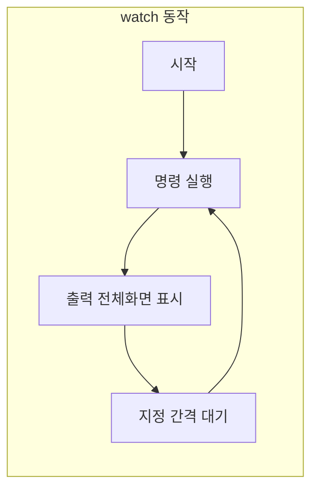
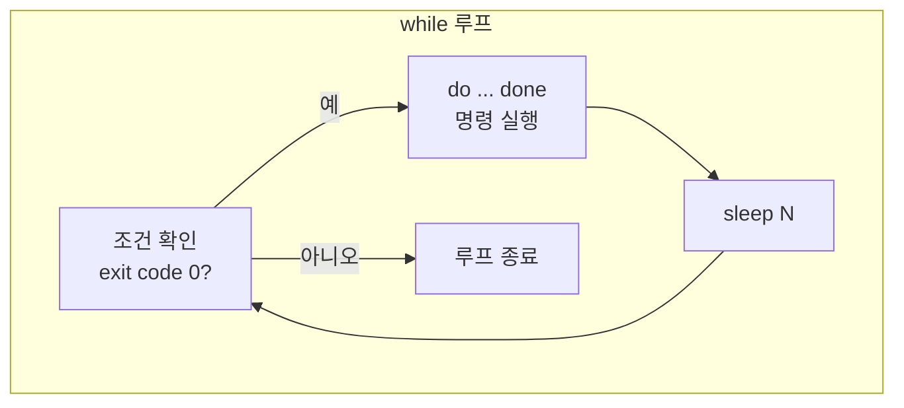

## 개요

같은 명령어를 주기적으로 실행해야 할 때가 있다. 시스템 자원 사용량 모니터링, 디렉터리·파일 변화 감시, 네트워크·라우팅 상태 확인, 또는 특정 프로세스·로그가 나타날 때까지 반복해서 확인하는 경우 등이다. 리눅스·유닉스 셸에서는 **`watch`** 명령어와 **`while`** 루프를 사용해 이를 손쉽게 구현할 수 있다.

- **`watch`**: 지정한 명령을 일정 간격으로 반복 실행하고, 출력을 전체 화면으로 갱신한다. 옵션으로 간격 조절·차이 강조·에러 시 동작 등을 제어할 수 있다.
- **`while`**: 셸 내장 구문으로, 조건이 참인 동안 명령을 반복 실행한다. `while true; do ... ; done` 형태로 무한 루프를 만들고, 루프 안에서 `sleep`으로 간격을 두면 `watch`와 유사한 효과를 낼 수 있다.

이 글에서는 두 방법의 사용법, 주요 옵션, 실무에 가까운 예제, 그리고 Mermaid로 흐름을 시각화한 뒤 참고 문서를 정리한다.

---

## watch

### 사용법

```text
watch [옵션...] 명령
```

`watch`는 **명령**을 주기적으로 실행하고, 그 출력의 첫 화면분을 전체 화면에 표시한다. 기본 간격은 2초이며, `^C`(Ctrl+C)로 종료할 수 있다. 상단 헤더에 명령 실행 시각·경과 시간·종료 코드가 표시된다.

### 주요 옵션

| 옵션 | 설명 |
|------|------|
| `-n`, `--interval 초` | 갱신 간격(초). 기본 2초. 0.1~2678400(31일) 범위로 제한된다. |
| `-d`, `--differences[=permanent]` | 이전 출력과 달라진 부분을 강조. `=permanent`이면 첫 실행 이후 모든 변경을 누적 강조. |
| `-t`, `--no-title` | 상단 헤더(시각·경과 시간 등)를 숨긴다. |
| `-e`, `--errexit` | 명령이 0이 아닌 종료 코드로 끝나면 갱신을 멈추고, 키 입력 후 watch가 종료된다. |
| `-g`, `--chgexit` | 명령 출력이 바뀌면 watch를 종료한다. |
| `-b`, `--beep` | 명령이 0이 아닌 종료 코드로 끝나면 비프음. |
| `-p`, `--precise` | 이전 실행이 끝난 시점이 아니라, 이전 실행 **시작** 시점 기준으로 간격을 맞춘다. |
| `-h`, `--help` | 도움말 출력 후 종료. |
| `-v`, `--version` | 버전 정보 출력 후 종료. |

옵션은 [man watch](https://man7.org/linux/man-pages/man1/watch.1.html)에서 더 자세히 볼 수 있다.

### watch 동작 흐름



### 예시

**1. 라우팅 테이블을 1초마다 확인**

```bash
watch -n 1 ip ro
```

**2. 디렉터리 목록을 1초마다 확인 (변경 부분 강조)**

```bash
watch -n 1 ls -la /tmp
```

**3. 디렉터리 변경 시 차이만 강조**

```bash
watch -d ls -l
```

**4. CPU MHz 변화 감시 (동적 주파수 CPU)**

```bash
watch -n 1 'grep "^cpu MHz" /proc/cpuinfo | sort -nrk4'
```

**5. 커널 버전이 바뀌는지 감시 (헤더 없이)**

```bash
watch -t uname -r
```

**6. 명령 실패 시 갱신 중단 후 키 입력 시 종료**

```bash
watch -e ping -c 1 example.com
```

**7. 출력이 바뀌면 watch 종료**

```bash
watch -g 'ls /tmp/marker 2>/dev/null || true'
```

**8. 10초 간격·정확한 주기·차이 강조로 서버 상태 로깅**

```bash
watch -n 10 -p -d '{ date; for i in 10.0.0.31 10.0.0.32 10.0.0.33; do R=OK; ping -c2 -W2 "$i" &>/dev/null || R=FAIL; echo "$i: $R"; done } | tee -a ~/log'
```

**9. 메모리 사용량 2초마다 확인**

```bash
watch -n 2 free -h
```

**10. 특정 프로세스 개수 감시**

```bash
watch -n 1 'ps aux | grep -c "[s]ome_process"'
```

---

## while

### 기본 개념

리눅스·유닉스 셸에서는 프롬프트에서 **`while`** 구문으로 반복 실행을 할 수 있다. 조건이 참(종료 코드 0)인 동안 `do`와 `done` 사이의 명령이 반복된다. `while true`는 항상 참이므로 무한 루프가 되고, 루프 안에 `sleep 초`를 두면 `watch`처럼 주기 실행 효과를 낼 수 있다.

### 문법

```text
while 조건명령; do 명령들; done
```

한 줄에 쓰지 않아도 되며, `;` 자리에는 줄바꿈을 쓸 수 있다.

### while 루프 흐름



### 예시

**1. netstat 결과를 1초마다 grep해서 확인**

```bash
while true; do netstat | grep aaa; sleep 1; done
```

종료는 `^C`(Ctrl+C).

**2. 특정 파일이 생길 때까지 2초마다 확인**

```bash
while [ ! -f /tmp/ready ]; do echo "대기 중..."; sleep 2; done
echo "파일이 생성되었습니다."
```

**3. 디스크 사용량 5초마다 출력 (헤더 없이 한 줄)**

```bash
while true; do df -h / | tail -1; sleep 5; done
```

**4. 로그에서 특정 문자열이 나올 때까지 반복**

```bash
while ! grep -q "Started" /var/log/app.log 2>/dev/null; do sleep 1; done
echo "앱이 시작되었습니다."
```

**5. 카운트를 세면서 3회만 실행**

```bash
i=0
while [ "$i" -lt 3 ]; do
  echo "실행 $i"
  ((i++))
  sleep 1
done
```

**6. watch와 유사하게 디렉터리 목록 1초마다 (화면 클리어)**

```bash
while true; do clear; ls -la /tmp; sleep 1; done
```

---

## watch와 while 비교

| 구분 | watch | while |
|------|--------|--------|
| 형태 | 외부 명령어(보통 procps-ng) | 셸 내장 구문 |
| 용도 | 명령 주기 실행·출력 갱신에 최적화 | 조건 기반 반복·스크립트 내 제어 |
| 차이 강조 | `-d` 옵션으로 지원 | 직접 구현 필요 |
| 출력 | 기본적으로 전체 화면 갱신 | 파이프·리다이렉션으로 자유롭게 구성 |
| 종료 조건 | `-g`, `-e` 등 옵션으로 제어 | 조건식·break·시그널로 제어 |

간단한 주기 실행·모니터링에는 `watch`가 편하고, 조건이 복잡하거나 스크립트 안에서 반복 제어가 필요하면 `while`이 적합하다.

---

## Reference

- [watch(1) - Linux manual page](https://man7.org/linux/man-pages/man1/watch.1.html) — man7.org
- [Bash Reference Manual - Looping Constructs](https://www.gnu.org/software/bash/manual/html_node/Looping-Constructs.html) — GNU
