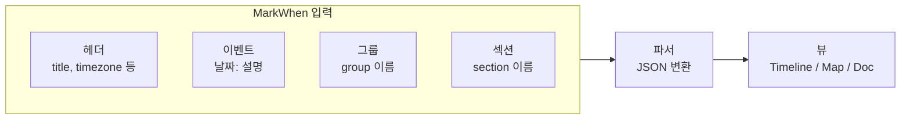

## 개요

**MarkWhen**은 마크다운에 가까운 문법으로 **시간 순서가 있는 내용**(일지, 간트 차트, 타임라인, 캘린더, 할 일 목록 등)을 텍스트로 작성하면, 이를 JSON으로 파싱한 뒤 **타임라인·맵·문서** 형태로 시각화해 주는 오픈소스 도구다. [공식 사이트](https://markwhen.com/)와 [공식 문서](https://docs.markwhen.com/)에서 체험과 문법을 확인할 수 있으며, [Meridiem 에디터](https://meridiem.markwhen.com/)에서 실시간 편집·미리보기가 가능하다.

- **도구 정보**: 마크다운 계열 저널 언어 + 파서 + 뷰(타임라인/캘린더 등). Vue·TypeScript 기반 클라이언트, Go 등 파서/백엔드 구성.
- **추천 대상**: 프로젝트 일정·마일스톤 정리, 개인/팀 로드맵, 회고·일지·블로그 타임라인, 간트 스타일 작업 구간 표시가 필요한 사용자.

아래 예시는 "프로젝트 계획" 스타일의 입력과, 그에 대응하는 타임라인 출력 감을 보여 준다.

```markdown
title: Project planning example

#Project1: #d336b1

group Project 1 #Project1
// Supports ISO8601
2022-01/2022-03: Sub task #John
2022-03/2022-06: Sub task 2 #Michelle
More info about sub task 2

2022-07: Yearly planning

group Project 2 #Project2
2022-04/4 months: Larger sub task #Danielle

// Supports American date formats
03/2022 - 1 year: Longer ongoing task #Michelle
10/2022 - 2 months: Holiday season

group Project 3
01/2023: Project kickoff
02/2023-04/2023: Other stuff

section Overall

2022: Year of the something
2023: Year of something else
```

위 텍스트를 MarkWhen에 넣으면 계단식 타임라인으로 렌더링된다.

|  |
| :---: |
| 예시 |

[markwhen.com](https://markwhen.com/) 또는 [Meridiem 예제](https://meridiem.markwhen.com/example)에서 직접 실행해 볼 수 있다.

---

## MarkWhen 문서 구조

MarkWhen 소스는 **헤더·이벤트·그룹·섹션**으로 구성된다. 파서가 텍스트를 해석해 JSON으로 변환한 뒤, 뷰어가 타임라인/캘린더/문서 뷰 등으로 렌더링한다. 구조 관계는 아래와 같이 요약할 수 있다.



- **헤더**: 문서 제목(`title`), 타임존(`timezone`) 등 메타 정보. 공식 문서에서는 `timezone` 지정을 권장한다.
- **이벤트**: `날짜` 또는 `시작/종료: 설명` 형태. 단일 일자·기간·상대 기간(예: `4 months`) 지원.
- **그룹**: 여러 이벤트를 한 덩어리로 묶어 색·태그로 구분할 때 사용.
- **섹션**: 타임라인 상의 큰 구간(예: "2022년", "Overall")을 나누는 단위.

---

## 특징

- **구성 요소**: 헤더, 이벤트, 그룹, 섹션으로 문서를 구성하며, 태그·색상(`#Project1: #d336b1`)으로 그룹을 구분할 수 있다.
- **날짜 형식**: ISO8601, 미국식 날짜(예: `03/2022`), 자연어 스타일(예: `Dec 1 2025`) 등 다양한 형식을 지원한다.
- **인터랙션**: 기간 구간을 마우스로 드래그해 조정할 수 있는 에디터(Meridiem)를 제공한다.
- **뷰 모드**: Timeline(계단식 타임라인), Map(지도 기반), Doc(문서형) 보기를 지원한다.
- **공유·내보내기**: URL 공유, PDF·PNG 내보내기로 문서·발표 자료에 활용하기 좋다.
- **오픈소스**: Vue·TypeScript 기반으로, [GitHub(mark-when/markwhen)](https://github.com/mark-when/markwhen)에서 소스와 파서·VS Code 확장·Obsidian 플러그인 등을 확인할 수 있다.

---

## 사용 시나리오

- **프로젝트·스프린트 일정**: 마일스톤과 태스크를 그룹·기간으로 작성 후 팀과 URL 공유.
- **개인 로드맵·회고**: 연도·분기별 목표와 회고를 한 파일에 타임라인으로 정리.
- **블로그·일지**: 시간 순서가 있는 포스트·일지를 타임라인으로 시각화.
- **간트 스타일 계획**: 작업 구간(시작/종료)을 텍스트로 관리하고 PNG/PDF로 내보내서 문서에 삽입.

---

## 장단점 및 한 줄 평가

- **장점**: 마크다운에 가까운 문법으로 타임라인을 버전 관리·텍스트 편집 가능하게 함. 다양한 날짜 형식·그룹·태그·뷰 모드·내보내기 지원. 오픈소스·에디터·VS Code·Obsidian 연동으로 확장성 있음.
- **단점**: 문법과 헤더 옵션을 익혀야 하며, 대규모 데이터 시 에디터 성능은 환경에 따라 다를 수 있음. 타임존 미지정 시 경고가 나오므로 헤더에 `timezone` 지정을 권장한다.

**한 줄 평**: 마크다운 스타일로 타임라인·간트·일지를 작성하고 공유·내보내기까지 하고 싶다면 MarkWhen을 쓰면 된다.

---

## 참고 문헌

1. [MarkWhen 공식 사이트](https://markwhen.com/) — 소개, 에디터·문서·예제 링크.
2. [Markwhen Documentation](https://docs.markwhen.com/) — 문법, 파서, 뷰(시각화) 설명.
3. [mark-when/markwhen (GitHub)](https://github.com/mark-when/markwhen) — 메인 저장소 및 이슈·기여 가이드.
