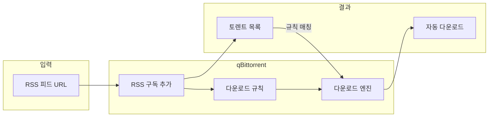

## 개요

### qBittorrent란

**qBittorrent**는 [µTorrent](https://www.utorrent.com/)의 오픈소스 대안을 지향하는 크로스 플랫폼 토렌트 클라이언트다. [Qt](https://www.qt.io/)와 [libtorrent-rasterbar](https://www.libtorrent.org/) 기반으로, Windows·Linux·macOS·FreeBSD 등에서 동일한 기능을 제공한다. 공식 사이트는 [qBittorrent 공식](https://www.qbittorrent.org/)에서 내려받을 수 있다.

토렌트 사용 시 특정 사이트나 RSS에서 나오는 새 토렌트를 매번 수동으로 받기 번거로울 수 있다. qBittorrent는 **RSS 피드 자동 다운로드**를 지원해, 구독한 피드에 새 항목이 올라오면 조건에 맞는 토렌트를 자동으로 받도록 설정할 수 있다.

### 이 포스트에서 다루는 내용

- qBittorrent 소개 및 추천 대상
- RSS 자동 다운로드 전체 흐름(구조)
- RSS 구독 추가 및 다운로드 규칙 등록(단계별 설정)
- µTorrent·ruTorrent·Transmission과의 비교 및 비추천 사유
- 참고 문헌 및 공식 리소스

### 추천 대상

- RSS로 배포되는 토렌트를 **자동으로 받고 싶은 사용자**
- **광고 없는** 토렌트 클라이언트를 쓰고 싶은 사용자
- **Windows·Linux·macOS** 중 어떤 환경이든 같은 방식으로 쓰고 싶은 사용자
- 웹 UI로 원격 제어가 필요해 **qBittorrent Web UI**를 쓰려는 사용자

---

## qBittorrent 소개

|  |
| :------------------------------------------------------------------: |
| qBittorrent 메인 화면 |

주요 특징은 다음과 같다.

- **통합 검색 엔진**: 여러 토렌트 사이트를 동시에 검색할 수 있다.
- **BitTorrent 확장**: DHT, PEX, LSD, 마그넷 링크, 암호화 연결, 프라이빗 토렌트 등 지원.
- **웹 UI**: 일반 GUI와 거의 동일한 웹 인터페이스로 원격 제어 가능.
- **토렌트·트래커·피어 제어**: 파일 선택, 우선순위, 대기열 제어 등.
- **RSS 리더**: 피드 구독 후 필터/규칙으로 자동 다운로드 가능.

---

## RSS 자동 다운로드

### 전체 흐름

RSS로 토렌트를 자동 받으려면 **① RSS 주소 등록**과 **② 다운로드 규칙 등록** 두 단계가 필요하다. RSS만 넣어 두면 목록만 보일 뿐, 규칙을 연결해야 자동으로 .torrent가 내려받아진다.

- **RSS 구독 추가**: 피드 URL을 등록하면 주기적으로 피드를 가져와 토렌트 목록을 갱신한다.
- **다운로드 규칙**: 특정 피드·키워드·카테고리 등 조건을 넣어, 매칭되는 항목만 자동으로 다운로드한다.

### 1단계: RSS 등록

설치 직후 기본 화면에는 RSS 메뉴가 보이지 않을 수 있다. **보기(V)** → **RSS 리더(R)** 를 선택해 RSS 패널을 연다.

|  |
| :----------------------------------------------------------------: |
| 보기 메뉴에서 RSS 리더 활성화 |

**새 구독**을 눌러 RSS 주소(URL)를 입력한다. 추가하면 해당 피드의 토렌트 목록이 주기적으로 갱신되어 화면에 표시된다.

|  |
| :--------------------------------------------------------------------------------: |
| 구독한 RSS 피드의 토렌트 목록 |

이 단계까지만 하면 **목록 조회만** 가능하고, 자동 다운로드는 되지 않는다. 자동 다운로드를 쓰려면 반드시 아래 다운로드 규칙을 설정해야 한다.

### 2단계: 다운로드 규칙 등록

오른쪽 위 **RSS 내려받기 도구** 버튼을 클릭한 뒤 **새 규칙**을 추가한다.

|  |
| :------------------------------------------------------: |
| RSS 다운로드 규칙 추가 화면 |

- **규칙 이름**: 구분하기 쉬운 이름을 붙인다.
- **적용할 피드**: 앞에서 등록한 RSS 구독을 선택한다. 이걸 지정해야 해당 피드의 새 항목에만 규칙이 적용된다.
- **필터(선택)**: 특정 키워드 포함/제외, 카테고리, 에피소드 필터 등으로 “어떤 항목을 받을지” 좁힐 수 있다. 전부 받으려면 필터를 비워 두면 된다.

규칙을 저장하면, 이후 해당 피드에 새 항목이 올라올 때마다 조건에 맞는 토렌트가 자동으로 다운로드된다.

---

## 추천하지 않는 클라이언트와 이유

RSS 자동 다운로드나 사용성·안정성 측면에서 아래 클라이언트들은 현재 qBittorrent 대비 비추천하는 이유를 정리했다.

### µTorrent

|  |
| :----------------------------------------------------------------------------------------: |
| µTorrent UI |

- **동시 다운로드 수 제한**: 기본 5개로 제한되어 있고, 늘리면 불안정해지는 경우가 있다.
- **RSS 자동 다운로드**: 무료 버전에서는 RSS 기반 자동 다운로드가 제한되거나 비활성화되어 있다.
- **광고**: 무료 버전에 광고가 포함되어 있다.

RSS로 손 안 대고 받는 용도라면 qBittorrent가 더 적합하다.

### ruTorrent

|  |
| :-----------------------------------------------------: |
| ruTorrent UI |

- **유지보수**: 개발·업데이트가 활발하지 않은 편이다.
- **버그**: 완료된 파일을 지정 경로로 옮기는 기능에 버그가 있고, 완료 후에도 “다운로드 중”으로 표시되는 문제가 있다.

리눅스에서 웹 기반으로 쓸 수 있지만, 안정성과 최신 기능을 원하면 qBittorrent(또는 qBittorrent + Web UI)를 쓰는 편이 낫다.

### Transmission

|  |
| :---------------------------------------------------------------------------------------------: |
| Transmission Remote UI |

- **단순함**: 가볍고 단순한 UI로 단발성 다운로드에는 좋다.
- **RSS 미지원**: 공식 클라이언트에는 RSS 자동 다운로드 기능이 없다.

RSS 자동화가 목적이면 qBittorrent를 쓰는 것이 맞다.

---

## 종합 정리

| 항목 | 내용 |
|------|------|
| **장점** | 오픈소스·광고 없음, RSS 자동 다운로드, 크로스 플랫폼, 웹 UI, 통합 검색 |
| **단점** | 초기 RSS·규칙 설정에 한 번 익숙해질 필요 있음 |
| **한 줄 요약** | RSS로 토렌트를 자동 받고 싶다면 qBittorrent를 쓰고, 구독 추가 후 “다운로드 규칙”까지 반드시 연결하자. |

### 참고 문헌

1. [qBittorrent 공식 웹사이트](https://www.qbittorrent.org/) — 다운로드, 소개, 기부·번역 안내.
2. [qBittorrent Wiki](https://wiki.qbittorrent.org/) — 설정·기능·번역 방법 등 상세 문서.
3. [libtorrent-rasterbar](https://www.libtorrent.org/) — qBittorrent가 사용하는 BitTorrent 라이브러리.
