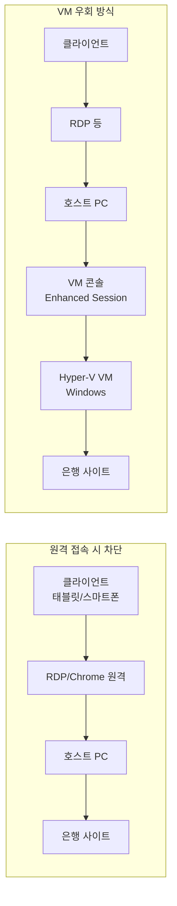

## 개요

태블릿이나 스마트폰에서 Windows PC의 기능이 필요할 때는 원격 데스크톱 프로그램으로 접속해 작업할 수 있다. 대표적으로 **Chrome 원격 데스크톱**, **Windows 원격 데스크톱(RDP)**, **AnyDesk** 등이 있다. 그러나 일부 사이트(특히 은행·금융·보안 프로그램이 동작하는 페이지)는 원격 접속 여부를 감지해 접근을 차단한다. 이 포스트에서는 **Hyper-V**로 가상 머신(VM)을 만들고, 그 VM 안에서만 해당 사이트에 접속하는 방식으로 이 제한을 우회하는 방법을 정리한다.

**추천 대상**: 모바일·태블릿에서 RDP 등으로 Windows에 접속해 쓰는 사용자 중, 은행·공인인증 등 원격 차단 사이트를 반드시 이용해야 하는 경우.

---

## 문제 상황 분석

### 용어 정리

* **서버(호스트)** : 모바일에서 원격으로 접속하는 Windows PC. 이 PC에서 Hyper-V가 동작한다.
* **클라이언트** : 태블릿·스마트폰 등, 서버에 원격 접속하는 기기.

### 원격 접속 차단 원리

원격 접속을 막는 사이트들은 대부분 **브라우저 확장 프로그램** 또는 **전용 보안 프로그램**을 설치하게 한다. 이 프로그램이 현재 세션이 원격 데스크톱(또는 가상 환경)인지 감지하면, 접속을 차단하거나 기능을 제한한다. 따라서 **원격으로 접속한 PC(호스트)** 에서는 해당 사이트 이용이 막히고, **원격 접속이 아닌 환경**에서만 이용 가능한 구조가 된다.

### 해결 전략 요약

호스트 PC에는 원격 접속이 감지되므로, **Hyper-V 위에 Windows VM을 하나 만들고**, 그 VM에는 원격 접속하지 않고 **호스트에서만 VM 콘솔(Enhanced Session 등)로 접속**한다. 브라우저·은행 사이트 접속은 **VM 안**에서만 수행한다. 이렇게 하면 은행 측에서 보는 환경은 “로컬 PC 한 대”로 보이므로 차단을 피할 수 있다.



---

## 해결 방법: Hyper-V 가상 머신 활용

> **핵심**: Hyper-V에 Windows 가상 머신을 생성하고, 은행·금융 등 원격 차단 사이트 접속은 **반드시 VM 안**에서만 수행한다.

### 1. Hyper-V 활성화

Windows Pro/Enterprise 등 Hyper-V를 지원하는 에디션에서 다음 순서로 활성화한다.

1. **제어판** → **프로그램 및 기능** → **Windows 기능 켜기/끄기**
2. **Hyper-V** 체크 후 확인, 필요 시 재부팅.

또는 PowerShell(관리자)에서:

```powershell
Enable-WindowsOptionalFeature -Online -FeatureName Microsoft-Hyper-V -All
```

일부 메인보드·BIOS에서는 가상화 옵션(VT-x/AMD-V 등)이 꺼져 있을 수 있다. 이 경우 BIOS에서 **가상화(Virtualization)** 를 활성화한 뒤 다시 시도한다.

### 2. 가상 컴퓨터 생성하기

1. **Hyper-V 관리자** 실행 → **동작** → **새로 만들기** → **가상 컴퓨터**
2. **이름 및 위치**: VM 이름 지정, 저장 위치는 기본 또는 원하는 디스크 선택
3. **세대**: Windows 64비트 설치 시 **2세대** 권장
4. **메모리**: 할당 메모리 크기 설정(예: 4096 MB). **동적 메모리** 사용 시 최소/최대 지정 가능
5. **네트워크**: 가상 스위치 선택(기본 스위치 또는 외부 스위치 등)
6. **가상 하드 디스크**: 새로 만들기, 크기(예: 60GB 이상)
7. **설치 옵션**: ISO로 설치할 경우 **부팅 시 가상 하드 디스크에 운영 체제 설치** 대신 **이미지 파일에서 설치** 선택 후 Windows ISO 지정

**팁: CPU와 메모리**  
Windows를 VM에 설치해 브라우저를 쓸 것이므로, 기본값(1 vCPU, 512MB 등)은 부족할 수 있다. 설치 단계에서는 **vCPU 4개, 메모리 4096 MB** 정도로 두고, 설치 후 Hyper-V 관리자에서 해당 VM → **설정**으로 조정할 수 있다.

### 3. 가상 컴퓨터에 Windows 설치하기

1. VM 생성 시 ISO를 연결했으면 VM을 **시작**한 뒤 **연결**하여 설치 화면으로 진입
2. Windows 설치 프로그램에서 언어·키보드 선택 후 **지금 설치**
3. **설치 유형**: **커스텀(고급)** → 생성한 가상 디스크 선택 후 다음
4. 설치가 끝나면 초기 설정(지역, 키보드, 계정 등) 진행

**팁: 비밀번호 없이 사용하기**  
VM을 자동 로그인처럼 쓰고 싶다면, 설치 과정에서 **Microsoft 계정으로 로그인** 대신 **오프라인 계정**을 선택한다. 오프라인 계정 생성 시 **사용자 이름만 입력**하고 **비밀번호는 비워 둔 채** 다음 단계로 넘어가면, 이후 VM 부팅 시 비밀번호 없이 바탕 화면까지 진입할 수 있다.  
Microsoft 계정으로 설치한 뒤 로그인 비밀번호를 끄는 방법도 있으나, 정책에 따라 제한이 있을 수 있어 오프라인 계정 사용을 권장한다.

---

## 세션 비교: 기본 세션 vs 고급 세션

설치가 끝난 VM에는 **기본 세션**과 **고급 세션(Enhanced Session)** 두 가지로 접속할 수 있다.

| 항목 | 기본 세션 | 고급 세션 |
|:---|:---:|:---:|
| 창 크기 조절 | X | O |
| 클립보드 공유 | O | X |

* **기본 세션**: 해상도는 고정에 가깝지만, 호스트와 VM 간 **클립보드 공유**가 가능해 텍스트 복사·붙여넣기가 편하다.
* **고급 세션**: **창 크기 조절**·해상도 변경이 유연하지만, 일부 환경에서는 클립보드 공유가 동작하지 않는다.

용도에 따라 선택하면 된다. 브라우저만 쓸 경우 고급 세션으로 해상도를 맞추고, 번호·OTP 등을 복사해 쓰려면 기본 세션을 쓰는 식으로 조합할 수 있다.

### 트러블슈팅: 고급 세션 로그인 문제

**증상**: 기본 세션으로는 VM에 잘 접속되는데, 고급 세션으로 접속하면 바탕 화면만 보이고 로그인 화면이 안 뜨거나 입력이 안 되는 경우.

**대처**: VM에 **기본 세션**으로 접속한 뒤, **Windows Hello**·생체 인증 등 로그인 정책을 비활성화하거나, 로그인 방식이 “Windows Hello 없이 암호만” 등으로 바뀌는지 확인한다. 정책 변경 후 고급 세션으로 다시 접속해 본다.

---

## 요약

| 구분 | 내용 |
|:---|:---|
| **문제** | RDP·Chrome 원격 등으로 접속한 PC에서는 은행 등 일부 사이트가 원격 감지로 접속을 차단함 |
| **해결** | Hyper-V에 Windows VM을 만들고, 해당 사이트 접속은 **VM 안**에서만 수행. 호스트에는 원격 접속, VM에는 호스트에서 콘솔로만 접속 |
| **설정 순서** | Hyper-V 활성화 → VM 생성(vCPU·메모리 여유 있게) → VM에 Windows 설치(오프라인 계정·비밀번호 생략 가능) → 기본/고급 세션 중 선택해 사용 |

원격 접속이 필요한 작업은 기존처럼 호스트에서 하고, 은행·금융 등 원격 차단 사이트만 VM 안에서 열면 된다. 이를 통해 모바일·태블릿에서의 원격 사용성과 보안 사이트 이용을 동시에 만족시킬 수 있다.
