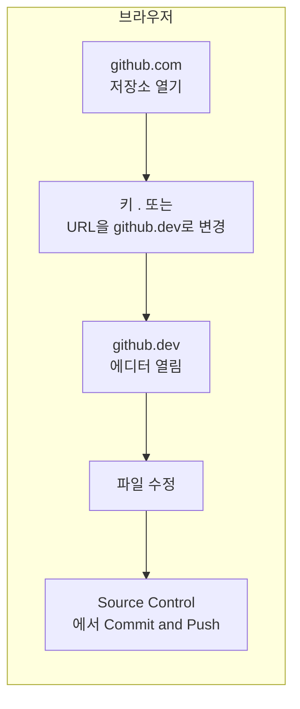

아는 사람만 아는 숨은(?) 서비스 **github.dev**를 알고 계신가요? GitHub 저장소를 브라우저에서 바로 VS Code 스타일로 열어 수정·커밋까지 할 수 있는 **무료 웹 기반 IDE**입니다. 설치 없이 키 하나로 진입할 수 있어, 급한 문서 수정이나 작은 PR 작업에 매우 유용합니다.

## 개요

|  |
| :---: |
| 웹 브라우저에서 사용할 수 있는 IDE |

**github.dev**는 GitHub가 제공하는 웹 기반 코드 에디터로, 다음을 만족합니다.

- **대상**: GitHub.com 사용자 전원(로그인 필요)
- **비용**: 무료
- **실행 환경**: 브라우저만 있으면 됨(Chrome, Edge, Firefox, Safari 등 최신 버전 권장)
- **추천 사용처**: README·설정 파일 등 가벼운 수정, PR 리뷰·작은 커밋, 로컬 환경 없이 빠르게 코드 확인

저장소를 클론하지 않고도 GitHub Repositories 확장 방식으로 파일을 불러오며, 변경분은 브라우저 로컬 스토리지에 두었다가 커밋 시점에 GitHub로 반영됩니다. **정기적으로 커밋하는 습관**이 필요합니다.

## 실행 방법

github.dev를 여는 방법은 세 가지입니다.

1. **키보드 단축키(가장 빠름)**  
   - `github.com`에서 저장소나 PR 페이지를 연 상태에서 **`.`(마침표)** 키 → 현재 탭에서 github.dev로 전환  
   - **`>`(쉬프트+.)** 키 → 새 탭에서 github.dev로 열기  
   - 키보드 레이아웃에 따라 `.`이 동작하지 않을 수 있으므로, 그 경우 아래 URL 변경 방식을 사용하면 됩니다.

2. **URL 변경**  
   - 주소창의 `github.com`을 **`github.dev`**로 바꾸고 엔터.  
   - 예: `https://github.com/owner/repo` → `https://github.dev/owner/repo`

3. **파일 보기 메뉴**  
   - 저장소에서 파일을 열었을 때 상단 드롭다운 메뉴에서 **"github.dev"** 선택

아래 플로우는 브라우저에서 저장소를 연 뒤 github.dev로 진입해 수정·커밋하는 흐름을 요약한 것입니다.

## 주요 기능

- **VS Code 기반 UI**: 탐색기, 검색, 문법 강조, minimap 등 익숙한 레이아웃
- **소스 제어 뷰**: 왼쪽 Activity Bar의 Source Control에서 변경 목록 확인, 스테이징, 커밋 메시지 입력, **Commit & Push** 한 번에 실행
- **브랜치 전환**: 브랜치를 바꿔도 스태시 없이 변경분을 그대로 가져갈 수 있음(확장 동작 방식 덕분)
- **Pull Request 작업**: PR 페이지에서 `.`로 열면 해당 브랜치가 열리고, 수정 후 커밋하면 같은 브랜치에 반영되며 PR 생성 버튼으로 PR까지 만들 수 있음
- **웹 확장(Web Extensions)**: VS Code 마켓플레이스 중 **웹에서 동작하는 확장**만 설치 가능. Settings Sync를 켜 두면 호환 확장이 자동 설치됨
- **Settings Sync**: VS Code 설정·키바인딩·확장 목록을 동기화 가능

## github.dev vs GitHub Codespaces

| 구분 | github.dev | GitHub Codespaces |
| --- | --- | --- |
| 비용 | 무료 | 개인 무료 한도 후 과금 |
| 실행 | 즉시(키 한 번) | devcontainer 구성 후 VM 기동(수 분 소요 가능) |
| 터미널·실행 | 없음(편집만) | 전용 VM에서 터미널·빌드·실행·디버깅 가능 |
| 확장 | 웹용 확장만 | 대부분 VS Code 확장 사용 가능 |

가벼운 편집·문서 수정은 github.dev, 실제로 빌드·실행·디버깅이 필요하면 Codespaces로 이어서 쓰는 흐름이 자연스럽습니다. github.dev에서 Run and Debug나 Terminal을 쓰려고 하면 Codespaces로 이어서 작업하라는 안내가 나옵니다.

## 한계와 주의사항

- **터미널·실행·디버깅 불가**: 코드 실행이나 셸 명령이 필요하면 Codespaces나 로컬 환경을 사용해야 합니다.
- **데이터 보관**: 변경분은 브라우저 저장소에만 있으므로 **자주 커밋**해야 합니다. 세션 간에는 미저장·현재 열린 파일 등 일부만 유지됩니다.
- **API 한도**: 문서·코드를 많이 푸시할 때 커밋 푸시가 잠깐 막힐 수 있으므로, 한동안 기다렸다가 다시 시도하면 됩니다.
- **방화벽**: 회사 등에서 `*.vscode-cdn.net`, `update.code.visualstudio.com`, `api.github.com` 등이 막혀 있으면 접속이 안 될 수 있습니다. 공식 문서의 [Using github.dev behind a firewall](https://docs.github.com/en/codespaces/the-githubdev-web-based-editor#using-githubdev-behind-a-firewall) 항목을 참고해 허용 목록에 넣을 수 있습니다.
- **시크릿 모드·광고 차단**: 시크릿 창이나 광고 차단 확장이 문제를 일으킬 수 있으므로, 문제 시 일반 창에서 광고 차단을 끄고 시도해 보는 것이 좋습니다.

## 활용 팁

- **긴급 문서 수정**: README, CONTRIBUTING, 설정 예시 파일 등을 다른 PC에서도 바로 고칠 때 유용합니다.
- **PR 리뷰 후 작은 수정**: 리뷰어가 "한 줄만 바꿔주세요"라고 할 때 해당 PR을 `.`로 열어 수정 후 커밋하면 됩니다.
- **설정 동기화**: VS Code Settings Sync를 켜 두면 github.dev에서도 동일한 테마·키바인딩·호환 확장을 쓸 수 있습니다.
- **URL만 공유**: `https://github.dev/owner/repo` 형태로 링크를 주면 상대방도 같은 저장소를 브라우저에서 바로 열 수 있습니다.

## 참고 문헌

- [github.dev](https://github.dev/) — 서비스 접속 주소
- [The github.dev web-based editor (GitHub Docs)](https://docs.github.com/en/codespaces/the-githubdev-web-based-editor) — 공식 설명, 실행 방법·소스 제어·확장·방화벽·트러블슈팅
- [GitHub Repositories extension (VS Code)](https://code.visualstudio.com/docs/editor/github#_github-repositories-extension) — github.dev가 사용하는 원격 저장소 확장 문서
