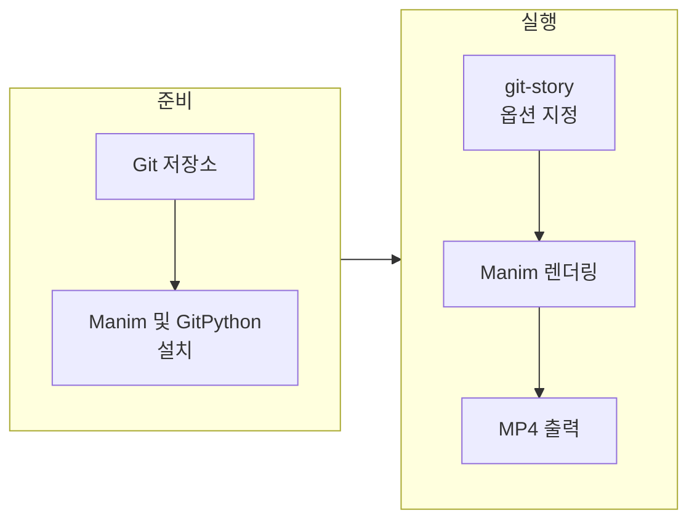

Git 프로젝트의 커밋 히스토리를 기반으로 비디오 애니메이션(.mp4)을 생성해, 저장소의 변화를 한눈에 보여 주는 **git-story**를 소개한다. 팀 내 공유, 블로그·유튜브 콘텐츠, Git 학습 자료 제작 등에 활용할 수 있는 무료 오픈소스 도구다.

## 개요

### 도구 정보

| 항목 | 내용 |
|------|------|
| **이름** | git-story |
| **제작** | Initial Commit (Jacob Stopak) |
| **라이선스** | 오픈소스 |
| **의존성** | Python 3.9+, GitPython, Manim Community |
| **출력** | MP4 비디오 (기본 8커밋, 다크/라이트 모드 지원) |

### 추천 대상

- **개발 팀**: 브랜치 전략·워크플로우를 시각적으로 공유하고 싶을 때  
- **교육·온보딩**: Git/버전 관리 수업·자료용 애니메이션이 필요할 때  
- **콘텐츠 제작자**: 블로그, 유튜브 등에 프로젝트 히스토리 영상을 넣고 싶을 때  
- **오픈소스 메인테이너**: 릴리스 노트·변경 이력 설명용 영상 제작 시  

---

## 특징

- **저장소 기반 시각화**: 로컬 Git 저장소에서 커밋 히스토리를 읽어, 브랜치·태그·HEAD 관계를 애니메이션으로 표현한다.
- **원라이너 생성**: 저장소 루트에서 `git-story` 한 번 실행으로 기본 설정(최근 8커밋, HEAD 기준) MP4를 생성한다.
- **시작점·범위 지정**: `--commit-id`, `--commits`로 시작 커밋(또는 ref)과 포함할 커밋 개수를 지정할 수 있다.
- **Ref 라벨**: HEAD, 브랜치명, 태그를 기본으로 표시하며, `--max-branches-per-commit`, `--max-tags-per-commit`로 개수 조절 가능.
- **인트로/아웃트로**: `--show-intro`, `--show-outro`와 `--title`, `--logo`, `--outro-top-text`, `--outro-bottom-text`로 커스텀 시퀀스 추가.
- **다크/라이트 모드**: 기본은 다크 모드이며, `--light-mode`로 흰 배경·검정 텍스트로 전환.
- **브랜치 레이아웃**: `--invert-branches`로 브랜치 배치 방향 반전, `--reverse`로 커밋 표시 순서 반전.
- **품질·속도**: `--low-quality`로 렌더링 시간 단축, `--speed`로 재생 속도 배율 조절.

---

## 요구사항 및 설치

### 요구사항

- **Python** 3.9 이상  
- **Pip**  
- **Manim Community**: [manim.community](https://www.manim.community/)에서 OS별 설치 방법 참고  
- **GitPython**: `pip install gitpython`  

### 설치 순서

1. Manim 및 OS별 의존성 설치 ([Manim 설치 가이드](https://www.manim.community/) 참고).  
2. GitPython 설치: `pip3 install gitpython`  
3. git-story 설치: `pip3 install git-story`  
4. 애니메이션을 만들 저장소로 이동: `cd path/to/project/root`  
5. 실행: `git-story` → 기본값으로 최근 8커밋 기준 MP4가 `git-story_media` 하위에 생성된다.  

출력 디렉터리는 `--media-dir=path/to/output`로 변경할 수 있다.

---

## 사용 워크플로우

git-story로 애니메이션을 만드는 흐름은 아래와 같다.



- **준비**: 대상 Git 저장소 확보, Manim·GitPython·git-story 설치.  
- **실행**: 저장소 루트에서 `git-story` (및 필요 시 `--commits`, `--commit-id`, `--show-intro` 등) 실행.  
- **결과**: 지정한 `--media-dir`(기본은 현재 디렉터리 내 `git-story_media`)에 MP4 파일이 생성된다.  

---

## 주요 옵션 정리

| 옵션 | 설명 | 기본값 |
|------|------|--------|
| `--commits N` | 애니메이션에 넣을 커밋 개수 | 8 |
| `--commit-id REF` | 시작할 커밋/ref (브랜치·태그·커밋 해시) | HEAD |
| `--reverse` | 커밋 표시 순서 반전 | False |
| `--hide-merged-chains` | 머지된 브랜치 커밋 제외, 메인라인만 표시 | False |
| `--show-intro` | 커스텀 인트로 시퀀스 사용 | False |
| `--show-outro` | 커스텀 아웃트로 시퀀스 사용 | False |
| `--title TITLE` | 인트로에 표시할 제목 | "Git Story, by initialcommit.com" |
| `--logo PATH` | 인트로/아웃트로용 로고 이미지 경로 | 패키지 기본 로고 |
| `--outro-top-text` | 아웃트로 상단 문구 | "Thanks for using Initial Commit!" |
| `--outro-bottom-text` | 아웃트로 하단 문구 | "Learn more at initialcommit.com" |
| `--light-mode` | 흰 배경·검정 텍스트 | False (다크 모드) |
| `--invert-branches` | 브랜치 위치 반전 | False |
| `--media-dir PATH` | 출력 디렉터리 | 현재 디렉터리 |
| `--low-quality` | 저화질·빠른 렌더링 | False |
| `--speed N` | 재생 속도 배율 (예: 2 = 2배속) | 1 |

---

## 사용 예시

### 기본 실행 (최근 8커밋, HEAD 기준)

```bash
cd path/to/project/root
git-story
```

### 특정 커밋부터 6개, 역순 표시

```bash
git-story --commit-id a1b2c3 --commits=6 --reverse
```

### 커스텀 인트로 (제목·로고)

```bash
git-story --commit-id dev --commits=10 --show-intro --title "My Git Repo" --logo ~/path/to/logo.png
```

### 아웃트로 문구·로고 지정

```bash
git-story --show-outro --outro-top-text "My Git Repo" --outro-bottom-text "Thanks for watching!" --logo path/to/logo.png
```

### 라이트 모드·출력 경로 지정

```bash
git-story --light-mode --media-dir=./output
```

### 테스트용 저화질·2배속

```bash
git-story --low-quality --speed=2
```

---

## 활용 사례

- **팀 문서·위키**: PR/머지 워크플로우, 브랜치 전략을 영상으로 첨부해 설명.  
- **기술 블로그·유튜브**: “이 프로젝트가 어떻게 성장했는지” 커밋 히스토리 스토리텔링.  
- **Git 교육**: 브랜치·머지·태그가 시각적으로 어떻게 쌓이는지 보여 주는 자료.  
- **오픈소스/상용 프로젝트**: 릴리스 노트, 주요 변경 구간만 잘라서 짧은 영상으로 공유.  

단순한 브랜치 구조에서 가장 잘 동작하며, 복잡한 히스토리도 지원하되 필요 시 `--commits`, `--hide-merged-chains` 등으로 구간을 조절하는 것이 좋다.

---

## 예시 스크린샷


---

## 참고 자료

- **공식 도구 소개**: [initialcommit.com/tools/git-story](https://initialcommit.com/tools/git-story)  
- **GitHub 저장소**: [github.com/initialcommit-com/git-story](https://github.com/initialcommit-com/git-story)  
- **PyPI 패키지**: [pypi.org/project/git-story](https://pypi.org/project/git-story)  

---

## 정리

git-story는 Git 커밋 히스토리를 MP4 애니메이션으로 만들어, 팀 공유·교육·콘텐츠 제작에 쓸 수 있는 경량 도구다. Manim과 GitPython만 준비하면 한 줄 명령으로 결과물을 얻을 수 있고, 인트로/아웃트로·다크/라이트 모드·커밋 범위 조절 등으로 목적에 맞게 맞춤 사용할 수 있다. Git 워크플로우를 시각적으로 설명해야 할 때 유용하게 활용해 보자.
