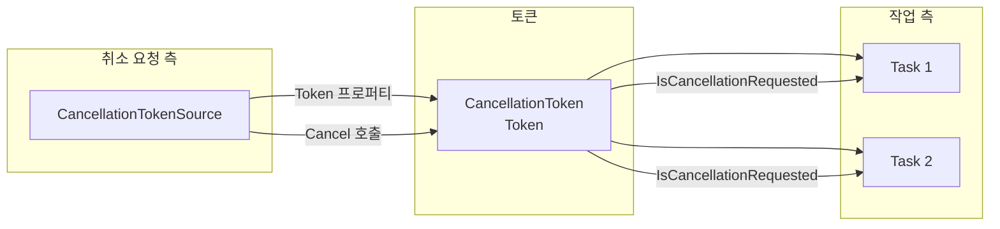

## 개요

C#에서 **비동기 작업**이나 **오래 걸리는 동기 작업**을 중간에 안전하게 멈추게 하려면, .NET 4부터 제공하는 **협력적 취소(cooperative cancellation)** 모델을 쓰는 것이 좋다. 이 모델의 중심에 있는 것이 **CancellationTokenSource**와 **CancellationToken**이다. 이 글에서는 `CancellationTokenSource`가 무엇인지, `TaskFactory`와 함께 쓸 때 흔히 겪는 실수와 그 해결 방법을 예제로 정리한다.

- **대상 독자**: C# 비동기·Task 기초는 알고 있으나, 취소 토큰을 제대로 쓰고 싶은 개발자.
- **다루는 내용**: `CancellationTokenSource`/`CancellationToken` 개념, 토큰을 받는 API에 일관되게 전달하는 방법, `Task.Delay`와 같은 비동기 대기에서 취소가 동작하도록 하는 방법.

---

## CancellationTokenSource란

**CancellationTokenSource**는 “취소를 요청하는 쪽”이 쓰는 객체다. 이 객체가 만들어 내는 **CancellationToken**(`Token` 프로퍼티)을 작업 쪽에 넘겨 주고, 나중에 `Cancel()`을 호출하면 해당 토큰을 받은 모든 작업에 “취소해라”는 신호가 전달된다. 즉, **취소 요청을 보내는 주체**가 `CancellationTokenSource`이고, **취소 요청을 받아서 확인하는 값**이 `CancellationToken`이다.

- **CancellationTokenSource**: 취소 신호를 만들고, `Cancel()`/`CancelAfter()` 등으로 “지금부터 취소”를 알림. `IDisposable`을 구현하므로 사용 후 `Dispose` 호출(또는 `using`) 권장.
- **CancellationToken**: 작업·메서드에 인자로 전달하는 가벼운 값. `IsCancellationRequested`로 취소 여부를 확인하거나, `ThrowIfCancellationRequested()`로 취소 시 예외를 던질 수 있음.

한 소스에서 나온 토큰을 여러 Task·스레드에 넘기면, 소스에서 한 번만 `Cancel()`을 호출해도 그 토큰을 받은 모든 작업에 취소가 전파된다.

---

## 협력적 취소 모델 흐름

아래 다이어그램은 소스 생성 → 토큰 전달 → 작업 실행 → 취소 요청 시의 관계를 단순화한 것이다.



- **취소 요청 측**: `CancellationTokenSource`를 만들고, 필요할 때 `Cancel()`(또는 `CancelAfter`) 호출.
- **작업 측**: 전달받은 `CancellationToken`으로 주기적으로 `IsCancellationRequested`를 확인하거나, `Task.Delay(delay, token)`처럼 토큰을 지원하는 API에 넘겨서 취소에 반응한다.

---

## 예제: TaskFactory와 취소 토큰

`TaskFactory`에 토큰을 넘기면, 그 팩토리로 만든 작업들은 해당 토큰과 연결된다. 다만 **작업 람다 안에서 호출하는 비동기 API에도 같은 토큰을 넘겨야** 취소가 제대로 동작한다. 그렇지 않으면 `Cancel()`을 호출해도 이미 시작된 `Task.Delay` 등은 끝날 때까지 기다리게 된다.

### 문제가 되는 코드

아래 코드는 `CancellationTokenSource`와 `TaskFactory`를 사용하지만, **작업 내부의 `Task.Delay`에 토큰을 넘기지 않았다**. 그래서 100ms 뒤에 `source.Cancel()`을 호출해도, 첫 번째·두 번째 `Task.Delay(1000)` 각각은 1초씩 끝날 때까지 기다리며, 결과적으로 “Task End : True”가 출력된다.

```csharp
CancellationTokenSource source = new CancellationTokenSource();
CancellationToken token = source.Token;
TaskFactory factory = new TaskFactory(token);

bool itShouldNotBeTrue = false;

factory.StartNew(async () =>
{
    Console.WriteLine("Task Start");
    await Task.Delay(1000);   // 토큰 없음 → 취소 신호 무시
    // if (token.IsCancellationRequested) return;  // 주석 처리된 수동 체크도 있으나,
    await Task.Delay(1000);   // 여기도 토큰 없음
    itShouldNotBeTrue = true;
    Console.WriteLine("Task End : " + itShouldNotBeTrue.ToString());
}, source.Token);

Thread.Sleep(100);
source.Cancel();
Console.WriteLine("Task Cancel : " + itShouldNotBeTrue.ToString());
Thread.Sleep(3000);
```

### 실제 출력

```
Task Start
Task Cancel : False
Task End : True
```

취소를 기대했지만, `Task.Delay`가 토큰을 받지 않아서 지연이 끝날 때까지 실행이 이어지고, `itShouldNotBeTrue`가 `true`가 되어 버린다.

---

## 해결 방법

**작업 안에서 사용하는 모든 취소 가능한 API에 동일한 `CancellationToken`을 넘겨야** 한다. `Task.Delay`는 `Task.Delay(int millisecondsDelay, CancellationToken cancellationToken)` 오버로드를 지원하므로, 두 번째 인자에 `token`을 넘기면 된다.

```csharp
await Task.Delay(1000, token);
await Task.Delay(1000, token);
```

이렇게 하면 `source.Cancel()` 호출 시 대기 중인 `Task.Delay`가 취소되고, 작업이 조기 종료될 수 있다. 필요하다면 루프나 긴 작업 사이에 `token.ThrowIfCancellationRequested()` 또는 `if (token.IsCancellationRequested) return;` 같은 수동 체크를 넣어 주면 더 명시적이다.

### 수정된 예제 요약

- `CancellationTokenSource` 생성 후 `Token`을 `TaskFactory`와 작업 델리게이트에 전달.
- 작업 내부의 **모든** `Task.Delay` 호출에 `token` 전달.
- 사용이 끝난 `CancellationTokenSource`는 `using` 또는 `Dispose()`로 정리.

---

## 사용 시 주의사항과 베스트 프랙티스

| 항목 | 권장 사항 |
|------|-----------|
| **토큰 전달 일관성** | `TaskFactory`뿐 아니라, 작업 안에서 호출하는 `Task.Delay`, `HttpClient` 등 취소를 지원하는 API에는 같은 토큰을 넘긴다. |
| **Dispose** | `CancellationTokenSource`는 `IDisposable`이므로 `using`으로 감싸거나, finally에서 `Dispose()`를 호출한다. |
| **취소 후 재사용** | 한 번 취소된 토큰은 다시 사용하지 않는다. 새 작업에는 새 `CancellationTokenSource`(및 그 `Token`)를 사용한다. |
| **여러 토큰 연동** | 외부 토큰과 내부 타임아웃 등을 함께 쓰려면 `CancellationTokenSource.CreateLinkedTokenSource`로 연결한 토큰을 사용한다. |

---

## 참고 문헌

- [CancellationTokenSource 클래스 (Microsoft Learn)](https://learn.microsoft.com/en-us/dotnet/api/system.threading.cancellationtokensource) — API 정의 및 설명.
- [CancellationToken 구조체 (Microsoft Learn)](https://learn.microsoft.com/en-us/dotnet/api/system.threading.cancellationtoken) — 토큰 속성·메서드.
- [Cancellation in Managed Threads (Microsoft Learn)](https://learn.microsoft.com/en-us/dotnet/standard/threading/cancellation-in-managed-threads) — 협력적 취소 모델 개요, 폴링·콜백·연결 토큰 등.
