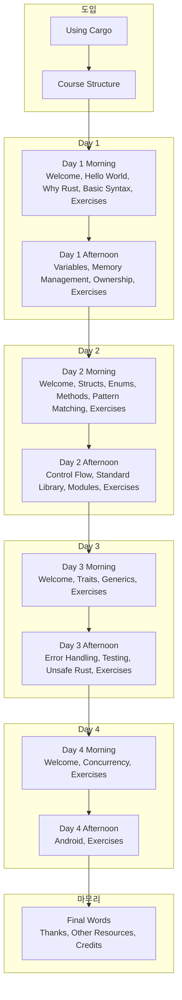

[Comprehensive Rust](https://google.github.io/comprehensive-rust/)는 **Google이 제공하는 Rust 공식 스타일의 무료 오픈소스 강의**다. Rust 언어의 기초 문법부터 메모리·소유권·에러 처리·동시성·Android까지 단계별로 배울 수 있으며, 각 섹션마다 실습 예제와 연습문제가 포함되어 있어 시스템 프로그래밍과 실무 패턴을 체계적으로 익힐 수 있다. 본 글에서는 강의 개요, 코스 구조, Day별 학습 내용, 핵심 개념 요약, 활용 팁, 장단점과 참고 문헌을 정리한다.

---

## 개요

### Comprehensive Rust란?

**Comprehensive Rust**는 [google/comprehensive-rust](https://github.com/google/comprehensive-rust) 저장소에서 공개·유지되는 **Rust 교육용 코스**다. 강의 자료는 웹 페이지 형태로 제공되며, Cargo 사용법·코스 구조 소개부터 시작해 4일 분량의 Morning/Afternoon 세션으로 나뉜다. 각 Day에는 Welcome, 핵심 주제, Exercises가 반복되어 이론과 실습이 균형을 이룬다. 최종일에는 Android 개발·마무리 인사·Other Resources·Credits로 마친다.

이 코스는 Rust 팀과 Google 엔지니어링 관례를 반영한 **실무 친화적** 구성이다. 단순 문법 나열이 아니라 **왜 그런 설계인지**, **언제 어떤 기능을 쓸지**에 대한 맥락을 함께 다루므로, Rust를 처음 접하는 학습자뿐 아니라 C/C++·Go 등 다른 시스템 언어 경험자가 Rust로 전환할 때도 유용하다.

### 추천 대상

- **Rust 입문자**: 문법·Ownership·에러 처리·동시성을 한 번에 정리하고 싶은 사람
- **시스템 프로그래밍 경험자**: C/C++·Go 등에서 Rust로 넘어가며 메모리 모델·타입 시스템을 비교 학습하려는 개발자
- **모바일·임베디드 관심자**: Day 4 Afternoon의 Android 세션으로 Rust in Android 맛보기를 하고 싶은 사람
- **팀 단위 러닝**: 4일 커리큘럼을 그대로 워크숍·스터디에 활용하려는 팀

---

## 강의 구조 (전체 흐름)

강의는 **Using Cargo → Course Structure** 소개 뒤, **Day 1 ~ Day 4**의 Morning/Afternoon 블록으로 진행되며, 마지막에 **Final Words**로 마친다. 각 블록은 Welcome(해당 Day 소개), 핵심 주제들, Exercises 순으로 구성된다. 아래 다이어그램은 이 흐름을 한눈에 보여 준다.

- **도입**: Cargo 사용법과 전체 코스 구조를 먼저 익혀, 이후 실습을 같은 환경에서 진행할 수 있게 한다.
- **Day 1**: Rust가 무엇인지, 왜 쓰는지(Why Rust), 기본 문법과 변수·메모리·소유권을 다룬다. Rust의 차별점인 **Ownership**을 처음 접하는 구간이다.
- **Day 2**: Structs, Enums, Methods, Pattern Matching으로 데이터 모델링과 제어 흐름을, Afternoon에서는 제어문·표준 라이브러리·모듈로 코드 구조화를 배운다.
- **Day 3**: Traits·Generics로 추상화와 재사용을, Afternoon에서는 **에러 처리·테스트·Unsafe Rust**로 실무에서 자주 마주치는 주제를 다룬다.
- **Day 4**: **동시성(Concurrency)**과 **Android**에서의 Rust 활용을 소개하고, Final Words에서 감사·추가 자료·Credits로 마친다.

---

## Day별 학습 내용 요약

### Day 1: Morning

- **Welcome**: Day 1 목표와 진행 방식 소개.
- **Hello World!**: 첫 Rust 프로그램 작성, `cargo run` 등 기본 워크플로우.
- **Why Rust?**: 성능·메모리 안전성·동시성 안전성·도구 생태계 등 Rust를 선택하는 이유.
- **Basic Syntax**: 변수·함수·타입·블록 등 기본 문법.
- **Exercises**: 위 내용을 적용하는 실습.

### Day 1: Afternoon

- **Variables**: 불변성·가변성·섀도잉.
- **Memory Management**: 스택·힙·메모리 안전성 개요.
- **Ownership**: 소유권·이동(move)·복사·참조 규칙. Rust의 핵심 개념.
- **Exercises**: Ownership 기반 실습.

### Day 2: Morning

- **Welcome**: Day 2 목표 소개.
- **Structs**: 구조체 정의·필드·인스턴스 생성.
- **Enums**: 열거형과 variants, Option·Result 맛보기.
- **Methods**: impl 블록·메서드·연관 함수.
- **Pattern Matching**: match·if let·패턴 문법.
- **Exercises**: 데이터 모델링·패턴 매칭 실습.

### Day 2: Afternoon

- **Control Flow**: if·loop·while·for·break/continue.
- **Standard Library**: 자주 쓰는 타입·컬렉션·문자열·IO 개요.
- **Modules**: crate·mod·use·가시성·파일 구조.
- **Exercises**: 제어 흐름·표준 라이브러리·모듈 활용.

### Day 3: Morning

- **Welcome**: Day 3 목표 소개.
- **Traits**: 트레이트 정의·구현·다형성·트레이트 바운드.
- **Generics**: 제네릭 함수·구조체·열거형·트레이트와의 조합.
- **Exercises**: Traits·Generics 실습.

### Day 3: Afternoon

- **Error Handling**: Result·Option·? 연산자·에러 전파·패닉 vs Result 선택.
- **Testing**: 단위 테스트·통합 테스트·테스트 조직화.
- **Unsafe Rust**: unsafe 블록·언세이프가 필요한 경우·안전한 래퍼.
- **Exercises**: 에러 처리·테스트·Unsafe 활용.

### Day 4: Morning

- **Welcome**: Day 4 목표 소개.
- **Concurrency**: 스레드·동시성·공유 상태·채널·동기화 도구 개요.
- **Exercises**: 동시성 실습.

### Day 4: Afternoon

- **Android**: Rust in Android 빌드·연동 개요.
- **Exercises**: Android 관련 실습.

### Final Words

- **Thanks!**: 강의 마무리 인사.
- **Other Resources**: 추가 학습 자료 링크.
- **Credits**: 기여자·출처.

---

## 핵심 개념 요약

| 개념 | 설명 |
|------|------|
| **Ownership** | 값의 소유권은 하나, 이동(move) 시 이전 소유자는 사용 불가. 복사 가능 타입은 Copy 트레이트로 구분. |
| **Borrowing & References** | 참조(&T, &mut T)로 소유권 없이 접근. 불변/가변 참조 규칙으로 데이터 레이스 방지. |
| **Traits & Generics** | 공통 동작을 Traits로 정의하고, Generics로 타입에 따라 재사용. 다형성의 기초. |
| **Error Handling** | Result\<T, E\>, Option\<T\>, ? 연산자로 에러 전파. 패닉은 복구 불가 상황에 한정. |
| **Concurrency** | 스레드·annels·Mutex 등으로 동시성 모델 설명. 타입 시스템이 데이터 레이스를 컴파일 타임에 막는 점 강조. |

이 코스를 마치면 **Rust 문법·메모리 모델·에러 처리·동시성**을 설명할 수 있고, **실제 프로젝트에서 Cargo로 패키지 구성·테스트·모듈 구조**를 적용할 수 있으며, **언제 Result vs 패닉, 언제 Unsafe를 최소화할지** 같은 판단 기준을 갖추는 데 도움이 된다.

---

## 활용 팁

- **순서대로 진행**: Day 1 → 4 순서가 Ownership → Traits → Error → Concurrency로 설계되어 있으므로, 건너뛰지 않고 진행하는 것이 이해에 유리하다.
- **Exercises 필수**: 각 Exercises를 직접 풀어 보면 이론이 실제 코드로 어떻게 쓰이는지 체감할 수 있다.
- **다른 언어와 비교**: C/C++의 메모리 수동 관리·Go의 goroutine 등과 비교하면 Rust의 선택(소유권·타입 기반 동시성)이 더 분명해진다.
- **공식 문서 병행**: [rust-lang.org](https://www.rust-lang.org/)·[doc.rust-lang.org](https://doc.rust-lang.org/)와 함께 보면 심화 내용을 채울 수 있다.

---

## 장단점 및 종합 평가

### 장점

- **무료·오픈소스**: 별도 비용 없이 웹에서 전 과정 학습 가능.
- **체계적 커리큘럼**: 4일 분량으로 문법 → 메모리 → 추상화 → 에러·테스트·동시성 → Android까지 단계가 명확함.
- **실습·연습문제**: 각 블록마다 Exercises가 있어 이론만 보지 않고 직접 타이핑해 볼 수 있음.
- **실무 관점**: Google·Rust 팀 스타일을 반영해 실무에서 쓰는 패턴과 판단 기준을 다룸.
- **다른 언어 경험자 친화**: Why Rust, 메모리 모델, 동시성 설계 등이 C/C++·Go 경험자에게 잘 맞음.

### 단점

- **영어 기준**: 강의 자료가 영어라 한국어만 사용하는 학습자에게는 부담이 될 수 있음.
- **실시간 강의 아님**: 워크숍용 슬라이드/문서 형태이므로, 강사가 있는 워크숍이나 스터디와 함께 쓰는 것이 효과적.
- **Android·Unsafe**: Day 4 Android·Unsafe Rust는 개요 수준이므로, 심화는 별도 자료가 필요함.

### 한 줄 평가

**Rust를 체계적으로 한 번에 정리하고 싶을 때 추천하는 무료 4일 코스**로, Ownership·에러 처리·동시성까지 실습과 함께 다뤄 시스템 프로그래밍 역량을 키우는 데 적합하다.

---

## 참고 문헌

1. [Comprehensive Rust — Google GitHub](https://google.github.io/comprehensive-rust/) — 공식 강의 사이트(Welcome·Day 1~4·Final Words).
2. [google/comprehensive-rust — GitHub](https://github.com/google/comprehensive-rust) — 소스·기여·이슈·번역 정보.
3. [The Rust Programming Language — rust-lang.org](https://www.rust-lang.org/learn) — 공식 학습 경로·책·문서.
4. [Rust by Example](https://doc.rust-lang.org/rust-by-example/) — 예제 중심 공식 문서.
5. [Rust API Guidelines](https://rust-lang.github.io/api-guidelines/) — API 설계·네이밍·에러 처리 등 실무 가이드라인.
