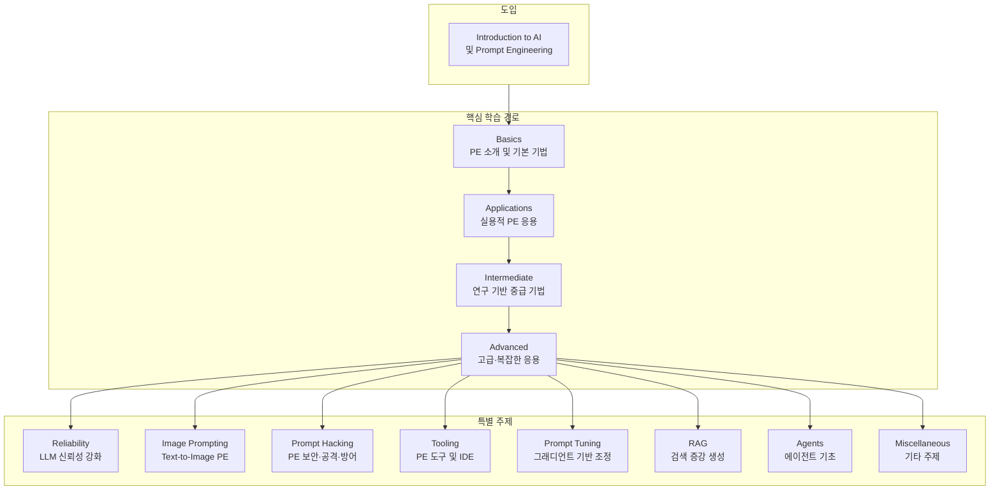

[Learn Prompting](https://learnprompting.org/)은 **LLM(Large Language Model)·생성형 AI와 효과적으로 소통하기 위한 프롬프트 엔지니어링(PE) 무료 오픈소스 가이드**다. ChatGPT 이전인 2022년 10월에 첫 버전이 공개된 이래, Google·Microsoft·Wikipedia·O'REILLY·Salesforce 등에서 인용되며 수백만 명이 이용하고 있다. 본 글에서는 Learn Prompting의 개요, 가이드 구조, 모듈별 학습 내용, 활용 팁, 장단점과 참고 문헌을 정리한다.

---

## 개요

### Learn Prompting이란?

**Learn Prompting**은 [learnprompting.org](https://learnprompting.org/)에서 제공하는 **무료·오픈소스 프롬프트 엔지니어링 가이드**이자, 동일 이름의 **유료 강의 플랫폼**을 함께 운영하는 서비스다. 가이드 본문은 [Docs](https://learnprompting.org/docs/introduction)에서 전부 무료로 읽을 수 있으며, 연구·실무에 기반한 기법을 비기술 독자도 따라 할 수 있게 예제와 함께 설명한다. 개발은 Maryland 대학 NLP/RL 연구자이자 Learn Prompting CEO인 Sander Schulhoff를 중심으로, 다양한 번역·기여자 커뮤니티가 참여하고 있다.

가이드의 특징은 **실용성·접근성·협업 학습**이다. (1) 논문과 실무에서 검증된 기법 위주로 구성되어 바로 프로젝트에 적용할 수 있고, (2) 각 기법마다 이해하기 쉬운 예제가 포함되어 있으며, (3) [Discord 커뮤니티](https://discord.gg/jXd7MGuxTJ)에서 학습 동료를 찾거나 질문할 수 있다. 문서는 난이도·필요 지식에 따라 초급(🟢)·쉬움(🟦)·중급(◆)·고급(◆◆)으로 표시되어 있어, 자신의 수준에 맞는 구간부터 골라 읽을 수 있다.

### 추천 대상

- **GenAI·프롬프트 엔지니어링 입문자**: AI 용어나 PE를 처음 접하는 비개발자·비전공자
- **개발자·엔지니어**: ChatGPT·Claude 등 LLM을 업무·제품에 활용하려는 사람
- **연구자·데이터 사이언티스트**: RAG·에이전트·프롬프트 튜닝 등 고급 주제를 체계적으로 보고 싶은 사람
- **보안·품질 담당자**: 프롬프트 인젝션·프롬프트 해킹 대응을 학습하려는 사람
- **이미지 생성 활용자**: DALL·E·Stable Diffusion 등 텍스트→이미지 모델용 프롬프트 기법을 배우려는 사람

---

## 가이드 구조 (전체 흐름)

가이드는 **Basics(기초)** 로 시작해 **Applications(응용)** → **Intermediate(중급)** → **Advanced(고급)** 로 이어지고, **Reliability(신뢰성)**·**Image Prompting**·**Prompt Hacking**·**Tooling**·**Prompt Tuning**·**RAG**·**Agents** 등 특별 주제로 확장된다. 아래 다이어그램은 이 흐름을 한눈에 보여 준다.

- **Basics**: 프롬프트 엔지니어링 소개, 프롬프트란 무엇인지, 간단한 PE 기법(역할 부여·Few-shot·CoT 등).
- **Applications**: 이메일 작성·요약·번역·코드 생성 등 즉시 쓸 수 있는 실용 예제.
- **Intermediate**: 연구 논문에 기반한 중간 수준 기법.
- **Advanced**: 더 강력하고 복잡한 PE 응용.
- **Reliability**: LLM 출력의 일관성·정확성·안정성을 높이는 방법.
- **Image Prompting**: DALL·E·Stable Diffusion 등 텍스트→이미지 모델용 프롬프트 작성.
- **Prompt Hacking**: 프롬프트 인젝션·악용·방어(레드팀·보안 관점).
- **Tooling**: 프롬프트 IDE·도구 소개.
- **Prompt Tuning**: 그래디언트 기반으로 프롬프트를 미세 조정하는 방법.
- **RAG**: 검색 증강 생성(Retrieval-Augmented Generation) 입문.
- **Agents**: LLM 기반 에이전트 개념과 활용.
- **Miscellaneous**: 기타 주제·신기술·참고 자료.

---

## 모듈별 요약

### Basics (기초)

프롬프트 엔지니어링이 무엇인지, 프롬프트의 기본 구조와 **역할 부여(Role Prompting)**·**Few-shot**·**Chain-of-Thought(CoT)**·**Zero-shot** 등 핵심 기법을 다룬다. 코딩 없이도 따라 할 수 있는 수준으로 설명되어 있어, GenAI를 처음 쓰는 사람에게 적합하다.

### Applications (응용)

이메일 자동 작성·편집, 문서 요약, 번역, 코드 생성·설명 등 **실무에서 바로 쓰는 응용**을 예제와 함께 소개한다. “어떤 식으로 지시하면 어떤 결과가 나오는지”를 보여 주므로, 업무 자동화·생산성 향상을 목표로 할 때 유용하다.

### Intermediate (중급)

연구 논문과 실무 사례에 기반한 **중간 난이도 기법**을 다룬다. 기본 기법을 넘어서 더 나은 출력 품질·제어를 원할 때 참고할 수 있으며, 일부 항목은 프로그래밍·도메인 지식이 있으면 이해가 쉽다.

### Advanced Applications (고급 응용)

더 **강력하고 복잡한 PE 응용**을 다룬다. 복합 태스크·긴 컨텍스트·다단계 추론 등 고급 사용 패턴을 배울 수 있다.

### Reliability (신뢰성)

LLM이 **같은 질문에 일관되게**, **환각을 줄이고** 답하도록 만드는 방법을 다룬다. Self-consistency·검증·캘리브레이션 등 기법이 소개되며, 프로덕션·품질 요구가 있는 환경에서 참고하기 좋다.

### Image Prompting (이미지 프롬프트)

**DALL·E·Stable Diffusion** 등 텍스트→이미지 모델을 위한 프롬프트 작성법을 다룬다. 스타일·구도·상세 묘사·네거티브 프롬프트 등 이미지 생성에 특화된 기법을 배울 수 있다.

### Prompt Hacking (프롬프트 해킹)

프롬프트 **인젝션·조작·악용**과 그 **방어** 방법을 다룬다. 레드팀·AI 보안 관점에서 PE를 이해하고, 서비스 설계 시 취약점을 줄이는 데 도움이 된다. Learn Prompting 측에서 운영하는 [HackAPrompt](https://www.hackaprompt.com/) 같은 대회·리소스와도 연결된다.

### Tooling (도구)

다양한 **프롬프트 엔지니어링 IDE·도구**를 소개한다. 프롬프트 버전 관리·A/B 테스트·템플릿 관리 등 실무 워크플로에 쓸 수 있는 도구를 파악할 수 있다.

### Prompt Tuning (프롬프트 미세 조정)

**그래디언트 기반**으로 프롬프트(또는 soft prompt)를 학습·조정하는 방법을 다룬다. 모델 가중치는 고정하고 프롬프트만 튜닝하는 방식에 관심 있는 연구자·엔지니어에게 유용하다.

### RAG (검색 증강 생성)

**Retrieval-Augmented Generation**의 개념과 활용을 다룬다. 외부 지식·문서를 검색해 LLM 입력에 넣어 정확도와 신뢰성을 높이는 패턴을 배울 수 있다.

### Agents (에이전트)

LLM 기반 **에이전트**의 개념, 도구 사용·계획·실행 등 기본 구조를 다룬다. 에이전트 설계·구현 입문에 적합한 진입 구간이다.

---

## 활용 팁

- **순서대로 읽기**: 처음이라면 Docs의 [Introduction](https://learnprompting.org/docs/introduction) → Basics → Applications 순으로 읽고, 필요에 따라 Intermediate·Advanced·특별 주제로 넘어가는 것을 권한다.
- **난이도 표시 활용**: 각 문서의 🟢·🟦·◆·◆◆ 표시를 보고, 자신의 배경에 맞는 난이도부터 골라 읽으면 시간 대비 이해도가 높아진다.
- **실습 병행**: 가이드 예제를 그대로 ChatGPT·Claude 등에 입력해 보면서 출력을 비교해 보면 기법 차이가 잘 느껴진다.
- **커뮤니티 활용**: [Discord](https://discord.gg/jXd7MGuxTJ)·[Twitter @learnprompting](https://twitter.com/learnprompting)에서 질문하거나 학습 기록을 공유하면 동기 부여와 피드백을 얻기 쉽다.
- **유료 강의와 병행**: 더 깊은 영상·인증 과정이 필요하면 [Learn Prompting Courses](https://learnprompting.org/courses)에서 Introduction to Prompt Engineering·Advanced Prompt Engineering·RAG·Agents·Prompt Hacking 등 유료 코스를 선택할 수 있다.

---

## 정리 및 참고 문헌

### 장점

- **무료·오픈소스**: 가이드 전편을 웹에서 무료로 읽을 수 있어 부담이 적다.
- **연구·실무 기반**: 논문과 업계 사례를 반영해 신뢰도가 높다.
- **단계별 구성**: Basics → Applications → Intermediate → Advanced → 특별 주제로 이어져 체계적으로 학습할 수 있다.
- **다양한 주제**: 텍스트 PE뿐 아니라 이미지 PE·RAG·에이전트·보안까지 폭넓게 다룬다.
- **커뮤니티·지속 업데이트**: Discord·GitHub 이슈를 통해 피드백이 반영되고, 최신 기법이 추가되는 편이다.

### 단점

- **영어 중심**: 공식 가이드는 영어이며, 일부만 번역된 상태일 수 있다.
- **고급 주제는 배경 지식 필요**: Prompt Tuning·일부 Advanced 항목은 ML·프로그래밍 경험이 있으면 유리하다.

### 한 줄 평

**“프롬프트 엔지니어링을 체계적으로 배우고 싶다면, Learn Prompting 무료 가이드부터 시작하는 것을 추천한다.”**

### 참고 문헌·링크

- [Learn Prompting 공식 사이트](https://learnprompting.org/) — 메인 페이지, 강의·리소스 진입점.
- [Learn Prompting Docs (Introduction)](https://learnprompting.org/docs/introduction) — 무료 오픈소스 가이드 본문.
- [Learn Prompting Courses](https://learnprompting.org/courses) — 유료 강의 목록(입문·고급 PE·RAG·에이전트·프롬프트 해킹 등).
- [HackAPrompt](https://www.hackaprompt.com/) — Learn Prompting 팀이 참여하는 프롬프트 해킹 대회·리소스.
- [Learn Prompting Discord](https://discord.gg/jXd7MGuxTJ) — 커뮤니티·질문·학습 동료 찾기.
