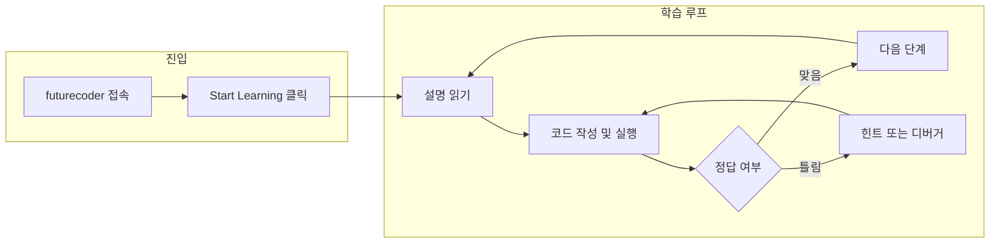

프로그래밍을 처음 배울 때 **어디서부터 어떻게** 시작할지 고민하는 경우가 많다. 서적, 유튜브, 유료 플랫폼까지 선택지가 넓지만, **무료이면서도 손으로 직접 타이핑하고 실행해 보는 경험**을 주는 도구는 생각보다 많지 않다. 이 글에서는 **futurecoder**를 소개한다. futurecoder는 **완전 무료**이자 **오픈소스**인 온라인 파이썬 학습 플랫폼으로, 초보자가 조건문·반복문·자료구조 등 기초 코딩을 **실습 중심**으로 익힐 수 있게 설계되어 있다.

[futurecoder](https://futurecoder.io/)에 접속하면 메인 화면에서 "Learn Python from scratch" 문구와 함께 **Start learning** 버튼을 볼 수 있다. 별도 가입 없이 브라우저만으로 바로 코스에 들어갈 수 있으며, 제공된 편집기나 셸에서 코드를 실행하고 질문에 답해야 다음 단계로 진행되는 **완전 인터랙티브** 구조다.

|  |
| :---: |
| futurecoder 첫 페이지 |

**Start Learning**을 클릭하면 단계별로 이어지는 학습 페이지로 이동한다. 왼쪽에는 설명과 과제, 오른쪽에는 에디터·셸이 배치되어 있어 설명을 읽으면서 곧바로 코드를 작성하고 실행할 수 있다.

|  |
| :---: |
| futurecoder 학습 페이지 |

---

## futurecoder란 무엇인가

**futurecoder**는 완전 초보자를 위해 설계된 **무료·오픈소스** 파이썬 코스이자 플랫폼이다. Alex Mojaki가 만들었으며, GitHub에서 [alexmojaki/futurecoder](https://github.com/alexmojaki/futurecoder)로 공개되어 있다. 목표는 **배경이나 재능에 관계없이 누구나 스스로 프로그래밍을 배울 수 있게** 하고, **최고 수준의 학습 자료**를 커뮤니티가 함께 개선할 수 있게 하는 것이다. 이를 위해 파이썬을 첫 언어로 선택했고, 강의 영상이 아니라 **실행·질문·피드백**이 이어지는 인터랙티브한 흐름을 채택했다.

학습 흐름은 대략 다음과 같이 요약할 수 있다. 진입 → 코스 선택 → 단계별 설명·과제 → 편집기/셸에서 코드 작성·실행 → 정답·힌트·디버거로 오류 해결 → 다음 단계 진행. 한 번에 많은 내용을 쏟아 붓기보다, **한 단계씩 성공 경험**을 쌓이게 하는 구조다.

---

## 핵심 특징

futurecoder의 특징은 **인터랙티브함**, **디버깅 편의**, **초보자 친화적 오류 메시지**, **파슨스 문제**, **솔루션 브레드크럼** 다섯 가지로 정리할 수 있다.

### 완전 인터랙티브

진행하려면 **제공된 편집기 또는 셸에서 코드를 실행**하고, 화면에 나오는 **질문에 답**해야 한다. 동영상을 보기만 하거나 글만 읽는 방식이 아니라, 직접 타이핑하고 실행해 보는 **능동 학습**이 반복된다. 이는 "이해했다고 생각했는데 막상 코드를 쓰면 막힌다"는 문제를 줄여 준다.

### 쉬운 디버깅

한 번의 클릭으로 **강력한 디버거**를 실행할 수 있다. 실행 과정을 시각화하고 문제를 찾는 데 쓰이는 도구가 **세 가지** 제공된다.

- **Python Tutor**: 실행 단계별로 변수·스택을 시각화한다.
- **Snoop**: 각 줄이 실행될 때 변수 변화를 로그로 보여 준다.
- **Bird's Eye**: 표현식·함수 호출 결과를 트리 형태로 보여 준다.

각 디버거는 장점이 다르므로, 막힌 부분에 맞춰 골라 쓰면 된다. 초보자가 "왜 틀렸는지"를 스스로 발견하기 쉽게 만든 설계다.

### 향상된 오류 메시지

일반 파이썬 **traceback**은 초보자에게 부담스럽다. futurecoder는 표준 오류 메시지를 **초보자도 읽기 쉬운 형태**로 보완해, 두려움을 줄이고 **어디를 고쳐야 할지** 안내한다.

### 파슨스 문제 (Parsons Problems)

문제를 풀다 막혔고 **힌트도 다 썼다면**, 정답 코드를 **잘라 놓은 블록을 올바른 순서로 재배치**하는 방식으로 시도할 수 있다. 이렇게 하면 정답을 그대로 베끼는 것보다 **생각을 하면서** 순서를 맞추게 되고, 죄책감 없이 한 단계만 완화된 도움을 받을 수 있다.

### 솔루션 브레드크럼 (Solution Breadcrumbs)

**최후의 수단**으로, 정답을 한 번에 보여 주지 않고 **조금씩 드러내는** 방식이다. 필요한 만큼만 열어 보고, 나머지는 스스로 채워 넣을 수 있어, 포기하지 않고 끝까지 시도하게 유도한다.

---

## 학습 흐름과 화면 구성

앞서 설명한 대로, 메인에서 **Start Learning**으로 들어가면 코스 목록과 단계별 페이지가 나온다. 각 단계에서는 왼쪽에 **설명·질문·과제**가, 오른쪽에 **에디터·셸**이 배치된다. 코드를 작성한 뒤 실행 버튼을 누르면 셸에 결과가 나오고, 정답이면 다음으로, 오답이면 힌트나 디버거를 사용해 수정하는 흐름이 반복된다. 조건문, 반복문, 리스트·딕셔너리 같은 **자료구조**, 함수, 나아가 **OOP**까지 코스에 따라 단계적으로 다룬다.

---

## 다른 학습 도구와의 비교·트레이드오프

| 구분 | futurecoder | 동영상 강의 | 코드카데미·유료 플랫폼 |
| --- | --- | --- | --- |
| 비용 | 무료 | 무료~유료 | 대부분 유료 |
| 학습 방식 | 실습·질문·실행 필수 | 시청 중심 | 실습 + 영상 혼합 |
| 오픈소스 | 예 (GitHub) | 해당 없음 | 대부분 아니오 |
| 디버거·오류 메시지 | 내장·초보자 친화 | 보통 없음 | 플랫폼마다 상이 |
| 대상 | 완전 초보자 | 초보~중급 | 초보~실무자 |

futurecoder는 **완전 초보자**가 "처음부터 차근차근 손으로 코딩해 보며" 배우는 데 가장 잘 맞는다. 이미 다른 언어를 쓰는 개발자가 파이썬 문법만 빠르게 훑고 싶다면, 치트시트나 공식 튜토리얼이 더 적합할 수 있다. **언제 쓰면 좋은지**를 정리하면 다음과 같다.

- **추천**: 프로그래밍을 처음 배우는 사람, 파이썬을 첫 언어로 선택한 사람, 무료·오픈소스 도구를 선호하는 사람, 실습과 즉각적인 피드백을 중시하는 사람.
- **비추천은 아니지만 대안 고려**: 이미 중급 이상인 사람이 문법만 빠르게 복습하려는 경우(이때는 공식 문서·Quick Reference가 더 효율적일 수 있음).

한계로는 **파이썬에 집중**되어 있어 다른 언어를 배우려면 별도 리소스가 필요하고, **영어** 기반이라 한국어만 쓰는 학습자에게는 진입 장벽이 있을 수 있다. 다만 코드와 UI가 직관적이라 영어가 약해도 따라 하기는 어렵지 않은 편이다.

---

## 마무리 및 요약

futurecoder는 **무료·오픈소스**로, 초보자가 **조건문·반복문·자료구조·함수·OOP** 등 파이썬 기초를 **실습 중심**으로 배울 수 있는 플랫폼이다. 완전 인터랙티브한 진행, 내장 디버거(Python Tutor·Snoop·Bird's Eye), 초보자 친화적 오류 메시지, 파슨스 문제·솔루션 브레드크럼으로 막혔을 때의 부담을 줄인 설계가 강점이다.

| 항목 | 내용 |
| --- | --- |
| **대상** | 프로그래밍·파이썬을 처음 배우는 사람 |
| **비용** | 무료 (오픈소스) |
| **접속** | [https://futurecoder.io/](https://futurecoder.io/) |
| **추가 정보** | [GitHub: alexmojaki/futurecoder](https://github.com/alexmojaki/futurecoder), [Contribution guide](https://github.com/alexmojaki/futurecoder/blob/main/how_to_contribute.md), [Discord](https://discord.gg/KwWvQCPBjW) |

이 글을 읽은 뒤에는 **futurecoder가 어떤 플랫폼인지**, **어떤 학습자에게 맞는지**, **다른 학습 방식과 비교했을 때 장단점**을 설명할 수 있고, 필요하다면 직접 접속해 첫 단계부터 실습을 시작할 수 있다.

---

## 참고 문헌·링크

1. [futurecoder 공식 사이트](https://futurecoder.io/) — 코스 시작 및 "Just code" IDE.
2. [alexmojaki/futurecoder (GitHub)](https://github.com/alexmojaki/futurecoder) — 소스 코드, 이슈, 기여 가이드.
3. [futurecoder - how to contribute](https://github.com/alexmojaki/futurecoder/blob/main/how_to_contribute.md) — 코드·콘텐츠 기여 방법.
